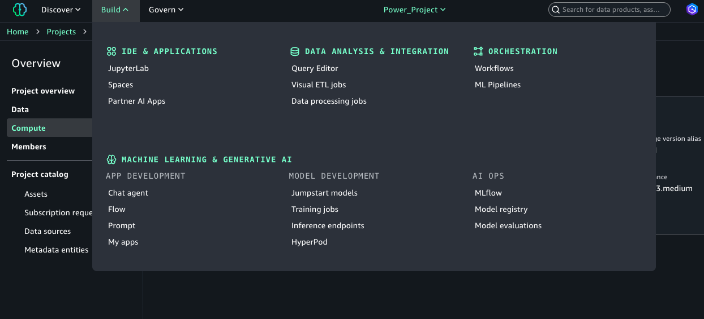

# AWS Bedrock AgentCore Starter Kit

This repository is primarily focused on **deploying the Neo4j MCP server to AWS Bedrock AgentCore** and demonstrating various approaches to calling that agent. Beyond basic deployment, the samples explore advanced AgentCore patterns including agent orchestration, observability, and production deployment strategies.

The core workflow centers on:
1. **Deploying an MCP server** (Neo4j graph database tools) to AgentCore Runtime
2. **Connecting AI agents** to the deployed MCP server via AgentCore Gateway
3. **Exploring advanced patterns** like multi-agent orchestration, memory management, and cloud-native agent deployment

For a detailed explanation of how all the pieces fit together, see the **[Architecture Documentation](./docs/ARCHITECTURE.md)** which includes Mermaid diagrams, component descriptions, and end-to-end request flows.

## AWS Labs Steps

A step-by-step guide to deploying and testing the Neo4j MCP server with AWS Bedrock AgentCore and SageMaker Unified Studio.

> **⚠️ CRITICAL: Use `us-west-2` region for all steps.** AWS Bedrock AgentCore features (Runtime, Gateway) are currently available in limited regions. This guide assumes `us-west-2` (Oregon) for all deployments and notebook configurations.

---

### Step 1: Deploy the Neo4j MCP Server

Deploy the Neo4j MCP server to AWS Bedrock AgentCore Runtime using CDK.

**Project:** [`neo4j-agentcore-mcp-server/`](./neo4j-agentcore-mcp-server/README.md)

This project packages the [official Neo4j MCP server](https://github.com/neo4j-contrib/neo4j-mcp) (written in Go) into a Docker container and deploys it to AgentCore Runtime with an OAuth2-protected Gateway. The server provides two tools for AI agents:
- `get-schema` - Retrieve the database structure
- `read-cypher` - Execute read-only Cypher queries

```bash
cd neo4j-agentcore-mcp-server

# Deploy the MCP server (creates Runtime, Gateway, and Cognito)
./deploy.sh

# IMPORTANT: Generate OAuth2 credentials for client applications
./deploy.sh credentials
```

> **Key step:** Run `./deploy.sh credentials` after deployment to generate the `.mcp-credentials.json` file containing the Gateway URL, OAuth2 client ID/secret, and access token needed by client applications.

---

### Step 2: Copy Credentials to the Agent Project

Copy the OAuth2 credentials from the MCP server deployment to the LangGraph agent project.

```bash
cp neo4j-agentcore-mcp-server/.mcp-credentials.json langgraph-neo4j-mcp-agent/
```

This file contains:
- `gateway_url` - AgentCore Gateway endpoint
- `client_id` / `client_secret` - OAuth2 credentials for Cognito
- `access_token` - Pre-generated bearer token (valid ~1 hour)
- `token_url` - Cognito token endpoint for refresh

**Optional: Test credentials locally**

Verify the MCP server connection by running the simple agent from your local machine (requires AWS CLI credentials with Bedrock access):

```bash
cd langgraph-neo4j-mcp-agent
uv sync
uv run python simple-agent.py "What is the database schema?"
```

This uses [`simple-agent.py`](./langgraph-neo4j-mcp-agent/simple-agent.py) which reads credentials from `.mcp-credentials.json` and queries the Neo4j MCP server via the AgentCore Gateway.

---

### Step 3: Create a SageMaker Domain

Navigate to AWS SageMaker and create a domain to access Amazon SageMaker Unified Studio.

1. Go to **AWS Console** → **Amazon SageMaker** → **Domains**
2. Click **Create domain** and follow the setup wizard
3. Once created, note the **Amazon SageMaker Unified Studio URL**


The domain provides access to SageMaker Unified Studio where you can run Jupyter notebooks with pre-configured ML environments and Bedrock access.

> **AWS Documentation:** [SageMaker Unified Studio](https://docs.aws.amazon.com/sagemaker/latest/dg/studio.html)

---

### Step 4: Open SageMaker Unified Studio and Start JupyterLab

In SageMaker Unified Studio, create a JupyterLab notebook environment.

1. Click **Open unified studio** from your domain
2. Navigate to **Build** in the left sidebar
3. Select **JupyterLab** to start a notebook environment



The JupyterLab environment comes pre-installed with `langchain`, `langgraph`, `boto3`, and other ML libraries.

---

### Step 5: Clone the Repository

Clone this repository into your SageMaker JupyterLab environment.

```bash
git clone https://github.com/neo4j-partners/aws-starter.git
cd aws-starter
```

---

### Step 6: Create an Inference Profile

Create a Bedrock inference profile to enable Claude access from SageMaker notebooks.

**Reference:** [`langgraph-neo4j-mcp-agent/README.md`](./langgraph-neo4j-mcp-agent/README.md#quick-start)

SageMaker Unified Studio has a permissions boundary that blocks direct Bedrock model access. The `setup-inference-profile.sh` script creates properly-tagged inference profiles that work within these constraints.

```bash
cd langgraph-neo4j-mcp-agent

# See available options
./setup-inference-profile.sh --help

# Create a profile (choose one)
./setup-inference-profile.sh haiku      # Fast & cheap - great for testing
./setup-inference-profile.sh sonnet     # Balanced - recommended
./setup-inference-profile.sh --test haiku  # Create and test in one step
```

Copy the output ARN - you'll paste it into notebooks in the following steps.

---

### Step 7: Test LangGraph with a Minimal Agent

Verify your Bedrock setup by running the minimal LangGraph agent notebook.

**Notebook:** [`langgraph-neo4j-mcp-agent/minimal_langgraph_agent.ipynb`](./langgraph-neo4j-mcp-agent/minimal_langgraph_agent.ipynb)

This notebook tests basic LangGraph functionality with simple tools (time, math) without requiring MCP or database connections:

1. Open the notebook in JupyterLab
2. Paste your inference profile ARN in the configuration cell
3. Run all cells to verify Claude is working

```python
INFERENCE_PROFILE_ARN = "arn:aws:bedrock:us-west-2:123456789:application-inference-profile/abc123"
REGION = "us-west-2"
```

---

### Step 8: Run the Strands Agent with Neo4j MCP

Test the Neo4j MCP connection using AWS Strands Agents.

**Notebook:** [`langgraph-neo4j-mcp-agent/neo4j_strands_mcp_agent.ipynb`](./langgraph-neo4j-mcp-agent/neo4j_strands_mcp_agent.ipynb)

Copy values from `.mcp-credentials.json` into the notebook's configuration cell:

```python
INFERENCE_PROFILE_ARN = "your-inference-profile-arn"
GATEWAY_URL = "https://...amazonaws.com/mcp"  # from gateway_url
ACCESS_TOKEN = "eyJ..."                        # from access_token
REGION = "us-west-2"
```

This notebook uses the Strands Agents framework (AWS's native agent library) to query Neo4j.

---

### Step 9: Run the LangGraph MCP Agent

Test the complete LangGraph + MCP integration with Neo4j.

**Notebook:** [`langgraph-neo4j-mcp-agent/neo4j_simple_mcp_agent.ipynb`](./langgraph-neo4j-mcp-agent/neo4j_simple_mcp_agent.ipynb)

Similar to Step 8, paste your credentials into the configuration cell:

```python
INFERENCE_PROFILE_ARN = "your-inference-profile-arn"
GATEWAY_URL = "your-gateway-url"
ACCESS_TOKEN = "your-access-token"
REGION = "us-west-2"
```

This notebook demonstrates:
- Low-level MCP client with `streamablehttp_client`
- LangGraph `create_react_agent` with dynamically loaded MCP tools
- ReAct reasoning pattern for multi-step database queries

---

### Step 10: Test Neo4j Aura Agents (Optional)

If you have a Neo4j Aura account with an external agent configured, test the Aura Agents REST API.

**Project:** [`aura-agents/`](./aura-agents/README.md)

[Neo4j Aura Agents](https://neo4j.com/developer/genai-ecosystem/aura-agent/) is a managed agent platform that provides a REST API for querying Neo4j databases without deploying your own infrastructure.

**Notebook:** [`aura-agents/aura_agent_demo.ipynb`](./aura-agents/aura_agent_demo.ipynb)

1. Follow the setup instructions in the [aura-agents README](./aura-agents/README.md) to get your API credentials
2. Open `aura_agent_demo.ipynb` in JupyterLab
3. Configure your credentials in the notebook and run all cells

This provides a simpler alternative when you don't need the full AgentCore deployment.

---

## Project Overview

### 🚀 **Neo4j MCP Server**

*   **[`neo4j-agentcore-mcp-server`](./neo4j-agentcore-mcp-server/)**
    *   **Status:** ✅ Works
    *   **Description:** Successfully deploys the Neo4j MCP server to AWS Bedrock AgentCore using **environment variable authentication** (`NEO4J_MCP_HTTP_AUTH_MODE=env`). This approach bypasses the HTTP `Authorization` header conflict between AgentCore and the Neo4j server by storing Neo4j credentials securely in environment variables rather than passing them per-request.
    *   **Key Features:** Single-tenant deployment, credentials passed via CDK/Env vars, CDK-based infrastructure-as-code deployment, Docker container packaging for AgentCore Runtime.
    *   **Use Case:** Teams needing a shared Neo4j graph database accessible via MCP tools for AI agents.

---

### 🤖 **LangGraph MCP Agent**

*   **[`langgraph-neo4j-mcp-agent`](./langgraph-neo4j-mcp-agent/)**
    *   **Status:** ✅ Ready to Run
    *   **Description:** A standalone LangGraph ReAct agent that connects to any MCP server via AgentCore Gateway. Demonstrates the complete pattern of using LangChain + MCP + AWS Bedrock Claude to build intelligent agents that can reason and call tools. The agent dynamically discovers tools from connected MCP servers and uses a reasoning loop to decide which tools to call.
    *   **Key Features:** ReAct pattern for multi-step reasoning, OAuth2 Gateway authentication, Claude Sonnet 4 via AWS Bedrock Converse API, automatic tool discovery via `langchain-mcp-adapters`, streaming responses.
    *   **Use Case:** Building AI assistants that can query databases, call APIs, or perform complex multi-step tasks by chaining MCP tool calls.

---

### 🤖 **AgentCore Neo4j MCP Agent**

*   **[`agentcore-neo4j-mcp-agent`](./agentcore-neo4j-mcp-agent/)**
    *   **Status:** ✅ Ready to Run
    *   **Description:** A LangGraph ReAct agent that deploys to AgentCore Runtime. Uses the `BedrockAgentCoreApp` pattern with `@app.entrypoint` decorator for cloud deployment via the AgentCore CLI (`agentcore configure`, `agentcore deploy`). This is the recommended final step to unlock AgentCore's advanced capabilities including built-in observability, auto-scaling, and multi-agent orchestration patterns.
    *   **Key Features:** AgentCore Runtime deployment, CLI-based workflow, programmatic invocation via boto3, LangChain + MCP integration, CloudWatch observability, managed infrastructure.
    *   **Use Case:** Production deployments requiring managed scaling, observability dashboards, enterprise security, and advanced orchestration patterns like supervisor/worker agents.

---

### 📊 **Databricks Integration** (`databrick_samples/`)

*   **[`databrick_samples`](./databrick_samples/)**
    *   **Status:** ✅ Ready to Run
    *   **Description:** Demonstrates how to connect Databricks workspaces to the Neo4j MCP server deployed on AWS AgentCore. Uses Unity Catalog HTTP connections with OAuth2 M2M authentication to securely proxy MCP requests from Databricks notebooks and LangGraph agents to the AgentCore Gateway. Databricks handles token refresh automatically.
    *   **Key Features:** Unity Catalog HTTP connection, OAuth2 M2M (Cognito), LangGraph agent with MLflow deployment, automatic token management, read-only Neo4j access.
    *   **Use Case:** Data teams using Databricks for analytics who need to query Neo4j graph data via natural language, or deploy AI agents that combine Spark data processing with graph database intelligence.
    *   **External Hosting** The official Neo4j MCP server is written in Go and runs as a compiled binary. Databricks Apps only supports Python/Node.js frameworks (Streamlit, Dash, Gradio) and cannot run Docker containers or compiled binaries. External hosting via AgentCore is the Databricks-recommended pattern for MCP servers that don't fit these constraints.
    *   **Unity Catalog HTTP connection** Databricks Unity Catalog supports creating HTTP connections to external services with built-in OAuth2 authentication. This allows secure, managed access to the AgentCore Gateway without hardcoding tokens in notebooks or code.

---

### 📦 **Foundation Samples** (`foundation_samples/`)

> These samples are adapted from the official [Amazon Bedrock AgentCore Samples](https://github.com/awslabs/amazon-bedrock-agentcore-samples) repository. They have been simplified and restructured with shell script wrappers to make them easy to run and understand without navigating the full samples repo.

*   **[`foundation_samples/simple-agentcore-agent`](./foundation_samples/simple-agentcore-agent/)**
    *   **Status:** ✅ Works
    *   **Description:** A "Hello World" baseline sample that deploys a simple AI agent to AgentCore Runtime using the Strands Agents framework. This is the best starting point for verifying your AWS setup, CDK bootstrapping, and understanding the basic AgentCore deployment lifecycle.
    *   **Key Features:** Minimal dependencies, `@app.entrypoint` decorator pattern, local development with hot reload, one-command cloud deployment.
    *   **Use Case:** First-time AgentCore users, testing AWS permissions, learning the deployment workflow.

*   **[`foundation_samples/sample-agentcore-mcp-server`](./foundation_samples/sample-agentcore-mcp-server/)**
    *   **Status:** ✅ Works
    *   **Description:** A generic MCP server example with Calculator and Greeter tools using the `FastMCP` framework. Demonstrates the foundational pattern for hosting custom Python MCP servers on AgentCore without the complexity of external databases or authentication.
    *   **Key Features:** FastMCP stateless HTTP transport, CloudFormation-based deployment, local development server, comprehensive test scripts.
    *   **Use Case:** Learning MCP server development, creating custom tool servers, prototyping before adding database integrations.

*   **[`foundation_samples/simple-oauth-gateway`](./foundation_samples/simple-oauth-gateway/)**
    *   **Status:** ✅ Works
    *   **Description:** A comprehensive demo of setting up an OAuth2 Gateway with Role-Based Access Control (RBAC) and Lambda Interceptors. Shows how to secure MCP server access with Cognito-based authentication and implement custom authorization logic.
    *   **Key Features:** Cognito User Pool integration, machine-to-machine (M2M) OAuth flows, Lambda interceptors for request/response modification, RBAC patterns.
    *   **Use Case:** Production deployments requiring authentication, multi-tenant MCP servers, enterprise security compliance.

---

## Documentation

*   [CLAUDE.md](CLAUDE.md) - detailed commands for Claude Code / Developers.
