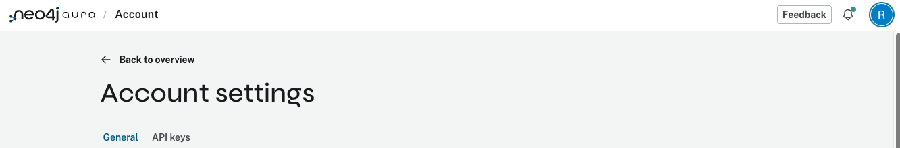

# Neo4j Aura Agents Python Client

A Python client for calling external Neo4j Aura Agents via the REST API.

## Overview

[Neo4j Aura Agents](https://neo4j.com/developer/genai-ecosystem/aura-agent/) is an agent-creation platform that enables you to rapidly build, test, and deploy AI agents grounded by your enterprise data in AuraDB. Once you've created an agent and made it "external," you can call it via a REST API endpoint.

This client library provides:

- OAuth2 authentication with automatic token caching and refresh
- Both synchronous and asynchronous invocation methods
- Pydantic models for type-safe responses
- CLI tool for quick queries
- Interactive chat mode

## Prerequisites

1. **Neo4j Aura Account** with an AuraDB instance
2. **An Aura Agent** with external endpoint enabled
3. **API Credentials** (Client ID and Secret) from your Neo4j profile

## Setting Up Your Aura Agent

### Step 1: Create Your Aura Agent

First, create your Aura Agent by following the hands-on lab:
**[Neo4j Aura Agents Lab](https://github.com/neo4j-partners/hands-on-lab-neo4j-and-azure/tree/main/Lab_2_Aura_Agents)**

**Important:** When creating your agent, select **"External endpoint"** to enable REST API access.

### Step 2: Get Your Agent Endpoint URL

After creating your agent:
1. Click on your agent in the Aura console
2. Copy the endpoint URL (it will look like `https://api.neo4j.io/v2beta1/projects/.../agents/.../invoke`)

### Step 3: Get Your API Credentials

To get your Client ID and Secret:
1. Click on your **profile icon** in the top right corner
2. Go to **Settings**
3. Select the **API keys** tab
4. Create a new API key to get your Client ID and Client Secret



## Quick Start with Jupyter Notebook

If you followed the lab setup in the main README.md, you can test your agent using the Jupyter notebook:

1. Open [aura_agent_demo.ipynb](aura_agent_demo.ipynb)
2. Copy your credentials and set the values in the notebook:
   - `CLIENT_ID` - Your API key Client ID
   - `CLIENT_SECRET` - Your API key Client Secret
   - `AGENT_ENDPOINT` - Your agent's endpoint URL
3. Run the notebook cells to test your agent

## Installation

```bash
cd aura-agents
uv sync
```

## Configuration

1. Copy the example environment file:
   ```bash
   cp .env.example .env
   ```

2. Edit `.env` with your credentials:
   ```bash
   # From your Neo4j Aura user profile (API Keys)
   NEO4J_CLIENT_ID=your-client-id
   NEO4J_CLIENT_SECRET=your-client-secret

   # From the Aura Agent console (Copy endpoint button)
   NEO4J_AGENT_ENDPOINT=https://api.neo4j.io/v2beta1/projects/.../agents/.../invoke
   ```

## Usage

### Python API

```python
from src import AuraAgentClient

# Create client from environment variables
client = AuraAgentClient.from_env()

# Or create with explicit credentials
client = AuraAgentClient(
    client_id="your-client-id",
    client_secret="your-client-secret",
    endpoint_url="https://api.neo4j.io/v2beta1/projects/.../agents/.../invoke"
)

# Invoke the agent (sync)
response = client.invoke("What contracts mention Motorola?")
print(response.text)

# Invoke the agent (async)
import asyncio
response = asyncio.run(client.invoke_async("What's in the graph?"))
print(response.text)
```

### CLI

```bash
# No arguments - asks default question about agent capabilities
uv run python cli.py

# Ask what tools the agent has available
uv run python cli.py --tools

# Query a specific company
uv run python cli.py "Tell me about NVIDIA CORPORATION"

# JSON output (for scripting)
uv run python cli.py --json "Give me a summary" | jq .text

# Raw API response (for debugging)
uv run python cli.py --raw "What tools do you have?"

# Verbose mode with debug output
uv run python cli.py -v "Explain the schema"

# Read from stdin
echo "What's in the graph?" | uv run python cli.py -
```

#### CLI Options

| Option | Description |
|--------|-------------|
| `(no args)` | Ask default question about agent capabilities |
| `--tools` | List the tools available to the agent |
| `--json`, `-j` | Output response as formatted JSON |
| `--raw`, `-r` | Output raw API response (for debugging) |
| `--verbose`, `-v` | Enable debug logging |
| `--timeout`, `-t` | Request timeout in seconds (default: 60) |

### Interactive Chat

```bash
uv run python examples/interactive_chat.py
```

## Examples

| Example | Description |
|---------|-------------|
| `examples/basic_usage.py` | Simple synchronous invocation |
| `examples/async_usage.py` | Concurrent async queries |
| `examples/interactive_chat.py` | Interactive Q&A session |

Run an example:
```bash
uv run python examples/basic_usage.py
```

## Discovering Agent Tools

You can ask the agent what tools it has available:

```bash
$ uv run python cli.py --tools

I have one tool available:

*   **`get_company_overview(company_name: str)`**: This tool provides a
    comprehensive overview of a company. It can retrieve information such
    as SEC filings, identified risk factors, and major institutional owners.
```

The tools available depend on how the agent was configured in the Aura console. Common tools include:

| Tool | Parameters | Description |
|------|------------|-------------|
| `get_company_overview` | `company_name: str` | Retrieves SEC filings, risk factors, and institutional owners |

## API Reference

### AuraAgentClient

```python
class AuraAgentClient:
    def __init__(
        self,
        client_id: str,
        client_secret: str,
        endpoint_url: str,
        token_url: str | None = None,  # Default: https://api.neo4j.io/oauth/token
        timeout: int | None = None,     # Default: 60 seconds
    ): ...

    def invoke(self, question: str) -> AgentResponse: ...
    async def invoke_async(self, question: str) -> AgentResponse: ...
    def clear_token_cache(self) -> None: ...

    @classmethod
    def from_env(cls) -> "AuraAgentClient": ...
```

### AgentResponse

```python
class AgentResponse:
    text: str | None           # Formatted response text
    thinking: str | None       # Agent reasoning steps (shows agent's logic)
    tool_uses: list[ToolUse]   # Tools used during invocation
    status: str | None         # Request status (SUCCESS)
    usage: AgentUsage | None   # Token usage metrics
    raw_response: dict | None  # Full JSON for debugging
```

### AgentUsage

```python
class AgentUsage:
    request_tokens: int | None   # Tokens in the request
    response_tokens: int | None  # Tokens in the response
    total_tokens: int | None     # Total tokens used
```

## Example Output

### Text Response

```bash
$ uv run python cli.py "Tell me about Apple Inc"

Apple Inc. (ticker: AAPL) has several SEC filings...

Some of their top risk factors include:
*   Geography
*   Aggressive price competition
*   Frequent introduction of new products
...

Major asset managers holding Apple Inc. include:
*   BlackRock Inc.
*   Berkshire Hathaway Inc
*   Vanguard Group Inc
...
```

### JSON Response

```bash
$ uv run python cli.py --json "What tools do you have?" | jq .
```

```json
{
  "text": "I have one tool available: `get_company_overview`...",
  "status": "SUCCESS",
  "thinking": "The user wants to know my capabilities...",
  "tool_uses": null,
  "usage": {
    "request_tokens": 122,
    "response_tokens": 100,
    "total_tokens": 222
  }
}
```

### Raw API Response

```bash
$ uv run python cli.py --raw "Hello" | jq .
```

```json
{
  "content": [
    { "type": "thinking", "thinking": "..." },
    { "type": "text", "text": "..." }
  ],
  "end_reason": "FINAL_ANSWER_PROVIDED",
  "role": "assistant",
  "status": "SUCCESS",
  "type": "message",
  "usage": {
    "request_tokens": 128,
    "response_tokens": 163,
    "total_tokens": 291
  }
}
```

## How Aura Agents Work

1. **Create an Agent** in the Neo4j Aura console:
   - Configure your AuraDB instance as the data source
   - Define the agent's capabilities and behavior
   - Test with the built-in chat interface

2. **Make it External**:
   - Set visibility to "External" in the agent settings
   - Copy the endpoint URL

3. **Get API Credentials**:
   - Go to your Neo4j user profile → API Keys
   - Create a new API key and secret

4. **Call via REST API**:
   - Authenticate via OAuth2 to get a bearer token
   - POST to the agent endpoint with `{"input": "your question"}`

## Authentication Flow

The client handles OAuth2 automatically:

```
1. POST https://api.neo4j.io/oauth/token
   - Basic Auth: client_id:client_secret
   - Body: grant_type=client_credentials
   - Response: { access_token, expires_in: 3600, token_type: bearer }

2. POST {endpoint_url}
   - Authorization: Bearer {access_token}
   - Body: { input: "your question" }
   - Response: { text, thinking, status, usage, ... }
```

Tokens are cached and automatically refreshed when expired.

## Resources

- [Aura Agent Documentation](https://neo4j.com/developer/genai-ecosystem/aura-agent/)
- [Build a GraphRAG Agent in Minutes](https://neo4j.com/blog/genai/build-context-aware-graphrag-agent/)
- [Aura API Authentication](https://neo4j.com/docs/aura/platform/api/authentication/)
- [GraphAcademy: Aura Agents](https://graphacademy.neo4j.com/courses/workshop-genai/3-agents/5-aura-agents/)
