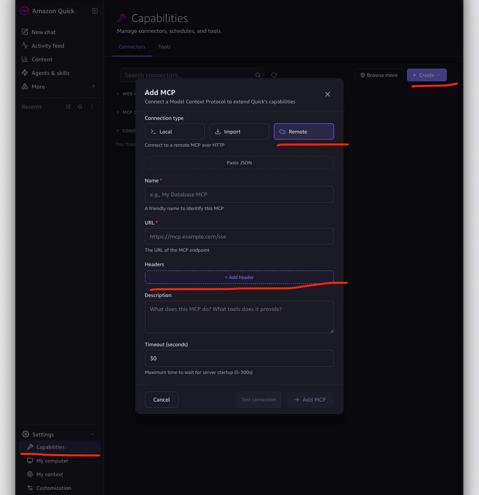
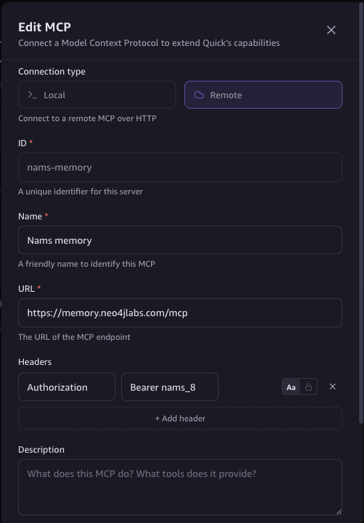
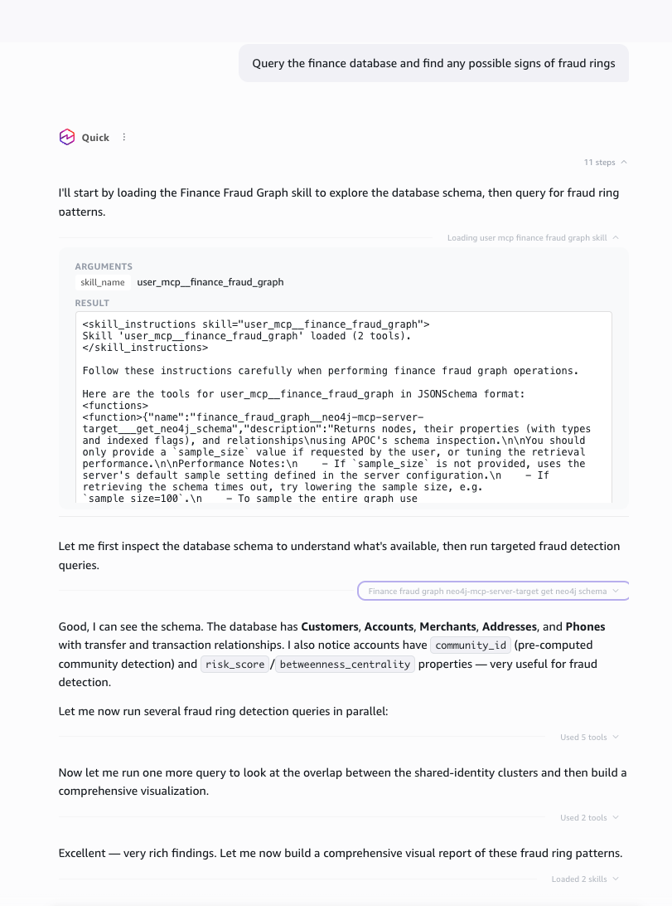
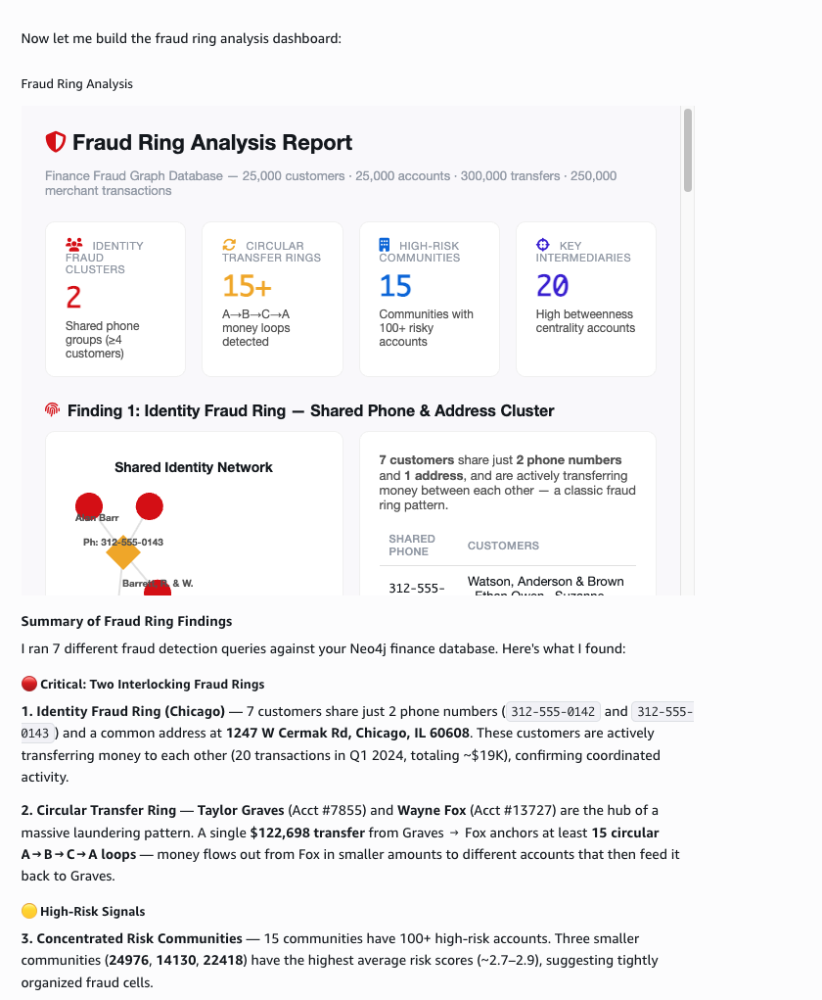

# Fraud Investigation with Amazon Quick

This demo finds synthetic fraud rings with AWS analytics and Neo4j. One
dataset feeds both Athena and a Neo4j graph, and Amazon Quick shows the
results.

## Overview

- **Dataset:** The folder [`demos/fraud-amazon-quick/data/`](./data/) holds the only copy of the synthetic fraud CSVs and `ground_truth.json`.
- **Graph loader:** The folder [`demos/fraud-amazon-quick/graph-loader/`](./graph-loader/) loads the data into Neo4j with a direct driver. It also adds GDS fraud signals.
- **Fraud memory agent:** The folder [`demos/fraud-amazon-quick/fraud-memory-agent/`](./fraud-memory-agent/) holds a Strands agent. The agent queries the graph through the MCP Gateway and records memory in NAMS.
- **Iceberg loaders:** The folder [`demos/fraud-amazon-quick/fraud-iceberg/`](./fraud-iceberg/) writes the data to Iceberg tables in S3 or S3 Tables. Athena queries those tables.
- **Amazon Quick:** Amazon Quick shows the Athena tables and the agent. You set it up in the AWS console.

## Quick start

Each command group starts from the repo root.

```bash
# 1. Load the graph and add GDS signals
cd demos/fraud-amazon-quick/graph-loader
cp .env.sample .env              # set NEO4J_URI, NEO4J_USERNAME, NEO4J_PASSWORD
uv sync
uv run fraud-graph-load
uv run fraud-graph-enrich

# 2. Deploy the MCP server for the same database
cd neo4j-mcp-server
cp .env.sample .env.finance      # set the same NEO4J_* values
./deploy.py --env finance
./deploy.py --env finance credentials
../scripts/sync-credentials.sh

# 3. Run the fraud memory agent
cd demos/fraud-amazon-quick/fraud-memory-agent
cp .env.sample .env              # set MEMORY_API_KEY=nams_...
uv sync
uv run fraud-server              # Terminal 1
uv run fraud-cli --user-id analyst-1 "Find circular transfer chains"   # Terminal 2

```

## Prerequisites

- **Neo4j database:** You need a Neo4j database set aside for this demo. The enrichment step also needs Graph Data Science or Aura Graph Analytics.
- **AWS credentials:** Your AWS credentials need access to Bedrock models.
- **NAMS API key:** You can create a key at [NAMS](https://memory.neo4jlabs.com/).
- **Tools:** You need the [`uv`](https://docs.astral.sh/uv/) package manager and Python 3.11 or later.

## Step 1: Load the graph

Run from `demos/fraud-amazon-quick/graph-loader/`:

```bash
cp .env.sample .env       # set NEO4J_URI, NEO4J_USERNAME, NEO4J_PASSWORD
uv sync
uv run fraud-graph-load
```

`uv run fraud-graph-load --reset` deletes every node and relationship in the
database before it loads. Use it only on the demo database.

## Step 2: Add GDS fraud signals

Run from `demos/fraud-amazon-quick/graph-loader/`:

```bash
uv run fraud-graph-enrich
uv run fraud-graph-analyze   # optional read-only check of the investigation queries
```

Enrichment adds risk scores, communities, betweenness, and account
similarity. The agent can query the graph without it. Questions about those
signals need it. See
[`demos/fraud-amazon-quick/graph-loader/README.md`](./graph-loader/README.md)
for GDS session sizing.

## Step 3: Deploy the MCP server for the fraud graph

The agent reaches Neo4j only through the Neo4j MCP server. Deploy the server
against the same database you loaded in Step 1.

Run from [`neo4j-mcp-server/`](../../neo4j-mcp-server/):

```bash
cp .env.sample .env.finance  # set the same NEO4J_URI, NEO4J_USERNAME, NEO4J_PASSWORD
./deploy.py --env finance
./deploy.py --env finance credentials
../scripts/sync-credentials.sh
```

`sync-credentials.sh` copies `.mcp-credentials.finance.json` to
`demos/fraud-amazon-quick/fraud-memory-agent/.mcp-credentials.json`.

## Step 4: Run the fraud memory agent

Run from `demos/fraud-amazon-quick/fraud-memory-agent/`:

```bash
cp .env.sample .env         # set MEMORY_API_KEY=nams_...
uv sync
uv run fraud-server        # Terminal 1
uv run fraud-cli --user-id analyst-1 "Find circular transfer chains"   # Terminal 2
```

Deploy the agent to AgentCore Runtime after the local run works:

```bash
./agent.sh configure
./agent.sh deploy
./agent.sh verify
```

See
[`demos/fraud-amazon-quick/fraud-memory-agent/README.md`](./fraud-memory-agent/README.md)
for the request format, NAMS traffic generation, and diagnostics.


## Step 6: Show the results in Amazon Quick

Amazon Quick connects to the finance Neo4j MCP Gateway from Step 3 as a
remote MCP server. You set it up in the Amazon Quick app. This repository does
not script it.

### 6.1 Create an Amazon Quick account

Create an Amazon Quick account. Sign-in with SSO does not work. A trial
account with any Gmail address works.

Download and install the Amazon Quick app from the
[Amazon Quick download page](https://aws.amazon.com/quick/download/). Sign in
with the account you created.

### 6.2 Create an MCP server connector

1. In the left sidebar, open **Settings** > **Capabilities**.
2. On the **Connectors** tab, choose **Create** > **MCP server**.

### 6.3 Configure the remote connection

Print the finance Gateway URL. Run from
[`neo4j-mcp-server/`](../../neo4j-mcp-server/):

```bash
jq -r .gateway_url .mcp-credentials.finance.json
```

1. Under **Connection type**, select **Remote**.
2. Enter a **Name** for the connector, such as `Neo4j fraud graph`.
3. Enter the Gateway URL in **URL**.
4. Paste this text into **Description**. The description tells Quick what the
   server holds and when to use it.

   ```text
   Read-only access to a Neo4j graph of synthetic banking fraud data. The graph holds Account, Customer, Merchant, Phone, and Address nodes. Accounts link through TRANSFERRED_TO, TRANSACTED_WITH, OWNS, and SIMILAR_TO relationships. Accounts carry risk_score, community_id, and betweenness_centrality properties. Tools: get_neo4j_schema returns the graph schema. read_neo4j_cypher runs a read-only Cypher query. Call get_neo4j_schema before writing Cypher. Use it to find fraud rings, circular transfers, shared phone numbers or addresses, and high-risk accounts.
   ```

5. Under **Headers**, choose **+ Add header**.



### 6.4 Add the Authorization header

Generate a fresh access token and copy it to the clipboard. Run from
[`neo4j-mcp-server/`](../../neo4j-mcp-server/):

```bash
./deploy.py --env finance credentials
jq -r .access_token .mcp-credentials.finance.json | pbcopy
```

1. Set the header name to `Authorization`.
2. Set the header value to `Bearer ` followed by the token you copied.
3. Choose **Test connection**. When the test succeeds, choose **Add MCP**.



The access token lasts 24 hours. Quick stores the header as a fixed value, so
the connector fails once the token expires. To renew it, run the two commands
above again. Then paste the new token into the header in the **Edit MCP**
dialog.

### 6.5 Query the finance graph from Quick

Once the connector is added, you can ask Quick about the graph in plain
language. The prompt below is
`Query the finance database and find any possible signs of fraud rings`.



Quick loads the connector's tools first. It then reads the Neo4j schema
through the Gateway. The schema shows the risk and community properties from
Step 2, so Quick uses them in its fraud queries. Quick runs several Cypher
queries in parallel, then builds a visual report.



The report sums up the findings in tiles and charts. It lists the shared phone
and address cluster in Chicago, circular transfer loops, and the communities
with the highest risk scores. A written summary of each finding follows the
report.

### 6.7 Ask Quick about the fraud graph

Open **New chat** and ask these questions in order. Each one builds on the
answer before it. The expected answers come from the loaded graph after the
Step 2 enrichment.

**Explore the graph**

1. `What data is in the Neo4j fraud graph? Describe the node labels and relationships.`

   Quick calls `get_neo4j_schema`. The graph holds `Account`, `Customer`,
   `Merchant`, `Phone`, and `Address` nodes.

**Follow a shared identity ring**

2. `Which phone numbers are shared by more than one customer? List the customers and the accounts they own.`

   Two numbers are shared: `312-555-0142` and `312-555-0143`. Four customers
   share each one.

3. `Is any address shared by more than one customer?`

   Four customers share `1247 W Cermak Rd, Chicago, IL 60608`. Two of them
   are on each shared phone number, so the address joins the two phone groups.

4. `Take the accounts linked by those shared phones and that address. Do they transfer money to each other, and are they in the same community?`

   The ring has eight accounts: 368, 927, 1033, 1696, 2184, 2216, 2612, and
   3003. They make 45 transfers among themselves. All eight sit in community
   20549.

5. `Which merchants do the most accounts in community 20549 buy from?`

   Four merchants stand out: Simmons Group (crypto), Stephens Ltd (retail),
   Stevenson-Powell (gaming), and Duncan, Wilson and Christensen (online).
   Between 56 and 61 community accounts buy from each one. The next merchant
   has only 2 buyers.

**Check the risk scores**

6. `Which 10 accounts have the highest risk score, and which communities are they in?`

   Scores run from about 21 to 22. Six of the ten sit in communities 18965
   and 8444. Those communities hold 6,801 and 8,487 accounts.

7. `Look at account 13914. How many transfers does it have compared with the average account? Does it look like a fraud ring member or a busy hub?`

   Account 13914 is Jarvis Inc, a business account with 492 transfers. The
   average account has 24. It is a high-volume hub, not a ring member.

8. `Which communities have the highest average risk score? How big are they, and how does their average compare with the whole graph?`

   Ten communities stand out, each with 111 to 135 accounts. Their average
   risk scores run from 2.45 to 2.82. The whole graph averages 0.96. These small, tight communities
   are the fraud rings. Community 20549 from question 4 is one of them.

Questions 6 through 8 make the key point of the demo. The highest PageRank
scores belong to busy hub accounts. The fraud rings show up as small
communities with shared identities and shared merchants.
