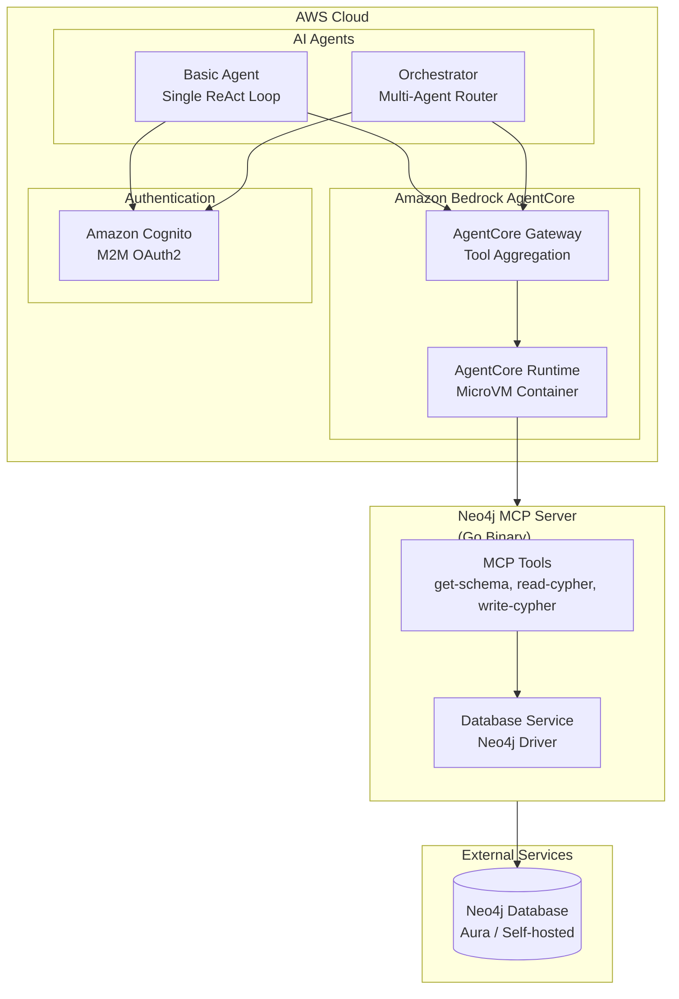
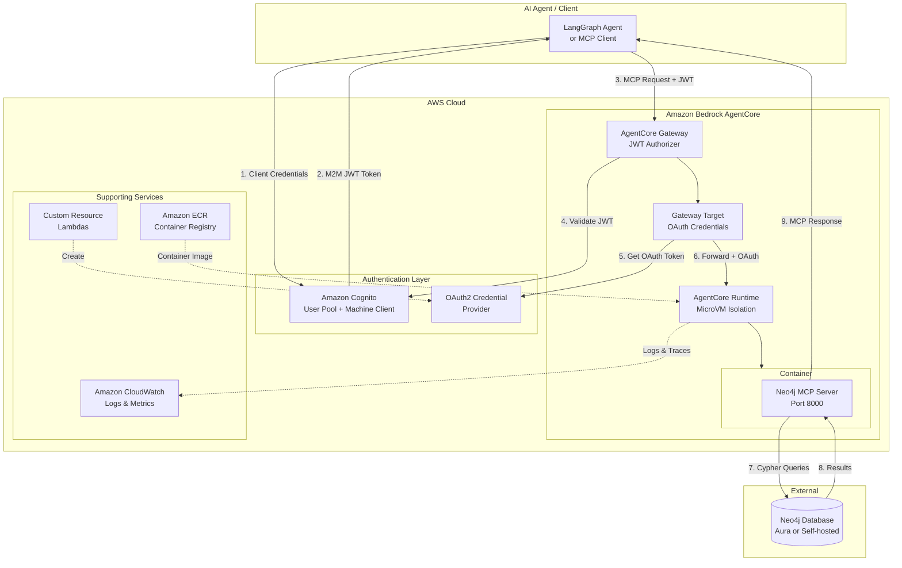
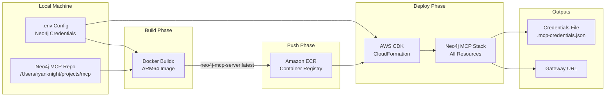
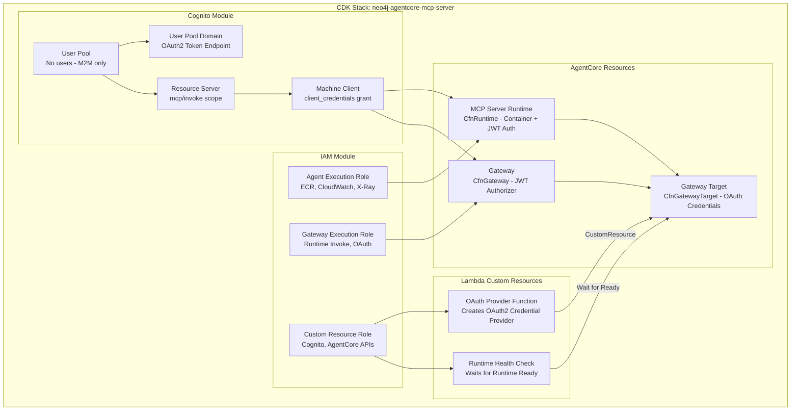
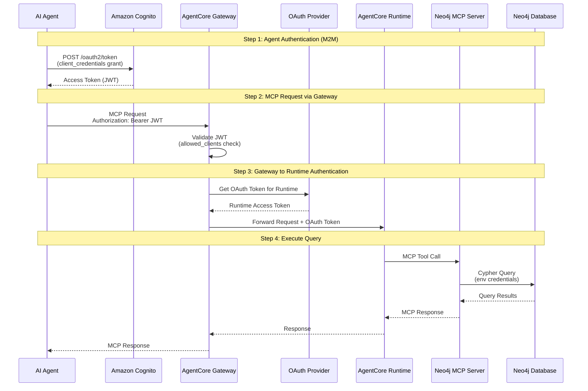
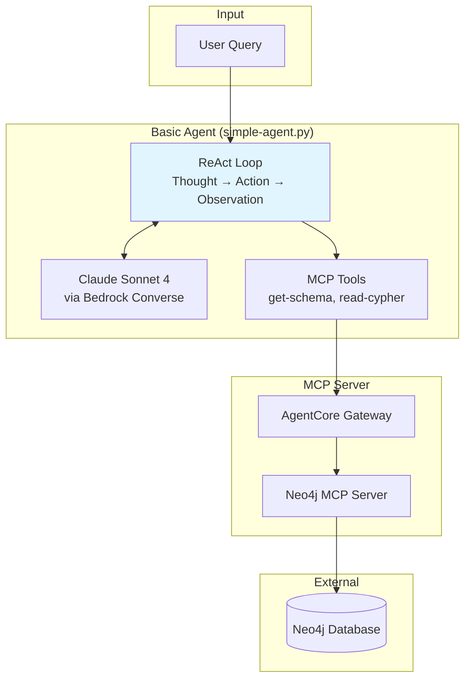
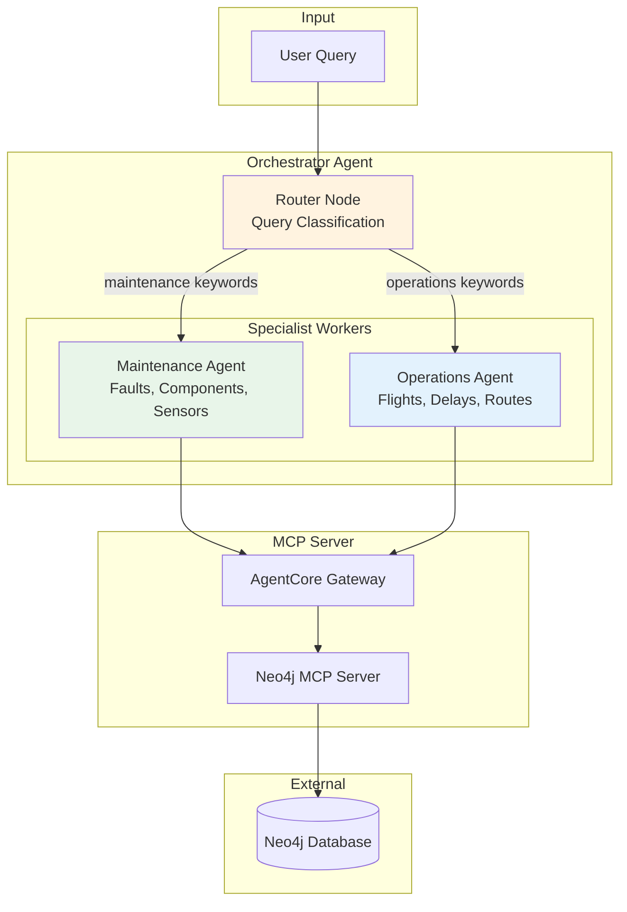
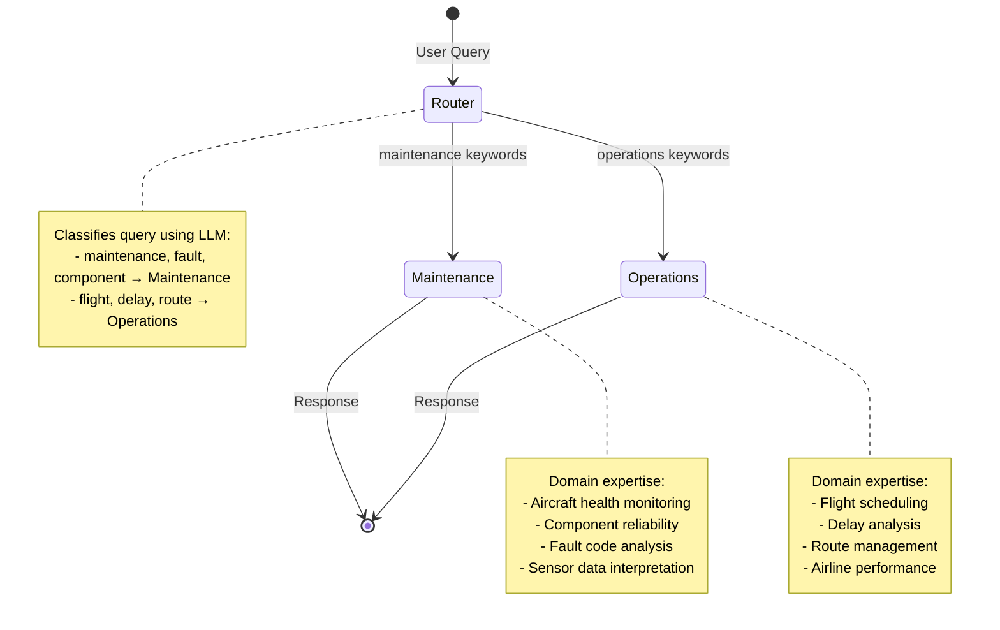
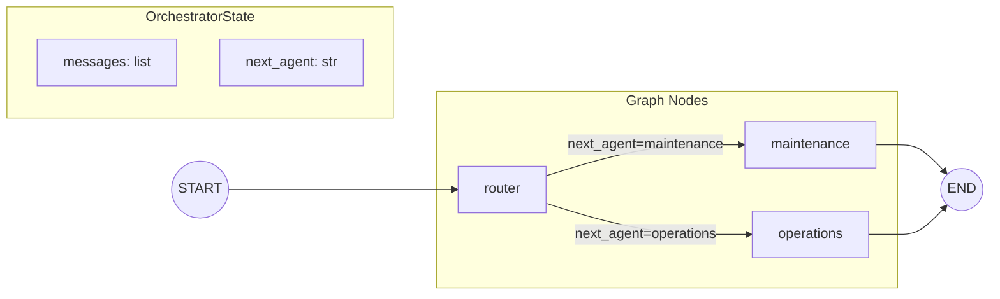
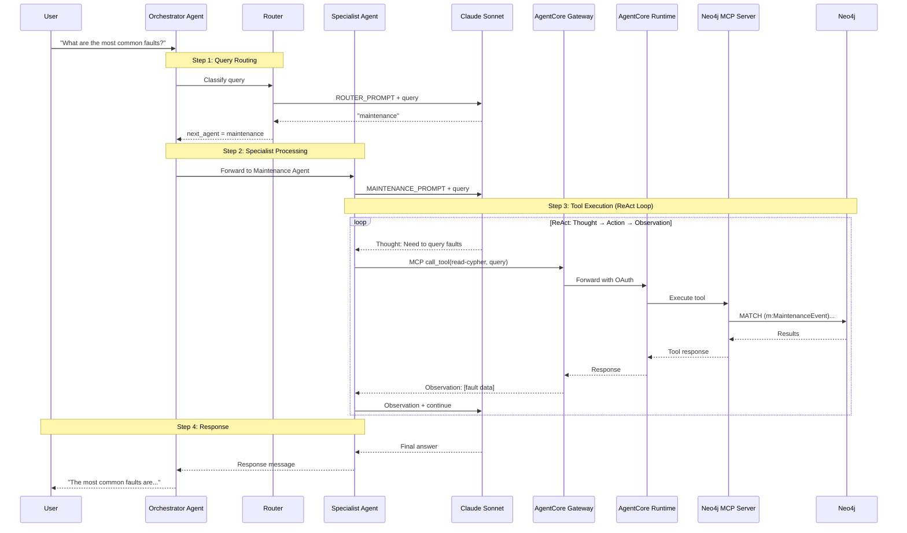

# Architecture Overview

This document provides a comprehensive architecture overview of the Neo4j MCP ecosystem deployed on Amazon Bedrock AgentCore, covering both the MCP server deployment and the AI agents that consume it.

## Table of Contents

1. [System Overview](#system-overview)
2. [Neo4j MCP Server Deployment](#neo4j-mcp-server-deployment)
   - [High-Level Architecture](#high-level-architecture)
   - [Deployment Flow](#deployment-flow)
   - [CDK Stack Components](#cdk-stack-components)
   - [Authentication Architecture](#authentication-architecture)
3. [AI Agents Architecture](#ai-agents-architecture)
   - [Basic Agent](#basic-agent)
   - [Orchestrator Agent (Multi-Agent)](#orchestrator-agent-multi-agent)
4. [End-to-End Request Flow](#end-to-end-request-flow)

---

## System Overview

The system consists of three main components:

1. **Neo4j MCP Server** (`/Users/ryanknight/projects/mcp`) - Official Neo4j Model Context Protocol server written in Go
2. **MCP Server Deployment** (`neo4j-agentcore-mcp-server/`) - AWS CDK infrastructure to deploy the MCP server on AgentCore
3. **AI Agents** (`agentcore-neo4j-mcp-agent/`) - LangGraph-based agents that query Neo4j via the MCP server



---

## Neo4j MCP Server Deployment

### High-Level Architecture

The `neo4j-agentcore-mcp-server` project deploys the official Neo4j MCP server to Amazon Bedrock AgentCore Runtime with Gateway authentication.



### Component Descriptions

Understanding what each piece does in plain English:

#### AgentCore Runtime

**What it is:** A secure, serverless compute environment purpose-built for running AI agents and tools. Think of it as a specialized hosting service where your MCP server container runs.

**Key characteristics:**
- **MicroVM Isolation** - Each user session runs in its own dedicated micro virtual machine with completely isolated CPU, memory, and filesystem. When a session ends, the entire VM is terminated and memory is wiped clean. This prevents data from one user ever leaking to another.
- **Long-Running Support** - Unlike Lambda's 15-minute limit, AgentCore Runtime supports workloads up to 8 hours, enabling complex multi-step agent workflows.
- **Framework Agnostic** - Works with any agent framework (LangGraph, CrewAI, Strands) and any LLM (Claude, GPT, Gemini).
- **Automatic Scaling** - Dynamically provisions resources based on demand with no pre-allocation required.

**In this deployment:** Hosts the Neo4j MCP server container, receiving requests from Gateway and executing Cypher queries against Neo4j.

#### AgentCore Gateway

**What it is:** A fully-managed service that acts as a front door for AI agents to discover and access tools. It translates requests, handles authentication, and can aggregate multiple tool sources into a single endpoint.

**Key characteristics:**
- **Protocol Translation** - Converts Model Context Protocol (MCP) requests into whatever format your backend needs (API calls, Lambda invocations, etc.).
- **Tool Discovery** - Provides semantic search across thousands of tools, helping agents find the right tool for a task without overwhelming the prompt.
- **Security Layer** - Manages both inbound authentication (verifying the agent's identity) and outbound credentials (authenticating to backend services).
- **Composition** - Combines multiple APIs, Lambda functions, and services into a single MCP endpoint.

**In this deployment:** Receives authenticated requests from agents, validates their JWT tokens, obtains OAuth credentials for the Runtime, and forwards MCP tool calls.

#### Gateway Target

**What it is:** A configuration that tells Gateway how to reach a specific backend service and what credentials to use. Each target represents one tool source (like an MCP server, Lambda function, or API).

**Key characteristics:**
- **Endpoint Configuration** - Specifies the URL where the backend service lives.
- **Credential Provider** - Attaches OAuth2 or other credentials that Gateway uses when calling the target.
- **Tool Indexing** - When created, Gateway automatically calls the target's `tools/list` endpoint to discover available tools.
- **MCP Protocol Support** - For MCP servers, supports protocol versions 2025-03-26 and 2025-06-18.

**In this deployment:** Points to the AgentCore Runtime URL where the Neo4j MCP server runs, with OAuth2 credentials attached for authentication.

#### OAuth2 Credential Provider

**What it is:** An AgentCore Identity resource that stores OAuth2 client credentials and manages token lifecycle. Gateway uses this to authenticate when calling protected backends.

**Key characteristics:**
- **Secure Storage** - Client ID and secret are stored securely in AWS Secrets Manager.
- **Token Management** - Handles token acquisition and refresh automatically.
- **Two-Legged OAuth** - Supports machine-to-machine (M2M) client credentials flow.

**In this deployment:** Stores the Cognito machine client credentials so Gateway can obtain tokens to authenticate with the Runtime.

#### Custom Resource Lambdas

**What they are:** AWS Lambda functions that extend CloudFormation's capabilities to manage resources that don't have native CloudFormation support. They run during stack create/update/delete operations.

**Key characteristics:**
- **Lifecycle Hooks** - Triggered automatically by CloudFormation during Create, Update, and Delete operations.
- **Return Values** - Can return data that other stack resources reference (like ARNs or IDs).
- **Idempotent** - Must handle being called multiple times safely.

**In this deployment, two Custom Resources:**

1. **OAuth Provider Function** - Creates the OAuth2 Credential Provider in AgentCore Identity. This resource isn't natively supported by CloudFormation, so the Lambda calls the AgentCore API directly.

2. **Runtime Health Check Function** - Waits for the AgentCore Runtime to reach a "ready" state before allowing the Gateway Target to be created. This prevents race conditions where Gateway tries to connect to a Runtime that isn't running yet.

#### Amazon Cognito User Pool

**What it is:** A managed identity service that handles user authentication and issues OAuth2 tokens. In this deployment, it's used purely for machine-to-machine authentication (no human users).

**Key characteristics:**
- **OAuth2 Token Endpoint** - Provides the `/oauth2/token` URL where clients exchange credentials for JWT tokens.
- **Machine Client** - A special client configured for `client_credentials` grant (no user login required).
- **Resource Server** - Defines OAuth2 scopes that control what the token authorizes.

**In this deployment:** Issues JWT tokens to agents (using client credentials flow) that Gateway validates before allowing access.

#### Amazon ECR (Elastic Container Registry)

**What it is:** A fully-managed Docker container registry where you store, manage, and deploy container images.

**In this deployment:** Stores the Neo4j MCP server Docker image. AgentCore Runtime pulls this image when starting the container.

#### Amazon CloudWatch

**What it is:** AWS's monitoring and observability service for logs, metrics, and traces.

**In this deployment:** Receives logs from the AgentCore Runtime (container stdout/stderr) and X-Ray traces for distributed tracing across the request flow.

### Deployment Flow

The `deploy.sh` script orchestrates the entire deployment process:



**Deployment Commands:**

| Command | Description |
|---------|-------------|
| `./deploy.sh` | Full deployment (build, push, stack) |
| `./deploy.sh redeploy` | Fast redeploy (build, push, update runtime) |
| `./deploy.sh stack` | Deploy CDK stack only |
| `./deploy.sh status` | Show stack status and outputs |
| `./deploy.sh credentials` | Generate `.mcp-credentials.json` |
| `./deploy.sh cleanup` | Delete all resources |

### CDK Stack Components

The CDK stack (`cdk/neo4j_mcp_stack.py`) creates these AWS resources:



**Key CDK Constructs:**

| Resource | Type | Purpose |
|----------|------|---------|
| User Pool | `cognito.UserPool` | OAuth2 identity provider |
| Machine Client | `cognito.CfnUserPoolClient` | M2M client credentials |
| Agent Execution Role | `iam.Role` | Runtime permissions |
| MCP Server Runtime | `bedrockagentcore.CfnRuntime` | Container hosting |
| Gateway | `bedrockagentcore.CfnGateway` | Entry point with JWT auth |
| Gateway Target | `bedrockagentcore.CfnGatewayTarget` | Routes to Runtime |

### Authentication Architecture

The system uses machine-to-machine (M2M) OAuth2 authentication:



**Why M2M-Only via Gateway:**

1. **No User Management** - No passwords to rotate, no users to create/delete
2. **Simplified Auth** - Agents use client credentials, not interactive login
3. **Centralized Access** - Gateway provides single entry point with audit logging
4. **Automatic Token Handling** - Gateway manages OAuth tokens with Runtime
5. **Tool Discovery** - Gateway enables semantic tool search across MCP servers
6. **Security Isolation** - Runtime only accepts Gateway traffic

---

## AI Agents Architecture

Two agent implementations are provided in `agentcore-neo4j-mcp-agent/`:

### Basic Agent

A single ReAct (Reasoning + Acting) agent that handles all queries using LangChain and LangGraph.



**Key Components:**

| Component | Technology | Purpose |
|-----------|------------|---------|
| LLM | Claude Sonnet 4 (Bedrock) | Reasoning and response generation |
| Agent Framework | LangChain `create_agent` | ReAct agent pattern |
| MCP Client | `langchain_mcp_adapters` | Tool discovery and invocation |
| Transport | Streamable HTTP | Gateway communication |

**Usage:**

```bash
cd basic-agent
./agent.sh setup          # Install dependencies
./agent.sh start          # Run locally (port 8080)
./agent.sh test           # Test local agent
python simple-agent.py "What is the database schema?"
```

### Orchestrator Agent (Multi-Agent)

A supervisor agent that routes queries to specialized domain experts using LangGraph StateGraph.



**StateGraph Architecture:**



**Agent State Flow:**



**Domain Specialists:**

| Agent | Handles | Example Queries |
|-------|---------|-----------------|
| **Maintenance** | MaintenanceEvent, Component, Sensor, System, Fault | "Most common maintenance faults", "Hydraulic system issues" |
| **Operations** | Flight, Delay, Airport, Route, Operator | "Common delay causes", "Busiest routes" |

**Key Components:**

| Component | Technology | Purpose |
|-----------|------------|---------|
| Orchestrator | LangGraph `StateGraph` | Multi-agent coordination |
| Router | Claude LLM + Classification Prompt | Query routing |
| Workers | LangGraph `create_react_agent` | Domain-specific ReAct agents |
| State | `TypedDict` with `add_messages` | Conversation history |
| Memory | `MemorySaver` | Session persistence |

**Usage:**

```bash
cd orchestrator-agent
./agent.sh setup              # Install dependencies
./agent.sh start              # Run locally (port 8080)
./agent.sh test-maintenance   # Test routing to Maintenance Agent
./agent.sh test-operations    # Test routing to Operations Agent
./agent.sh deploy             # Deploy to AgentCore Runtime
```

---

## End-to-End Request Flow

Complete flow from user query to Neo4j response:



---

## Technology Stack Summary

| Layer | Technology | Purpose |
|-------|------------|---------|
| **MCP Server** | Go, Neo4j Driver | Cypher query execution |
| **Container** | Docker, ARM64 | Cross-platform deployment |
| **Infrastructure** | AWS CDK (Python) | Infrastructure as Code |
| **Runtime** | Bedrock AgentCore | MicroVM container hosting |
| **Gateway** | Bedrock AgentCore | Tool aggregation, auth |
| **Auth** | Amazon Cognito | OAuth2 M2M tokens |
| **Agents** | LangGraph, LangChain | Multi-agent orchestration |
| **LLM** | Claude Sonnet 4 (Bedrock) | Reasoning, tool selection |
| **Observability** | CloudWatch, X-Ray | Logs, traces, metrics |

---

## References

### AWS Documentation

- [Amazon Bedrock AgentCore Overview](https://docs.aws.amazon.com/bedrock-agentcore/latest/devguide/what-is-bedrock-agentcore.html)
- [AgentCore Runtime](https://docs.aws.amazon.com/bedrock-agentcore/latest/devguide/agents-tools-runtime.html)
- [AgentCore Gateway](https://docs.aws.amazon.com/bedrock-agentcore/latest/devguide/gateway.html)
- [MCP Server Targets](https://docs.aws.amazon.com/bedrock-agentcore/latest/devguide/gateway-target-MCPservers.html)
- [Adding Gateway Targets](https://docs.aws.amazon.com/bedrock-agentcore/latest/devguide/gateway-building-adding-targets.html)
- [AWS CDK Custom Resources](https://docs.aws.amazon.com/cdk/api/v2/docs/aws-cdk-lib.custom_resources-readme.html)
- [Lambda-backed Custom Resources](https://docs.aws.amazon.com/AWSCloudFormation/latest/UserGuide/template-custom-resources-lambda.html)

### Project Resources

- [Neo4j MCP Server](https://github.com/neo4j/mcp)
- [Model Context Protocol](https://modelcontextprotocol.io/)
- [LangGraph Multi-Agent](https://langchain-ai.github.io/langgraph/concepts/multi_agent/)
- [AWS CDK Python Reference](https://docs.aws.amazon.com/cdk/api/v2/python/)
