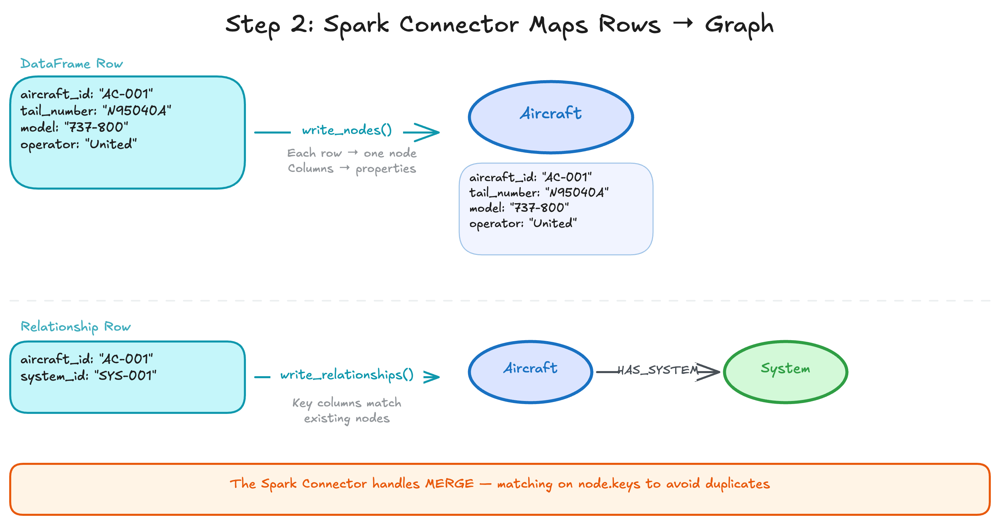
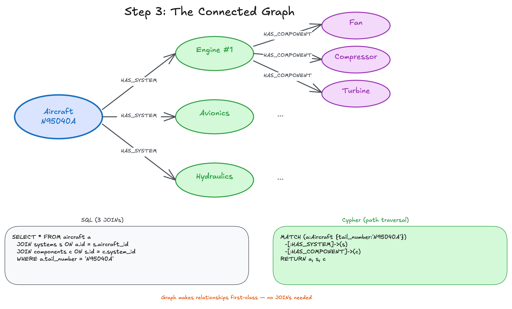

<style>
section {
  --marp-auto-scaling-code: false;
}

li {
  opacity: 1 !important;
  animation: none !important;
  visibility: visible !important;
}

/* Disable all fragment animations */
.marp-fragment {
  opacity: 1 !important;
  visibility: visible !important;
}

ul > li,
ol > li {
  opacity: 1 !important;
}
</style>


# The Aircraft Data Model

Digital twins, knowledge graphs, and turning flat data into a connected fleet

---

## What Is a Digital Twin?

A **digital twin** is a virtual representation of a physical system: its structure, state, and behavior modeled in data.

For an aircraft fleet this means capturing:
- **Topology**: Aircraft, systems, components, and sensors and how they connect
- **Operations**: Flights, routes, delays
- **Maintenance**: Events, faults, component removals, corrective actions
- **Documentation**: Maintenance manuals, procedures, operating limits

---

## Why Knowledge Graphs for Digital Twins?

Digital twins are fundamentally about **relationships**. A component belongs to a system, a system belongs to an aircraft, a fault affects a component, a removal follows a maintenance event.

**Knowledge graphs model this naturally:**
- Entities become **nodes** with properties
- Connections become **relationships** with types and properties
- Multi-hop traversals are native, with no expensive JOINs
- The graph *is* the twin: query it, reason over it, extend it

Tabular databases can store the same data, but answering "Which components caused flight delays?" requires chaining multiple JOINs across many tables. In a graph, it is a single traversal.

---

<style scoped>
section { font-size: 95%; }
</style>

## The Aircraft Digital Twin Dataset

A comprehensive dataset modeling a complete aviation fleet over 90 operational days:

| Entity | Count | Description |
|--------|-------|-------------|
| Aircraft | 20 | Tail numbers, models, operators |
| Systems | 80 | Engines, Avionics, Hydraulics per aircraft |
| Components | 320 | Turbines, Compressors, Pumps |
| Sensors | 160 | Monitoring metadata |
| Sensor Readings | 345,600+ | Hourly telemetry over 90 days |
| Flights | 800 | Departure/arrival information |
| Maintenance Events | 300 | Fault severity and corrective actions |
| Airports | 12 | Route network |

---

## What the Dataset Models

Behind the counts, the dataset captures a realistic fleet:

- Multiple operators flying Boeing 737, Airbus A320/A321, and Embraer E190
- Each aircraft broken into systems (engines, avionics, hydraulics) and components (turbines, compressors, pumps)
- Sensors emitting time-series telemetry: EGT, vibration, fuel flow
- Operational history: flights, delays, and maintenance events with severity and corrective actions

---

## From Tabular Data to Graph

**In flat CSV/tables:** Information is isolated across separate files.

**In a knowledge graph:** It becomes connected and traversable:

```
(Aircraft AC1001)-[:HAS_SYSTEM]->(Engine CFM56-7B #1)
(Engine CFM56-7B #1)-[:HAS_COMPONENT]->(High-pressure Turbine)
(High-pressure Turbine)-[:HAS_EVENT]->(Bearing wear, CRITICAL)
```

---

## Step 1: Flat Tables with Foreign Keys


---

## Step 2: Mapping Tables to Nodes and Relationships



---

## Step 3: A Connected Graph



---

## What the Graph Looks Like

- Graphs naturally model the real world
- Data lives as **nodes** (entities/nouns) and **relationships** (how they connect)
- In the diagram: `(parentheses)` are nodes, `[:brackets]` are relationships

```
(Aircraft) -[:HAS_SYSTEM]-> (System) -[:HAS_COMPONENT]-> (Component)
     |
     |--[:OPERATED_FLIGHT]-> (Flight) -[:DEPARTED_FROM]-> (Airport)
                                |
                                |--[:HAD_DELAY]-> (Delay)
```

Every node and relationship can carry properties (names, dates, measurements), so the graph is rich with context, not just connections.

---

## The Complete Picture

After modeling, the knowledge graph contains:

```
Aircraft → Systems → Components → MaintenanceEvents
                  → Sensors (with embeddings on maintenance chunks)
Aircraft → Flights → Airports
                   → Delays
```

This structure enables questions that traditional tabular search cannot answer.

---

## The Property Graph


---

## What the Graph Enables

| Question Type | How the Graph Helps |
|--------------|---------------------|
| "What maintenance events affect AC1001?" | Traverse HAS_SYSTEM → HAS_COMPONENT → HAS_EVENT |
| "Which flights departed from JFK?" | Follow DEPARTS_FROM relationships |
| "What sensors monitor Engine #1?" | Traverse HAS_SENSOR relationships |
| "How many critical maintenance events?" | Count MaintenanceEvent nodes by severity |

---

## Why It Matters

A flat dataset hides the connections that operations and maintenance questions depend on.

Modeled as a property graph, the aircraft fleet becomes:
- A faithful **digital twin** of structure, operations, and maintenance
- **Traversable**: relationship-heavy questions become single graph queries
- **Extensible**: new entities, properties, and connections layer in without reshaping tables

The graph makes implicit relationships explicit and queryable.
