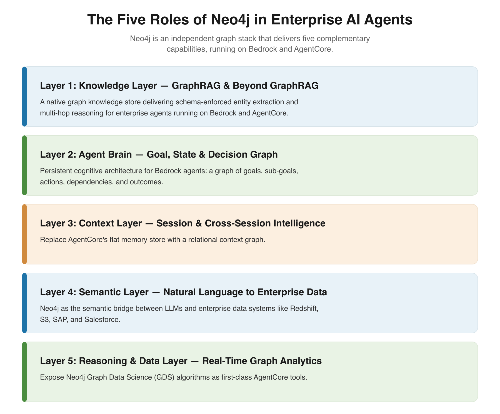

# Neo4j for Agentic AI

A managed graph database, GraphRAG retrieval, and the step from retrievers to agents.

---

# The Foundation: Neo4j

Knowledge, agent brain, context memory, semantic bridge, and graph analytics, in one graph stack.

---

---

## Neo4j: The Graph Intelligence Platform

- **Traverses** supply chains, fault networks, knowledge graphs
- **Cypher** pattern matching on nodes and relationships
- **Multi-hop traversal** and path finding in milliseconds
- Pattern matching across connection topologies reveals structures invisible in flat tables
- Graph Data Science (graph algorithms), AuraDB (managed database), GraphRAG (graph-enhanced retrieval)

---

## Why Use a Graph Database?

Traditional databases struggle with **connected data**:

| Scenario | Relational DB | Graph DB |
|----------|---------------|----------|
| "Find friends of friends" | Complex JOINs, slow | Natural traversal, fast |
| "What impacts what?" | Multiple queries | Single query |
| "How are these connected?" | Hard to express | Native pattern matching |

**Graphs excel at relationship-heavy queries** that would require dozens of JOINs in SQL.

---

## The Value of Neo4j for AI/GenAI

Neo4j provides unique capabilities for building AI applications:

**GraphRAG Foundation:**
- Store knowledge graphs that power AI agents
- Vector search for semantic similarity
- Graph traversal for relationship reasoning

**Production-Ready:**
- Built-in vector indexes for embeddings
- Cypher query language for complex retrieval
- APIs for integration with LLM frameworks

---

# Example Agents

Retrievers and graph access become **tools**. Three reference agents show the patterns:

- **Fleet Agent**: retrievers wired straight to Neo4j
- **Neo4j MCP**: governed graph access for any agent
- **Finance Agent**: persistent, per-user memory

---

## The Fleet Agent

`fleet-agent-demo/agent`: a Strands ReAct agent answering natural-language questions over the aviation fleet graph.

- **Two tools**: `graph_query` (Text2Cypher) and `vector_search` (VectorRetriever), both `neo4j-graphrag`
- **Direct to Neo4j**: opens one driver, no MCP server or Gateway
- **Claude on Bedrock**: the ReAct loop picks the tool per question
- **Runs as `BedrockAgentCoreApp`**: schema read live from the database at runtime

---

## Neo4j MCP on AgentCore

`neo4j-agentcore-mcp-server`: the Neo4j MCP server deployed so *any* agent can reach the graph.

- **AgentCore Runtime**: hosts the Neo4j MCP server
- **AgentCore Gateway**: OAuth2 M2M auth via Cognito, centralized access and audit
- **Read-only tools**: `get-schema` and `read-cypher`, target-prefixed names
- **No embedded driver**: agents call tools instead of carrying credentials

---

## Agent Memory

An agent that forgets every session starts from zero each time. Memory makes it persistent and personal.

- **Short-term**: the current conversation and recent turns
- **Long-term**: durable entities, preferences, and facts as a knowledge graph
- **Reasoning**: past decisions and tool usage, recalled for similar tasks

Stored in Neo4j, memory *is* a graph: entities resolve and connect instead of piling up as isolated chunks.

---

## Neo4j Agent Memory

The [Neo4j Labs agent-memory](https://neo4j.com/labs/agent-memory/) library backs agent memory with a graph.

- **Three memory types**: short-term conversations, long-term knowledge ([POLE+O model](https://neo4j.com/labs/agent-memory/explanation/poleo-model)), reasoning traces
- **Entity resolution**: extraction and dedup, not append-only blobs
- **Per-user scoping**: the core API's `user_identifier=` isolates memory per user across sessions
- **Pluggable**: framework integrations (Strands, LangChain, others) and an MCP server

---

## Example: The Finance Agent

`neo4j-agentcore-agents/finance-agent` wires memory in as Strands tools.

- **`core/memory.py`**: user-scoped wrapper over the library's context-graph tools
- **Four tools**: `search_context`, `add_memory`, `get_user_preferences`, `get_entity_graph`
- **Per-user isolation**: every write links a `:User` node; recall is scoped to that user across all their sessions
- **Graph via MCP**: reaches the graph through the Neo4j MCP server over the AgentCore Gateway (OAuth2, auto-refreshed token)
- **Same graph stack**: memory lives in Neo4j alongside the domain knowledge graph

---

## Neo4j for Agentic AI: The Takeaway

- **Graphs hold the connections** that flat similarity search loses
- **Neo4j is the graph intelligence platform**: traversal, Cypher, and managed vector indexes
- **Fleet Agent**: `neo4j-graphrag` retrievers wired straight to Neo4j as agent tools
- **Neo4j MCP on AgentCore**: governed, read-only graph access for any agent
- **Agent memory**: persistent, per-user, graph-native context across sessions

The result: agents that reason over connected data, grounded in the graph.
