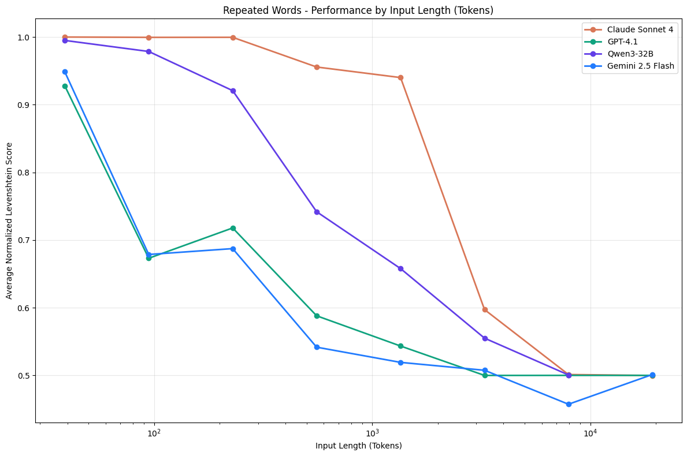
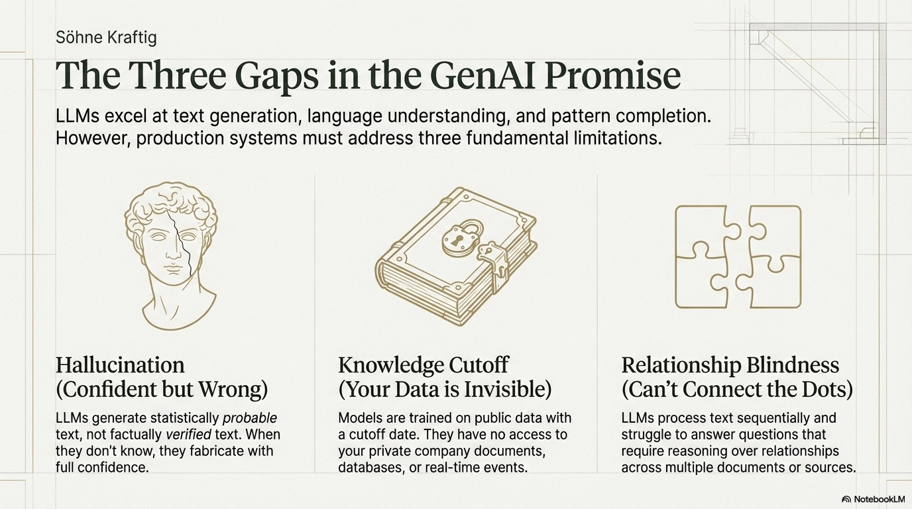

<style>
section {
  --marp-auto-scaling-code: false;
}

li {
  opacity: 1 !important;
  animation: none !important;
  visibility: visible !important;
}

/* Disable all fragment animations */
.marp-fragment {
  opacity: 1 !important;
  visibility: visible !important;
}

ul > li,
ol > li {
  opacity: 1 !important;
}
</style>

# GraphRAG: From Retrieval Limits to Graph-Enriched Search

Why traditional RAG falls short, how GraphRAG fixes it, and the three retrievers you use in practice. GenAI and embedding fundamentals are in the appendix.

<!--
This deck tells one arc. Traditional RAG retrieves similar text and stops
there. GraphRAG preserves entities and relationships, which unlocks three
retrieval patterns. We end on how those retrievers become agent tools.
Background on why context matters, and how embeddings work, lives in the
appendix for anyone who needs it.
-->

---

## The RAG Retrieval Flow

```
User Question
     ↓
Embed the question
     ↓
Compare to all chunk embeddings
     ↓
Return top K most similar chunks
     ↓
Send chunks + question to LLM
     ↓
LLM answers using chunks as context
```

<!--
Traditional RAG retrieves the chunks most similar to a question and hands
them to the LLM. Embedding and vector-search fundamentals are in the appendix.
-->

---

## Traditional RAG: What It Enables

- **Single-document Q&A:** "what does this doc say about X?"
- **Topic retrieval:** relevant passages by meaning
- **Grounding:** answers tied to real text

The foundation of modern AI assistants, with real limits on connected data.

<!--
Traditional RAG works well for finding relevant passages by topic and
answering questions inside a single document. It is the foundation of modern
AI assistants. But as we will see, it struggles the moment information is
connected across sources.
-->

---

## The Problem With Traditional RAG

Traditional RAG treats documents as **isolated blobs**.

- **Sees:** chunks about bearing wear, delays, EGT readings
- **Misses:** which delay came from that bearing wear
- **Misses:** is the high EGT the same engine as the fault
- **Misses:** which other aircraft share that engine type

Each chunk is independent. No understanding of how information connects.

<!--
What traditional RAG sees: a chunk about aircraft AC1001 bearing wear, a chunk
about flight FL00123 delayed at JFK, a chunk about EGT exceeding threshold on
Engine 1. What it misses is everything connecting them. It can find text about
bearing wear and text about delays, but it cannot tell you which flights were
delayed because of a specific maintenance event. Each chunk is embedded and
searched independently. There is no model of how the information connects.
-->

---

## Context ROT: More Context, Worse Answers

Too much irrelevant context **degrades** LLM performance.

- RAG retrieves chunks that are *similar*, not *relevant*
- Context window fills with tangential noise
- Model gets distracted or misled

"Context ROT": retrieval of tangents that rots response quality.

<!--
A surprising finding. When RAG retrieves chunks that are similar but not truly
relevant, the context window fills with tangentially related information and
the model gets confused or misled. This became known as Context ROT, the
retrieval of tangents. The retrieved context actively rots the quality of the
answer.
-->

---

## Context ROT: The Research



As irrelevant context grows, accuracy **drops sharply**.

Quality of context beats quantity.

[Chroma Research: Context ROT](https://research.trychroma.com/context-rot)

<!--
Research from Chroma shows accuracy decreasing as irrelevant context grows.
Adding more retrieved chunks often hurts rather than helps. The takeaway:
quality of context matters more than quantity.
-->

---

## Questions Traditional RAG Can't Answer

| Question | Why It Struggles |
|----------|------------------|
| Aircraft with engines that have critical events | Traverse Aircraft to System to Component to Event |
| Components sharing fault types across the fleet | Find shared patterns across aircraft |
| How many flights delayed due to maintenance | Aggregation, not similarity |
| Sensors on the same system as a failed part | Traverse entity relationships |

These need *structured context* that preserves relationships.

<!--
Each of these requires traversing or aggregating over relationships, not
finding similar text. Similarity search cannot express them.
-->

---

## The GraphRAG Solution

Information isn't truly unstructured. Documents contain:

- **Entities:** aircraft, systems, components, sensors, flights
- **Relationships:** HAS_SYSTEM, HAS_COMPONENT, HAS_EVENT
- **Properties:** attributes on each entity

**Traditional RAG asks:** what chunks are similar?
**GraphRAG asks:** what entities and relationships are relevant?

<!--
The core insight: documents have structure that traditional RAG ignores by
treating them as a bag of words. GraphRAG extracts that structure into a
knowledge graph that preserves entities, the relationships between them, and
their properties. That shifts the question from "what is similar" to "what is
connected and relevant".
-->

---

## Create the Vector Index

GraphRAG still enters the graph through vector search.

```python
from neo4j_graphrag.indexes import create_vector_index

create_vector_index(
    driver,
    name="chunkEmbeddings",
    label="Chunk",
    embedding_property="embedding",
    dimensions=1024,            # Amazon Bedrock Titan v2
    similarity_fn="cosine",
)
```

Idempotent: safe to run on every load.

<!--
Create the index once, before any vectors are stored. The sample uses the
neo4j_graphrag library with Amazon Bedrock Titan v2 embeddings at 1024
dimensions. It is idempotent, so running it on every load is safe.
-->

---

## Store Vectors in Neo4j

The knowledge graph pipeline populates the index.

1. **Embed** each chunk with Amazon Bedrock Titan v2 (1024 dims)
2. **Write** the vector to the `embedding` property on `Chunk`
3. **Index updates** automatically

<!--
Each chunk gets a Titan v2 embedding written to the embedding property on its
Chunk node. The chunkEmbeddings index updates automatically. You can verify
with: MATCH (c:Chunk) RETURN c.text, size(c.embedding) LIMIT 1.
-->

---

## The Complete Knowledge Graph

| Component | Purpose |
|-----------|---------|
| **Documents** | Source provenance |
| **Chunks** | Searchable text units |
| **Embeddings** | Semantic search |
| **Entities** | Structured domain knowledge |
| **Relationships** | Connections between entities |

<!--
With all five in place, the graph has everything GraphRAG needs: searchable
text, the structure around it, and the provenance behind it.
-->

---

## GraphRAG: Graph-Enriched Retrieval

- **Graph holds** structured connections and domain knowledge
- **Search finds** starting chunks closest in meaning
- **Traversal enriches** by following entities and relationships
- **Agents receive** richer context than text search alone

<!--
Vector or fulltext search finds relevant chunks, standard RAG. What GraphRAG
adds is graph traversal from those chunks through the entities and
relationships surrounding them. The agent ends up with far richer context
than text search could provide.
-->

---


---

## Powered by the Neo4j Python GraphRAG Library

- **Retrievers:** ready-made Vector, Vector Cypher, Text2Cypher
- **Embeddings:** pluggable embedders (Amazon Bedrock Titan, others)
- **Pipeline:** one call to retrieve context and generate an answer

<!--
Everything from here is built on the Neo4j Python GraphRAG library. It ships
the three retriever patterns, pluggable embedders, and a pipeline that
combines retrieval with generation in one call.
-->

---

## The GraphRAG Class

```
User Question
    ↓
Retriever finds relevant context
    ↓
Context passed to LLM
    ↓
LLM generates grounded answer
```

Retriever finds context. LLM writes the answer.

<!--
The GraphRAG class combines retrieval with generation. The retriever's only
job is finding the right context. The LLM's only job is turning that context
into a coherent answer.
-->

---

## Overview of Retrievers

| Pattern | What It Does |
|---------|--------------|
| **Vector** | Semantically similar content (standard RAG) |
| **Vector Cypher** | Similar content, then traverse to entities |
| **Text2Cypher** | Query the graph directly for precise facts |

The rest of this deck builds on these three.

<!--
This is the single most important slide. Everything that follows is one of
these three retrievers. Vector for content, Vector Cypher for content plus
relationships, Text2Cypher for precise facts. The combination is more powerful
than any one alone.
-->

---

## Searching a Vector Index

Embed the query in application code, pass the vector as a parameter.

```python
from neo4j_graphrag.embeddings import BedrockEmbeddings

embedder = BedrockEmbeddings(model_id="amazon.titan-embed-text-v2:0")
query_embedding = embedder.embed_query(
    "What maintenance issues affect the turbine?"
)
```

```cypher
CALL db.index.vector.queryNodes('chunkEmbeddings', 5, $queryEmbedding)
YIELD node, score
RETURN node.text AS content, score ORDER BY score DESC
```

<!--
Embed the query with Amazon Bedrock Titan, pass it into Neo4j as
$queryEmbedding, and the index returns the five most semantically similar
chunks. This is standard RAG retrieval, the entry point into the graph.
-->

---

## Combining Vectors With Graph Traversal

The real power: start with semantic search, then **traverse**.

```cypher
CALL db.index.vector.queryNodes('chunkEmbeddings', 5, $queryEmbedding)
YIELD node, score

MATCH (node)-[:FROM_DOCUMENT]->(d:Document)
RETURN node.text AS content, score, d.path AS sourceDocument
```

Returns similar text **and** where it came from.

<!--
This is what traditional RAG cannot do. After vector search finds the starting
chunks, we traverse the graph from them, here to the source document. The same
pattern extends to components, events, and sensors.
-->

---

## Choosing the Right Retriever

| Question Pattern | Retriever |
|------------------|-----------|
| "What is...", "Tell me about..." | Vector |
| "Which entities are affected by..." | Vector Cypher |
| "How many...", "List all..." | Text2Cypher |

**Decide:** content or facts? Need related entities? About relationships?

<!--
The decision framework in three questions. Content or facts: content goes to
Vector or Vector Cypher, facts go to Text2Cypher. Do you need related
entities: no means Vector, yes means Vector Cypher. Is it about relationships:
traversals go to Vector Cypher or Text2Cypher, pure semantics to Vector.
-->

---

# Vector Retriever

---

## What Is a Vector Retriever?

The simplest retriever. Finds content by meaning.

1. **Embed** the question
2. **Search** the vector index
3. **Return** the most similar chunks

"Engine problems" finds "bearing wear" without exact words.

<!--
Mechanics only here. Embedding and similarity fundamentals are in the
appendix. The key behavior: semantic match, not keyword match. "Engine
problems" surfaces chunks about bearing wear and vibration exceedance.
-->

---

## Creating and Searching

```python
from neo4j_graphrag.retrievers import VectorRetriever

vector_retriever = VectorRetriever(
    driver=driver,
    index_name='chunkEmbeddings',
    embedder=embedder,            # Amazon Bedrock Titan v2
    return_properties=['text'],
)

results = vector_retriever.search(query_text=query, top_k=5)
```

Each result: `text` (chunk content) and `score` (0-1 similarity).

<!--
Driver is the Neo4j connection, index_name is where embeddings live, embedder
is the Amazon Bedrock Titan model that vectorizes the query. search returns
the top_k most similar chunks, each with its text and a similarity score.
-->

---

## Understanding Similarity Scores

| Score | Interpretation |
|-------|----------------|
| 0.95-1.0 | Near-exact match |
| 0.90-0.95 | Highly relevant |
| 0.85-0.90 | Relevant |
| 0.80-0.85 | Moderately relevant |
| < 0.80 | Weak relevance |

Higher means a stronger semantic match.

<!--
A practical scale for reading scores. Below 0.80 the match is usually too weak
to trust as context.
-->

---

## Vector Retriever: Best For and Limits

**Use when:**

- Conceptual content: "what is...", "explain..."
- Exploratory questions about topics

**Limits (text only):**

- No entity relationships or structured data
- Can't aggregate or traverse
- "Turbine on AC1001" may return non-AC1001 chunks

<!--
Vector retriever returns text and nothing else. It cannot scope to a specific
entity or aggregate. When you need related entities, move to Vector Cypher.
-->

---

# Vector Cypher Retriever

---

## Beyond Basic Vector Search

Vector returns chunks. **Vector Cypher returns chunks plus traversed entities.**

```
Query
  ↓
Vector Search: find relevant chunks
  ↓
Graph Traversal: chunks → Components → MaintenanceEvents
  ↓
Result: content + structured entity data
```

Semantic relevance + graph intelligence.

<!--
Two steps. Step one is the same vector search as before. Step two traverses
the graph from each matched chunk to gather connected entities and
relationships. You get semantic relevance and graph structure together.
-->

---

## Creating a Vector Cypher Retriever

```python
from neo4j_graphrag.retrievers import VectorCypherRetriever

retrieval_query = """
MATCH (node)-[:FROM_DOCUMENT]-(doc:Document)-[:DESCRIBES]-(component:Component)
OPTIONAL MATCH (component)-[:HAS_EVENT]->(event:MaintenanceEvent)
WITH node, score, component, collect(event.description)[0..20] AS events
RETURN node.text AS text, score,
       {component: component.name, events: events} AS metadata
ORDER BY score DESC
"""

retriever = VectorCypherRetriever(
    driver=driver, index_name='chunkEmbeddings',
    embedder=embedder, retrieval_query=retrieval_query)
```

<!--
You supply a retrieval_query that runs after vector search. The embedder is
Amazon Bedrock Titan, consistent with the rest of the deck.
-->

---

## Understanding the Retrieval Query

The library prepends automatically:

```cypher
CALL db.index.vector.queryNodes($index_name, $top_k, $embedding)
YIELD node, score
-- your query starts here with node and score --
```

Then your query traverses:

```cypher
MATCH (node)-[:FROM_DOCUMENT]-(doc:Document)-[:DESCRIBES]-(component:Component)
OPTIONAL MATCH (component)-[:HAS_EVENT]->(event:MaintenanceEvent)
WITH node, score, component, collect(event.description)[0..20] AS events
RETURN node.text AS text, score, {component: component.name, events: events}
```

<!--
Your query receives node (the matched chunk) and score (similarity). From
there you traverse to components and their events and return enriched results.
-->

---

## Why OPTIONAL MATCH Matters

**Without:** `MATCH (component)-[:HAS_EVENT]->(event)`
returns only components that *have* events.

**With:** `OPTIONAL MATCH (component)-[:HAS_EVENT]->(event)`
returns *all* components; events empty if none.

Use OPTIONAL MATCH for complete results.

<!--
A plain MATCH silently drops components with no events. OPTIONAL MATCH keeps
them with an empty events list, which is almost always what you want.
-->

---

## The Chunk as Anchor

You can only traverse from what vector search finds.

- Query: "maintenance on the turbine on AC1001"
- Vector finds: generic "turbine maintenance" chunks
- Traversal: components in *those* chunks
- Risk: misses AC1001 if chunks aren't specific

For entity-specific queries, use Text2Cypher.

<!--
This is the key limitation. Traversal starts from the chunks vector search
returns. If those chunks are generic, the traversal never reaches the specific
entity. Entity-scoped questions belong to Text2Cypher.
-->

---

## Vector Cypher: Best For

**Use when:**

- You need content **and** related entities
- Questions involve relationships

**Examples:**

- "Components affected by high vibration readings"
- "Maintenance events on the engine system's components"

<!--
Vector Cypher shines when the answer is content plus the structured entities
connected to it.
-->

---

# Text2Cypher Retriever

---

## From Natural Language to Database Queries

Some questions need precise facts, not semantic search.

1. User asks in natural language
2. LLM generates Cypher from the question + schema
3. Query runs, structured results returned

- Q: "How many maintenance events affect AC1001?"
- Cypher: `MATCH (a:Aircraft {tail:'AC1001'})-[:HAS_SYSTEM]->(:System)-[:HAS_COMPONENT]->(:Component)-[:HAS_EVENT]->(e) RETURN count(e)`
- Result: `12`

<!--
No embeddings involved. The LLM, given the schema, translates the question
directly into Cypher, runs it, and returns exact structured results.
-->

---

## Creating a Text2Cypher Retriever

```python
from neo4j_graphrag.retrievers import Text2CypherRetriever
from neo4j_graphrag.schema import get_schema

schema = get_schema(driver)

text2cypher_retriever = Text2CypherRetriever(
    driver=driver,
    llm=llm,                # LLM for Cypher generation
    neo4j_schema=schema,    # graph structure
)
```

The schema is critical. Without it, the LLM guesses.

<!--
get_schema introspects the graph. Passing it in is what keeps generated Cypher
valid.
-->

---

## The Role of Schema

```
Node properties:
  Aircraft {tail, model, operator}
  Component {name, type}
  MaintenanceEvent {description, severity}

Relationships:
  (:Aircraft)-[:HAS_SYSTEM]->(:System)
  (:Component)-[:HAS_EVENT]->(:MaintenanceEvent)
```

**With schema:** LLM knows what exists.
**Without:** it invents properties and relationships.

<!--
The schema is the contract. With it the LLM generates valid Cypher. Without
it, it hallucinates properties and relationship types that do not exist.
-->

---

## Text2Cypher: Best For and Limits

**Use when:** precise facts, counts, lists, aggregations, specific entities.

- "How many events on AC1001?"
- "Which aircraft has the most events?"

**Limits:**

- Question must map to the schema (no predictive properties)
- Ambiguous questions, content in text chunks → use Vector

<!--
Text2Cypher answers exact questions about what is in the graph. It cannot
predict, and it cannot answer questions whose answer lives in unstructured
chunk text. Match the retriever to the question.
-->

---

## Security Considerations

Text2Cypher executes LLM-generated queries.

- **Read-only credentials:** prevent writes
- **Validate queries:** block DELETE, DROP
- **Limit results:** enforce LIMIT
- **Monitor usage:** log generated Cypher
- **Trust boundaries:** not for untrusted users

<!--
Generated queries are still queries. Read-only credentials and query
validation are the minimum safeguards before exposing this anywhere.
-->

---

## Comparing All Three Retrievers

| Question | Retriever | Why |
|----------|-----------|-----|
| "What is exhaust gas temperature?" | Vector | Semantic content |
| "Aircraft with components with critical events" | Vector Cypher | Content + entities |
| "How many events on AC1001?" | Text2Cypher | Precise count |
| "Tell me about the CFM56 engine" | Vector | Exploratory |
| "List AC1001 components" | Text2Cypher | Entity facts |

<!--
The canonical comparison. Read the question, pick the retriever.
-->

---

## Each Retriever Becomes an Agent Tool

```python
@tool
def vector_search_tool(query: str, top_k: int = 5) -> str:
    """Semantic search over chunks. Conceptual questions."""
    return _vector_retriever().search(query_text=query, top_k=top_k)

@tool
def related_entities_tool(query: str, top_k: int = 5) -> str:
    """Search, then traverse to components and events."""
    return _vector_cypher_retriever().search(query_text=query, top_k=top_k)

@tool
def graph_query_tool(question: str) -> str:
    """Read-only Cypher. Counts, lists, exact facts."""
    return _text2cypher_retriever().search(query_text=question)
```

<!--
In the fleet-agent sample, each retriever is one single-responsibility tool.
The docstring is the routing logic the model reads. One tool per retriever,
routing driven by the model.
-->

---

## Summary

- **Traditional RAG** retrieves similar text and stops; Context ROT shows more
  context can make answers worse
- **GraphRAG** preserves entities and relationships, so retrieval can traverse
- **Three retrievers:** Vector (content), Vector Cypher (content + entities),
  Text2Cypher (precise facts)
- **Vector search finds the starting points; graph traversal enriches them**
- **Retrievers become agent tools**, routed by the model

<!--
The whole arc: traditional RAG's limits motivate GraphRAG; GraphRAG enables
three retrieval patterns; each becomes a tool an agent selects. Vector finds
the entry point, the graph adds the structure around it.
-->

---

# Appendix: Foundations

GenAI limits, the case for context, and embedding fundamentals. Background for the GraphRAG story above.

---

## What Generative AI Does Well

- **Text generation:** responses, summaries, explanations
- **Language understanding:** intent, meaning, instructions
- **Pattern completion:** sequences, variations
- **Transformation:** formats, styles, languages

Emerges from training on vast text.

<!--
LLMs excel at pattern recognition and language fluency. These capabilities
emerge from training on huge text corpora.
-->

---



---

## 1. Hallucination: Confident But Wrong

LLMs generate the most *probable* text, not the most *accurate*.

- Doesn't say "I don't know"
- Fabricates details and citations

**2023:** US lawyers sanctioned for a brief with six fictitious citations.

<!--
The model produces the most likely continuation, not a verified fact, and it
does so confidently, complete with invented citations.
-->

---

## 2. Knowledge Cutoff: No Access to Your Data

Trained at a point in time on public data.

- No events after training cutoff
- No company documents or databases
- No real-time data

Ask about Q3 results and it may confidently invent an answer.

<!--
The model has no knowledge of your internal data or anything after its cutoff,
yet it will still answer confidently.
-->

---

## 3. Relationship Blindness: Can't Connect the Dots

Processes text sequentially, each piece in isolation.

Struggles with:

- "Aircraft with engines that have critical events"
- "Components sharing fault types across the fleet"
- "How a sensor reading connects to a delay"

These need *reasoning over relationships*.

<!--
These questions require connecting entities across documents and traversing
chains of relationships, which sequential text processing cannot do.
-->

---

## Why These Limitations Matter

| Limitation | Impact |
|------------|--------|
| Hallucination | Can't trust answers without verification |
| Knowledge cutoff | Can't answer questions about your data |
| Relationship blindness | Can't reason across connected information |

Production AI means addressing these directly.

<!--
Each limitation has a concrete failure mode. Building real systems means
designing around all three.
-->

---

## The Solution: Providing Context

All three limitations share one fix: **context**.

- Facts to work with → less hallucination
- Your specific data → overcomes the cutoff
- Structured information → enables relationship reasoning

RAG automates this: retrieve context based on the question.

<!--
Give the model relevant information in the prompt and all three problems
shrink. RAG automates supplying that context instead of doing it by hand. This
is the foundation of Retrieval-Augmented Generation.
-->

---

## How Traditional RAG Works

1. **Index documents:** chunk and embed
2. **Receive query:** user asks a question
3. **Retrieve context:** find chunks similar to the query
4. **Generate response:** pass chunks to the LLM

Next: chunking, embeddings, vector search.

<!--
The four-step pattern. The rest of the appendix unpacks embeddings and vector
search, the machinery behind step three.
-->

---


---

## The Smart Librarian Analogy

**Keyword catalog:**

- Search "dogs" misses "canines", "puppies", "pets"

**Smart librarian (embeddings):**

- Understands what each book is *about*
- "Loyal companions" finds dog books with no "dog"

Organizes by meaning, not labels.

<!--
Embeddings are like a librarian who has read every book and organizes by
meaning rather than by title or subject keywords.
-->

---


---

## What Is a Vector?

A list of numbers.

`[1, 2, 3]` is a point in three-dimensional space.

In ML, vectors can represent complex data, including the *meaning* of text.

<!--
A vector is just a list of numbers locating a point in space. In machine
learning those numbers can encode the meaning of text.
-->

---

## What Are Embeddings?

Numerical representations of text as high-dimensional vectors.

**Key property:** similar meanings → similar vectors.

- "bearing wear needs replacement" ≈ "turbine component degradation"
- "bearing wear needs replacement" ≠ "flight departed JFK"

Enables **semantic search**: find by meaning, not keywords.

<!--
Embeddings turn text into vectors where closeness equals similarity in
meaning. That property is what makes semantic search possible.
-->

---

## Without Vectors vs With Vectors

**Without:**

- Exact keyword matches only
- "Engine problems" misses "bearing wear"

**With:**

- Question and chunks become embeddings
- Find similar *meaning* regardless of words

<!--
Keyword search needs the exact term. Vector search matches meaning, so
"engine problems" surfaces "bearing wear" and "overheat".
-->

---

## Similarity Search

Measured by **cosine similarity**, the angle between two vectors.

| Score | Meaning |
|-------|---------|
| Near 1.0 | Very similar |
| Near 0.5 | Somewhat related |
| Near 0.0 | Unrelated |

Your question becomes an embedding; the system finds the closest chunks.

<!--
Conceptual scale. The main deck has a finer-grained practical band table for
reading retriever scores in production.
-->
