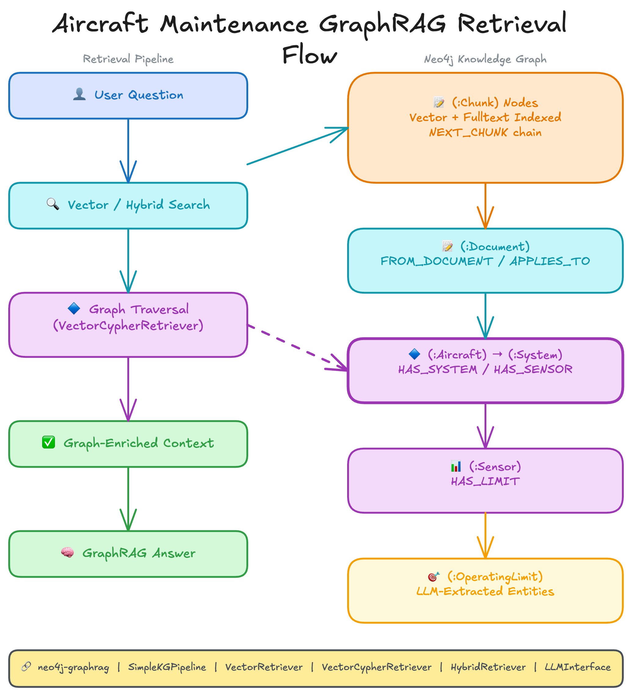

<style>
section {
  --marp-auto-scaling-code: false;
}

li {
  opacity: 1 !important;
  animation: none !important;
  visibility: visible !important;
}

/* Disable all fragment animations */
.marp-fragment {
  opacity: 1 !important;
  visibility: visible !important;
}

ul > li,
ol > li {
  opacity: 1 !important;
}
</style>

# Neo4j for Agentic AI

A managed graph database, GraphRAG retrieval, and the step from retrievers to agents.

---

# The Foundation: Neo4j

Knowledge, agent brain, context memory, semantic bridge, and graph analytics, in one graph stack.

---


---

## Why Use a Graph Database?

Traditional databases struggle with **connected data**:

| Scenario | Relational DB | Graph DB |
|----------|---------------|----------|
| "Find friends of friends" | Complex JOINs, slow | Natural traversal, fast |
| "What impacts what?" | Multiple queries | Single query |
| "How are these connected?" | Hard to express | Native pattern matching |

**Graphs excel at relationship-heavy queries** that would require dozens of JOINs in SQL.

---

## The Value of Neo4j for AI/GenAI

Neo4j provides unique capabilities for building AI applications:

**GraphRAG Foundation:**
- Store knowledge graphs that power AI agents
- Vector search for semantic similarity
- Graph traversal for relationship reasoning

**Production-Ready:**
- Built-in vector indexes for embeddings
- Cypher query language for complex retrieval
- APIs for integration with LLM frameworks

---

# Why Plain RAG Falls Short

Similarity search alone misses the connections that matter.

---

## The Problem with Traditional RAG

Traditional RAG treats documents as isolated, unstructured blobs.

**What traditional RAG sees:**
```
Chunk 1: "Aircraft AC1001 engine reported bearing wear..."
Chunk 2: "Flight FL00123 was delayed 45 minutes at JFK..."
Chunk 3: "EGT sensor readings exceeded threshold on Engine #1..."
```

**What traditional RAG misses:**
- Which flights were delayed because of that bearing wear?
- Is the high EGT reading on the same engine with the fault?
- Which other aircraft share this engine type and might be at risk?

---

## Retrieves Similar Content, Not Connected Information

Traditional RAG can find text about bearing wear and text about flight delays.

**But it can't tell you:**
- Which flights were delayed because of maintenance events on a specific engine

**Why?** Each chunk is independent. There's no understanding of how information connects.

---

## Context ROT: When More Context Makes Things Worse

A surprising discovery: **too much irrelevant context degrades LLM performance**.

**What happens:**
- RAG retrieves chunks that are *similar* but not truly *relevant*
- The LLM's context window fills with tangentially related information
- The model gets confused, distracted, or misled by the noise

**This became known as "Context ROT" (Retrieval of Tangents).** The retrieved context actually *rots* the quality of the response.

---

# GraphRAG: Structure Over Similarity

Turn unstructured text into entities and relationships.

---

## From Unstructured to Structured

**The core insight:** Information isn't truly unstructured.

Documents contain:
- **Entities**: Aircraft, systems, components, sensors, flights
- **Relationships**: HAS_SYSTEM, HAS_COMPONENT, OPERATES_FLIGHT, HAS_EVENT

Traditional RAG ignores this structure. It treats a document as a bag of words to embed and search.

---

## The GraphRAG Solution

GraphRAG extracts structure, creating a *knowledge graph* that preserves:

- **Entities**: The things mentioned in documents
- **Relationships**: How those things connect
- **Properties**: Attributes and details about entities

**Traditional RAG asks**: "What chunks are similar to this query?"

**GraphRAG asks**: "What entities and relationships are relevant to this query?"

---

# Retrieval Over the Graph

Three retrievers turn a knowledge graph into answers.

---

## From Knowledge Graph to Answers

You have a knowledge graph with:

- **Entities**: Aircraft, systems, components, maintenance events, sensors
- **Relationships**: HAS_SYSTEM, HAS_COMPONENT, HAS_EVENT, HAS_SENSOR, DESCRIBES
- **Embeddings**: Vector representations for semantic search

**The question**: How do you *retrieve* the right information to answer user questions?

---

## What is a Retriever?

A **retriever** searches your knowledge graph and returns relevant information.

**Three retrieval patterns:**

| Retriever | What It Does |
|-----------|--------------|
| **Vector** | Semantic similarity search across text chunks |
| **Vector Cypher** | Semantic search + graph traversal for relationships |
| **Text2Cypher** | Natural language to Cypher query for precise facts |

Each pattern excels at different question types.

---

## The GraphRAG Class

Retrievers work with the **GraphRAG** class, which combines retrieval with LLM generation:

```
User Question
    ↓
Retriever finds relevant context
    ↓
Context passed to LLM
    ↓
LLM generates grounded answer
```

The retriever's job is finding the right context. The LLM's job is generating a coherent answer from that context.

---

## GraphRAG: Graph-Enriched Retrieval

- **The graph holds** structured connections and domain knowledge: chunked, embedded, entity-extracted documents plus operational data
- **Search finds the starting points:** chunks closest in meaning to the question
- **Graph traversal enriches:** follows entities and relationships from those chunks
- **Agents receive richer context** than text search alone

Vector or fulltext search finds relevant chunks (standard RAG). What GraphRAG adds is graph traversal from those chunks through the entities and relationships surrounding them.

---



---

# From Retrievers to Agents

Wrap retrievers as tools and let an agent choose.

---

## What is an Agent?

In AI terms, an agent has **four components**:

| Component | What It Does |
|-----------|--------------|
| **Perception** | Receives input (questions, history, tool descriptions) |
| **Reasoning** | Analyzes the question and decides what to do |
| **Action** | Executes the selected tool(s) |
| **Response** | Returns output in natural language |

---

## Retrievers as Tools

Your retrievers become tools:

| Tool | Based On | When Agent Uses It |
|------|----------|-------------------|
| Schema Tool | Graph introspection | "What data exists?" |
| Semantic Search | Vector Retriever | "What is...", "Tell me about..." |
| Database Query | Text2Cypher | "How many...", "List all..." |

Each tool has a description that tells the agent when to use it.

---

## Each Retriever Becomes an Agent Tool

In the fleet-agent sample, each retriever becomes one single-responsibility tool. Its docstring is the routing logic the LLM reads.

```python
@tool
def vector_search_tool(query: str, top_k: int = 5) -> str:
    """Semantic search over document chunks. Conceptual questions."""
    return _vector_retriever().search(query_text=query, top_k=top_k)

@tool
def related_entities_tool(query: str, top_k: int = 5) -> str:
    """Search, then traverse to connected components and events."""
    return _vector_cypher_retriever().search(query_text=query, top_k=top_k)

@tool
def graph_query_tool(question: str) -> str:
    """Generate and run read-only Cypher. Counts, lists, exact facts."""
    return _text2cypher_retriever().search(query_text=question)
```

One tool per retriever; routing is driven by the model.

---

## The ReAct Pattern

Agents follow **ReAct** (Reasoning + Acting):

```
1. Receive question: "How many maintenance events affect aircraft AC1001?"
2. Reason: "This asks for a count"
3. Act: Call Database Query Tool
4. Observe: Result = 12
5. Respond: "Aircraft AC1001 is affected by 12 maintenance events."
```

For complex questions, the agent may loop through multiple cycles.

---

## An Example: The GraphRAG Agent

An example of an agent is a GraphRAG system that:

1. **Receives** a user question
2. **Analyzes** what kind of question it is
3. **Selects** and executes the appropriate tool(s)
4. **Synthesizes** results into a coherent answer

Your retrievers become **tools** the agent can use.

---

## Neo4j for Agentic AI: The Takeaway

- **Graphs hold the connections** that flat similarity search loses
- **Neo4j** provides managed vector indexes and Cypher for GraphRAG
- **GraphRAG** retrieves entities and relationships, not just similar chunks
- **Three retrievers** (Vector, Vector Cypher, Text2Cypher) cover the question space
- **Each retriever becomes an agent tool**; a ReAct agent picks the right one per question
- **Neo4j as an MCP server on AWS Bedrock AgentCore** gives agents direct, governed graph access

The result: agents that reason over connected data, grounded in the graph.
