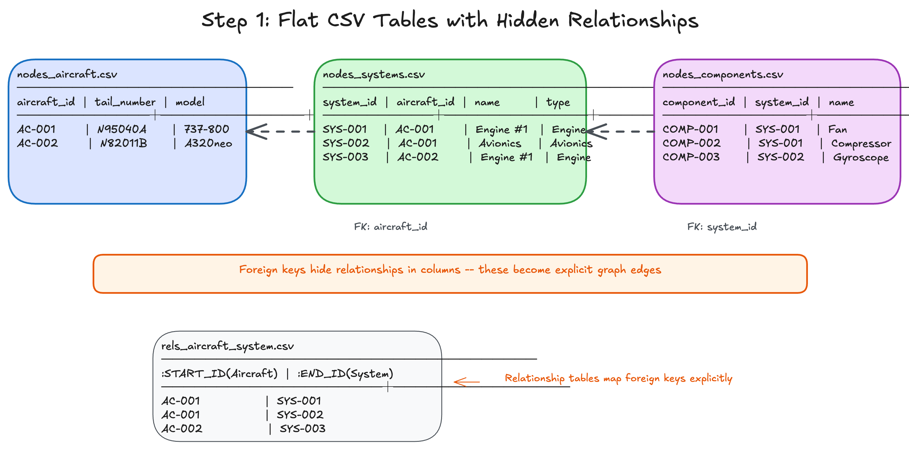
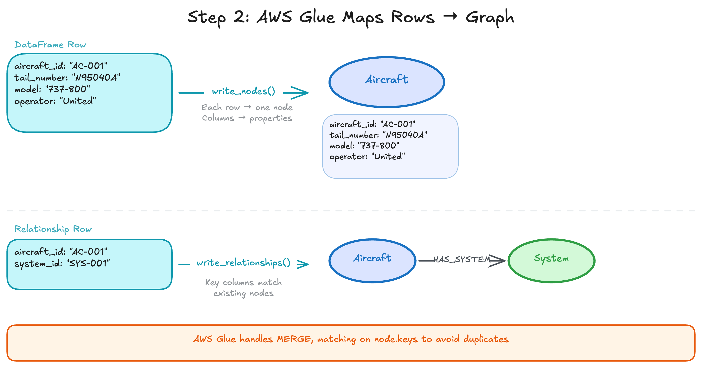
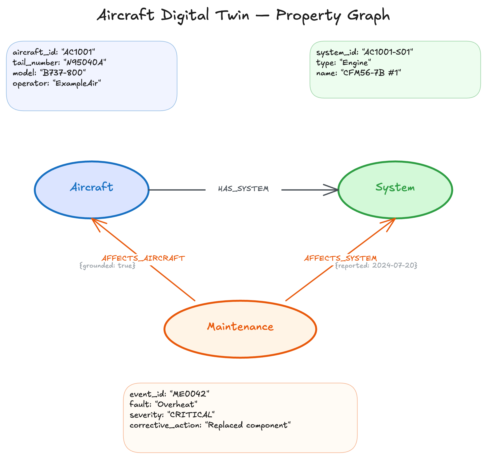
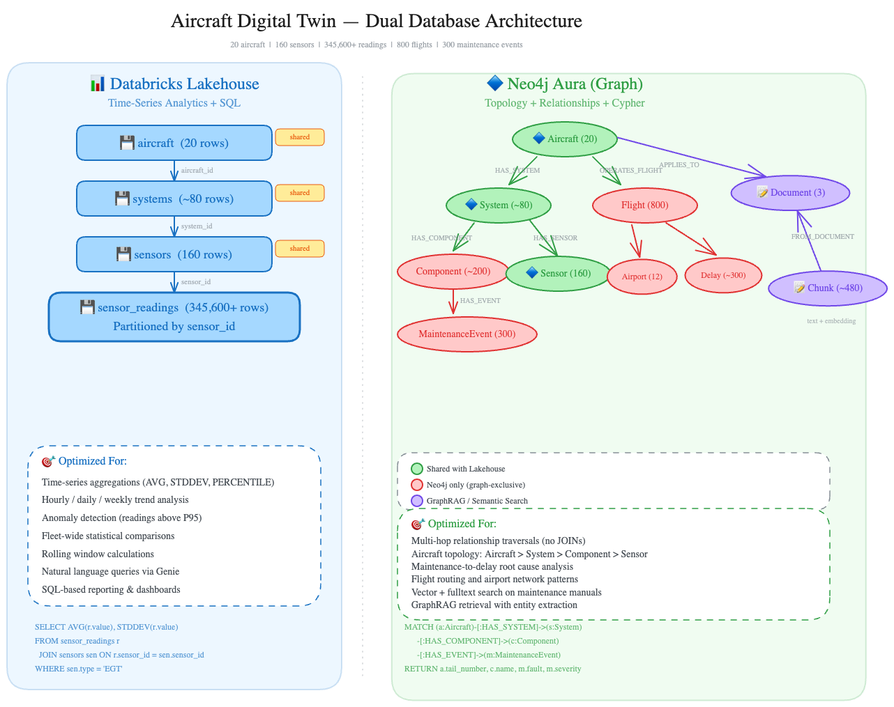

<style>
section {
  --marp-auto-scaling-code: false;
}

li {
  opacity: 1 !important;
  animation: none !important;
  visibility: visible !important;
}

/* Disable all fragment animations */
.marp-fragment {
  opacity: 1 !important;
  visibility: visible !important;
}

ul > li,
ol > li {
  opacity: 1 !important;
}
</style>


# The Aircraft Data Model

Turning a flat aircraft fleet into a connected digital twin, then serving it with a dual analytics-plus-graph architecture

---

## What Is a Digital Twin?

A **digital twin** is a virtual representation of a physical system: its structure, state, and behavior modeled in data.

For an aircraft fleet this means capturing:
- **Topology**: Aircraft, systems, components, and sensors and how they connect
- **Operations**: Flights, routes, delays
- **Maintenance**: Events, faults, component removals, corrective actions
- **Documentation**: Maintenance manuals, procedures, operating limits

---

## Why Knowledge Graphs for Digital Twins?

Digital twins are fundamentally about **relationships**. A component belongs to a system, a system belongs to an aircraft, a fault affects a component, a removal follows a maintenance event.

**Knowledge graphs model this naturally:**
- Entities become **nodes** with properties
- Connections become **relationships** with types and properties
- Multi-hop traversals are native, with no expensive JOINs
- The graph *is* the twin: query it, reason over it, extend it

Tabular databases can store the same data, but answering "Which components caused flight delays?" requires chaining multiple JOINs across many tables. In a graph, it is a single traversal.

---

<style scoped>
section { font-size: 95%; }
</style>

## The Aircraft Digital Twin Dataset

A comprehensive dataset modeling a complete aviation fleet over 90 operational days:

| Entity | Count | Description |
|--------|-------|-------------|
| Aircraft | 20 | Tail numbers, models, operators |
| Systems | 80 | Engines, Avionics, Hydraulics per aircraft |
| Components | 320 | Turbines, Compressors, Pumps |
| Sensors | 160 | Monitoring metadata |
| Sensor Readings | 345,600+ | Hourly telemetry over 90 days |
| Flights | 800 | Departure/arrival information |
| Maintenance Events | 300 | Fault severity and corrective actions |
| Airports | 12 | Route network |

---

## What the Dataset Models

Behind the counts, the dataset captures a realistic fleet:

- Multiple operators flying Boeing 737, Airbus A320/A321, and Embraer E190
- Each aircraft broken into systems (engines, avionics, hydraulics) and components (turbines, compressors, pumps)
- Sensors emitting time-series telemetry: EGT, vibration, fuel flow
- Operational history: flights, delays, and maintenance events with severity and corrective actions

---

## Step 1: Flat Tables with Foreign Keys



---

## Step 2: Mapping Tables to Nodes and Relationships



---

## Step 3: A Connected Graph


---

## What the Graph Looks Like

- Graphs naturally model the real world
- Data lives as **nodes** (entities/nouns) and **relationships** (how they connect)
- In the diagram: `(parentheses)` are nodes, `[:brackets]` are relationships

```
(Aircraft) -[:HAS_SYSTEM]-> (System) -[:HAS_COMPONENT]-> (Component)
     |
     |--[:OPERATED_FLIGHT]-> (Flight) -[:DEPARTED_FROM]-> (Airport)
                                |
                                |--[:HAD_DELAY]-> (Delay)
```

Every node and relationship can carry properties (names, dates, measurements), so the graph is rich with context, not just connections.

---

## The Complete Picture

After modeling, the knowledge graph contains:

```
Aircraft → Systems → Components → MaintenanceEvents
                  → Sensors (with embeddings on maintenance chunks)
Aircraft → Flights → Airports
                   → Delays
```

This structure enables questions that traditional tabular search cannot answer.

---

## The Property Graph



---

## What the Graph Enables

| Question Type | How the Graph Helps |
|--------------|---------------------|
| "What maintenance events affect AC1001?" | Traverse HAS_SYSTEM → HAS_COMPONENT → HAS_EVENT |
| "Which flights departed from JFK?" | Follow DEPARTS_FROM relationships |
| "What sensors monitor Engine #1?" | Traverse HAS_SENSOR relationships |
| "How many critical maintenance events?" | Count MaintenanceEvent nodes by severity |

---

## From Digital Twin to Dual Store

- **Flat data hides connections**: operations and maintenance questions depend on relationships a flat dataset cannot express
- **The graph is the twin**: modeled as a property graph, the fleet becomes a faithful digital twin
- **Traversable**: relationship-heavy questions become single graph queries
- **Extensible**: new entities and connections layer in without reshaping tables
- **Not the whole story**: the same fleet emits hundreds of thousands of sensor readings, better crunched as columns than traversed as nodes
- **The dual data architecture**: pair the knowledge graph with a columnar analytics store, and route each question to the store that answers it best

---

## Why Combine an Analytics Store and Neo4j?

- **Different problems, different tools**: a columnar analytics store and Neo4j each solve a distinct class of problem well
- **The analytics layer**: a lakehouse or data warehouse excels at large volumes of structured data, aggregations, time-series analysis, and ML over tables
- **Neo4j**: excels at understanding how things connect, following chains of relationships, finding patterns, answering questions about structure
- **Most problems have both**: numbers that need crunching and relationships that need navigating
- **Use both together**: each store does what it is best at

---

## Dual Database Architecture

Each store handles the workload it is best at:

- **Columnar analytics store**: hundreds of thousands of hourly sensor readings; SQL aggregations, trend analysis, statistical comparisons
- **Neo4j Aura**: aircraft topology, component hierarchies, maintenance, flights, delays, routes; native multi-hop traversals without expensive JOINs
- **Supervisor (Bedrock AgentCore)**: routes each question to the right store automatically

---



---

## What Each Store Brings

| | Columnar analytics store | Neo4j |
|---|-----------|-------|
| **Stores** | Tables and files | Nodes and relationships |
| **Answers** | "How much?" and "How often?" | "How is this connected?" and "What is affected?" |
| **AI capability** | SQL analytics, foundation models | Vector indexes, GraphRAG, MCP |
| **Strength** | Scale, aggregation, ML | Relationships, traversal, pattern matching |

**AWS Glue with the Neo4j Spark connector** moves data between the stores. Together, the stores stay connected at every layer.

---

## Two Data Models, Two Query Languages

How rows and columns work together with nodes and relationships.

- **The analytics store (Data Intelligence):** structured, semi-structured, and unstructured data at scale
- **Neo4j (Graph Intelligence):** connections between entities, explicit and traversable

The next slides break down what each side does and when to reach for which.

---

## The Analytics Store

- **Aggregates** transactions, sensor streams, clickstreams
- **Governs** documents, images, unstructured files
- **SQL** at petabyte scale, real-time streaming, data science
- Schema enforcement, ACID transactions, and time travel provide the foundation
- ML pipelines from feature engineering through model serving

---

## Neo4j: The Graph Intelligence Platform

- **Traverses** supply chains, fault networks, knowledge graphs
- **Cypher** pattern matching on nodes and relationships
- **Multi-hop traversal** and path finding in milliseconds
- Pattern matching across connection topologies reveals structures invisible in flat tables
- Graph Data Science (graph algorithms), AuraDB (managed database), GraphRAG (graph-enhanced retrieval)

---

## Tables Become Graphs

Earlier we saw flat tables become a connected graph conceptually. In the dual architecture, that same mapping runs as a repeatable pipeline: data in the analytics store lives in **rows and columns**, data in Neo4j lives as **nodes and relationships**.

The Neo4j Connector for Apache Spark, run as an AWS Glue job, handles the translation:

| Columnar analytics store | Knowledge Graph (Neo4j) |
|------------------------|------------------------|
| A row in an Aircraft table | An Aircraft node |
| A row in a Systems table | A System node |
| A foreign key linking them | A `HAS_SYSTEM` relationship |

What was implicit in table joins becomes **explicit and traversable** in the graph.

---

## From the Analytics Store to the Graph

- **Most data stays put:** aggregates, metrics, logs, documents
- **Rows become nodes:** entity columns become node properties
- **Foreign keys become relationships:** `record.system_id` to `(:Aircraft)-[:HAS_SYSTEM]->(:System)`
- **Mapping tables become relationships:** junction rows become edges with properties
- **Shared attributes become shared nodes:** two flights through the same airport connect through one `(:Airport)` node
- **Self-referential columns become chains:** component replacement becomes `(:Component)-[:REPLACED_BY]->(:Component)`

Only the subset with connection patterns worth traversing projects into Neo4j. The analytics store remains the system of record; the graph is a projection of the connections that matter.

---

## Data Intelligence, Graph Intelligence, or Both?

- **SQL:** average EGT by aircraft, a single GROUP BY aggregation
- **Cypher:** components within three hops of a flagged maintenance event, a single traversal query

Most investigations need **both**.

| Question | Store |
|---|---|
| Average EGT by aircraft | Analytics store (SQL aggregation) |
| Components within three hops of a flagged maintenance event | Neo4j (graph traversal) |
| Find aircraft sharing a faulty component type, then compute their total delay minutes | Both |

---

## When to Stay in SQL vs. Move to the Graph

**Stay in SQL / the analytics store when:**

- The question is about aggregation: totals, averages, counts, distributions
- The data fits naturally in rows and columns with no recursive joins
- You need full-table scans over billions of records
- The answer lives in a single table or a small number of predictable joins

**Move to Cypher / Neo4j when:**

- The question involves connections between entities, "who is connected to whom?"
- You need variable-length traversal, following chains where the depth is not known in advance
- The join count would be three or more self-joins against the same table
- You need real-time path finding or pattern matching against a connection topology
- The query shape changes based on what you find (exploratory traversal)

**The rule of thumb:** if you are counting things, stay in SQL. If you are following connections, move to the graph.

---

## Decision Table: SQL vs. Cypher

| Signal | Stay in SQL | Move to Cypher |
|--------|-------------|----------------|
| Number of hops | 1 to 2 fixed joins | 3+ or variable depth |
| Query shape | Known at design time | Depends on the data encountered |
| Result type | Aggregated numbers | Paths, subgraphs, connected components |
| Latency requirement | Batch is fine | Sub-second for interactive investigation |
| Data volume per query | Millions of rows scanned | Thousands of entities traversed |

---

## The Same Question, Two Languages

**Question:** Find all components within three hops of a flagged component (comp-1234) through shared systems or shared maintenance events.

**SQL (analytics store):**

```sql
WITH hop1 AS (
    SELECT DISTINCT sc2.component_id
    FROM system_components sc1
    JOIN system_components sc2
      ON sc1.system_id = sc2.system_id AND sc1.component_id != sc2.component_id
    WHERE sc1.component_id = 'comp-1234'
    UNION
    SELECT DISTINCT ec2.component_id
    FROM event_components ec1
    JOIN event_components ec2
      ON ec1.event_id = ec2.event_id AND ec1.component_id != ec2.component_id
    WHERE ec1.component_id = 'comp-1234'
),
hop2 AS (
    SELECT DISTINCT sc2.component_id
    FROM hop1 h JOIN system_components sc1 ON h.component_id = sc1.component_id
    JOIN system_components sc2
      ON sc1.system_id = sc2.system_id AND sc1.component_id != sc2.component_id
    UNION
    SELECT DISTINCT ec2.component_id
    FROM hop1 h JOIN event_components ec1 ON h.component_id = ec1.component_id
    JOIN event_components ec2
      ON ec1.event_id = ec2.event_id AND ec1.component_id != ec2.component_id
),
hop3 AS (
    SELECT DISTINCT sc2.component_id
    FROM hop2 h JOIN system_components sc1 ON h.component_id = sc1.component_id
    JOIN system_components sc2
      ON sc1.system_id = sc2.system_id AND sc1.component_id != sc2.component_id
    UNION
    SELECT DISTINCT ec2.component_id
    FROM hop2 h JOIN event_components ec1 ON h.component_id = ec1.component_id
    JOIN event_components ec2
      ON ec1.event_id = ec2.event_id AND ec1.component_id != ec2.component_id
)
SELECT component_id FROM hop1 UNION
SELECT component_id FROM hop2 UNION
SELECT component_id FROM hop3;
```

---

## The Same Question in Cypher

**Cypher (Neo4j):**

```cypher
MATCH (flagged:Component {id: 'comp-1234'})
      -[:HAS_COMPONENT|HAS_EVENT*1..3]-
      (connected:Component)
WHERE connected <> flagged
RETURN DISTINCT connected.id
```

The SQL version requires manually coding each hop as a separate CTE with explicit joins across two link tables. Adding a fourth hop means another CTE block. The Cypher version expresses the same traversal in three lines, and changing `*1..3` to `*1..5` extends the search with no structural change.

---

## Routing Questions to the Right Store

A **multi-agent supervisor on AWS Bedrock AgentCore** sits above the two stores and routes each question.

```
                    User Question
                         |
                         v
            ┌─── Supervisor (AgentCore) ───┐
            |                              |
            v                              v
     Analytics agent              Neo4j MCP agent
     (columnar / SQL)             (graph / Cypher)
```

It decides based on the question:
- **Numbers and trends** to the analytics agent
- **Relationships and structure** to the Neo4j MCP agent
- **Both needed** calls each agent in sequence, then combines results

---

## Multi-Agent Routing in Action

**"What is the average EGT for engine AC5?"**
The supervisor sends this to the **analytics agent**, a numeric aggregation over sensor data.

**"Which components were serviced on aircraft N95040A?"**
The supervisor sends this to the **Neo4j agent**, a relationship traversal through the graph.

**"Find aircraft with high vibration readings and show their maintenance history"**
The supervisor calls **both agents in sequence**:
  1. The analytics agent identifies which aircraft have high vibration
  2. The Neo4j agent retrieves maintenance history for those aircraft
  3. The supervisor synthesizes a combined answer

No Cypher or SQL knowledge is required from the end user.

---

## Summary

From flat fleet data to a queryable digital twin, served by two stores:

- **The fleet becomes a property-graph digital twin**: topology, operations, and maintenance modeled as nodes and relationships
- AWS Glue with the Neo4j Spark connector moves data between the analytics store and the knowledge graph
- **Tabular data becomes a graph**, making implicit relationships explicit and queryable
- **Neo4j as an MCP server** gives AI agents direct access to the knowledge graph
- **A multi-agent supervisor on AWS Bedrock AgentCore** routes questions to the right store automatically
- If you are counting things, stay in SQL. If you are following connections, move to the graph

Together, you get the analytical power of the columnar store **and** the relationship intelligence of the graph, connected, not siloed.
