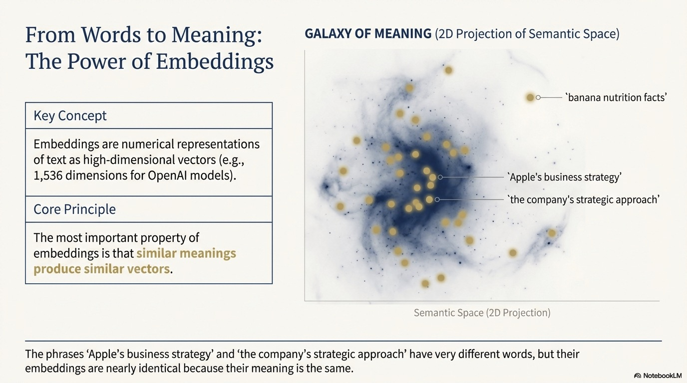
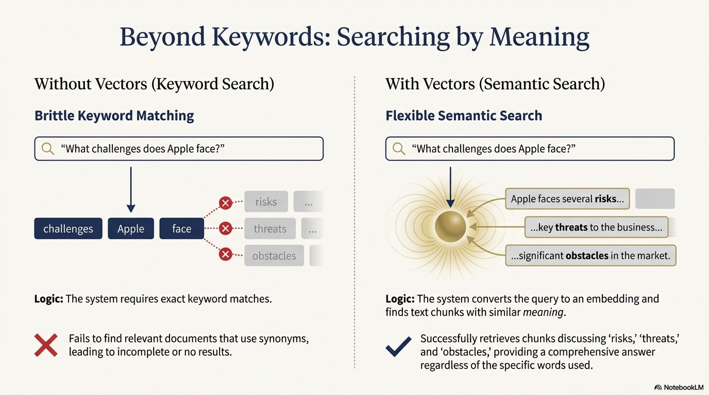

<style>
section {
  --marp-auto-scaling-code: false;
}

li {
  opacity: 1 !important;
  animation: none !important;
  visibility: visible !important;
}

/* Disable all fragment animations */
.marp-fragment {
  opacity: 1 !important;
  visibility: visible !important;
}

ul > li,
ol > li {
  opacity: 1 !important;
}
</style>


# From GenAI Limits to GraphRAG

What GenAI does well, where it breaks, and how knowledge graphs fix retrieval.

---

## What Generative AI Does Well

LLMs excel at tasks that rely on pattern recognition and language fluency:

- **Text generation**: Creating human-like responses, summaries, explanations
- **Language understanding**: Parsing intent, extracting meaning, following instructions
- **Pattern completion**: Continuing sequences, filling in blanks, generating variations
- **Translation and transformation**: Converting between formats, styles, languages

These capabilities emerge from training on vast amounts of text data.

---


---

## 1. Hallucination: Confident But Wrong

LLMs generate responses based on statistical likelihood, not factual verification.

**The Problem:**
- Produces the most *probable* continuation, not the most *accurate*
- Doesn't say "I don't know", generates plausible-sounding text instead
- Complete with fabricated details and citations

**Real Example:** In 2023, US lawyers were sanctioned for submitting an LLM-generated brief with six fictitious case citations.

---

## 2. Knowledge Cutoff: No Access to Your Data

LLMs are trained at a specific point in time on publicly available data.

**They don't know:**
- Recent events after their training cutoff
- Your company's documents, databases, or internal knowledge
- Real-time data: current prices, live statistics, changing conditions

**The Risk:** Ask about your Q3 results or last week's board meeting, and the LLM may still generate a confident (and wrong) response.

---

## 3. Relationship Blindness: Can't Connect the Dots

LLMs process text sequentially and treat each piece in isolation.

**Questions they struggle with:**
- "Which aircraft have engines with critical maintenance events?"
- "What components share the same fault types across the fleet?"
- "How is a sensor reading connected to a flight delay?"

These questions require *reasoning over relationships*, connecting entities across documents and traversing chains of connections.

---

## Why These Limitations Matter

| Limitation | Impact | Example |
|------------|--------|---------|
| Hallucination | Can't trust answers without verification | Legal brief with fabricated citations |
| Knowledge cutoff | Can't answer questions about your data | "What maintenance was done on AC1001 last month?" |
| Relationship blindness | Can't reason across connected information | "Which aircraft have engines with critical faults?" |

Building production AI systems means addressing these limitations directly.

---

## The Solution: Providing Context

All three limitations have a common solution: **providing context**.

When you give an LLM relevant information in its prompt:
- It has facts to work with (reduces hallucination)
- It can access your specific data (overcomes knowledge cutoff)
- You can structure that information to show relationships (enables reasoning)

This is the foundation of **Retrieval-Augmented Generation (RAG)**.

---

## The Power of Context

Providing context in prompts dramatically improves LLM responses.

**When you include relevant information, the model can:**
- Generate accurate summaries grounded in actual documents
- Answer questions about your specific data
- Reduce hallucination by having facts to reference

**RAG automates this:** Instead of manually adding context, retrieve it automatically based on the user's question.

---

## How Traditional RAG Works

Traditional RAG follows a simple pattern:

1. **Index documents**: Break documents into chunks and create embeddings
2. **Receive query**: User asks a question
3. **Retrieve context**: Find chunks with embeddings similar to the query
4. **Generate response**: Pass retrieved chunks to LLM as context

Let's understand each component: chunking, embeddings, and vector search.

---



---

## The Smart Librarian Analogy

Think of embeddings like having a **really smart librarian** who has read every book in the library.

**Traditional catalog (keywords):**
- Books organized by title, author, subject
- Search for "dogs" only finds books with "dogs" in the title/subject
- Miss books about "canines," "puppies," or "pets"

**Smart librarian (embeddings):**
- Understands what each book is *about*
- "I want something about loyal companions" finds dog books, even without the word "dog"
- Organizes by meaning, not just labels

---



---

## The RAG Retrieval Flow

```
User Question
     ↓
Create embedding of question
     ↓
Compare to all chunk embeddings
     ↓
Return top K most similar chunks
     ↓
Send chunks + question to LLM
     ↓
LLM generates answer using chunks as context
```

---

## Traditional RAG: What It Enables

**Works well for:**
- "What does this document say about X?"
- Finding relevant passages by topic
- Answering questions within a single document

**The foundation of modern AI assistants**, but as we'll see, it has important limitations when dealing with connected information.

---

## RAG Helps, But Introduces New Challenges

We've seen how RAG provides context to LLMs:
- Retrieves relevant chunks based on semantic similarity
- Grounds responses in actual documents
- Reduces hallucination

**But traditional RAG also introduced new problems:**
- Retrieves similar content, not necessarily *relevant* content
- Misses relationships between pieces of information
- Can actually make responses *worse* when context is poor

---

## The Problem with Traditional RAG

Traditional RAG treats documents as isolated, unstructured blobs.

**What traditional RAG sees:**
```
Chunk 1: "Aircraft AC1001 engine reported bearing wear..."
Chunk 2: "Flight FL00123 was delayed 45 minutes at JFK..."
Chunk 3: "EGT sensor readings exceeded threshold on Engine #1..."
```

**What traditional RAG misses:**
- Which flights were delayed because of that bearing wear?
- Is the high EGT reading on the same engine with the fault?
- Which other aircraft share this engine type and might be at risk?

---

## Retrieves Similar Content, Not Connected Information

Traditional RAG can find text about bearing wear and text about flight delays.

**But it can't tell you:**
- Which flights were delayed because of maintenance events on a specific engine

**Why?** Each chunk is independent. There's no understanding of how information connects.

---

## Context ROT: When More Context Makes Things Worse

A surprising discovery: **too much irrelevant context degrades LLM performance**.

**What happens:**
- RAG retrieves chunks that are *similar* but not truly *relevant*
- The LLM's context window fills with tangentially related information
- The model gets confused, distracted, or misled by the noise

**This became known as "Context ROT" (Retrieval of Tangents).** The retrieved context actually *rots* the quality of the response.

---

## Context ROT: The Research


Research shows that as irrelevant context increases, LLM accuracy **decreases dramatically**.

The graph shows how adding more retrieved chunks often hurts rather than helps.

**Key insight:** Quality of context matters more than quantity.

[Source: Chroma Research - Context ROT](https://research.trychroma.com/context-rot)

---

## Questions Traditional RAG Can't Answer

| Question | Why Traditional RAG Struggles |
|----------|------------------------------|
| "Which aircraft have engines with critical maintenance events?" | Requires traversing Aircraft to System to Component to Event |
| "What components share the same fault types across the fleet?" | Requires finding shared patterns across multiple aircraft |
| "How many flights were delayed due to maintenance?" | Requires aggregation, not similarity search |
| "What sensors are on the same system as a failed component?" | Requires traversing entity relationships |

These questions need *structured context* that preserves relationships.

---

## From Unstructured to Structured

**The core insight:** Information isn't truly unstructured.

Documents contain:
- **Entities**: Aircraft, systems, components, sensors, flights
- **Relationships**: HAS_SYSTEM, HAS_COMPONENT, OPERATES_FLIGHT, HAS_EVENT

Traditional RAG ignores this structure. It treats a document as a bag of words to embed and search.

---

## The GraphRAG Solution

GraphRAG extracts structure, creating a *knowledge graph* that preserves:

- **Entities**: The things mentioned in documents
- **Relationships**: How those things connect
- **Properties**: Attributes and details about entities

**Traditional RAG asks**: "What chunks are similar to this query?"

**GraphRAG asks**: "What entities and relationships are relevant to this query?"

---

## What is a Vector?

Vectors are lists of numbers.

The vector `[1, 2, 3]` represents a point in three-dimensional space.

In machine learning, vectors can represent much more complex data, including the *meaning* of text.

---

## What are Embeddings?

Embeddings are numerical representations of text encoded as high-dimensional vectors (often 1,536 dimensions).

**The key property:** Similar meanings produce similar vectors.

- "Engine bearing wear requires replacement" and "turbine component degradation" produce vectors close together
- "Engine bearing wear requires replacement" and "flight departed from JFK" produce vectors far apart

This enables **semantic search**: finding content by meaning, not just keywords.

---

## Without Vectors vs With Vectors

**Without vectors:**
- You need exact keyword matches
- "What engine problems occurred?" won't find chunks about "bearing wear" or "vibration exceedance"

**With vectors:**
- The question and chunks become embeddings
- You find chunks with similar *meaning*, regardless of exact words
- "Engine problems" finds content about "bearing wear" and "overheat"

---

## Similarity Search

Vector similarity is typically measured by **cosine similarity**, the angle between two vectors:

| Score | Meaning |
|-------|---------|
| Near 1.0 | Very similar meanings |
| Near 0.5 | Somewhat related |
| Near 0.0 | Unrelated |

When you search, your question becomes an embedding, and the system finds chunks with embeddings close to your question.

---

## Create the Vector Index

Create the index once, before any vectors are stored. The sample uses `neo4j_graphrag`:

```python
from neo4j_graphrag.indexes import create_vector_index

create_vector_index(
    driver,
    name="maintenanceChunkEmbeddings",
    label="Chunk",
    embedding_property="embedding",
    dimensions=1024,            # Amazon Bedrock Titan v2
    similarity_fn="cosine",
)
```

It is idempotent, so it is safe to run on every load.

---

## Store Vectors in Neo4j

The knowledge graph pipeline then populates the index:

1. Each chunk gets an embedding from Amazon Bedrock Titan v2 (1024 dimensions)
2. The embedding is written to the `embedding` property on the Chunk node
3. The `maintenanceChunkEmbeddings` index updates automatically

```cypher
// Verify embeddings were stored
MATCH (c:Chunk)
RETURN c.text, size(c.embedding) AS embeddingDimensions
LIMIT 1
```

---

## Searching a Vector Index

Embed the query in application code with Amazon Bedrock Titan, then pass the vector into Neo4j as a parameter:

```python
# Application code: Amazon Bedrock Titan v2 (1024 dims)
from neo4j_graphrag.embeddings import BedrockEmbeddings

embedder = BedrockEmbeddings(model_id="amazon.titan-embed-text-v2:0")
query_embedding = embedder.embed_query(
    "What maintenance issues affect the turbine?"
)
```

```cypher
// $queryEmbedding is the Titan vector created above
CALL db.index.vector.queryNodes('maintenanceChunkEmbeddings', 5, $queryEmbedding)
YIELD node, score

RETURN node.text AS content, score
ORDER BY score DESC
```

This finds the 5 chunks most semantically similar to the query.

---

## Combining Vectors with Graph Traversal

**The real power of GraphRAG:** Start with semantic search, then traverse the graph.

```python
# Application code: embed the query with Amazon Bedrock Titan
query_embedding = embedder.embed_query(
    "What maintenance issues affect the turbine?"
)
```

```cypher
// $queryEmbedding is the Titan vector created above
CALL db.index.vector.queryNodes('maintenanceChunkEmbeddings', 5, $queryEmbedding)
YIELD node, score

// Traverse from chunk to its parent document
MATCH (node)-[:FROM_DOCUMENT]->(d:Document)
RETURN node.text AS content, score, d.path AS sourceDocument
```

Returns both similar text AND the source document it came from.

---

## The Complete Knowledge Graph

Your knowledge graph now has everything needed for GraphRAG:

| Component | Purpose |
|-----------|---------|
| **Documents** | Source provenance |
| **Chunks** | Searchable text units |
| **Embeddings** | Enable semantic search |
| **Entities** | Structured domain knowledge |
| **Relationships** | Connections between entities |

---

## Three Retrieval Patterns

GraphRAG enables three retrieval patterns:

| Pattern | What It Does |
|---------|--------------|
| **Vector search** | Find semantically similar content (what traditional RAG does) |
| **Vector + Graph** | Find similar content, then traverse to related entities |
| **Text2Cypher** | Query the graph structure directly for precise answers |

The combination is more powerful than any single approach.

---

## Summary

In this deck, you learned:

- **GenAI limits**: Hallucination, knowledge cutoff, and relationship blindness
- **Traditional RAG** provides context automatically using embeddings and semantic search
- **Context ROT**: Poor retrieval can make responses *worse* than no retrieval
- **The limitation**: Traditional RAG treats documents as isolated blobs, missing relationships
- **Vectors** encode meaning so similar content produces similar vectors
- **GraphRAG** preserves entities and relationships, enabling Vector, Vector + Graph, and Text2Cypher retrieval
