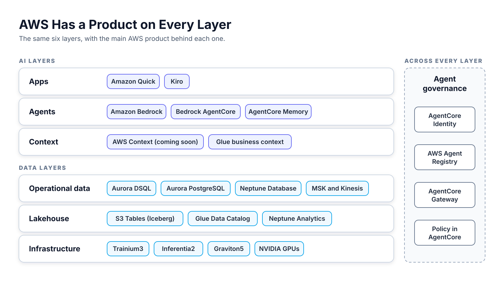

# AWS Main Services

The main AWS products behind each layer of the data and AI stack.

<!--
The slides follow the AWS data and AI stack from the bottom up: data first,
then models, agents, and apps. The Cloud Data and AI Stacks deck compares AWS
with Databricks, Google Cloud, IBM, and Microsoft.

Source material: cloud-integration/hyperscaler.md,
cloud-integration/aws/current/briefing/aws-briefing-review.md, and
cloud-integration/aws/current/reference/aws-ecosystem-summary.md.
-->

---

<!--
AWS has a product on every layer of the stack.

- Infrastructure: Trainium3, Inferentia2, and Graviton5 chips run next to
  NVIDIA GPUs.
- Lakehouse: Amazon S3 Tables holds the data. The AWS Glue Data Catalog
  lists it. Neptune Analytics is the analytical graph on the lakehouse.
- Operational data: Amazon Aurora and Neptune Database hold the present. MSK
  and Kinesis carry streams.
- Context: AWS Context maps existing data into a knowledge graph.
- Agents and models: Amazon Bedrock serves models. Amazon Bedrock AgentCore
  runs agents.
- Apps: Amazon Quick serves employees. Kiro serves developers.

Agent governance runs across every layer. At AWS it is AgentCore Identity,
AgentCore Gateway, Policy in AgentCore, and AWS Agent Registry.

AWS Context is coming soon. Glue Data Catalog business context is in preview,
and S3 annotations are GA. The open-source Context Ontology Accelerator uses
Neptune as its graph store. AWS does not say the managed service runs on
Neptune.
-->

---

## AWS Stores Data Once in Iceberg Tables on S3

- **S3 Tables:** Amazon S3 Tables stores data as managed Apache Iceberg tables.
- **Many engines:** Athena, Redshift, EMR, Spark, and Snowflake read the same tables.
- **Catalog:** The Glue Data Catalog lists every table.
- **Access:** IAM and Lake Formation control who reads each table.
- **One copy:** The lakehouse architecture of SageMaker joins S3 and Redshift data.

<!--
S3 Tables exposes the Iceberg REST Catalog API, so Trino and Flink can also
read and write the tables.

The lakehouse architecture of Amazon SageMaker was called SageMaker Lakehouse
until 2026. It joins S3 data lakes and Redshift warehouses into one copy of
the data. SageMaker Unified Studio is the browser workspace over all of it.
-->

---

## Aurora and Streams Run the Day-to-Day Business

- **Systems of record:** Aurora runs the orders, accounts, and inventory the business changes every second.
- **Less to operate:** AWS handles patching, backups, failover, and scaling. Express configuration creates a database in seconds.
- **No rewrite:** PostgreSQL compatibility lets existing apps, drivers, and tools move over unchanged.
- **Global scale:** Aurora DSQL runs active-active across Regions with a 99.999% availability SLA.
- **One database:** The pgvector extension adds similarity search, so no separate vector store is needed.
- **Current everywhere:** Amazon MSK and Kinesis deliver each change to analytics, alerts, and the lakehouse in seconds.

**The lakehouse is only as current as the streams that feed it.**

<!--
The lakehouse holds history. Aurora holds the current state of the business.
MSK and Kinesis carry each change as it happens, so reports and alerts don't
wait for a nightly batch.
-->

---

## Neptune Gives AWS Two Graph Engines

- **Neptune Database:** Neptune Database is the operational graph. It runs Gremlin, openCypher, and SPARQL.
- **Its limits:** Neptune Database has no graph algorithms and no vector search.
- **Neptune Analytics:** Neptune Analytics is in-memory, with more than 25 algorithms and vector search.
- **Loading:** Neptune Analytics loads a point-in-time copy from Neptune Database or S3.
- **Standards:** Neither product supports GQL or SQL/PGQ.

<!--
Neptune Database is a serverless graph database for operational workloads
such as fraud alerts and Customer 360. Engine 1.4.8.0 shipped on July 27,
2026. It adds RDF export to S3 and a property graph schema API.

Each Neptune Analytics graph holds one HNSW vector index, set when the graph
is created. Vector updates are not ACID. The copy from Neptune Database is not
a live projection, so it goes stale until the next load.

The Amazon Neptune MCP server launched on May 28, 2025.
-->

---

## Amazon Bedrock Serves Models Through One API

- **Models:** Bedrock serves models from 18 providers, including Anthropic, Amazon, Meta, and OpenAI.
- **Knowledge Bases:** Knowledge Bases run managed RAG and cite their sources.
- **Bedrock Agents:** Bedrock Agents runs a managed agent loop over Lambda or OpenAPI actions.
- **Guardrails:** Guardrails filter content, topics, and personal data on any model call.

<!--
Amazon Nova is Amazon's own model family. Bedrock also offers fine-tuning,
distillation, Flows, Data Automation, model evaluation, and prompt management.

Knowledge Bases chunk, embed, and index documents. They store vectors in
OpenSearch, S3 Vectors, Aurora PostgreSQL, Pinecone, Redis, or MongoDB Atlas.
Knowledge Bases GraphRAG is on the next slide.

Bedrock Agents is configuration over code: Bedrock runs the reasoning loop.
AgentCore is for teams that write their own agent code.
-->

---

## Bedrock GraphRAG Builds Its Graph in Neptune Analytics

- **How it works:** Vector search finds chunks. Graph traversal then follows related entities across hops.
- **Extraction:** Claude 3 Haiku builds the graph, and customers can't change the model.
- **Sources:** S3 is the only data source, with 1,000 files per source.
- **Schema:** Customers can't define their own graph structure.
- **Scale:** Neptune Analytics does not autoscale for GraphRAG. It runs in 7 Regions.

<!--
Knowledge Bases GraphRAG reached GA on March 7, 2025. It is a feature of
Bedrock Knowledge Bases, not a separate service.

The file limit can rise to 10,000 per source with a quota increase. Other
Knowledge Bases connectors, such as Confluence and SharePoint, don't work with
GraphRAG.

The API accepts a model ARN, which hints that the extraction model may open up
later. Today the documentation names Claude 3 Haiku only.

Deleting the knowledge base doesn't delete the graph. It must be deleted
separately. With hierarchical chunking, GraphRAG returns child chunks only.
-->

---

## Bedrock Agents and AgentCore Solve Different Problems

| | **Bedrock Agents** | **AgentCore** |
|---|---|---|
| **Approach** | Configuration over code | Bring your own code |
| **Orchestration** | Bedrock runs the loop | Your framework runs the loop |
| **Frameworks** | Bedrock's own | Strands, LangGraph, CrewAI, and others |
| **Models** | Bedrock models only | Any model, in or outside Bedrock |
| **Tools** | Action groups over OpenAPI or Lambda | Gateway over MCP, APIs, and Lambda |
| **Knowledge** | Bedrock Knowledge Bases built in | Bring your own or call Knowledge Bases |
| **Best for** | Fast, low-code agents inside Bedrock | Existing agent code that needs production hosting |

<!--
The two work together. AgentCore Runtime can host an agent that calls Bedrock
models and Knowledge Bases. A Bedrock Agent can act as the orchestrator and
use AgentCore Gateway for tools and AgentCore Memory for state.

AWS prescriptive guidance calls Bedrock Agents a managed agent platform and
AgentCore a modular infrastructure platform.
-->

---

## AgentCore Builds and Runs Agents

- **Any framework:** AgentCore runs agents built with Strands, LangGraph, CrewAI, and others.
- **Runtime:** Runtime hosts each session in an isolated microVM for up to 8 hours.
- **Harness:** Harness runs a managed agent loop from one API call. It is built on Strands.
- **Gateway:** Gateway turns APIs, Lambda functions, and MCP servers into MCP tools.
- **Memory:** Memory keeps session context and extracts long-term memory with four strategies.
- **Built-in tools:** Code Interpreter runs code in a sandbox. Browser drives web pages.

<!--
AgentCore works with any model, in or outside Bedrock.

- Runtime has two compute types: serverless microVMs billed per use, and
  Instances billed at EC2 cost plus a management fee.
- Gateway ships built-in templates for 16 providers, such as Salesforce,
  Jira, and Slack.
- The four memory strategies are semantic, summary, user preference, and
  episodic.

This repo runs the Neo4j MCP Server on AgentCore Runtime behind AgentCore
Gateway.
-->

---

## AgentCore Governs and Measures Agents

- **Identity:** Identity gives each agent credentials through 24 built-in OAuth providers.
- **Policy:** Policy checks every tool call through Gateway before it runs.
- **Registry:** Registry lists agents, MCP servers, tools, and skills for review and approval.
- **Observability:** Observability traces each step with OpenTelemetry. Datadog, Grafana, and Elastic read the traces.
- **Evaluations:** Evaluations scores agent quality on sessions and traces.
- **Optimization:** Optimization A/B tests prompt and tool changes through Gateway.

**AgentCore is AWS's control plane for agents.**

<!--
Policy in Amazon Bedrock AgentCore reached GA on March 3, 2026. Teams write
policies in natural language or Dogwood, which is compatible with Cedar. AWS
Agent Registry reached GA in August 2026.

AgentCore has 13 core services. The last one is Payments, which lets agents
pay for APIs and content. Confirm the status of Payments and the Optimization
Insights feature before citing them to a customer.
-->

---

## Amazon Quick Puts Agents in Front of Employees

- **Chat:** Amazon Quick answers questions and acts on company data and apps.
- **Features:** Quick bundles BI, search, research, flows, automation, and app building.
- **Reach:** Quick runs inside Chrome, Slack, Microsoft Teams, and Microsoft 365.
- **MCP client:** Quick connects to outside MCP servers as tools.

<!--
The six Quick features are Quick Sight, Quick Index, Quick Research, Quick
Flows, Quick Automate, and Apps in Amazon Quick. Apps in Amazon Quick
reached GA on September 1, 2026. Users can sign up with an email address and
no AWS account.

Renames: Amazon QuickSight and Amazon Quick Suite became Amazon Quick. The BI
feature is now Quick Sight.

AWS publishes a pattern for connecting an MCP server on AgentCore Runtime to
Amazon Quick. Using it with the Neo4j MCP Server is our inference. Neither
AWS nor Neo4j has published that pairing.
-->

---

## Kiro Brings Spec-Driven Development to the IDE

- **Agentic IDE:** The Kiro IDE is based on Code OSS and imports VS Code settings.
- **Specs:** Kiro turns a prompt into requirements, a design, and a task list.
- **Parallel agents:** Agents build the tasks on the laptop or in the cloud.
- **Correctness:** Property-based tests catch edge cases that unit tests miss.
- **Every surface:** Kiro also runs as a CLI, a web app, and a mobile app.
- **Open standards:** Kiro supports MCP, AGENTS.md, Agent Skills, and the Agent Client Protocol.

<!--
Kiro calls this agentic engineering, as opposed to vibe coding. A spec records
the requirements and design decisions before any code exists, so the team can
review them. Kiro checks requirements for contradictions and gaps before it
writes code. Property-based testing runs in the Kiro IDE only.

- Hooks run tasks automatically, such as updating tests or docs on save.
- Steering files give the agent project rules. They carry across every Kiro
  surface.
- Powers pull context from tools like Figma and Terraform.
- The IDE installs Open VSX extensions.
- The headless CLI runs in CI/CD to review pull requests and fix bugs.
- Kiro on the web runs sessions in cloud sandboxes that keep going after the
  laptop closes.
- Through ACP, the Kiro CLI runs as an agent inside JetBrains IDEs, Zed, and
  other ACP editors.

Models: Anthropic Claude, OpenAI GPT, and open-weight models such as DeepSeek
and Qwen. Auto picks a model per task. Pricing is credit-based. Plans run
from Free with 50 credits to Power at $200 per user per month. Developers
sign in with GitHub, Google, AWS Builder ID, or IAM Identity Center, and need
no AWS account.
-->

---

## AWS DevOps Agent Investigates Incidents on Its Own

- **Trigger:** DevOps Agent starts an investigation when an alert fires.
- **Outcome:** The agent finds the root cause and recommends a fix.
- **Reach:** It covers AWS, Azure, and on-premises systems. MCP reaches on-premises tools.
- **Connections:** It reads CloudWatch, Datadog, Splunk, GitHub, ServiceNow, PagerDuty, and Slack.
- **Topology:** The agent builds a map of how services, code, and deployments connect.
- **Frontier agents:** AWS groups DevOps Agent with Security Agent, Kiro, and FinOps Agent.

<!--
AWS DevOps Agent reached GA on March 31, 2026. Its Release Management feature
is in Preview. AWS Support plans include monthly credits toward its use.

It also connects to Dynatrace, New Relic, Grafana, GitLab, and Azure DevOps.

AWS Security Agent runs on-demand penetration tests and is GA. AWS FinOps
Agent is in preview.

AWS does not say where the application topology is stored. A topology is a
map of connected things, which is what a graph stores. That point is our
inference from the vendor pages.
-->

---

## Neo4j Plugs into the AWS Agent Stack

- **AgentCore:** The Neo4j MCP Server runs on AgentCore Runtime behind AgentCore Gateway.
- **Bedrock Agents:** An action group reaches Neo4j through the MCP Server or a Lambda around the driver.
- **Agent memory:** The Neo4j Agent Memory library stores memory as a graph. It ships an AgentCore integration.
- **Data movement:** The Neo4j Connector for AWS Glue reads and writes Neo4j from Glue jobs.
- **Beyond GraphRAG limits:** The customer defines the graph model, loads any source, and runs 65+ algorithms.

<!--
The MCP Server on AgentCore samples are Neo4j Labs samples. This repo is one
of them.

AgentCore Memory offers no graph memory strategy. The Neo4j Agent Memory
library fills that gap.

The last bullet contrasts with Bedrock GraphRAG, which fixes the extraction
model, reads only S3, and does not let customers define the graph structure.
Neo4j Graph Data Science runs more than 65 algorithms.

Amazon Quick can reach the Neo4j MCP Server through its MCP client. That
pairing is our inference. Neither AWS nor Neo4j has published it.

The Neo4j Connector for Apache Spark is confirmed on Databricks. Neo4j does
not document it on Amazon EMR.

DevOps Agent builds an application topology. A Neo4j graph could hold that
kind of map. That point is our inference from the vendor pages.
-->
