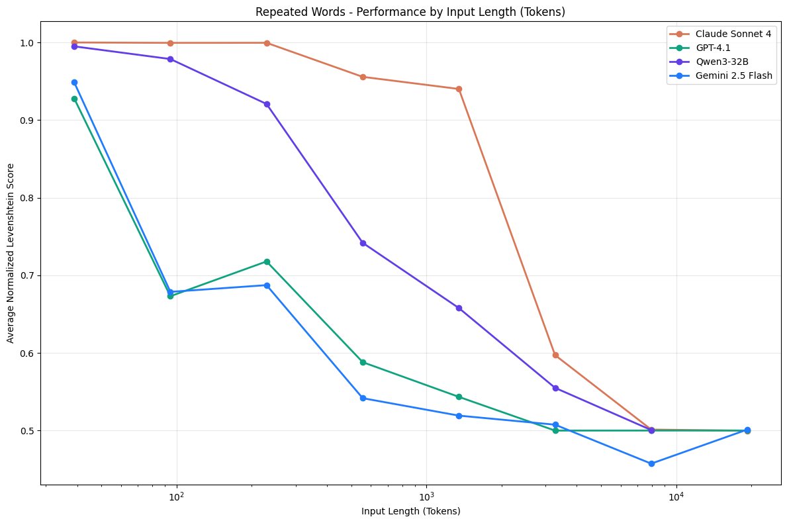

<style>
section {
  --marp-auto-scaling-code: false;
}

li {
  opacity: 1 !important;
  animation: none !important;
  visibility: visible !important;
}

/* Disable all fragment animations */
.marp-fragment {
  opacity: 1 !important;
  visibility: visible !important;
}

ul > li,
ol > li {
  opacity: 1 !important;
}
</style>

# Neo4j + AWS

Data Intelligence Meets Graph Intelligence

<!--
Conference overview talk. The arc runs from why connected data matters, through
how Neo4j and AWS fit together, into the details of the integration patterns:
data connectors, agent frameworks, memory, and GraphRAG.

Source material: the original AWS Agentic AI Conference deck, plus slides
pulled from the Neo4j hotel booking agent workshop (agent, memory,
architecture, business-case, GraphRAG, and knowledge-graph decks), rewritten
here in plain language for a general conference audience, then adapted from
the hotel booking domain to a finance and fraud-investigation domain for this
deck.
-->

---

## Neo4j Graph Intelligence Platform

What Neo4j is, and why connected data matters.

---

## What Is a Graph Database

Three structures, and that is the whole model:

- **Node:** a thing, such as a person, an account, a merchant, or a document.
- **Relationship:** a named, directed connection between two nodes.
- **Property:** a named value stored on a node or on a relationship.
- **Cypher:** Neo4j's query language for these patterns. Think of it like SQL, but built to match connected paths instead of joining separate tables.

The relationship is stored, not computed. Following one is a direct hop, not a join, so the cost of a hop does not grow with the size of the data on the other side.

---

## The Power of the Label Property Graph

Neo4j calls its model a Label Property Graph. A label names what kind of thing a node is, such as Person or Account, and both nodes and relationships can carry their own properties.

```cypher
(:Person)-[:HAS_ACCOUNT]->(:Account)-[:HAS_TRANSACTIONS]->(:Transaction)
```

- **Labels group nodes by type.** Person, Account, and Transaction are labels here, not separate tables.
- **Properties live on both sides.** A `Person` node might store a name and date of birth. A `:HAS_ACCOUNT` relationship can carry its own property too, such as the date the account was opened.
- **Direction shows which node acted on which.** A Person opened an Account, and an Account holds Transactions.

<!--
Diagram in the source deck: Person connects to Account through :HAS_ACCOUNT,
and Account connects to Transaction through :HAS_TRANSACTIONS, with example
property values shown on each node and relationship.
-->

---

## From Silos to Connected Context

Separate systems each hold one piece of the picture. A graph connects them, so hidden context becomes visible.

- **Employees:** talent development, career management, and knowing who is who in the organization.
- **Network & security:** identity and access management, identity resolution, reputation scoring, and threat detection.
- **Suppliers:** route planning, real-time supply chain visibility, and risk analysis.
- **Process, product, transactions, and customers:** the same connected approach applies to process improvement, product recommendations, fraud detection, and customer loyalty.

<!--
Diagram in the source deck: a network diagram with these areas as connected
hubs, showing how they link into one shared graph.
-->

---

## Graph Makes It Easy to Explore Hidden Patterns

A graph lets you ask three kinds of questions directly against connected data.

- **What's important:** find the most central or influential node in a network, such as the most connected account.
- **What's unusual:** spot outliers, such as one address linked to multiple accounts and identifiers that other customers do not share.
- **What's next:** predict a likely new connection, such as flagging a transfer path that matches a known fraud typology.

---


---

## Why Use a Graph Database?

Traditional databases struggle with **connected data**:

| Scenario | Relational DB | Graph DB |
|----------|---------------|----------|
| "Find friends of friends" | Complex JOINs, slow | Natural traversal, fast |
| "What impacts what?" | Multiple queries | Single query |
| "How are these connected?" | Hard to express | Native pattern matching |

**Graphs excel at relationship-heavy queries** that would require dozens of JOINs in SQL.

---

## AWS + Neo4j

From Models to Knowledge

---

## Select Neo4j and AWS Customers

Companies that use Neo4j and AWS together include Adobe, Financial Times, Meredith, AstraZeneca, Novo Nordisk, Volvo, Lyft, Verizon, Novartis, LendingClub, Lockheed Martin, Comcast, Cisco, Airbus, DB, Levi Strauss & Co., Caterpillar, and TAG IMF.

---

## Neo4j and AWS: What Each Platform Brings

| Component | What it provides |
|---|---|
| **Neo4j Aura** | Stores connected facts, source documents, business rules, and results as one graph |
| **Amazon Bedrock** | Provides foundation models for extraction, reasoning, and embeddings |
| **An agent framework, such as Strands Agents** | Gives the model its tools and runs the agent's decision loop |
| **Amazon Bedrock AgentCore** | Publishes tools through Gateway, and runs the deployed agent on Runtime |

A graph can hold more than a search index. Business rules and results can live there too, which is what makes an agent's actions checkable, not just its answers.

<!--
Give the two platforms parallel treatment. Neo4j holds connected facts and
rules. Bedrock provides reasoning and embeddings. Each platform owns a clear
part of the request path.
-->

---

<style scoped>
section { font-size: 24px; }
</style>

## Five Ways AWS Connects to Neo4j

Choose the pattern that matches how the data moves and who needs it.

- **Spark Connector on Amazon EMR:** moves large Spark DataFrames into Neo4j and reads graph data back into Spark.
- **AWS Glue Connector:** builds managed ETL jobs from S3, RDS, Redshift, DynamoDB, and other Glue sources.
- **Kafka Connector on Amazon MSK:** streams events into Neo4j and publishes Neo4j changes to Kafka topics.
- **Neo4j drivers in AWS applications:** let Lambda, ECS, EKS, and EC2 services run Cypher directly.
- **MCP for AWS agents:** lets Bedrock and AgentCore agents call graph tools through a standard interface.

<small>Sources: <a href="https://neo4j.com/docs/connectors/">AWS Glue and data connectors</a>, <a href="https://neo4j.com/docs/spark/current/">Spark Connector</a>, <a href="https://neo4j.com/docs/kafka/current/">Kafka Connector</a>, <a href="https://neo4j.com/developer/genai-ecosystem/model-context-protocol-mcp/">Neo4j MCP</a></small>

<!--
These are separate connection patterns, not one required stack. Pick EMR for
large Spark workloads, Glue for managed ETL, MSK for event streams, a driver
for direct application requests, and MCP when an agent needs graph tools.
-->

---

## Neo4j in the AWS Ecosystem

Neo4j Aura sits at the center of the AWS cloud, with data flowing in and out through several AWS services.

- **Inside Aura:** Graph Analytics, a graph database, and Explore work together as one connected platform.
- **Data flows in** from Amazon Managed Streaming for Apache Kafka, Amazon S3, a JDBC driver, AWS Lambda, and Amazon EMR through the Spark connector.
- **Data flows out** to AWS Glue, Amazon Bedrock AgentCore, and Amazon Bedrock.
- **Amazon Redshift** connects through the Spark connector, and a general database driver connects Neo4j to other AWS services.

---


---

## A Combined Architecture: Graph Plus Lakehouse

- **Amazon S3 Tables, Amazon Athena, and AWS Glue Data Catalog** hold and query high-volume analytic data as open Iceberg tables. AWS Lake Formation can govern access.
- **Neo4j Aura** holds the connected domain, GraphRAG paths, rules, provenance, and agent memory.
- **Stable identifiers connect both sides**, through an ETL pipeline or application services.
- **Each store does the job it's good at:** Athena scans and totals rows. Neo4j follows relationships and returns focused context.

<!--
This is a production pattern for teams who already have a lakehouse. The graph
does not replace it. It adds the connected layer the lakehouse does not model
well: relationships, rules, and provenance.
-->

---

## Decision Table: SQL vs. Cypher

| Signal | Stay in SQL | Move to Cypher |
|--------|-------------|----------------|
| Number of hops | 1 to 2 fixed joins | 3+ or variable depth |
| Query shape | Known at design time | Depends on the data encountered |
| Result type | Aggregated numbers | Paths, subgraphs, connected components |
| Latency requirement | Batch is fine | Sub-second for interactive investigation |
| Data volume per query | Millions of rows scanned | Thousands of entities traversed |

**The rule of thumb:** if you are counting things, stay in SQL. If you are following connections, move to the graph.

---

## Overview of Strands Agents

```python
agent = Agent(
    model=BedrockModel(model_id=...),
    tools=list(READ_TOOLS),
    system_prompt=BASE_GROUNDING_PROMPT,
    hooks=[trace],
)
```

- **`Agent`** runs the loop and calls whichever tool the model picks.
- **`BedrockModel`** connects the agent to a model on Amazon Bedrock.
- **A tool specification** gives the model a name, a description, and an input schema for each capability it can use.
- **The system prompt** states which facts the model may use, and when it must say it does not know.
- **A trace hook** records the selected tool and its bounded result.

The model picks a tool from the specifications the framework gives it. The developer does not hard-code which step runs next.

<!--
Strands is model-driven by default. The developer defines the goal, the model,
and the tools. The model decides which tool to call, how the result changes
its reasoning, and whether it needs another call. More control is still
available: a Strands Graph defines fixed nodes and allowed transitions, and a
Workflow defines fixed task dependencies, for cases that need less freedom.
-->

---

## How Strands, Bedrock, and Neo4j Work Together

- **Grounded retrieval:** the tool matches the question to real facts stored in the graph.
- **Connected reasoning:** the tool follows stored relationships out from those facts.
- **Right-sized context:** the agent receives only the small slice of the graph the question needs, not everything that looked similar.

<!--
Strands runs the agent loop. Amazon Bedrock provides the model. Neo4j gives
that agent verified facts and connected context through a retrieval tool.
-->

---


---

## A Neo4j Read Tool, in Strands

```python
from strands import tool
from neo4j_graphrag.retrievers import VectorCypherRetriever

@tool
def search_passages(query: str) -> dict:
    """Search financial documents and return linked facts."""
    results = retriever.search(query_text=query, top_k=5)
    return {
        "passages": [r.content for r in results.items],
        "metadata": [r.metadata for r in results.items],
    }
```

- **`@tool`** turns this function into a specification the model can choose, with `query` as its one input.
- **`VectorCypherRetriever`** runs the vector search, then a reviewed Cypher traversal, in one call.
- **Returns plain JSON.** The model never sees a driver, a connection string, or write access.
- **Same shape as any other Strands tool.** Only the body changes.

<!--
This is the piece that ties the last two slides together: the abstract
Agent/BedrockModel/tools code, and the grounded retrieval, connected reasoning,
right-sized context principles. Here is what actually runs inside the tool.
-->

---

## How the Gateway Request Flow Works

A read tool can also reach Neo4j through a managed, authenticated MCP server instead of an embedded driver.

1. **Agent gets an M2M JWT from Cognito** with `client_credentials`.
2. **Agent calls the Gateway with the JWT.**
3. **Gateway validates the JWT**, then exchanges it for a Runtime token through an OAuth2 credential provider.
4. **Gateway forwards to the Runtime**, which invokes the Neo4j MCP server against Neo4j Aura.

Tool names come back target-prefixed, such as `neo4j-mcp-server-target___read-cypher`. M2M only: no user accounts, no interactive login, no passwords to rotate.

<!--
This is the Gateway-mediated alternative to the previous slide's embedded
driver: same agent-side shape (a tool the model calls), but the graph access
runs through Cognito, the Gateway, and the Runtime instead of a local driver.
-->

---


---

## Context Rot: More Context, Worse Answers

Too much irrelevant context **degrades** LLM performance.

- RAG retrieves chunks that are *similar*, not *relevant*.
- The context window fills with tangential noise.
- The model gets distracted or misled.

"Context rot": retrieval of tangents that rots response quality. This is the problem GraphRAG's traversal step is built to avoid.

<!--
A surprising finding. When RAG retrieves chunks that are similar but not truly
relevant, the context window fills with tangentially related information and
the model gets confused or misled. The retrieved context actively rots the
quality of the answer. This motivates the shift to GraphRAG on the next slide:
traversal reaches connected facts instead of just more similar-looking text.
-->

---



## Context Rot: The Research

As irrelevant context grows, accuracy **drops sharply**.

Quality of context beats quantity.

[Chroma Research: Context Rot](https://research.trychroma.com/context-rot)

---

## The Shift to GraphRAG

If you have built a Bedrock Knowledge Base, you already do half of this today. Your documents are chunked and embedded, and a question matches the closest chunks by vector search. GraphRAG adds one more step on top of that same match: a graph traversal to the facts connected to it.

A knowledge graph stores each record and stores the links between records. This transaction belongs to that account. That policy governs this alert. This fact came from that document.

- **Connected, verifiable facts:** the graph stores facts you can check, not just pattern-matched chunks of text.
- **Traversal on top of similarity:** a traversal reaches connected context that a plain text search cannot.
- **Traceable:** every answer can walk back to the document behind it.
- **Fewer tokens:** the agent receives the facts an answer needs, not everything that looked similar.
- **Governed retrieval:** the application fixes the traversal ahead of time. The model does not choose it on the fly.

The agent answers from evidence the graph can defend.

---

## GraphRAG: Graph-Enriched Retrieval

GraphRAG improves standard AI retrieval by adding graph traversal on top of search.

- **Search finds the starting points:** the system first finds the text passages closest in meaning to the question.
- **Graph traversal enriches:** the system then follows the entities and relationships connected to those passages.
- **Agents receive richer context than text search alone:** the combined result gives the agent more complete and accurate information.

---

## How Graph-Enriched Retrieval Works

- **Step 1, search:** the question is matched against stored text to find the closest starting point.
- **Step 2, traversal:** a reviewed query follows relationships out from that starting point to connected facts.
- **Two decisions, two owners:** search decides where the answer starts. The traversal decides what comes back with it.

<!--
This is the mechanism behind "The Shift to GraphRAG" and "GraphRAG:
Graph-Enriched Retrieval." Search alone ranks similar text. The traversal is
what proves a fact is actually connected to the record in question.
-->

---


---

## GraphRAG Patterns

Five patterns for building GraphRAG, all built around one graph.

- **Vector & hybrid search:** basic vector or full-text search, enhanced with graph and metadata filtering.
- **Query templates:** fixed Cypher queries that match a known question shape.
- **Query generation:** the system writes Cypher queries dynamically, also called text-to-Cypher.
- **Graph enrichment:** adds community summaries, graph embeddings, and PageRank scores to improve results.
- **Query-optimized graphs:** graphs built for direct querying, using hypothetical question-and-answer pairs and a parent-child retriever structure.

---

## Three Layers of Agent Memory

- **Short-term memory:** conversation history, session state, and the entities mentioned in each turn. This is what lets an agent resolve "what's the current balance?" after an account was already named.
- **Long-term memory:** durable facts and preferences that should outlive one conversation, plus a record of what changed and when.
- **Reasoning memory:** the tool calls, decisions, and outcomes an agent produced. This is evidence for debugging and review.

Most agents are stateless until memory is designed on purpose.

---

## Why Graphs for Agent Memory

- **Relationships are first-class.** A conversation, a preference, and a transaction can all point to the same real-world record.
- **Multi-hop queries combine memory with domain facts** without joining separate data stores in application code.
- **Provenance stays traversable.** A stored memory can point back to the exact source that produced it.
- **Graph identity prevents copies.** One canonical record accumulates facts, conversations, preferences, and actions instead of scattering them.
- **History stays visible.** A new memory can replace an old one while both remain inspectable.

Graph memory earns its place when the relationship between a conversation and the underlying data matters as much as the text itself.

---

## Neo4j and AWS

- **Neo4j Aura:** stores connected enterprise facts and returns graph context with provenance.
- **Amazon Bedrock:** provides models for extraction, embeddings, and agent reasoning.
- **Amazon Bedrock AgentCore:** publishes remote tools through Gateway and runs deployed agents through Runtime.
- **Together:** Neo4j supplies verified context. AWS runs the models, tools, and agent services.
- **AWS Marketplace:** lets customers buy Neo4j Aura through their AWS account.
