<style>
section {
  --marp-auto-scaling-code: false;
}

li {
  opacity: 1 !important;
  animation: none !important;
  visibility: visible !important;
}

/* Disable all fragment animations */
.marp-fragment {
  opacity: 1 !important;
  visibility: visible !important;
}

ul > li,
ol > li {
  opacity: 1 !important;
}
</style>

# Neo4j + AWS

Grounding Generative AI in Graph Data

<!--
Conference overview talk. The arc runs from why connected data matters, through
how Neo4j and AWS fit together, into the details of the integration patterns:
data connectors, agent frameworks, memory, and GraphRAG.

Source material: the original AWS Agentic AI Conference deck, plus slides
pulled from the Neo4j hotel booking agent workshop (agent, memory,
architecture, business-case, GraphRAG, and knowledge-graph decks), rewritten
here in plain language for a general conference audience, then adapted from
the hotel booking domain to a finance and fraud-investigation domain for this
deck.
-->

---

## Neo4j Graph Intelligence Platform

What Neo4j is, and why connected data matters.

---

## What Is a Graph Database

Three structures, and that is the whole model:

- **Node:** a thing, such as a person, an account, a merchant, or a document.
- **Relationship:** a named, directed connection between two nodes.
- **Property:** a named value stored on a node or on a relationship.
- **Cypher:** Neo4j's query language for these patterns. Think of it like SQL, but built to match connected paths instead of joining separate tables.

The relationship is stored, not computed. Following one is a direct hop, not a join, so the cost of a hop does not grow with the size of the data on the other side.

---

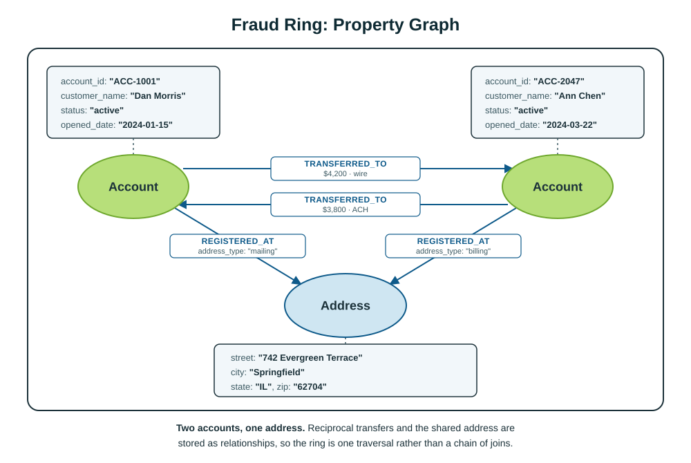

---

## Why a Knowledge Graph Fits Fraud Investigations

- **See the full network:** connect customers, accounts, devices, addresses, merchants, alerts, and cases in one view.
- **Find hidden relationships:** reveal shared identifiers and indirect connections that isolated transactions do not show.
- **Follow the money:** trace transfers across any number of accounts without knowing the chain length in advance.
- **Explain why a pattern matters:** link suspicious activity to known fraud typologies, policies, KYC documents, and prior cases.
- **Adapt as schemes change:** add new entities and connections without rebuilding a rigid relational model.

**Investigator value:** move from isolated transactions to an evidence-backed view of who is connected, how money moved, and why the pattern matters.

---

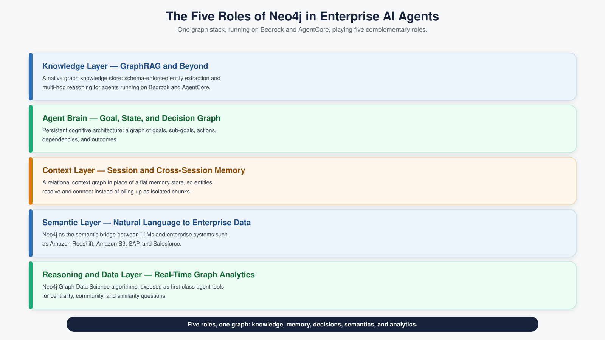

---

## AWS + Neo4j: Connected Context for Grounded Enterprise AI

Neo4j graph, knowledge, and memory integrated with AWS data and agent services

---

## Select Neo4j and AWS Customers

Companies that use Neo4j and AWS together include Adobe, Financial Times, Meredith, AstraZeneca, Novo Nordisk, Volvo, Lyft, Verizon, Novartis, LendingClub, Lockheed Martin, Comcast, Cisco, Airbus, DB, Levi Strauss & Co., Caterpillar, and TAG IMF.

---

## AWS Provides the Foundation for Governed Enterprise AI

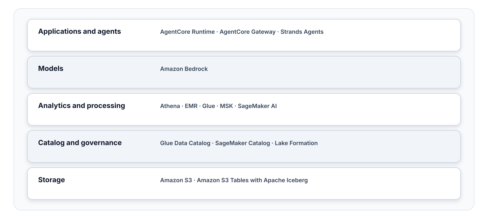

---

## Neo4j Adds Connected Context Across the AWS Platform

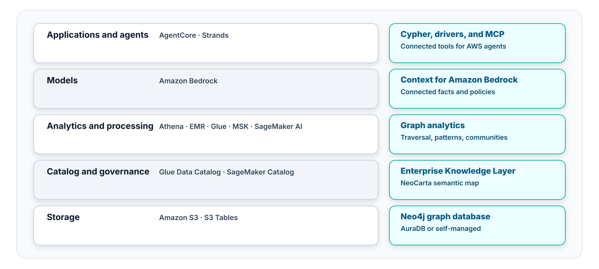

---

<style scoped>
table { font-size: 21px; }
small { font-size: 16px; }
</style>

## Neo4j Connection Patterns for AWS

| Integration path | AWS home | Description |
| --- | --- | --- |
| **Neo4j Spark Connector** | Amazon EMR | Exchange data between Spark DataFrames and Neo4j graphs. |
| **Neo4j Connector for AWS Glue** | AWS Glue | Load data from AWS sources into Neo4j with managed ETL jobs. |
| **Neo4j Connector for Kafka** | Amazon MSK | Stream events into Neo4j and publish graph changes to Kafka. |
| **Neo4j drivers** | Lambda, ECS, EKS, EC2 | Connect new or existing AWS applications to Neo4j. |
| **Neo4j MCP tools** | Amazon Bedrock AgentCore and Strands Agents | Connect AWS-hosted agents to Neo4j graph retrieval tools. |

<small>Sources: [Neo4j Spark Connector](https://neo4j.com/docs/spark/current/), [Kafka Connector](https://neo4j.com/docs/kafka/current/), [connectors and drivers](https://neo4j.com/docs/connectors/), and [Neo4j MCP](https://neo4j.com/developer/genai-ecosystem/model-context-protocol-mcp/)</small>

<!--
These are separate connection patterns, not one required stack. Pick EMR for
large Spark workloads, Glue for managed ETL, MSK for event streams, a driver
for direct application requests, and MCP when an agent needs graph tools.
-->

---

<style scoped>
small { font-size: 16px; }
</style>

## Spark on Amazon EMR: A Two-Way Bridge to Neo4j

The Neo4j Connector for Apache Spark maps Spark DataFrames to graph data in both directions.

```text
Write   transfers DataFrame  →  (:Account)-[:TRANSFERRED_TO]->(:Account)
Read    (:Customer) nodes    →  DataFrame with one column per property
```

- **Write:** Rows become nodes by label and key. Rows can also become relationships between matched source and target nodes.
- **Read:** A label, a relationship type, or a Cypher query returns a DataFrame. The connector infers its columns from the graph.
- **Run on EMR:** The connector is a Spark DataSource, so an EMR Spark job adds it as a package.

<small>Sources: [Neo4j Connector for Apache Spark](https://neo4j.com/docs/spark/current/) and [writer options](https://neo4j.com/docs/spark/current/write/options/)</small>

<!--
Use this path for large batch loads from S3 or Iceberg into the graph, and for
pulling graph results back into Spark for analytics. Writes are batched, and
each batch commits in its own transaction. Custom Cypher works for both reads
and writes when the label and key options are not enough. Check the connector
version against the EMR release's Spark version: connector 5.x targets Spark
3.4 and 3.5, and connector 6.x targets Spark 4.
-->

---

<style scoped>
small { font-size: 16px; }
</style>

## AWS Glue Stays Tabular While Neo4j Receives Cypher

The Neo4j Connector for AWS Glue is a JDBC driver that translates SQL to Cypher.

```text
Account table             →  (:Account)
account_id column         →  .account_id
Customer_OWNS_Account     →  (:Customer)-[:OWNS]->(:Account)
```

- **Runtime path:** Glue Visual ETL sends SQL over JDBC. The driver translates it to Cypher and sends it to Neo4j over Bolt.
- **Model first:** A blueprint graph defines the labels, relationship types, and properties. Glue reads it as table metadata.
- **Load order:** Jobs import nodes before relationships. Glue can also export labels back to Parquet on S3.

<small>Sources: [Neo4j Connector for AWS Glue](https://neo4j.com/docs/neo4j-aws-glue/), [Getting Started](https://neo4j.com/docs/neo4j-aws-glue/getting-started/), and [JDBC SQL-to-Cypher translation](https://neo4j.com/docs/jdbc-manual/current/sql2cypher/)</small>

<!--
Setup: upload the connector JAR to S3 and create a Glue custom connector with
driver class org.neo4j.jdbc.Neo4jDriver. The JDBC URL adds
enableSQLTranslation=true. Neo4j credentials live in Secrets Manager. Only
supported SQL constructs are translated. Pick Glue for managed, visual ETL.
Pick Spark on EMR when the job needs custom Cypher or very large batches.
-->

---

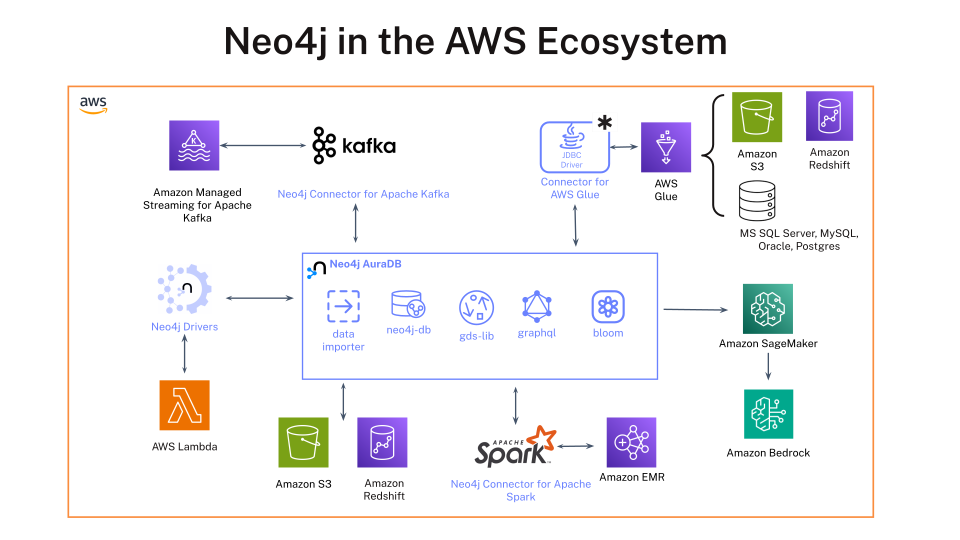

---

<style scoped>
small { font-size: 16px; }
</style>

## Neo4j Supports Managed and Self-Managed AWS Deployment

- **AuraDB on AWS:** Use Neo4j's managed graph database in an AWS region that fits the workload.
- **AWS Marketplace:** Purchase eligible Aura plans through AWS billing and marketplace terms.
- **Private connectivity:** Use AWS PrivateLink with supported Aura enterprise configurations.
- **Self-managed:** Deploy Neo4j on Amazon EKS or Amazon EC2 when the customer manages the runtime.

<small>Sources: [Aura through cloud marketplaces](https://neo4j.com/docs/aura/cloud-providers/), [Aura secure connections](https://neo4j.com/docs/aura/security/secure-connections/), and [AgentCore supported regions](https://docs.aws.amazon.com/bedrock-agentcore/latest/devguide/agentcore-regions.html)</small>

---

## A Combined Architecture: Graph Plus Lakehouse

- **Amazon S3 Tables, Amazon Athena, and AWS Glue Data Catalog** hold and query high-volume analytic data as open Iceberg tables. AWS Lake Formation can govern access.
- **Neo4j Aura** holds the connected domain, GraphRAG paths, rules, provenance, and agent memory.
- **Stable identifiers connect both sides**, through an ETL pipeline or application services.
- **Each store does the job it's good at:** Athena scans and totals rows. Neo4j follows relationships and returns focused context.

<!--
This is a production pattern for teams who already have a lakehouse. The graph
does not replace it. It adds the connected layer the lakehouse does not model
well: relationships, rules, and provenance.
-->

---

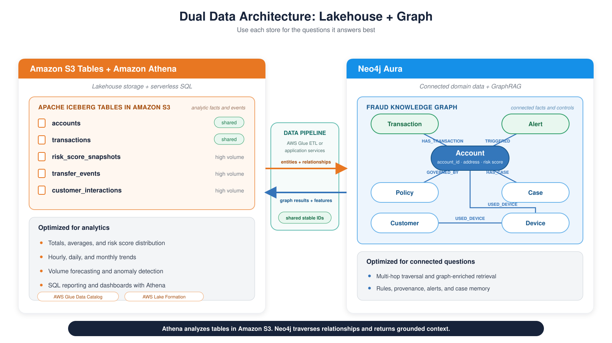

---

<style scoped>
table { font-size: 21px; }
ul, p { font-size: 24px; }
</style>

## Decision Table: SQL vs. Cypher

| Signal | Stay in SQL | Move to Cypher |
|--------|-------------|----------------|
| Number of hops | 1 to 2 fixed joins | 3+ or variable depth |
| Query shape | Known at design time | Depends on the data encountered |
| Result type | Aggregated numbers | Paths, subgraphs, connected components |
| Latency requirement | Batch is fine | Sub-second for interactive investigation |
| Data volume per query | Millions of rows scanned | Thousands of entities traversed |

- **Athena in SQL:** aggregates transaction activity, computes P95 thresholds, and ranks the accounts generating the most alerts.
- **Cypher in Neo4j:** follows funds across accounts and devices, finds circular transfers, and reaches everything downstream of a compromised account.

**The rule of thumb:** if you are counting things, stay in SQL. If you are following connections, move to the graph.

---

## Virtual Graph for AWS

Planned: query Amazon S3 Tables with Cypher through Athena.

---

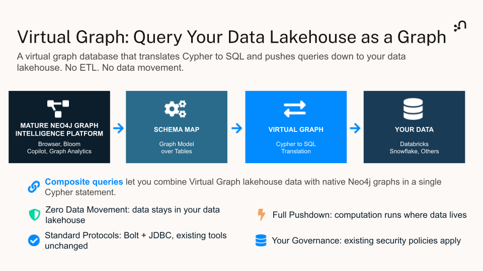

---

## Planned AWS Query Path: Cypher Through Athena to S3 Tables

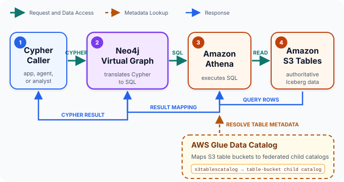

**Read in place:** Virtual Graph queries current S3 Tables data without materializing a second copy in Neo4j.

---

<style scoped>
small { font-size: 16px; }
</style>

## What Each Component Does in the Virtual Graph Path

- **Translate:** Virtual Graph turns Cypher into SQL and maps the returned rows back to a Cypher result.
- **Execute:** Athena runs the SQL against the table bucket.
- **Resolve:** Glue exposes each table bucket as a child federated catalog under `s3tablescatalog`.
- **Govern:** IAM or Lake Formation permissions control access to catalog and table resources.
- **Store:** S3 Tables remains the authoritative source.

<small>**Public preview:** Snowflake, Databricks, and Google BigQuery. **Planned for AWS:** Athena, AWS Glue Data Catalog, and Amazon S3 Tables.</small>

<!--
Sources: https://neo4j.com/blog/auradb/neo4j-virtual-graph-is-now-in-public-preview/,
https://docs.aws.amazon.com/athena/latest/ug/gdc-register-s3-table-bucket-cat.html,
and https://docs.aws.amazon.com/glue/latest/dg/enable-s3-tables-catalog-integration.html
-->

---

## Choose the Execution Path That Fits the Workload

| Workload | Recommended path | Execution |
| --- | --- | --- |
| **Query current S3 Tables data without copying it**<br>*Planned* | Cypher through Virtual Graph | Athena queries the table-bucket child catalog mounted in AWS Glue Data Catalog. |
| **Run frequent, low-latency traversals or graph algorithms** | Materialize selected data in Neo4j | Neo4j executes Cypher against the persisted graph. |

---

## Connecting Amazon Quick and Neo4j with MCP

Graph context for the enterprise AI assistant.

---

## Model Context Protocol (MCP)

**MCP** is an open standard that defines how AI agents discover and use external tools.

```
AI Assistant or Agent  ←→  MCP Server  ←→  Data Source
                           (Neo4j MCP)     (Neo4j Aura)
```

- **Client:** The assistant or agent asks the MCP server which tools it offers.
- **MCP server:** The server translates between the protocol and the native API.
- **Data source:** Neo4j, a REST API, or a file system holds the data.

Any MCP-compatible client connects to any MCP-compatible server.

---

## Neo4j MCP Server Tools

The Neo4j MCP Server exposes two tools in read-only mode:

| Tool | Description |
|------|-------------|
| **`get_neo4j_schema`** | Reads the graph schema: node labels, relationship types, and properties. The format is token-efficient for LLM use. |
| **`read_neo4j_cypher`** | Executes a read-only Cypher query. It runs `EXPLAIN` first to reject writes such as CREATE, MERGE, DELETE, and SET. |

The client discovers these tools automatically through MCP. Schema lookup shows it the Customer, Account, Phone, Address, and Merchant labels before it writes Cypher.

---

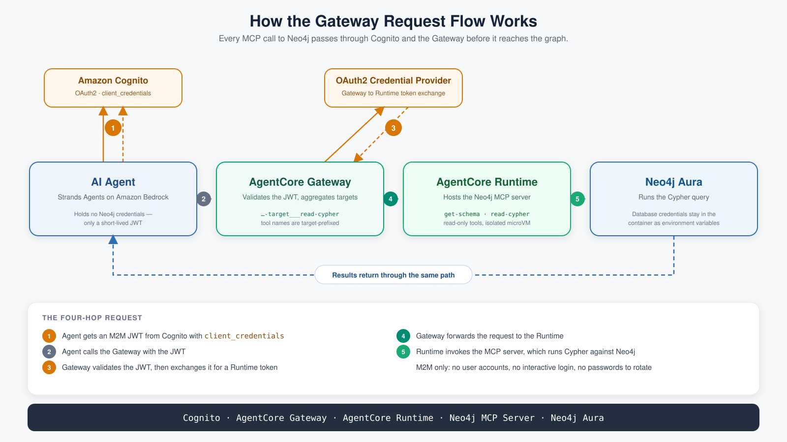

<!--
The client never holds Neo4j credentials. Cognito exchanges a client ID and
secret for a JWT. The Gateway validates the JWT and routes each tool call to
the runtime. The runtime hosts the read-only Neo4j MCP Server over Streamable
HTTP. Secrets Manager stores the Neo4j password, and the runtime receives it
at deploy time. Deployment code lives in neo4j-mcp-server/.

./deploy.py builds the ARM64 image, pushes it to ECR, and deploys the CDK
stack. ./deploy.py credentials writes the Gateway URL, client ID, client
secret, and token URL that the Quick connection slide uses. The Gateway also
exchanges its own OAuth token with the runtime, so callers see one endpoint.
-->

---

<style scoped>
small { font-size: 16px; }
</style>

## What Amazon Quick Is

Amazon Quick is the AI assistant for work, on web and desktop. As an MCP client, it can call the Neo4j tools from the previous slides.

- **Chat and Spaces:** Answers are grounded in connected data such as S3, SharePoint, Slack, and Salesforce.
- **Quick Sight:** Dashboards and natural-language Q&A run over sources such as Athena and Redshift.
- **Flows and automation:** Quick handles repetitive tasks and multi-step processes across apps.
- **Actions:** Quick acts on connected systems through built-in connectors and MCP servers.

<small>Sources: [Amazon Quick](https://aws.amazon.com/quick/) and [Amazon Quick features](https://aws.amazon.com/quick/features/)</small>

<!--
Amazon Quick is the rebrand of the Amazon Q Business enterprise assistant.
Amazon QuickSight is now Quick Sight, the BI part of Quick. Amazon Q Developer
is a separate product and is unaffected. The point for this audience: Quick is
where business users already ask questions, so it is the natural front door
for graph context. MCP is the door Neo4j comes through.
-->

---

<style scoped>
small { font-size: 16px; }
</style>

## Registering Neo4j MCP in Amazon Quick

- **Register the server:** An admin adds the Neo4j MCP endpoint as a Quick connector.
- **Tools become actions:** Quick discovers each Neo4j tool, such as schema lookup and read-only Cypher.
- **Authenticate as a service:** Quick's service-to-service option uses the same Cognito client credentials.
- **Reach it privately:** A Quick VPC connection reaches MCP servers that are not on the public internet.
- **Share the connector:** Analysts on the team use the same governed graph tools.

<small>Source: [MCP integration with Amazon Quick](https://docs.aws.amazon.com/quick/latest/userguide/mcp-integration.html)</small>

<!--
The Neo4j MCP server from the deployment slide works here unchanged. Point
Quick at the AgentCore Gateway URL. The credentials file from
./deploy.py credentials already holds the client ID, client secret, and token
URL that Quick's service authentication asks for. The Quick setup is done in
the console. This repository does not script it.

Limits to plan for:
- MCP integration needs a Quick Enterprise subscription.
- Quick supports remote servers only. Streamable HTTP is preferred over SSE.
- Each MCP operation has a fixed 60-second timeout. Keep Cypher tools bounded.
- Quick registers at most 100 tools per MCP server.
- Custom HTTP headers are not sent. Auth must go through OAuth.
- Custom connectors do not pick up new tools automatically. The owner chooses
  Sync after the server changes.
-->

---

## One Fraud Investigation in Amazon Quick

1. **Spot the anomaly:** A Quick Sight dashboard over the Athena Iceberg tables shows an alert spike.
2. **Ask in chat:** The analyst asks Quick who is connected to the flagged accounts.
3. **Traverse the graph:** Quick calls the Neo4j MCP tools and traces the ACC-1001 ⇄ ACC-2047 ring.
4. **Explain the finding:** Graph context links the ring to typologies, KYC documents, and prior cases.
5. **Share the result:** Quick turns the answer into a case summary for the team.

**One assistant, both data paths:** Quick Sight counts the activity. Neo4j explains how it connects.

<!--
This closes the loop with the dual-architecture slides. Athena and Quick Sight
cover the "counting things" side. The Neo4j MCP tools cover the "following
connections" side. The analyst never leaves Quick, and never needs Neo4j
credentials, because the Gateway and MCP server own database access.
Source: demos/fraud-amazon-quick/README.md.
-->

---

## Building GraphRAG Agents on AWS

---

## Context Rot: More Context, Worse Answers

Too much irrelevant context **degrades** LLM performance.

- RAG retrieves chunks that are *similar*, not *relevant*.
- The context window fills with tangential noise.
- The model gets distracted or misled.

"Context rot": retrieval of tangents that rots response quality. This is the problem GraphRAG's traversal step is built to avoid.

<!--
A surprising finding. When RAG retrieves chunks that are similar but not truly
relevant, the context window fills with tangentially related information and
the model gets confused or misled. The retrieved context actively rots the
quality of the answer. This motivates GraphRAG, previewed on the next slide:
traversal reaches connected facts instead of just more similar-looking text.
-->

---

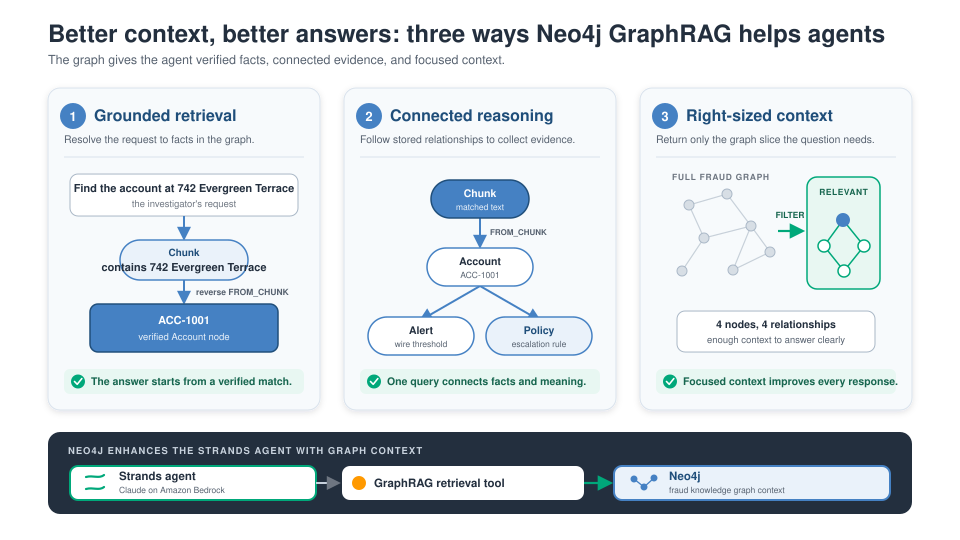

---

## The Shift to GraphRAG

- **One step past vector search:** a graph traversal follows the matched text to the facts connected to it.
- **Stored links:** the graph records how facts connect, such as which account a transaction belongs to.
- **Connected, verifiable facts:** the graph stores facts you can check, not just pattern-matched chunks of text.
- **Traceable:** every answer can walk back to the document behind it.
- **Fewer tokens:** the agent receives the facts an answer needs, not everything that looked similar.

The agent answers from evidence the graph can defend.

---

## GraphRAG Patterns

Four patterns for building GraphRAG, all built around one graph.

- **Vector search:** the system finds the passages closest in meaning to the question, then narrows them with graph and metadata filters.
- **Hybrid search:** the system combines vector search with full-text keyword search.
- **Query generation:** the system writes Cypher queries dynamically, also called text-to-Cypher.
- **Graph enrichment:** the system adds community summaries, graph embeddings, and PageRank scores to improve results.

---

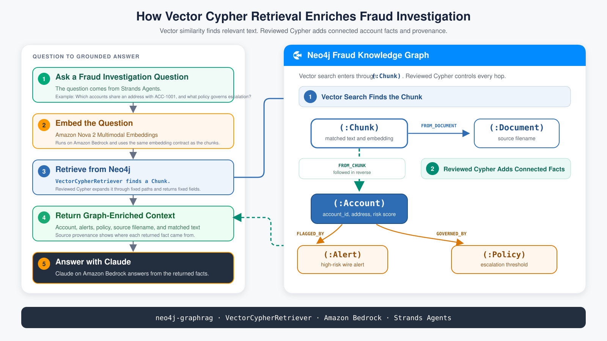

---

## GraphRAG Becomes a Strands Agent Tool

- **GraphRAG patterns fit as tools:** Each GraphRAG pattern can be wrapped as a Strands tool. The agent calls it to pull connected context into the conversation.
- **Deploy to AgentCore:** A finished Strands agent deploys to AgentCore Runtime. AgentCore Gateway can expose Neo4j MCP tools to it.
- **The model picks, the tool governs:** The model decides when to call the tool. The tool's reviewed Cypher decides what data comes back.
- **Focused results:** The tool returns a small, bounded result, so the agent's context stays clean.

<!--
The audience already knows Strands. The point here is that everything in this
section becomes a tool: the vector search plus traversal from the previous
image, text-to-Cypher, or a GDS-backed query. "Focused results" closes the loop
on context rot from the start of the section.
-->

---

## Agent Memory with Neo4j

Tools answer the current question. Memory carries context across turns and sessions.

<style scoped>
small { font-size: 16px; }
</style>

<small>[Library documentation](https://neo4j.com/labs/agent-memory/) · [GitHub project](https://github.com/neo4j-labs/agent-memory)</small>

---

## A Context Graph Is Persistent Connected Memory for Agents

One queryable graph links three kinds of memory.

- **Long-term knowledge:** Entities, relationships, business meaning, policies, and authoritative facts.
- **Short-term state:** Conversation, user intent, task, workflow state, and tool observations.
- **Reasoning memory:** Decisions linked to their situation, rationale, actions, outcomes, and precedents.

**Compounding context:** Each request retrieves relevant context and adds new state or traces. The graph persists across requests.

<!--
Short-term state is what lets an agent resolve "what's the current balance?"
after an account was already named. Long-term knowledge holds durable facts
and preferences that should outlive one conversation, plus a record of what
changed and when. Reasoning memory keeps the tool calls, decisions, and
outcomes an agent produced, which is evidence for debugging and review. Most
agents are stateless until memory is designed on purpose.

Sources: https://neo4j.com/blog/agentic-ai/what-is-context-graph/,
https://neo4j.com/blog/agentic-ai/context-graph-ai-agent-memory/, and
https://neo4j.com/blog/agentic-ai/hands-on-with-context-graphs-and-neo4j/
-->

---

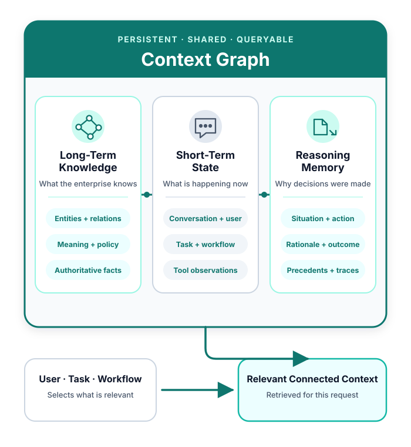

---

## Agent Memory Preserves Facts, Context, and Reasoning


**Long-term model:** POLE+O represents Person, Object, Location, Event, and Organization. Temporal validity records when a fact was true.

<!-- Source: https://github.com/neo4j-labs/agent-memory -->

---

<style scoped>
ul, p { font-size: 25px; }
</style>

## Why Graphs for Agent Memory

- **Relationships are first-class.** A conversation, a preference, and a transaction can all point to the same real-world record.
- **Multi-hop queries combine memory with domain facts** without joining separate data stores in application code.
- **Provenance stays traversable.** A stored memory can point back to the exact source that produced it.
- **Graph identity prevents copies.** One canonical record accumulates facts, conversations, preferences, and actions instead of scattering them.
- **Memory is scoped to individual users.** Each user's memory stays isolated across sessions.
- **History is retained.** Outdated memory is superseded without erasing its correction path.

**Store deliberately:** Entity extraction identifies what a turn is about. Policy or confirmation decides what becomes durable memory.

---

## Example: The Fraud Memory Agent

The agent uses **NAMS**, the Neo4j Hosted Agent Memory Service.

- **Every turn is captured:** The agent records each user and assistant message in NAMS, tagged with the user and session.
- **Entities are extracted:** NAMS extracts entities from each message on the server side.
- **Tool calls become reasoning traces:** Each MCP tool call is saved as a step in a reasoning trace.
- **Graph and memory stay separate:** The Neo4j MCP server owns access to the fraud graph, and NAMS owns memory storage. The agent holds no Neo4j credentials.

<!--
This demo captures memory. It does not inject recalled memory back into
prompts, which keeps a shared NAMS workspace safe for synthetic multi-user
load runs. Recall is a library capability, not something this demo shows.
Source: demos/fraud-amazon-quick/fraud-memory-agent/README.md and
server/runtime_app.py.
-->

---

## These Capabilities Meet Inside an AWS-Hosted Agent Workflow

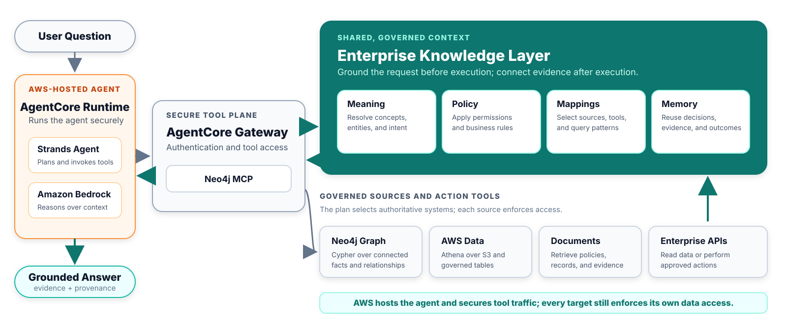

**Security boundary:** Gateway supports OAuth 2.0 for tool traffic. Targets enforce data access.

<!--
Sources: https://docs.aws.amazon.com/bedrock-agentcore/latest/devguide/gateway.html
and https://docs.aws.amazon.com/bedrock-agentcore/latest/devguide/gateway-target-MCPservers.html
-->

---

## Together, Connected Knowledge Grounds the AWS Agent Stack

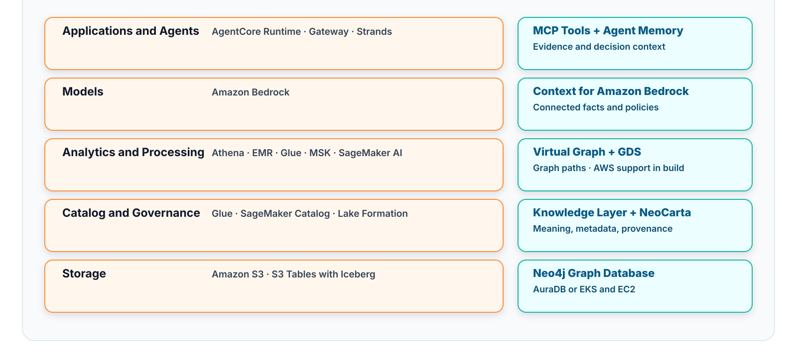

---

## Takeaways

- **Neo4j connects what AWS stores:** AWS stores, governs, and analyzes the data. Neo4j follows the relationships in it.
- **GraphRAG counters context rot:** Vector search finds the starting point. A reviewed traversal returns only the connected facts.
- **GraphRAG is an agent tool:** Strands agents on Bedrock call it directly or through Neo4j MCP on AgentCore Gateway.
- **Graph memory persists:** Conversations, entities, and reasoning traces stay connected and inspectable across sessions.
