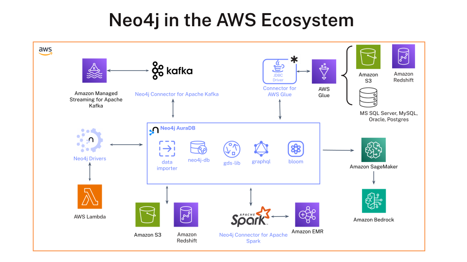
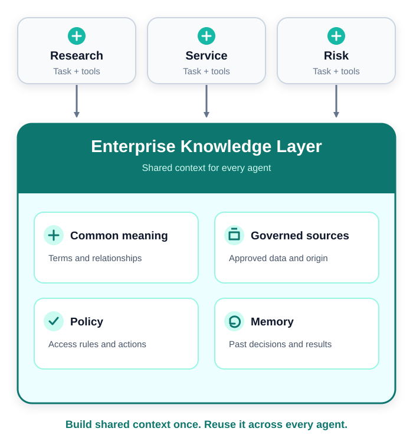
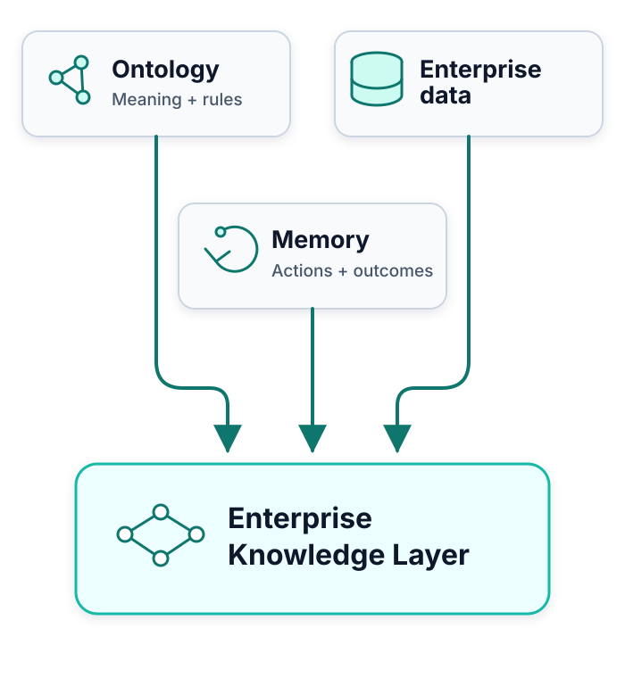
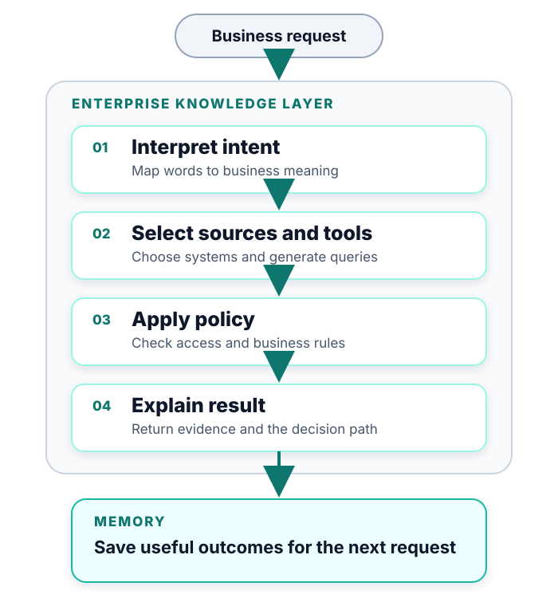
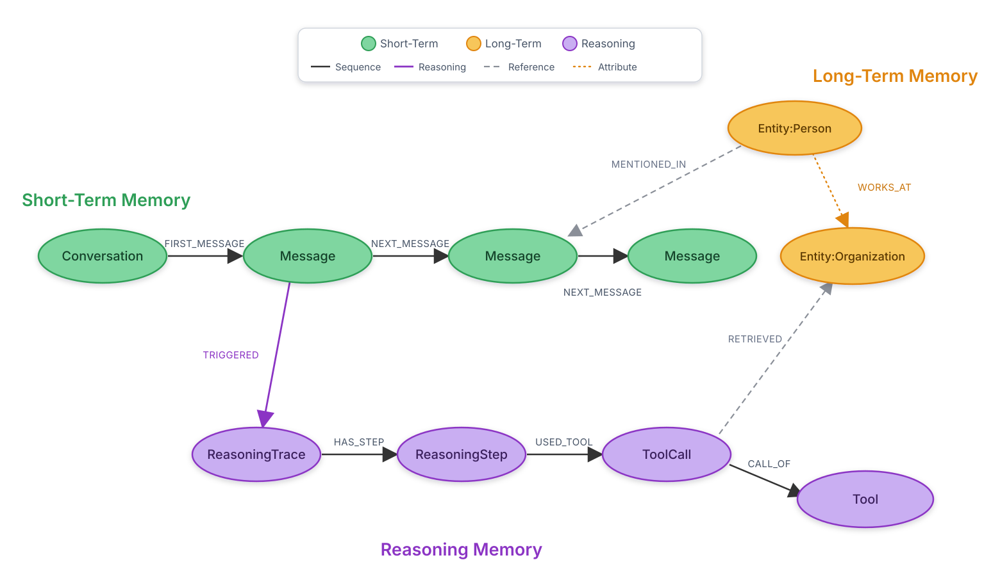
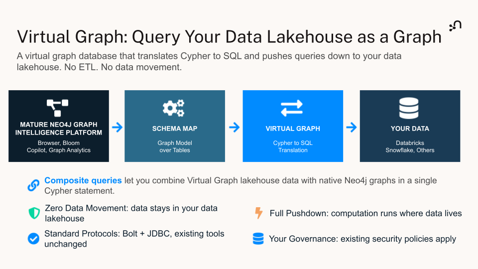
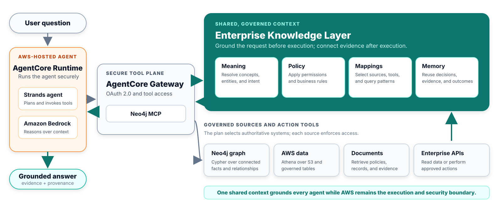

<style>
section {
  --marp-auto-scaling-code: false;
  color: #0f172a;
  font-size: 26px;
  padding: 48px 64px;
}

h1 {
  color: #0f172a;
  font-size: 52px;
}

h2 {
  color: #0f172a;
  font-size: 37px;
  margin-bottom: 18px;
}

h3 {
  color: #0f766e;
  font-size: 26px;
}

table {
  font-size: 21px;
  width: 100%;
}

th {
  background: #e2e8f0;
}

td, th {
  padding: 9px 13px;
}

code {
  font-size: 21px;
}

small {
  color: #64748b;
  font-size: 13px;
}

section.lead {
  background: linear-gradient(135deg, #f8fafc 0%, #ecfeff 100%);
}

section.lead h1 {
  font-size: 58px;
  max-width: 1050px;
}

section.lead h2 {
  color: #0f766e;
  font-size: 29px;
  font-weight: 500;
  max-width: 980px;
}

.promise {
  color: #475569;
  font-size: 21px;
  margin-top: 72px;
}

.callout {
  background: #ecfeff;
  border-left: 6px solid #14b8a6;
  margin-top: 18px;
  padding: 12px 18px;
}

.status-now {
  color: #047857;
  font-weight: 700;
}

.status-preview {
  color: #a16207;
  font-weight: 700;
}

.status-roadmap {
  color: #7c3aed;
  font-weight: 700;
}

.cols {
  display: grid;
  gap: 30px;
  grid-template-columns: 1fr 1fr;
}

.center {
  text-align: center;
}

.tight li {
  margin: 6px 0;
}

section.knowledge-slide {
  padding: 40px 56px;
}

section.knowledge-slide h2 {
  margin-bottom: 8px;
}

section.knowledge-slide .overview {
  color: #475569;
  font-size: 23px;
  margin: 0 0 12px;
}

section.knowledge-slide .cols {
  align-items: center;
  gap: 24px;
  grid-template-columns: 0.95fr 1.05fr;
}

section.knowledge-slide ul {
  font-size: 21px;
  margin: 4px 0 0;
  padding-left: 24px;
}

section.knowledge-slide li {
  margin: 9px 0;
}

section.knowledge-slide img {
  display: block;
  margin: 0 auto;
}

section.knowledge-slide pre {
  background: #f8fafc;
  border: 2px solid #cbd5e1;
  border-radius: 14px;
  padding: 18px;
}

li {
  opacity: 1 !important;
  visibility: visible !important;
}
</style>

<!-- _class: lead -->

# AWS + Neo4j: Connected Context for Grounded Enterprise AI

## Neo4j graph, knowledge, and memory integrated with AWS data and agent services

---

## AWS provides the foundation for governed enterprise AI


---

## Neo4j adds connected context across the AWS platform


---

## AWS provides cloud-scale services; Neo4j provides connected context

| AWS | Neo4j |
| --- | --- |
| **Store:** Keep authoritative records, documents, tables, and operational history. | **Connect:** Represent important entities, relationships, and investigation context. |
| **Govern:** Control access through catalogs, policies, identities, and platform services. | **Explain:** Link data to business terms, policies, typologies, and prior decisions. |
| **Analyze:** Use SQL, Spark, streaming, and ML for activity at scale. | **Traverse:** Find paths, communities, shared identifiers, and network patterns. |
| **Run AI:** Supply models, agent runtimes, gateways, and application infrastructure. | **Ground AI:** Give agents connected facts, semantic routing, tools, and memory. |

---

## Neo4j connection patterns for AWS

| Integration path | AWS home | Description |
| --- | --- | --- |
| **Neo4j Spark Connector** | Amazon EMR | Exchange data between Spark DataFrames and Neo4j graphs. |
| **Neo4j Connector for AWS Glue** | AWS Glue | Load data from AWS sources into Neo4j with managed ETL jobs. |
| **Neo4j Connector for Kafka** | Amazon MSK | Stream events into Neo4j and publish graph changes to Kafka. |
| **Neo4j drivers** | Lambda, ECS, EKS, EC2 | Connect new or existing AWS applications to Neo4j. |
| **Neo4j MCP tools** | AgentCore and Strands | Connect AWS-hosted agents to Neo4j graph retrieval tools. |

<small>Sources: [Neo4j Spark Connector](https://neo4j.com/docs/spark/current/), [Kafka Connector](https://neo4j.com/docs/kafka/current/), [connectors and drivers](https://neo4j.com/docs/connectors/), and [Neo4j MCP](https://neo4j.com/developer/genai-ecosystem/model-context-protocol-mcp/)</small>

---



---

<!-- _class: lead -->

# Enterprise Knowledge Layer

---

<!-- _class: knowledge-slide -->

## A shared Knowledge Layer makes connected context reusable

<p class="overview">Keep meaning in one governed layer so every agent uses consistent definitions and rules.</p>

<div class="cols">
<div>

- **Knowledge Layer:** Provides one governed place for enterprise knowledge.
- **Business meaning:** Defines shared terms, relationships, and rules.
- **Connected context:** Links concepts to data, policies, owners, and processes.
- **Lighter agents:** Query the shared layer when they need context.

</div>
<div>



</div>
</div>

<!-- Source: /Users/ryanknight/projects/cloud-integration/knowledge-layer/reference/knowledge-layer-official.md -->

---

<!-- _class: knowledge-slide -->

## Three parts ground every answer

<p class="overview">Combine business meaning, enterprise data, and past experience.</p>

<div class="cols">
<div>

- **Knowledge Layer ontology:** Connects business concepts to systems, processes, policies, and owners.
- **Enterprise data:** Supplies governed facts from authoritative systems.
- **Memory:** Stores previous actions, decisions, and results.
- **Decision trace:** Records the evidence and reasoning behind each result.

</div>
<div>



</div>
</div>

<!-- Source: /Users/ryanknight/projects/cloud-integration/knowledge-layer/reference/knowledge-layer-official.md -->

---

<!-- _class: knowledge-slide -->

## The Knowledge Layer turns each request into a governed action plan

<p class="overview">The layer grounds the request. The agent or application executes the plan.</p>

<div class="cols">
<div>

- **Interpret intent:** Resolve the business meaning of the request.
- **Select sources and tools:** Choose authoritative systems and generate their queries.
- **Apply policy:** Limit the plan to permitted data and actions.
- **Explain result:** Return the sources, evidence, and decision path.
- **Update memory:** Store useful outcomes for future requests.

</div>
<div>



</div>
</div>

<!-- Source: /Users/ryanknight/projects/cloud-integration/knowledge-layer/reference/knowledge-layer-official.md -->

---

<!-- _class: knowledge-slide -->

## Start with meaning, then add data and memory

<p class="overview">Begin with shared meaning and mappings. Add graph data and memory when the use case needs them.</p>

<div class="cols">
<div>

- **Ontology-Based Semantic Layer:** Defines concepts, maps sources, and routes tools.
- **Query in place:** Keeps AWS data in its source system.
- **Materialized data:** Stores repeated or graph-heavy data in Neo4j when speed matters.
- **Memory:** Uses prior decisions to improve future actions.

</div>
<div>

```text
Ontology-Based Semantic Layer
  meaning + mappings + tools
              ↓
   query external data in place
              ↓
   add graph data when useful
              ↓
     add memory over time
              ↓
    full Knowledge Layer
```

</div>
</div>

<!-- Source: /Users/ryanknight/projects/cloud-integration/knowledge-layer/reference/knowledge-layer-official.md -->

---

## Policy and prior decisions make each result explainable

```text
Finding → business meaning → policy → prior decision → evidence
```

- **Explain the result:** Link each finding to its meaning, policy, and evidence.
- **Reuse prior work:** Find similar decisions, evidence, and outcomes.
- **Keep the path inspectable:** Let reviewers trace each answer back to governed sources.

---

<!-- _class: lead -->

# Neo4j Agent Memory

## Open-source, graph-native memory for conversations, durable knowledge, and agent reasoning

<div class="promise"><a href="https://neo4j.com/labs/agent-memory/">Library documentation</a> · <a href="https://github.com/neo4j-labs/agent-memory">GitHub project</a></div>

---

## Graph memory makes each result inspectable and reusable

<div class="cols">
<div>

### What it remembers

- **Short-term:** Conversations, messages, and session context.
- **Long-term:** Entities, facts, preferences, relationships, and temporal context.
- **Reasoning:** Tool calls, evidence, decisions, outcomes, and feedback.

</div>
<div>

### What the graph adds

- **Traversable provenance:** Follow a memory back to its exact source turn and evidence.
- **Canonical identity:** Connect memory to the same domain entities the agent queries.
- **Actor-scoped recall:** Keep each user's memory isolated across sessions.
- **Retained history:** Supersede outdated memory without erasing its correction path.

</div>
</div>

<div class="callout"><strong>Store deliberately:</strong> Entity extraction identifies what a turn is about. Policy or confirmation decides what becomes durable memory.</div>

<!-- Source: /Users/ryanknight/projects/aws/neo4j-aws-graphrag-workshop/site/content/06-neo4j-memory/index.en.md -->

---

## Agent Memory preserves facts, context, and reasoning



<div class="callout"><strong>Long-term model:</strong> POLE+O represents Person, Object, Location, Event, and Organization. Temporal validity records when a fact was true.</div>

<!-- Source: https://github.com/neo4j-labs/agent-memory -->

---

## Example: The Finance Agent remembers across sessions

`neo4j-agentcore-agents/finance-agent` adds four Strands tools: `search_context`, `add_memory`, `get_user_preferences`, and `get_entity_graph`.

1. **Cold start:** A new user asks what the agent remembers; the agent reports nothing.
2. **Teach:** The user states a durable portfolio or risk preference; the agent stores it with `add_memory`.
3. **Recall:** A fresh session for the same user retrieves the preference without it being restated.
4. **Isolate:** A second user asks the same question and cannot see the first user's memory.

<div class="callout"><strong>One graph stack:</strong> The memory wrapper uses the library's user-scoped core API against the same Neo4j instance as the finance graph. Domain graph tools remain behind AgentCore Gateway and MCP.</div>

<!-- Sources: neo4j-agentcore-agents/finance-agent/README.md and neo4j-agentcore-agents/finance-agent/core/memory.py -->

---

<!-- _class: lead -->

# Virtual Graph for AWS

## Planned: Query Amazon S3 Tables with Cypher through Athena

---



---

## Planned AWS query path: Cypher through Athena to S3 Tables

<div class="cols">
<div>

```text
Cypher query
      ↓
Neo4j Virtual Graph
translates Cypher to SQL
      ↓ SQL
Amazon Athena
      ├── uses → AWS Glue Data Catalog
      │          registered S3 table
      │          bucket catalog
      └── reads → Amazon S3 Tables
                 Apache Iceberg data
      ↓
Cypher result
```

</div>
<div>

### AWS service roles

- **Query engine:** Amazon Athena executes the generated SQL.
- **Catalog:** AWS Glue Data Catalog exposes the registered S3 Tables catalog to Athena.
- **Storage:** Amazon S3 Tables remains the authoritative data store.

</div>
</div>

<div class="callout"><strong>No source-data copy:</strong> Virtual Graph queries the tables in place instead of copying them into Neo4j.</div>

<small><span class="status-preview">Public preview:</span> Snowflake, Databricks, and Google BigQuery. <span class="status-roadmap">Planned for AWS:</span> Athena, AWS Glue Data Catalog, and Amazon S3 Tables.</small>

<!-- Source: https://neo4j.com/blog/auradb/neo4j-virtual-graph-is-now-in-public-preview/ -->

---

## Choose the execution path that fits the workload

| Workload | Recommended path | Execution |
| --- | --- | --- |
| **Query current S3 Tables data without copying it**<br><span class="status-roadmap">Planned</span> | Cypher through Virtual Graph | Athena queries S3 Tables through the catalog registered in AWS Glue Data Catalog. |
| **Run frequent, low-latency traversals or graph algorithms** | Materialize selected data in Neo4j | Neo4j executes Cypher against the persisted graph. |

---

<!-- _class: lead -->

# Closing

## From connected context to a governed AI operating model

---

## Neo4j supports managed and self-managed AWS deployment

- **AuraDB on AWS:** Use Neo4j's managed graph database in an AWS region that fits the workload.
- **AWS Marketplace:** Purchase eligible Aura plans through AWS billing and marketplace terms.
- **Private connectivity:** Use AWS PrivateLink with supported Aura enterprise configurations.
- **Self-managed:** Deploy Neo4j on Amazon EKS or Amazon EC2 when the customer manages the runtime.

<small>Sources: [Aura through cloud marketplaces](https://neo4j.com/docs/aura/cloud-providers/), [Aura secure connections](https://neo4j.com/docs/aura/security/secure-connections/), and [AgentCore supported regions](https://docs.aws.amazon.com/bedrock-agentcore/latest/devguide/agentcore-regions.html)</small>

---

## These capabilities meet inside an AWS-hosted agent workflow



<div class="callout"><strong>Security boundary:</strong> AgentCore Gateway manages tool access and OAuth 2.0. Each source service enforces data access.</div>

---

## Together, connected knowledge grounds the AWS agent stack


