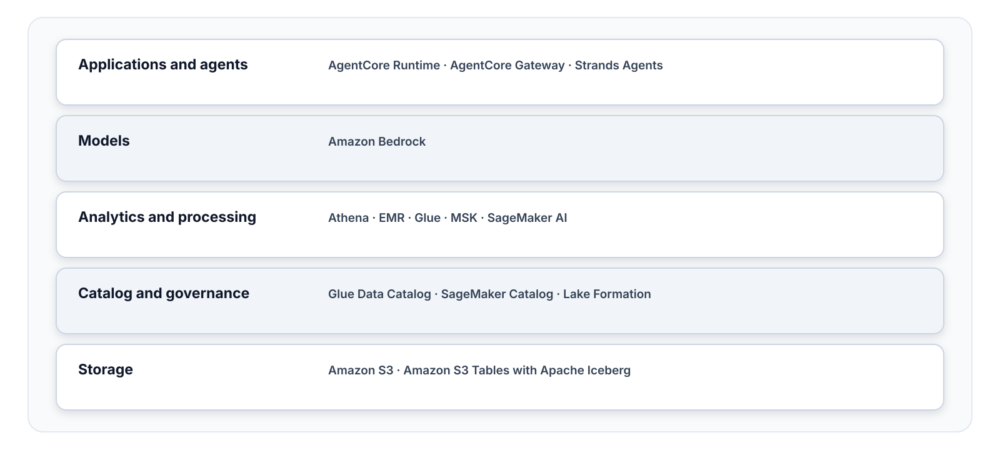
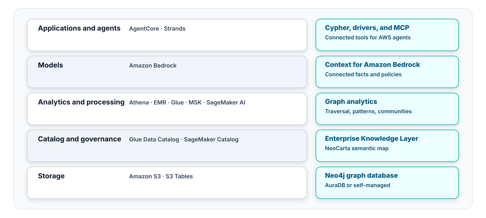
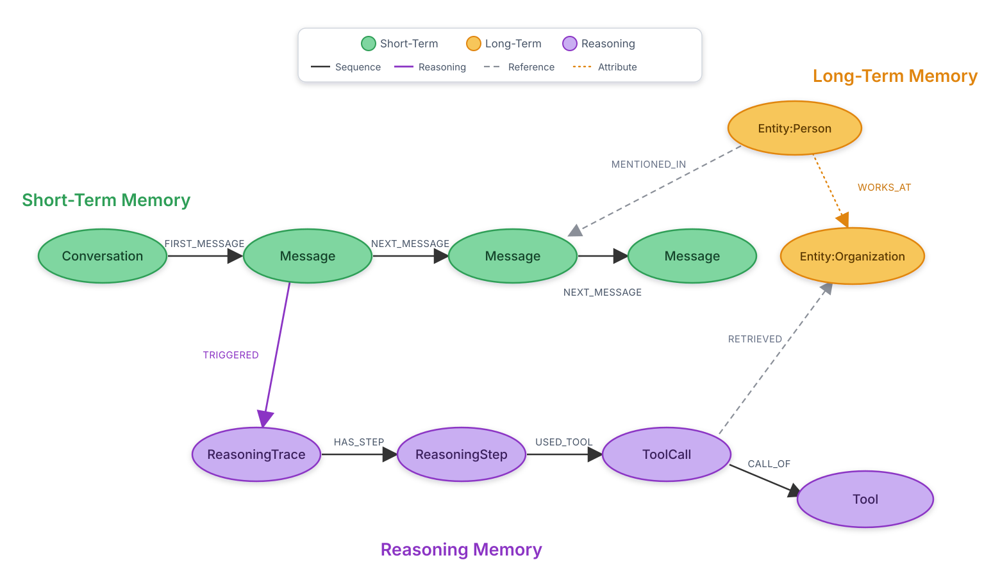
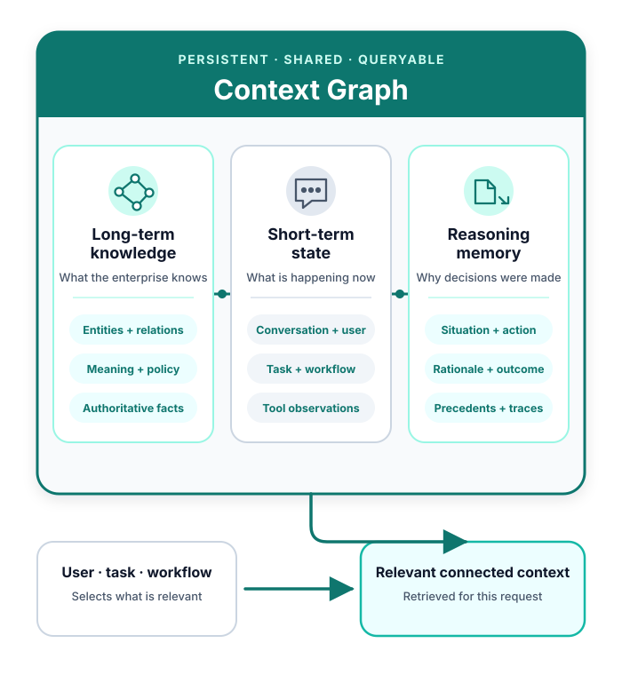
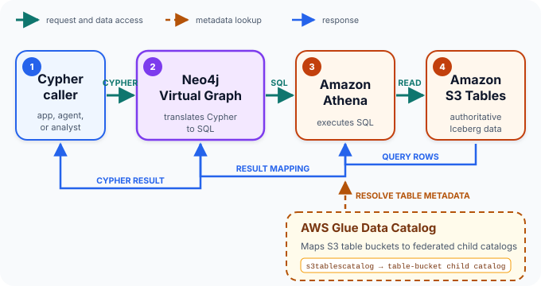
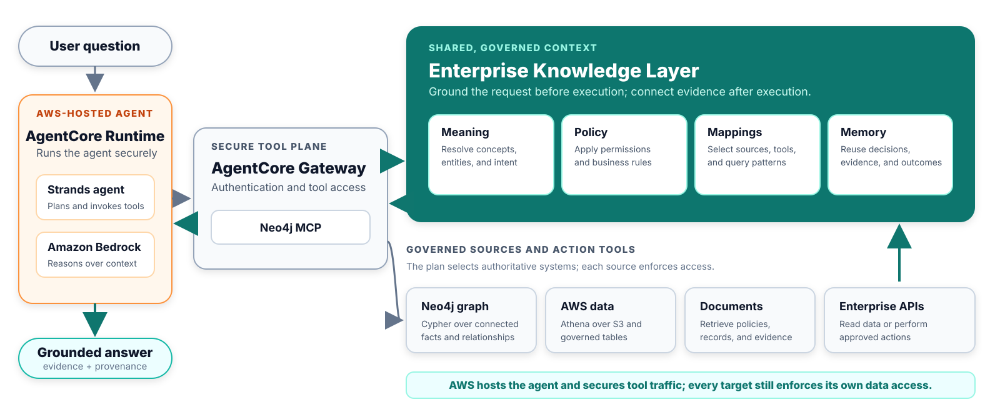
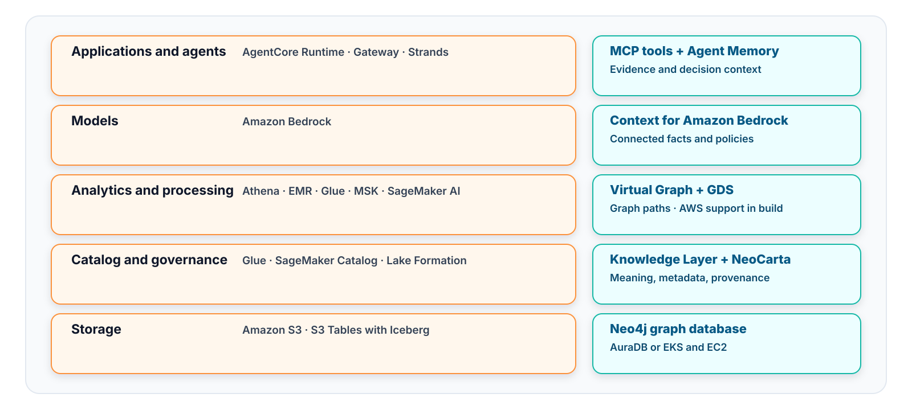

<style>
section {
  --marp-auto-scaling-code: false;
  color: #0f172a;
  font-size: 26px;
  padding: 48px 64px;
}

h1 {
  color: #0f172a;
  font-size: 52px;
}

h2 {
  color: #0f172a;
  font-size: 37px;
  margin-bottom: 18px;
}

h3 {
  color: #0f766e;
  font-size: 26px;
}

table {
  font-size: 21px;
  width: 100%;
}

th {
  background: #e2e8f0;
}

td, th {
  padding: 9px 13px;
}

code {
  font-size: 21px;
}

small {
  color: #64748b;
  font-size: 13px;
}

section.lead {
  background: linear-gradient(135deg, #f8fafc 0%, #ecfeff 100%);
}

section.lead h1 {
  font-size: 58px;
  max-width: 1050px;
}

section.lead h2 {
  color: #0f766e;
  font-size: 29px;
  font-weight: 500;
  max-width: 980px;
}

.promise {
  color: #475569;
  font-size: 21px;
  margin-top: 72px;
}

.callout {
  background: #ecfeff;
  border-left: 6px solid #14b8a6;
  margin-top: 18px;
  padding: 12px 18px;
}

.status-now {
  color: #047857;
  font-weight: 700;
}

.status-preview {
  color: #a16207;
  font-weight: 700;
}

.status-roadmap {
  color: #7c3aed;
  font-weight: 700;
}

.cols {
  display: grid;
  gap: 30px;
  grid-template-columns: 1fr 1fr;
}

.center {
  text-align: center;
}

.tight li {
  margin: 6px 0;
}

section.knowledge-slide {
  padding: 40px 56px;
}

section.knowledge-slide h2 {
  margin-bottom: 8px;
}

section.knowledge-slide .overview {
  color: #475569;
  font-size: 23px;
  margin: 0 0 12px;
}

section.knowledge-slide .cols {
  align-items: center;
  gap: 24px;
  grid-template-columns: 0.95fr 1.05fr;
}

section.knowledge-slide ul {
  font-size: 21px;
  margin: 4px 0 0;
  padding-left: 24px;
}

section.knowledge-slide li {
  margin: 9px 0;
}

section.knowledge-slide img {
  display: block;
  margin: 0 auto;
}

section.knowledge-slide pre {
  background: #f8fafc;
  border: 2px solid #cbd5e1;
  border-radius: 14px;
  padding: 18px;
}

section.knowledge-slide .callout {
  font-size: 18px;
}

section.virtual-graph-slide {
  padding: 38px 56px;
}

section.virtual-graph-slide h2 {
  margin-bottom: 10px;
}

section.virtual-graph-slide .cols {
  align-items: start;
  gap: 24px;
  grid-template-columns: 1.08fr 0.92fr;
}

section.virtual-graph-slide h3 {
  margin: 6px 0 8px;
}

section.virtual-graph-slide ul {
  font-size: 20px;
  margin: 0;
  padding-left: 22px;
}

section.virtual-graph-slide li {
  margin: 8px 0;
}

section.virtual-graph-slide img {
  display: block;
  margin: 0 auto;
}

section.virtual-graph-slide .callout {
  font-size: 18px;
  margin-top: 8px;
  padding: 9px 14px;
}

li {
  opacity: 1 !important;
  visibility: visible !important;
}
</style>

<!-- _class: lead -->

# AWS + Neo4j: Connected Context for Grounded Enterprise AI

## Neo4j graph, knowledge, and memory integrated with AWS data and agent services

---

## AWS provides the foundation for governed enterprise AI



---

## Neo4j adds connected context across the AWS platform



---

## AWS provides cloud-scale services; Neo4j provides connected context

| AWS | Neo4j |
| --- | --- |
| **Store:** Keep authoritative records, documents, tables, and operational history. | **Connect:** Represent important entities, relationships, and investigation context. |
| **Govern:** Control access through catalogs, policies, identities, and platform services. | **Explain:** Link data to business terms, policies, typologies, and prior decisions. |
| **Analyze:** Use SQL, Spark, streaming, and ML for activity at scale. | **Traverse:** Find paths, communities, shared identifiers, and network patterns. |
| **Run AI:** Supply models, agent runtimes, gateways, and application infrastructure. | **Ground AI:** Give agents connected facts, semantic routing, tools, and memory. |

---

## Neo4j connection patterns for AWS

| Integration path | AWS home | Description |
| --- | --- | --- |
| **Neo4j Spark Connector** | Amazon EMR | Exchange data between Spark DataFrames and Neo4j graphs. |
| **Neo4j Connector for AWS Glue** | AWS Glue | Load data from AWS sources into Neo4j with managed ETL jobs. |
| **Neo4j Connector for Kafka** | Amazon MSK | Stream events into Neo4j and publish graph changes to Kafka. |
| **Neo4j drivers** | Lambda, ECS, EKS, EC2 | Connect new or existing AWS applications to Neo4j. |
| **Neo4j MCP tools** | Amazon Bedrock AgentCore and Strands Agents | Connect AWS-hosted agents to Neo4j graph retrieval tools. |

<small>Sources: [Neo4j Spark Connector](https://neo4j.com/docs/spark/current/), [Kafka Connector](https://neo4j.com/docs/kafka/current/), [connectors and drivers](https://neo4j.com/docs/connectors/), and [Neo4j MCP](https://neo4j.com/developer/genai-ecosystem/model-context-protocol-mcp/)</small>

---

<!-- _class: knowledge-slide -->

## AWS Glue stays tabular while Neo4j receives Cypher

<div class="cols">
<div>

### Runtime path

```text
Glue Visual ETL
  └─ SQL / JDBC → connector + translator
                         └─ Cypher / Bolt → Neo4j
```

- Driver: `org.neo4j.jdbc.Neo4jDriver`
- Enable: `enableSQLTranslation=true`

</div>
<div>

### The mapping in practice

```text
Movie                     → (:Movie)
title                     → .title
Person_ACTED_IN_Movie     →
(:Person)-[:ACTED_IN]->(:Movie)
```

```sql
SELECT m.title FROM Movie m
```

```cypher
MATCH (m:Movie)
RETURN m.title
```

</div>
</div>

<div class="callout"><strong>Model first:</strong> Glue expects queryable metadata. Create a blueprint graph with the labels, relationship types, and properties; load nodes before relationships. Only supported SQL constructs are translated.</div>

<small>Sources: [Neo4j Connector for AWS Glue](https://neo4j.com/docs/neo4j-aws-glue/), [Getting Started](https://neo4j.com/docs/neo4j-aws-glue/getting-started/), [JDBC SQL-to-Cypher translation](https://neo4j.com/docs/jdbc-manual/current/sql2cypher/), and [connector announcement](https://neo4j.com/blog/developer/neo4j-connector-for-aws-glue/)</small>

---


---

<!-- _class: lead -->

# Neo4j Agent Memory

## Agent Memory supplies the historical and reasoning dimension of a Context Graph

<div class="promise"><a href="https://neo4j.com/labs/agent-memory/">Library documentation</a> · <a href="https://github.com/neo4j-labs/agent-memory">GitHub project</a></div>

---

## Graph memory makes each result inspectable and reusable

<div class="cols">
<div>

### What it remembers

- **Short-term:** Conversations, messages, and session context.
- **Long-term:** Entities, facts, preferences, relationships, and temporal context.
- **Reasoning:** Tool calls, evidence, decisions, outcomes, and feedback.

</div>
<div>

### What the graph adds

- **Traversable provenance:** Follow a memory back to its exact source turn and evidence.
- **Canonical identity:** Connect memory to the same domain entities the agent queries.
- **Actor-scoped recall:** Keep each user's memory isolated across sessions.
- **Retained history:** Supersede outdated memory without erasing its correction path.

</div>
</div>

<div class="callout"><strong>Store deliberately:</strong> Entity extraction identifies what a turn is about. Policy or confirmation decides what becomes durable memory.</div>

<!-- Source: /Users/ryanknight/projects/aws/neo4j-hotel-booking-agent-workshop/site/content/06-neo4j-memory/index.en.md -->

---

## Agent Memory preserves facts, context, and reasoning



<div class="callout"><strong>Long-term model:</strong> POLE+O represents Person, Object, Location, Event, and Organization. Temporal validity records when a fact was true.</div>

<!-- Source: https://github.com/neo4j-labs/agent-memory -->

---

## Example: The Fraud Memory Agent remembers across sessions

`demos/fraud-amazon-quick/fraud-memory-agent` adds four Strands tools: `search_context`, `add_memory`, `get_user_preferences`, and `get_entity_graph`.

1. **Cold start:** A new user asks what the agent remembers; the agent reports nothing.
2. **Teach:** The user states a durable portfolio or risk preference; the agent stores it with `add_memory`.
3. **Recall:** A fresh session for the same user retrieves the preference without it being restated.
4. **Isolate:** A second user asks the same question and cannot see the first user's memory.

<div class="callout"><strong>One graph stack:</strong> The memory wrapper uses the library's user-scoped core API against the same Neo4j instance as the fraud graph. Domain graph tools remain behind AgentCore Gateway and MCP.</div>

<!-- Sources: demos/fraud-amazon-quick/fraud-memory-agent/README.md and demos/fraud-amazon-quick/fraud-memory-agent/server/runtime_app.py -->

---

<!-- _class: knowledge-slide -->

## A Context Graph is persistent connected memory for agents

<p class="overview">It links long-term enterprise knowledge, short-term interaction state, and reasoning memory in one queryable graph.</p>

<div class="cols">
<div>

- **Long-term knowledge:** Entities, relationships, business meaning, policies, and authoritative facts.
- **Short-term state:** Conversation, user intent, task, workflow state, and tool observations.
- **Reasoning memory:** Decisions linked to their situation, rationale, actions, outcomes, and precedents.

<div class="callout"><strong>Each request retrieves relevant context and adds new state or traces.</strong> The graph persists and compounds across requests.</div>

</div>
<div>



</div>
</div>

<!-- Sources: https://neo4j.com/blog/agentic-ai/what-is-context-graph/, https://neo4j.com/blog/agentic-ai/context-graph-ai-agent-memory/, https://neo4j.com/blog/agentic-ai/hands-on-with-context-graphs-and-neo4j/, and /Users/ryanknight/projects/cloud-integration/knowledge-layer/reference/knowledge-layer-official.md -->

---

<!-- _class: lead -->

# Virtual Graph for AWS

## Planned: Query Amazon S3 Tables with Cypher through Athena

---


---

<!-- _class: virtual-graph-slide -->

## Planned AWS query path: Cypher through Athena to S3 Tables

<div class="cols">
<div>



</div>
<div>

### What each component does

- **Translate:** Virtual Graph turns Cypher into SQL and maps the returned rows back to a Cypher result.
- **Execute:** Athena runs the SQL against the table bucket.
- **Resolve:** Glue exposes each table bucket as a child federated catalog under `s3tablescatalog`.
- **Govern:** IAM or Lake Formation permissions control access to catalog and table resources.
- **Store:** S3 Tables remains the authoritative source.

</div>
</div>

<div class="callout"><strong>Read in place:</strong> Virtual Graph queries current S3 Tables data without materializing a second copy in Neo4j.</div>

<small><span class="status-preview">Public preview:</span> Snowflake, Databricks, and Google BigQuery. <span class="status-roadmap">Planned for AWS:</span> Athena, AWS Glue Data Catalog, and Amazon S3 Tables.</small>

<!-- Sources: https://neo4j.com/blog/auradb/neo4j-virtual-graph-is-now-in-public-preview/, https://docs.aws.amazon.com/athena/latest/ug/gdc-register-s3-table-bucket-cat.html, and https://docs.aws.amazon.com/glue/latest/dg/enable-s3-tables-catalog-integration.html -->

---

## Choose the execution path that fits the workload

| Workload | Recommended path | Execution |
| --- | --- | --- |
| **Query current S3 Tables data without copying it**<br><span class="status-roadmap">Planned</span> | Cypher through Virtual Graph | Athena queries the table-bucket child catalog mounted in AWS Glue Data Catalog. |
| **Run frequent, low-latency traversals or graph algorithms** | Materialize selected data in Neo4j | Neo4j executes Cypher against the persisted graph. |

---

<!-- _class: lead -->

# Closing

## From connected context to a governed AI operating model

---

## Neo4j supports managed and self-managed AWS deployment

- **AuraDB on AWS:** Use Neo4j's managed graph database in an AWS region that fits the workload.
- **AWS Marketplace:** Purchase eligible Aura plans through AWS billing and marketplace terms.
- **Private connectivity:** Use AWS PrivateLink with supported Aura enterprise configurations.
- **Self-managed:** Deploy Neo4j on Amazon EKS or Amazon EC2 when the customer manages the runtime.

<small>Sources: [Aura through cloud marketplaces](https://neo4j.com/docs/aura/cloud-providers/), [Aura secure connections](https://neo4j.com/docs/aura/security/secure-connections/), and [AgentCore supported regions](https://docs.aws.amazon.com/bedrock-agentcore/latest/devguide/agentcore-regions.html)</small>

---

## These capabilities meet inside an AWS-hosted agent workflow



<div class="callout"><strong>Security boundary:</strong> Gateway supports OAuth 2.0 for tool traffic; targets enforce data access.</div>

<!-- Sources: https://docs.aws.amazon.com/bedrock-agentcore/latest/devguide/gateway.html and https://docs.aws.amazon.com/bedrock-agentcore/latest/devguide/gateway-target-MCPservers.html -->

---

## Together, connected knowledge grounds the AWS agent stack


