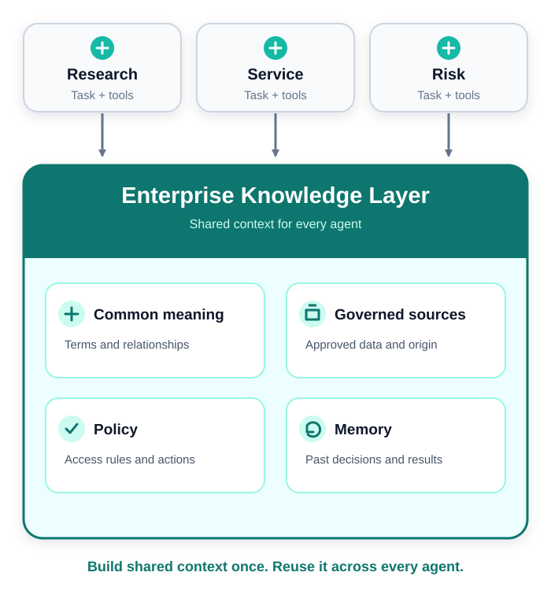
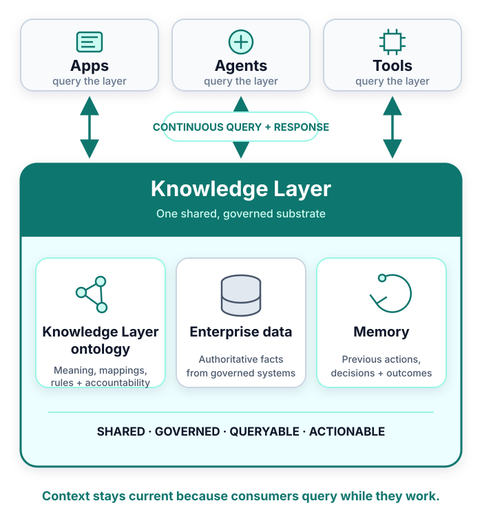
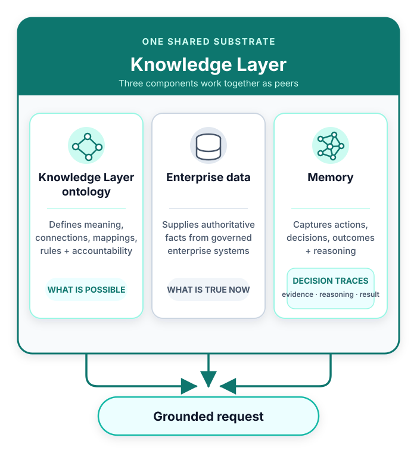
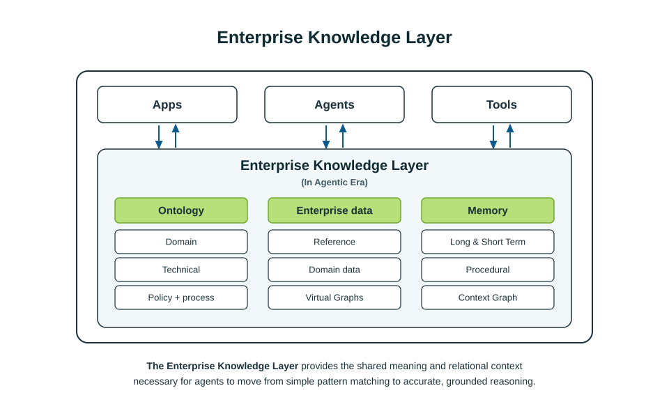
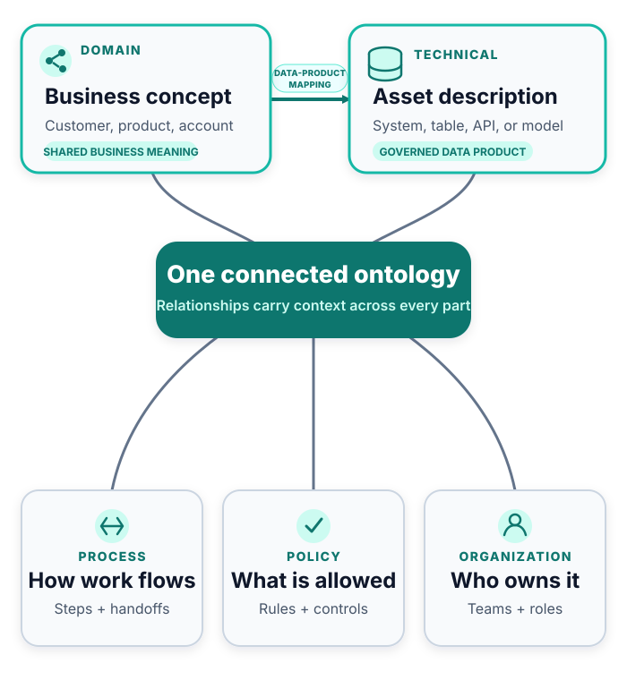
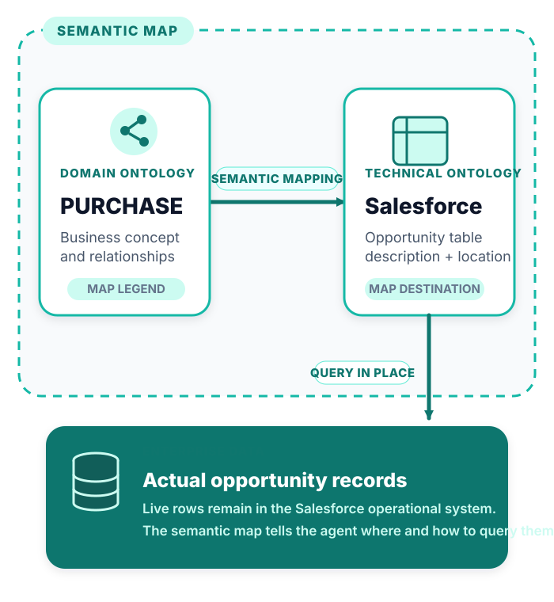
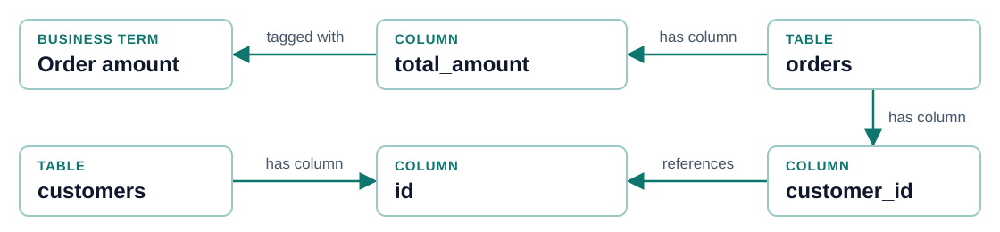
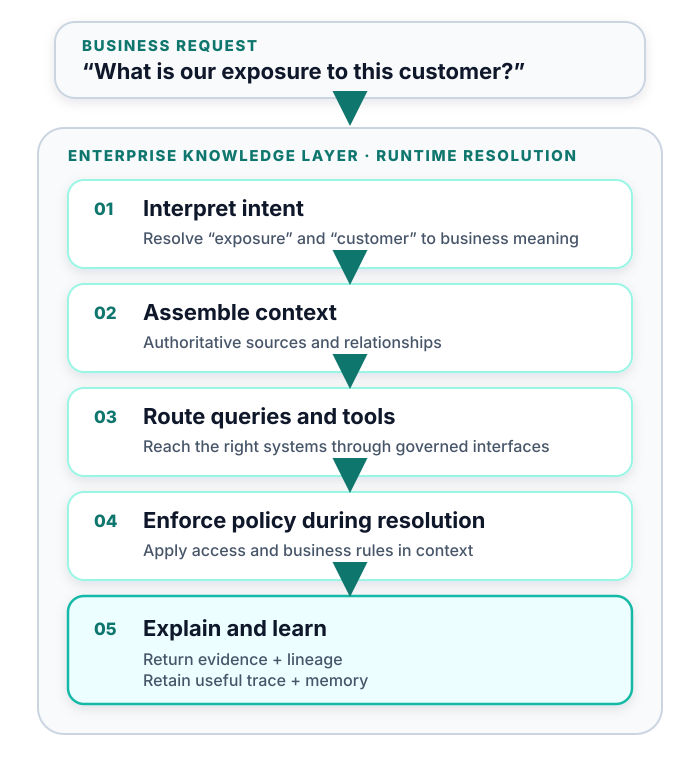
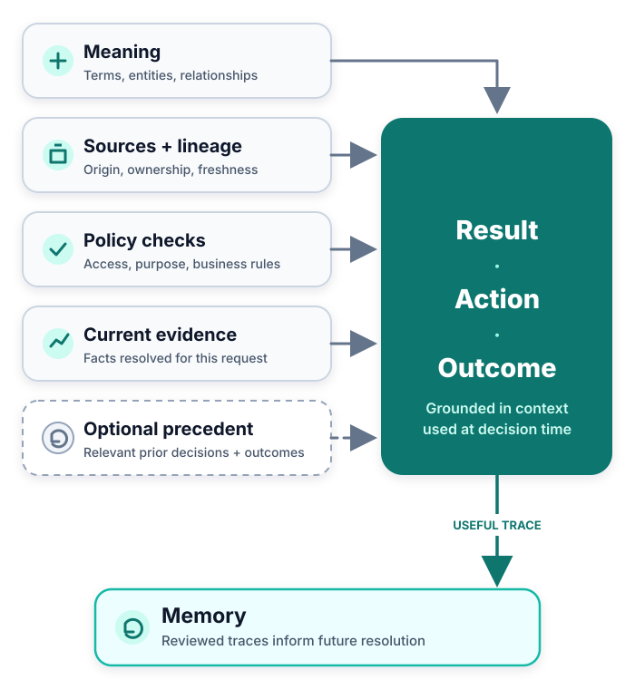
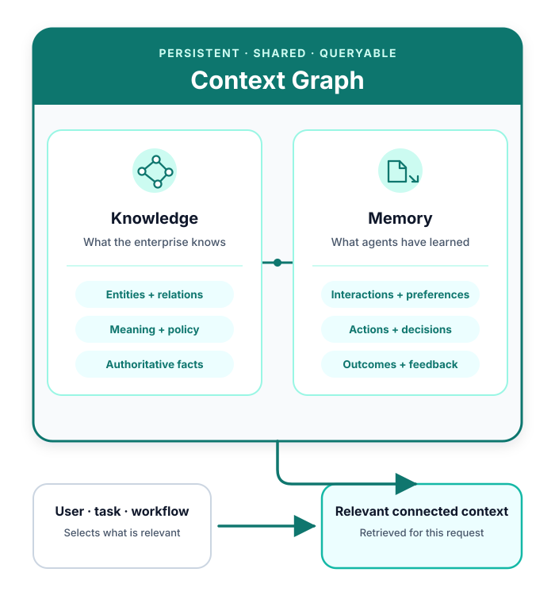

<style>
section {
  --marp-auto-scaling-code: false;
  color: #0f172a;
  font-size: 26px;
  padding: 48px 64px;
}

h1 {
  color: #0f172a;
  font-size: 52px;
}

h2 {
  color: #0f172a;
  font-size: 37px;
  margin-bottom: 18px;
}

h3 {
  color: #0f766e;
  font-size: 26px;
}

table {
  font-size: 21px;
  width: 100%;
}

th {
  background: #e2e8f0;
}

td, th {
  padding: 9px 13px;
}

code {
  font-size: 21px;
}

small {
  color: #64748b;
  font-size: 13px;
}

section.lead {
  background: linear-gradient(135deg, #f8fafc 0%, #ecfeff 100%);
}

section.lead h1 {
  font-size: 58px;
  max-width: 1050px;
}

section.lead h2 {
  color: #0f766e;
  font-size: 29px;
  font-weight: 500;
  max-width: 980px;
}

.callout {
  background: #ecfeff;
  border-left: 6px solid #14b8a6;
  margin-top: 18px;
  padding: 12px 18px;
}

.cols {
  display: grid;
  gap: 30px;
  grid-template-columns: 1fr 1fr;
}

section.knowledge-slide {
  padding: 40px 56px;
}

section.knowledge-slide h2 {
  margin-bottom: 8px;
}

section.knowledge-slide .overview {
  color: #475569;
  font-size: 23px;
  margin: 0 0 12px;
}

section.knowledge-slide .cols {
  align-items: center;
  gap: 24px;
  grid-template-columns: 0.95fr 1.05fr;
}

section.knowledge-slide ul {
  font-size: 21px;
  margin: 4px 0 0;
  padding-left: 24px;
}

section.knowledge-slide li {
  margin: 9px 0;
}

section.knowledge-slide img {
  display: block;
  margin: 0 auto;
}

section.knowledge-slide pre {
  background: #f8fafc;
  border: 2px solid #cbd5e1;
  border-radius: 14px;
  padding: 18px;
}

section.knowledge-slide .callout {
  font-size: 18px;
}

li {
  opacity: 1 !important;
  visibility: visible !important;
}
</style>

<!-- _class: lead -->

# Enterprise Knowledge Layer

---

<!-- _class: knowledge-slide -->

## Ten agents should not create ten versions of the business

<p class="overview">Definitions copied into prompts, tools, and retrieval pipelines drift independently.</p>

<div class="cols">
<div>

- **Private meaning:** Each agent carries its own interpretation of the business.
- **Private routing:** Each agent decides which source or tool is authoritative.
- **Private policy:** Rules are repeated across prompts and integrations.
- **Silent drift:** Every answer can sound reasonable while the enterprise loses a consistent view.

</div>
<div>

### Same term, different meanings

```text
"active customer"

Agent A → signed in within 30 days
Agent B → current paid contract
Agent C → open account balance
```

<div class="callout"><strong>The problem:</strong> Copies change separately, so inconsistency grows with every new agent.</div>

</div>
</div>

<!-- Source: /Users/ryanknight/projects/cloud-integration/knowledge-layer/reference/knowledge-layer-official.md -->

---

<!-- _class: knowledge-slide -->

## A shared Knowledge Layer makes connected context reusable

<p class="overview">Keep meaning in one governed layer so every agent uses consistent definitions, relationships, and rules.</p>

<div class="cols">
<div>

- **One shared layer:** Maintain enterprise knowledge once and reuse it across consumers.
- **Connected context:** Link concepts to data, policies, owners, and processes.
- **Current by design:** Query the layer while work is happening instead of copying it into prompts.
- **Lighter agents:** Keep task logic in the agent and enterprise meaning in the shared layer.

</div>
<div>



</div>
</div>

<!-- Source: /Users/ryanknight/projects/cloud-integration/knowledge-layer/reference/knowledge-layer-official.md -->

---

<!-- _class: knowledge-slide -->

## Enterprise knowledge becomes queryable and actionable

<p class="overview">The Knowledge Layer is shared, governed, executable software that sits between enterprise systems and their consumers.</p>

<div class="cols">
<div>

- **Shared:** Reuse business meaning and operating knowledge across consumers.
- **Governed:** Keep sources, policies, ownership, and accountability explicit.
- **Queryable:** Retrieve the exact context required for each request.
- **Actionable:** Map intent to authoritative sources, permitted tools, and executable queries.

</div>
<div>



</div>
</div>

<!-- Source: /Users/ryanknight/projects/cloud-integration/knowledge-layer/reference/knowledge-layer-official.md -->

---

<!-- _class: knowledge-slide -->

## Three components ground every request

<p class="overview">Combine a governed model of the business, authoritative facts, and experience from previous work.</p>

<div class="cols">
<div>

- **Knowledge Layer ontology:** Defines what things mean, how they connect, where their data lives, what rules apply, and who is accountable.
- **Enterprise data:** Supplies authoritative facts about what is true now.
- **Memory:** Captures previous actions, decisions, outcomes, and reasoning.

<div class="callout"><strong>Ontology holds what is possible; memory holds what is proven.</strong></div>

</div>
<div>



</div>
</div>

<!-- Source: /Users/ryanknight/projects/cloud-integration/knowledge-layer/reference/knowledge-layer-official.md -->

---



---

<!-- _class: knowledge-slide -->

## “Ontology” has a narrow and a broad meaning

<p class="overview">The difference is scope: business meaning alone, or the larger connected model that makes that meaning operational.</p>

<div class="cols">
<div>

### Narrow: Conceptual Map

- Defines what business concepts mean and how they relate.
- Includes concepts such as **Customer**, **Purchase**, and **Product**.
- Does not refer to Salesforce, tables, APIs, or other physical systems.

</div>
<div>

### Broad: Knowledge Layer ontology

- Connects five sub-ontologies: domain, technical, process, policy, and organization.
- Includes descriptions of technical assets and mappings from business concepts to them.
- Does not require the actual enterprise records to be stored in the ontology.

</div>
</div>

<div class="callout"><strong>Both uses are valid:</strong> the Conceptual Map is the meaning; the broader Knowledge Layer ontology also connects that meaning to where the data lives.</div>

<!-- Source: /Users/ryanknight/projects/cloud-integration/knowledge-layer/reference/knowledge-layer-official.md -->

---

<!-- _class: knowledge-slide -->

## The ontology connects meaning to systems and accountability

<p class="overview">Five connected sub-ontologies describe how the business operates.</p>

<div class="cols">
<div>

- **Domain:** Business concepts and relationships.
- **Technical:** Descriptions of systems, sources, and data assets, plus mappings from business concepts to those assets.
- **Process:** Tasks, decisions, workflows, and actions.
- **Policy:** Access rules, conditions, constraints, and permitted actions.
- **Organization:** Roles, ownership, responsibilities, and accountability.

</div>
<div>



</div>
</div>

<!-- Source: /Users/ryanknight/projects/cloud-integration/knowledge-layer/reference/knowledge-layer-official.md -->

---

<!-- _class: knowledge-slide -->

## The semantic map bridges business meaning and enterprise data

<p class="overview">It uses ontology concepts, technical asset descriptions, and mappings to route requests to authoritative source systems.</p>

<div class="cols">
<div>

- **Domain ontology:** Provides concepts such as “Customer,” “Purchase,” and “Product.”
- **Technical ontology:** Describes systems and assets such as Salesforce and its **Opportunity table**.
- **Semantic map:** Connects the two: **PURCHASE → Salesforce.Opportunity**.
- **Enterprise data:** Supplies the actual opportunity records from Salesforce.

<div class="callout"><strong>The semantic map tells agents what a request means, where to find the data, and how the two connect.</strong></div>

</div>
<div>



</div>
</div>

<!-- Source: /Users/ryanknight/projects/cloud-integration/knowledge-layer/reference/knowledge-layer-official.md -->

---

## Graph links connect business terms to tables and columns



- **Business meaning:** “Order amount” maps to `orders.total_amount`.
- **Known relationship:** `orders.customer_id` references `customers.id`.

<div class="callout"><strong>Why a graph:</strong> Stored relationships connect the meaning, the field, and the join in one map.</div>

<!--
This illustrative path makes the graph concrete. A glossary term is
linked to a column. That column belongs to a table. Another column on
the same table carries a foreign-key reference to the customer table.

The term mapping and foreign key must be loaded from a source or curated.
They are stored facts for retrieval to follow. A missing relationship
requires more source information or review.

Search locates relevant entities and graph traversal supplies related
details.
-->

---

<!-- _class: knowledge-slide -->

## Every request becomes a governed action plan

<p class="overview">The layer grounds the request. The agent or application executes the plan.</p>

<div class="cols">
<div>

- **Interpret intent:** Resolve the business meaning of the request.
- **Assemble context:** Select authoritative sources and relationships.
- **Route queries and tools:** Translate concepts into calls against AWS systems.
- **Enforce policy:** Apply access and action rules during resolution.
- **Explain and learn:** Return evidence and lineage, then retain useful outcomes.

</div>
<div>



</div>
</div>

<!-- Source: /Users/ryanknight/projects/cloud-integration/knowledge-layer/reference/knowledge-layer-official.md -->

---

<!-- _class: knowledge-slide -->

## Every governed action leaves an inspectable decision trace

<p class="overview">The trace links a result to the context that produced it.</p>

<div class="cols">
<div>

- **Meaning:** Concepts resolved for the request.
- **Sources:** Authoritative systems, queries, and lineage.
- **Policy:** Access and action checks applied.
- **Evidence:** Facts supporting the current result.
- **Precedent:** Prior decisions, only when they influenced the result.
- **Outcome:** The result or action, observed outcome, and feedback.

</div>
<div>



</div>
</div>

<div class="callout"><strong>Decision traces explain the current result.</strong> Memory makes useful traces available to future requests.</div>

<!-- Source: /Users/ryanknight/projects/cloud-integration/knowledge-layer/reference/knowledge-layer-official.md -->

---

<!-- _class: knowledge-slide -->

## A Context Graph connects knowledge and memory

<p class="overview">It links enterprise knowledge and agent memory in one persistent, queryable graph.</p>

<div class="cols">
<div>

- **Knowledge:** Entities, relationships, business meaning, policies, and authoritative facts.
- **Memory:** Previous interactions, actions, decisions, and outcomes that agents can reuse.

<div class="callout"><strong>Each request retrieves relevant context and adds new memory.</strong> The graph persists and compounds across requests.</div>

</div>
<div>



</div>
</div>

<!-- Sources: https://neo4j.com/blog/agentic-ai/what-is-context-graph/, https://neo4j.com/blog/agentic-ai/context-graph-ai-agent-memory/, and /Users/ryanknight/projects/cloud-integration/knowledge-layer/reference/knowledge-layer-official.md -->
