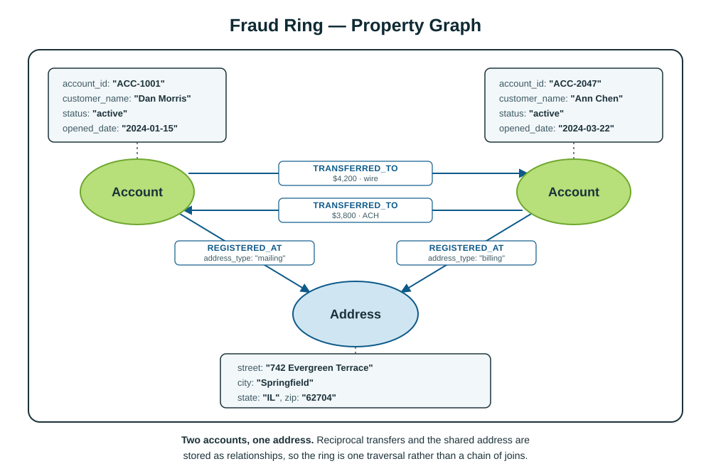

<style>
section {
  --marp-auto-scaling-code: false;
  color: #0f172a;
  font-size: 26px;
  padding: 48px 64px;
}

h1 {
  color: #0f172a;
  font-size: 58px;
}

h2 {
  color: #0f172a;
  font-size: 37px;
  margin-bottom: 18px;
}

code {
  font-size: 21px;
}

table {
  font-size: 20px;
  width: 100%;
}

th {
  background: #e2e8f0;
}

td, th {
  padding: 10px 13px;
}

section.lead {
  background: linear-gradient(135deg, #f8fafc 0%, #ecfeff 100%);
}

section.lead h1 {
  max-width: 1050px;
}

section.lead h2 {
  color: #0f766e;
  font-size: 29px;
  font-weight: 500;
  max-width: 980px;
}

.callout {
  background: #ecfeff;
  border-left: 6px solid #14b8a6;
  margin-top: 18px;
  padding: 12px 18px;
}

.cols {
  display: grid;
  gap: 32px;
  grid-template-columns: 1fr 1fr;
}

section.compact {
  font-size: 23px;
}

section.compact li {
  margin: 9px 0;
}

section.compact .callout {
  font-size: 21px;
}

section.data-sources-overview {
  padding: 24px 64px;
}

section.data-sources-overview h2 {
  margin: 0 0 8px;
}

section.data-sources-overview p {
  margin: 0;
  text-align: center;
}

section.data-sources-overview .callout {
  font-size: 22px;
  margin-top: 8px;
  padding: 8px 18px;
}

section.fraud-overview {
  padding: 24px 48px;
}

section.fraud-overview h2 {
  margin: 0 0 8px;
}

section.fraud-overview p {
  margin: 0;
  text-align: center;
}

section.workload-comparison {
  font-size: 18px;
  line-height: 1.25;
  padding: 32px 52px;
}

section.workload-comparison h2 {
  font-size: 35px;
  margin: 0 0 14px;
}

section.workload-comparison h3 {
  color: #0f766e;
  font-size: 22px;
  margin: 0 0 8px;
}

section.workload-comparison ul {
  margin: 0;
  padding-left: 22px;
}

section.workload-comparison li {
  margin: 7px 0;
}

section.investigation-flow {
  font-size: 23px;
}

section.investigation-flow li {
  margin: 13px 0;
}

section.investigation-flow .callout {
  font-size: 21px;
}

li {
  opacity: 1 !important;
  visibility: visible !important;
}
</style>

<!-- _class: lead -->

# Fraud Data Architecture

## What data lives where across AWS and Neo4j

---

## A fraud ring shows why an investigation needs both views

One transfer can look ordinary. Its connections can reveal coordinated activity.

```text
Account ACC-1001 ⇄ Account ACC-2047
         ↘         ↙
   742 Evergreen Terrace
```

- **Shared identity signal:** Accounts belonging to different customers use the same address.
- **Reciprocal movement:** A $4,200 wire and a $3,800 ACH transfer move in opposite directions.
- **Corroborating evidence:** Devices, phone numbers, merchants, and timing strengthen or weaken the case.

<div class="callout"><strong>Investigation question:</strong> Do the shared address and reciprocal transfers indicate ordinary household activity or coordinated fraud?</div>

---

<!-- _class: compact -->

## Why a knowledge graph fits fraud investigations

- **See the full network:** Connect customers, accounts, devices, addresses, merchants, alerts, and cases in one view.
- **Find hidden relationships:** Reveal shared identifiers and indirect connections that isolated transactions do not show.
- **Follow the money:** Trace transfers across any number of accounts without knowing the chain length in advance.
- **Explain why a pattern matters:** Link suspicious activity to known fraud patterns, policies, KYC documents, and prior cases.
- **Adapt as schemes change:** Add new entities and connections without rebuilding a rigid relational model.

<div class="callout"><strong>Investigator value:</strong> Move from isolated transactions to an evidence-backed view of who is connected, how money moved, and why the pattern matters.</div>

---

<!-- _class: fraud-overview -->

## The fraud ring as a property graph



---

<!-- _class: compact -->

## What the graph enables for investigators

| Investigation question | How the graph helps |
| --- | --- |
| **Which accounts share a device or address?** | Traverse identity relationships across customers and accounts. |
| **Does money return to its starting point?** | Detect circular transfer paths. |
| **What is exposed through a compromised account?** | Follow downstream accounts, merchants, and counterparties. |
| **Which prior cases resemble this pattern?** | Connect findings to typologies, policies, evidence, and outcomes. |

<div class="callout"><strong>Graph advantage:</strong> Relationship questions become traversals instead of expanding join chains.</div>

---

<!-- _class: workload-comparison -->

## AWS analyzes activity; Neo4j reveals connections

<div class="cols">
<div>

### AWS analytics: transaction activity at scale

- **Aggregation:** Athena calculates totals, averages, min/max, and standard deviation for amounts and risk scores.
- **Time-series trends:** SQL produces hourly, daily, and monthly rollups by account, merchant, or channel.
- **Filtering and ranking:** SQL finds transactions above P95 and accounts generating the most alerts.
- **Key-based joins:** Fixed joins connect transactions to accounts, customers, and merchants.
- **Dashboards:** Amazon Quick Sight presents volume, alerts, exposure, losses, and case throughput.

</div>
<div>

### Neo4j Cypher: how the fraud network is connected

- **Multi-hop traversal:** Follow funds across accounts, devices, addresses, and merchants.
- **Pattern search:** Identify circular transfers and shared identity signals.
- **Path and reachability:** Find everything downstream of a compromised account.
- **Variable depth:** Investigate chains whose length is unknown in advance.
- **GraphRAG:** Link entities to KYC documents, typologies, policies, and prior cases.

</div>
</div>

<!-- Sources: https://docs.aws.amazon.com/athena/latest/ug/functions.html and https://docs.aws.amazon.com/quick/latest/userguide/what-is.html -->

---

<!-- _class: data-sources-overview -->

## A dual data architecture puts each workload in the right place


<div class="callout"><strong>Two query paths:</strong> Athena queries transaction evidence in S3 Tables; Cypher traverses connected context in Neo4j.</div>

<!-- Sources: https://docs.aws.amazon.com/AmazonS3/latest/userguide/s3-tables.html and https://docs.aws.amazon.com/athena/latest/ug/gdc-register-s3-table-bucket-cat.html -->

---

<!-- _class: investigation-flow -->

## One investigation uses both data paths

1. **Detect in AWS:** SQL in Athena flags unusual transactions, accounts, or merchants in governed S3 data.
2. **Expand in Neo4j:** The investigation starts from those identifiers and traverses the connected network.
3. **Find the pattern:** Cypher detects shared identities, circular transfers, and exposed entities.
4. **Explain the finding:** Policies, fraud typologies, KYC documents, and prior cases establish significance.
5. **Return the result:** Graph findings flow back to AWS for analytics, reporting, and case workflows.

<div class="callout"><strong>Combined outcome:</strong> AWS supplies authoritative activity; Neo4j supplies the connected context needed to investigate it.</div>
