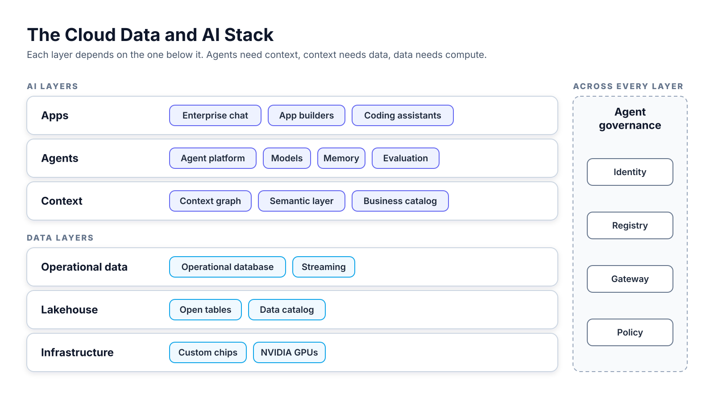
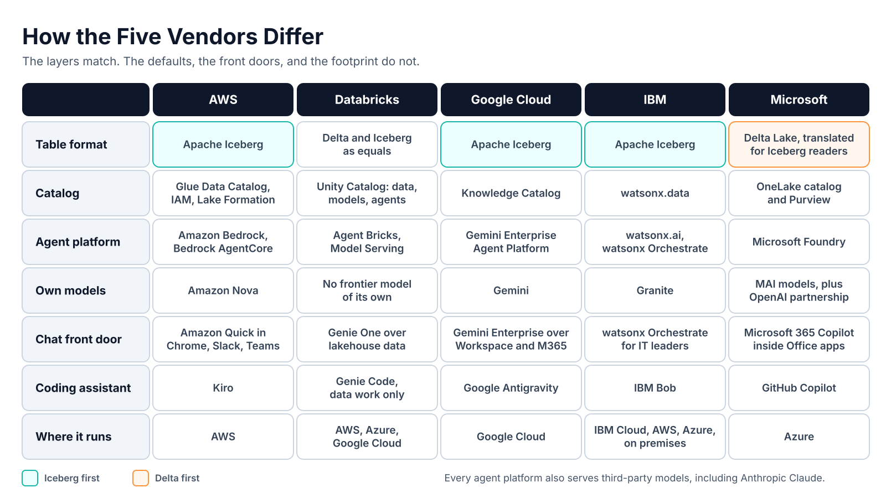
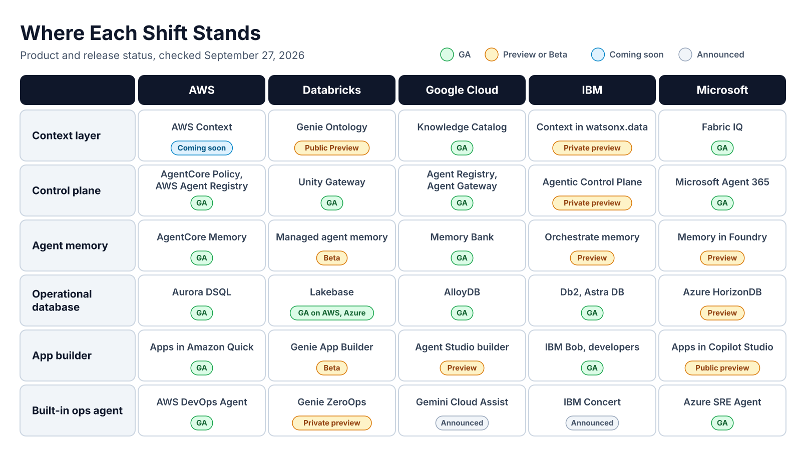
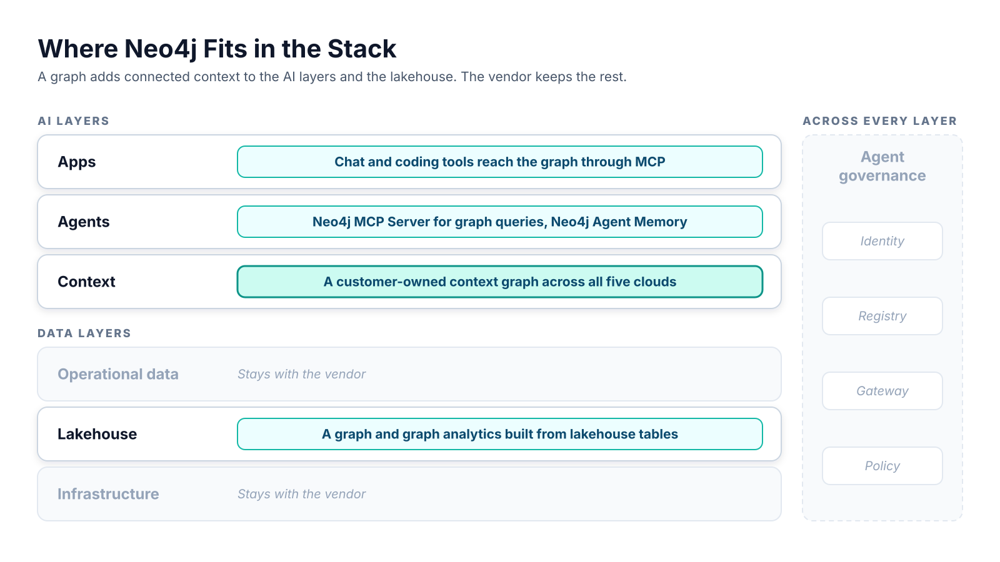

# Cloud Data and AI Stacks

AWS, Databricks, Google Cloud, IBM, and Microsoft

<!--
Overview talk. The arc runs from the stack all five vendors now sell, through
where the vendors differ, into the shifts that show up across all of them in
2026, and ends with where Neo4j fits.

Product names and status were checked against vendor pages on September 27,
2026. Graph engine facts were checked on September 29, 2026. Names changed
often in 2025 and 2026, so check again before reuse.

Source material: cloud-integration/hyperscaler.md.
-->

---

## The Shared Stack

Five vendors, one stack shape, different product names.

---

## Five Vendors Sell the Same Stack

- **Same layers:** Every vendor sells infrastructure, a lakehouse, operational data, context, agents, and apps.
- **Different names:** The product names differ, and many changed in 2025 and 2026.
- **Real differences:** The vendors differ most in table format, catalog, model choice, and where their products run.
- **Not only clouds:** Databricks runs on other vendors' clouds. IBM runs on its own cloud, other clouds, and on premises.

<!--
Databricks and IBM are not hyperscalers in the strict sense, but they follow
the same stack shape, so the comparison includes them.
-->

---

<!--
Six layers in two groups. The three data layers store and run the company's
data. The three AI layers turn that data into answers and actions. Agent
governance runs across every layer.

Vendors now also build agents into their own services, such as an agent that
finds the cause of an outage. Each built-in agent belongs to the layer of the
service it runs in, so the stack keeps its six layers.
-->

---

## Data Layers Store and Run the Company's Data

- **Infrastructure:** Custom chips and NVIDIA GPUs train and run the models.
- **Lakehouse:** Open tables in object storage hold the data once. Many query engines read the same tables.
- **Operational data:** Databases and streams hold the present. The lakehouse holds the history.
- **Graph engine:** Operational graphs sit next to the databases. Analytical graphs sit on the lakehouse.

<!--
An operational database stores the current state that an app changes many
times per second, such as an order or an agent session. A stream carries
events as they happen.

A graph engine stores entities and the relationships between them. It follows
a chain of relationships in one query. Spanner Graph and Amazon Neptune
Database are operational graphs. BigQuery Graph, Graph in Microsoft Fabric,
and Amazon Neptune Analytics are analytical graphs.
-->

---

## AI Layers Turn Data into Answers and Actions

- **Context:** The context layer stores what data means: metrics, business terms, and relationships.
- **Agents and models:** The agent platform hosts models and connects agents to tools and memory.
- **Apps:** Enterprise chat, coding assistants, and app builders put agents in front of people.
- **Agent governance:** Identity, registry, gateway, and policy span every layer.

<!--
Agents read the context layer before they query, so they pick the right table
and the right meaning. Vendors call it a context graph, an ontology, or a
semantic layer. Vendors call the governance pieces an agent control plane.
-->

---

## Where the Vendors Differ

Same layers, different defaults.

---

## Four Questions Place Any Vendor on the Stack

1. **Find the data:** Which table format and catalog hold the data?
2. **Find the meaning:** Where do business definitions and relationships live?
3. **Find the agents:** Which platform builds agents, and which models does it offer?
4. **Find the people:** Which chat and coding tools do employees open every day?

<!--
Ask them in order. The next grid answers the data, agents, and people
questions for each vendor. The meaning question is the context layer, which
gets its own slides in the next section. Who governs the agents is the control
plane, also in the next section.

For the people question, the usual answers are Office, Slack, a browser, or an
IDE.
-->

---

<!--
The rows follow the four questions: data first, then agents, then people,
then where it all runs.

- Table format: AWS, Google Cloud, and IBM default to Apache Iceberg.
  Microsoft defaults to Delta Lake and translates the metadata for outside
  Iceberg readers. Databricks manages both as equals.
- Catalog: Unity Catalog is the only one that governs data, models, agents,
  and MCP tools in one place. Google's Knowledge Catalog can federate to AWS
  Glue, Unity Catalog, and Snowflake, in Preview.
- Agent platform: Gemini Enterprise Agent Platform replaced Vertex AI on
  April 22, 2026. Microsoft Foundry puts agents, models, and tools in one
  Azure resource with one set of access controls.
- Models: Microsoft Foundry lists more than 10,000 models. Google Model
  Garden lists more than 200.
- Chat: Microsoft 365 Copilot lives inside the Office apps most companies
  already use. Gemini Enterprise also connects to Microsoft 365. watsonx
  Orchestrate targets IT leaders more than end users.
- Coding: Kiro, Antigravity, IBM Bob, and GitHub Copilot help developers build
  any software. Genie Code works only inside Databricks. It reads Unity
  Catalog tables, columns, and lineage before it writes code.
- Where it runs: AWS, Google Cloud, and Microsoft run on their own cloud.
  Databricks is multi-cloud. IBM is the only vendor here with an on-premises
  lakehouse edition.
-->

---

## Table Format Matters Less, the Catalog Matters More

- **Iceberg first:** AWS, Google Cloud, and IBM store data in Apache Iceberg by default.
- **Delta first:** Microsoft stores data in Delta Lake and translates metadata for Iceberg readers.
- **Converging:** Databricks is moving Delta Lake 5.0 onto Iceberg's metadata design.
- **Common ground:** Every vendor now reads Iceberg, so format choice locks customers in less.

**The catalog now decides** who can write and govern the tables.

<!--
The last point is our inference from the vendor pages. Delta Lake 5.0 was
presented at Data + AI Summit 2026. It adopts the Iceberg v4 metadata tree,
so Delta and Iceberg clients will read and write one on-disk format. It has
not shipped yet: the Databricks Iceberg docs still list Iceberg v1 to v3.

OneLake translation limits: it writes Iceberg V2 only, handles Parquet only,
and skips tables with 5,000 or more commits.

Bridge to the next section: the catalog is also growing up. It no longer just
lists tables. Every vendor is turning it into a context layer that stores what
the data means.
-->

---

## Shifts Across All Five Vendors

The same moves show up at every vendor in 2026.

---

<!--
One view of where each shift stands. The next slides start with MCP, the
protocol most of these shifts depend on. Then they follow the grid's rows from
top to bottom.

"Announced" means the vendor announced the product, but the source does not
state a release status. Google rebuilt Gemini Cloud Assist around proactive
agents at Next '26 on April 22, 2026. IBM announced IBM Concert on May 5,
2026.

The graph engine row counts native engines only. Databricks offers the
GraphFrames library on Spark. IBM sells DataStax Graph in DataStax Enterprise.
-->

---

## MCP and A2A Connect Agents Across Platforms

- **MCP:** The Model Context Protocol lets an agent call an outside tool through one interface.
- **A2A:** The Agent2Agent protocol lets one agent call another, even on another platform.
- **MCP support:** All five vendors support MCP.
- **A2A support:** AWS, Google Cloud, IBM, and Microsoft support A2A.

**One MCP server** plugs into all five agent platforms.

<!--
AgentCore Gateway turns APIs and Lambda functions into MCP tools. Databricks
offers managed MCP servers and a GA Genie One MCP server. Google runs managed
MCP servers for its own services. watsonx Orchestrate and Foundry agents both
call MCP servers.

Google supports A2A 1.0, and IBM supports 0.3.0. Databricks documents A2A in
a community blog post.
-->

---

## Every Vendor Is Building a Context Graph

- **Problem:** Agents give wrong answers when they pick the wrong table or meaning.
- **AWS:** AWS Context maps existing data into a knowledge graph for agents.
- **Databricks:** Genie Ontology is a "living context graph" behind Genie One and Genie Code.
- **Google Cloud:** Knowledge Catalog builds a "dynamic context graph" from all data.
- **Microsoft:** Fabric IQ holds an ontology of entities, relationships, and rules.
- **IBM:** Context in watsonx.data is a federated context layer.

<!--
An example of a wrong meaning is the term "revenue." AWS, Databricks, Google
Cloud, and Microsoft all describe their context layer as a graph. Only
Microsoft documents the graph engine behind it: Graph in Fabric stores the
Fabric IQ instance graph.

- AWS Context is coming soon. Pieces available now: Glue Data Catalog
  business context is in preview, and S3 annotations are GA.
- Genie Ontology is in Public Preview and on by default since August 6, 2026.
- Knowledge Catalog is GA. Its Context API is in preview.
- The Fabric IQ workload is GA. The ontology item is in preview. Work IQ and
  Foundry IQ round out Microsoft's context layer.
- Context in watsonx.data entered private preview on May 5, 2026.
- Snowflake Horizon Context competes for the same layer.
-->

---

## Every Cloud Now Ships a Graph Engine

- **Google Cloud:** Spanner Graph is the operational graph. BigQuery Graph is the analytical graph. Both are GA.
- **Microsoft:** Graph in Fabric is the analytical graph over OneLake. It reached GA on June 2, 2026.
- **AWS:** Neptune Database is the operational graph. Neptune Analytics is the analytical graph.
- **No native engine:** Databricks and IBM ship no graph engine in their lakehouse.
- **GQL:** Google and Microsoft query with ISO GQL. AWS queries with Gremlin, openCypher, and SPARQL.

**The graph model is now standard.** Graph deals now open with "why a separate graph database?"

<!--
This is the most important slide for a Neo4j audience.

A context graph records what data means. A graph engine stores the entities
and relationships themselves. It runs traversals and graph algorithms over
them.

- Spanner Graph has been GA since December 2, 2024. BigQuery Graph reached GA
  on August 31, 2026. Google says the two share one graph schema and query
  language.
- Graph in Fabric stores the instance graph of the Fabric IQ ontology.
  Microsoft says the ontology "declares what connects and why."
- AWS Context and the Amazon Quick knowledge graph name no graph store. The
  open-source Context Ontology Accelerator uses Neptune.
- GQL is ISO/IEC 39075:2024. Neptune supports neither GQL nor SQL/PGQ. Neo4j
  Cypher 25 supports most mandatory GQL features.

Each engine lives inside one vendor's platform and serves that vendor's
agents. That validates the graph model. It also means the difference is now a
graph the customer owns, queries with Cypher, and uses across every cloud.

The "why a separate graph database" point is our inference from the vendor
pages.
-->

---

## Context Graphs Share Four Traits

- **Written and learned:** Teams write some definitions by hand. The layer learns others by watching queries.
- **Permissions:** The layer answers with the caller's own permissions.
- **MCP access:** Agents reach the layer through MCP tools.
- **Open standard:** Apache Ossie specifies semantic layers and ontologies.

**Each context graph lives inside its vendor's platform.** A customer on two clouds builds two.

<!--
AWS Context learns join paths from agent queries. Genie Ontology ranks
snippets partly by how often they are used. AWS Context inherits IAM and Lake
Formation permissions. Genie Ontology gates every snippet by Unity Catalog
permissions.

MCP entry points: AWS Context MCP tools, the Genie One MCP server, and the
Foundry IQ MCP server.

Apache Ossie was called Open Semantic Interchange until it entered the Apache
Incubator. Snowflake founded it, and AWS and Databricks joined.

The platform-bound point is our inference from the vendor pages.
-->

---

## Agents Get a Control Plane

- **Identity:** Each agent gets its own identity.
- **Registry:** A registry lists every agent, MCP server, and tool.
- **Gateway:** A gateway routes all agent traffic.
- **Policy:** A policy check runs on every tool call.
- **Cross-cloud reach:** Microsoft and IBM control planes now discover agents on other clouds.

**The control plane holder** sees every agent and every tool call.

<!--
- AWS: AgentCore Identity, AgentCore Gateway, Policy in AgentCore, and AWS
  Agent Registry are all GA.
- Databricks: Unity Gateway reached GA on August 4, 2026.
- Google Cloud: Agent Identity, Agent Registry, and Agent Gateway are GA.
- IBM: The watsonx Orchestrate Agentic Control Plane is in private preview.
- Microsoft: Microsoft Agent 365 reached GA on May 1, 2026. Entra Agent ID
  gives each agent an Entra identity.

Microsoft Agent 365 syncs registries with Amazon Bedrock and Google Cloud in
public preview. watsonx Orchestrate discovers agents in Google's agent
platform and Microsoft Foundry.
-->

---

## Memory and Evaluation Become Managed Services

- **Agent memory:** Memory stores what an agent learned across sessions.
- **Memory status:** AWS and Google Cloud memory are GA. The other three are in Beta or preview.
- **Evaluation:** Evaluation scores agent answers against test cases before and after release.
- **Evaluation status:** AWS, Google Cloud, and Microsoft evaluation is GA.

**The memory layer is still open** at three of five vendors.

<!--
Memory examples: user preferences and past decisions. AgentCore Memory has
been GA since October 2025. Databricks managed agent memory is in Beta and
stores long-term memory in Lakebase. Google Memory Bank features reached GA
in June and July 2026.

Databricks evaluates agents with MLflow 3. IBM monitors agents with
watsonx.governance.
-->

---

## Operational Data Moves Next to the Lakehouse

- **Why:** Agents and AI apps need a database they can write to many times per second.
- **Postgres:** Databricks, AWS, Google Cloud, and Microsoft each offer managed Postgres.
- **Vectors:** Every vendor's operational database now adds vector search.
- **Streams:** Streams now feed the context layer as well as the lakehouse.

**Vector search alone** no longer sets a product apart.

<!--
Postgres products: Databricks Lakebase, Amazon Aurora DSQL and Aurora
PostgreSQL, AlloyDB for PostgreSQL, and Azure HorizonDB. IBM offers Db2 with
DiskANN vector indexing and DataStax Astra DB.

IBM completed its purchase of Confluent on March 17, 2026. IBM pairs the
Confluent Real-Time Context Engine with Context in watsonx.data.

The vector point is our inference from the vendor pages.
-->

---

## App Builders and Custom Chips Round Out the Stack

- **App builders:** Business users describe an app, and the platform builds it on company data.
- **App builder status:** Apps in Amazon Quick is GA. The others are in Beta or preview.
- **Custom chips:** AWS, Google Cloud, Microsoft, and IBM build their own chips.
- **NVIDIA too:** The same four also rent NVIDIA GPUs next to their own chips.

<!--
Apps in Amazon Quick reached GA on September 1, 2026. Genie App Builder is in
Beta. Google's Agent Studio app builder and Apps in Copilot Studio are in
preview. IBM's closest product is IBM Bob, which targets developers.

Chips: Trainium3, Inferentia2, and Graviton5 at AWS. Ironwood TPU and Axion at
Google, with TPU 8t and 8i coming soon. Maia 200 and Cobalt 200 at Microsoft.
Telum II and the Spyre Accelerator at IBM. Databricks runs on the hardware of
its host clouds.
-->

---

## Agents Now Run Inside the Services

- **First wave:** Built-in agents handle incidents, failed pipelines, and cost spikes.
- **Turned on, not built:** The customer turns the agent on instead of building one.
- **Examples:** AWS DevOps Agent, Azure SRE Agent, Gemini Cloud Assist, Genie ZeroOps, and IBM Concert.
- **Needs a map:** Each agent needs a map of how services, code, and deployments connect.

**AWS DevOps Agent** builds an application topology. **Genie ZeroOps** reads Unity Catalog lineage.

<!--
AWS DevOps Agent reached GA on March 31, 2026. It covers AWS, Azure, and
on-premises systems, and reaches on-premises tools through MCP. Azure SRE
Agent reached GA in March 2026 and can restart, scale, or roll back within
policy guardrails. Genie ZeroOps is in private preview and tests a fix in a
sandbox before a human applies it.

Built-in agents will likely spread from operations to other routine tasks.
That point is our inference from the vendor pages.

Bridge to the Neo4j section: a map of how things connect is a graph.
-->

---

## Where Neo4j Fits

A graph adds connected context to each layer.

---

<!--
The same stack from the start of the deck. Neo4j adds a role on four layers:
the context layer, the agent layer, the apps layer, and the lakehouse. The
vendor keeps the chips, the operational databases, and agent governance.

AgentCore Gateway, Databricks Agent Bricks, and IBM watsonx Orchestrate all
connect to MCP servers. The Neo4j Agent Memory library ships an integration
for Amazon Bedrock AgentCore.
-->

---

## A Customer-Owned Graph Works Across Every Vendor

- **One graph, every cloud:** A customer on two clouds keeps one context graph instead of two.
- **Traceable answers:** The graph returns multi-hop answers that trace back to their source.
- **A map for built-in agents:** Built-in agents need a map of how services connect. A graph is that map.
- **Reached through MCP:** Every agent platform reaches the graph through the Neo4j MCP Server.
- **Built from the lakehouse:** The lakehouse keeps the tables. The graph adds the links.
- **Graph depth:** Graph Data Science runs more than 65 algorithms. Cypher 25 supports most mandatory GQL features.

<!--
Each vendor builds a context graph inside its own platform. Neo4j adds one
that the customer owns, queries with Cypher, and uses across every cloud.

Graph deals on Google Cloud and Microsoft will open with "why a separate graph
database?" Neo4j answers with depth and reach. Teams that learn GQL on Google
Cloud or Microsoft can carry those skills to Neo4j.

- Neo4j Graph Intelligence for Microsoft Fabric reached GA on October 23,
  2025. It brings Graph Data Science algorithms into Fabric, so it adds to
  Graph in Fabric on Microsoft accounts.
- Neo4j Graph Analytics runs inside Snowflake as a Native App.
- Neo4j Aura is listed on AWS Marketplace and Google Cloud Marketplace.
  AuraDB Professional is listed on Microsoft Marketplace.

The graph stores entities and the relationships between them, so an agent can
follow a chain of links in one query.

The built-in agents point is our inference. AWS DevOps Agent builds an
application topology, and Genie ZeroOps reads lineage. Both are maps of
connected things, which is what a graph stores.
-->

---

## Takeaways

- **One stack, five vendors:** The layers match. The names, formats, and catalogs differ.
- **Iceberg is common ground:** Format locks customers in less. The catalog decides more.
- **Every cloud now ships a graph engine:** Each one stays inside its own platform.
- **MCP is the shared interface:** One MCP server reaches every agent platform.
- **Memory is still open:** Agent memory is in Beta or preview at three of five vendors.
- **Neo4j spans the clouds:** A customer-owned graph serves agents on any vendor.

---

## AWS Main Services

The main AWS products behind each layer of the stack.

<!--
A closer look at one vendor. The slides follow the stack from the bottom up:
data first, then models, agents, and apps.

Source material: cloud-integration/hyperscaler.md,
cloud-integration/aws/current/briefing/aws-briefing-review.md, and
cloud-integration/aws/current/reference/aws-ecosystem-summary.md.
-->

---

## AWS Has a Product on Every Layer

- **Infrastructure:** Trainium3, Inferentia2, and Graviton5 chips run next to NVIDIA GPUs.
- **Lakehouse:** Amazon S3 Tables holds the data. The AWS Glue Data Catalog lists it.
- **Operational data:** Amazon Aurora and Amazon Neptune hold the present. MSK and Kinesis carry streams.
- **Context:** AWS Context maps existing data into a knowledge graph.
- **Agents and models:** Amazon Bedrock serves models. Amazon Bedrock AgentCore runs agents.
- **Apps:** Amazon Quick serves employees. Kiro serves developers.

<!--
Agent governance runs across every layer. At AWS it is AgentCore Identity,
AgentCore Gateway, Policy in AgentCore, and AWS Agent Registry.

AWS Context is coming soon. Glue Data Catalog business context is in preview,
and S3 annotations are GA. The open-source Context Ontology Accelerator uses
Neptune as its graph store. AWS does not say the managed service runs on
Neptune.

Neptune Database is the operational graph. Neptune Analytics is the analytical
graph on the lakehouse.
-->

---

## AWS Stores Data Once in Iceberg Tables on S3

- **S3 Tables:** Amazon S3 Tables stores data as managed Apache Iceberg tables.
- **Many engines:** Athena, Redshift, EMR, Spark, and Snowflake read the same tables.
- **Catalog:** The Glue Data Catalog lists every table. IAM and Lake Formation control access.
- **Postgres:** Aurora DSQL and Aurora PostgreSQL hold app state. pgvector adds vector search.
- **Streams:** Amazon MSK runs managed Kafka. Kinesis Data Streams runs serverless streams.
- **Graph:** Neptune Database runs the operational graph. Neptune Analytics runs the analytical graph.

<!--
S3 Tables exposes the Iceberg REST Catalog API, so Trino and Flink can also
read and write the tables.

The lakehouse architecture of Amazon SageMaker was called SageMaker Lakehouse
until 2026. It joins S3 data lakes and Redshift warehouses into one copy of
the data. SageMaker Unified Studio is the browser workspace over all of it.

Aurora DSQL is a serverless, distributed, PostgreSQL-compatible database.
Aurora PostgreSQL express configuration creates a serverless database in
seconds.

Amazon Neptune has two products. Neptune Database is a serverless graph
database for operational workloads such as fraud alerts and Customer 360. It
supports openCypher, Gremlin, and SPARQL, but has no graph algorithms or
vector search. Neptune Analytics is an in-memory engine with more than 25
graph algorithms and vector search. It loads a point-in-time copy from
Neptune Database or S3. Neither product supports GQL or SQL/PGQ.
-->

---

## Amazon Bedrock Serves Models Through One API

- **Models:** Bedrock serves models from 18 providers, including Anthropic, Amazon, Meta, and OpenAI.
- **Knowledge Bases:** Knowledge Bases run managed RAG and cite their sources.
- **Bedrock Agents:** Bedrock Agents runs a managed agent loop over Lambda or OpenAPI actions.
- **Guardrails:** Guardrails filter content, topics, and personal data on any model call.
- **Pricing:** Bedrock bills on-demand use per token.

<!--
Amazon Nova is Amazon's own model family. Bedrock also offers fine-tuning,
distillation, Flows, Data Automation, model evaluation, and prompt management.

Knowledge Bases chunk, embed, and index documents. They store vectors in
OpenSearch, S3 Vectors, Aurora PostgreSQL, Pinecone, Redis, or MongoDB Atlas.
Knowledge Bases GraphRAG reached GA on March 7, 2025, and builds its graph in
Neptune Analytics. S3 is the only data source, with 1,000 files per source.
Customers cannot define their own graph structure. It runs in 7 Regions.

Bedrock Agents is configuration over code: Bedrock runs the reasoning loop.
AgentCore, on the next slide, is for teams that write their own agent code.
-->

---

## AgentCore Runs Agents Built with Any Framework

- **Any framework:** AgentCore runs agents built with Strands, LangGraph, CrewAI, and others.
- **Host:** Runtime hosts agents in isolated microVMs. Harness runs a managed agent loop.
- **Connect:** Gateway turns APIs, Lambda functions, and MCP servers into MCP tools.
- **Remember:** Memory keeps session context and long-term facts.
- **Govern:** Identity, Policy, and Registry control who acts and which tools they call.
- **Measure:** Observability traces every step. Evaluations scores the answers.

<!--
AgentCore has 13 core services. The others are Code Interpreter, Browser,
Optimization, and Payments. Confirm the status of Payments and the
Optimization Insights feature before citing them to a customer.

- Runtime sessions last up to 8 hours.
- Gateway ships built-in templates for 16 providers, such as Salesforce,
  Jira, and Slack.
- Memory extracts long-term memory with four strategies.
- Identity has 24 built-in OAuth providers.
- Policy checks every tool call through Gateway. Teams write policies in
  natural language or Dogwood, which is compatible with Cedar.

AgentCore works with any model, in or outside Bedrock. This repo runs the
Neo4j MCP Server on AgentCore Runtime behind AgentCore Gateway.
-->

---

## Amazon Quick Puts Agents in Front of Employees

- **Chat:** Amazon Quick answers questions and acts on company data and apps.
- **Features:** Quick bundles BI, search, research, flows, automation, and app building.
- **Reach:** Quick runs inside Chrome, Slack, Microsoft Teams, and Microsoft 365.
- **MCP client:** Quick connects to outside MCP servers as tools.

<!--
The six Quick features are Quick Sight, Quick Index, Quick Research, Quick
Flows, Quick Automate, and Apps in Amazon Quick. Apps in Amazon Quick
reached GA on September 1, 2026. Users can sign up with an email address and
no AWS account.

Renames: Amazon QuickSight and Amazon Quick Suite became Amazon Quick. The BI
feature is now Quick Sight.

AWS publishes a pattern for connecting an MCP server on AgentCore Runtime to
Amazon Quick. Using it with the Neo4j MCP Server is our inference. Neither
AWS nor Neo4j has published that pairing.
-->

---

## Kiro Brings Spec-Driven Development to the IDE

- **Agentic IDE:** The Kiro IDE is based on Code OSS and imports VS Code settings.
- **Specs:** Kiro turns a prompt into requirements, a design, and a task list.
- **Parallel agents:** Agents build the tasks on the laptop or in the cloud.
- **Correctness:** Property-based tests catch edge cases that unit tests miss.
- **Every surface:** Kiro also runs as a CLI, a web app, and a mobile app.
- **Open standards:** Kiro supports MCP, AGENTS.md, Agent Skills, and the Agent Client Protocol.

<!--
Kiro calls this agentic engineering, as opposed to vibe coding. A spec records
the requirements and design decisions before any code exists, so the team can
review them. Kiro checks requirements for contradictions and gaps before it
writes code. Property-based testing runs in the Kiro IDE only.

- Hooks run tasks automatically, such as updating tests or docs on save.
- Steering files give the agent project rules. They carry across every Kiro
  surface.
- Powers pull context from tools like Figma and Terraform.
- The IDE installs Open VSX extensions.
- The headless CLI runs in CI/CD to review pull requests and fix bugs.
- Kiro on the web runs sessions in cloud sandboxes that keep going after the
  laptop closes.
- Through ACP, the Kiro CLI runs as an agent inside JetBrains IDEs, Zed, and
  other ACP editors.

Models: Anthropic Claude, OpenAI GPT, and open-weight models such as DeepSeek
and Qwen. Auto picks a model per task. Pricing is credit-based. Plans run
from Free with 50 credits to Power at $200 per user per month. Developers
sign in with GitHub, Google, AWS Builder ID, or IAM Identity Center, and need
no AWS account.

AWS groups Kiro, AWS DevOps Agent, AWS Security Agent, and AWS FinOps Agent
as "frontier agents." FinOps Agent is in preview.
-->
