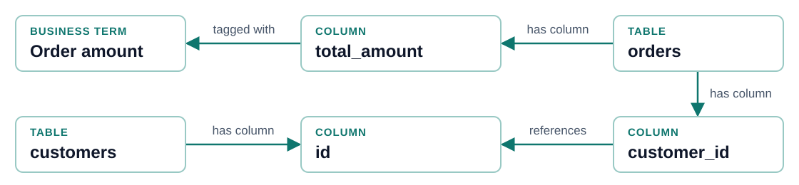

<style>
section {
  --marp-auto-scaling-code: false;
  background: #f8fafc;
  color: #0f172a;
  font-size: 26px;
  line-height: 1.4;
  padding: 44px 64px 58px;
}
h1 { color: #0f172a; font-size: 56px; line-height: 1.15; }
h2 { color: #0f172a; font-size: 38px; line-height: 1.18; margin: 0 0 24px; }
h3 { color: #0f766e; font-size: 25px; margin: 0 0 12px; }
strong { color: #0f766e; }
li { margin: 10px 0; opacity: 1 !important; visibility: visible !important; }
ul, ol { margin: 8px 0; }
p { margin: 12px 0; }
code { font-size: 22px; }
pre { background: #eaf0f5; border: 1px solid #dbe4ed; padding: 20px 24px; }
pre code { line-height: 1.5; }
table { font-size: 22px; width: 100%; margin: 10px 0; }
th { background: #e2e8f0; }
td, th { border-color: #cbd5e1; padding: 9px 12px; }
footer { color: #64748b; font-size: 15px; left: 64px; bottom: 20px; }
section::after { color: #64748b; font-size: 16px; }
.callout { background: #e0f2f1; border-left: 5px solid #0d9488; margin-top: 22px; padding: 14px 18px; font-size: 23px; }
.note { color: #475569; font-size: 20px; margin-top: 18px; }
.cols { display: grid; gap: 32px; grid-template-columns: 1fr 1fr; }
.cols > div { min-width: 0; }
.flow { display: flex; align-items: stretch; gap: 12px; margin: 24px 0; }
.flow .step { background: #ffffff; border: 1px solid #b9d8d5; border-top: 5px solid #0d9488; border-radius: 6px; flex: 1; padding: 18px 16px; font-size: 22px; }
.flow .step strong { display: block; font-size: 24px; margin-bottom: 8px; }
.flow .arrow { align-self: center; color: #0f766e; font-size: 30px; }
.question { border-left: 5px solid #0d9488; padding: 10px 20px; font-size: 27px; background: #ecfeff; }
.label { color: #0f766e; font-size: 20px; font-weight: 700; letter-spacing: 1px; margin-bottom: 18px; }
section.lead { background: linear-gradient(135deg, #f8fafc 0%, #dff5f2 100%); }
section.lead h1 { max-width: 1050px; }
section.lead .subtitle { color: #0f766e; font-size: 32px; max-width: 1000px; margin-top: 26px; }
section.lead .note { margin-top: 60px; }
section.connectors table { font-size: 19px; }
section.connectors td, section.connectors th { padding: 7px 9px; }
section.connectors .cols { gap: 24px; }
section.future { background: #f6f3fc; }
section.future .label { color: #6d28d9; }
section.future .callout { border-color: #8b5cf6; background: #ede9fe; }
</style>

<!-- _class: lead -->

<div class="label">CONNECTED METADATA FOR AGENTS</div>

# Neocarta: A Semantic Map for Enterprise Data

<div class="subtitle">Connect data structure, business meaning, and usage in Neo4j. Give agents the context to find and query the right data.</div>

<div class="note">An experimental Neo4j Labs project supported by the Neo4j field team.</div>

<!--
Neocarta is a Python library that builds a semantic layer in Neo4j.
A semantic layer connects the structure of data with its business meaning.
Agents use this graph through tools exposed by an MCP server.

Neocarta supplies context. An agent and a separate database query tool use
that context to answer questions. Neocarta is a Neo4j Labs project, with
experimental status. It is not a supported Neo4j product.
-->

---

## Agents See Metadata in Pieces, Not as a Connected Map

- **Schemas:** Show which tables and columns exist.
- **Business terms:** Explain what the data means.
- **Relationships:** Show how tables join and where data lives.
- **Query history:** Shows which tables and columns people use together.

<div class="callout"><strong>The problem:</strong> These facts live in separate systems. An agent must connect them to answer a business question.</div>

<!--
Start with the missing connections. A schema may list an amount column,
but the business definition tells the agent which amount the user means.
A foreign key explains how that table relates to customers. Query history
records how people have used those assets.

An agent needs the structure, the meaning, and the links between them.
That is the problem the metadata graph addresses.
-->

---

## Neocarta Builds a Connected Map of Enterprise Metadata

<div class="flow">
  <div class="step"><strong>1. Collect</strong>Read metadata from catalogs, glossaries, models, and logs.</div>
  <div class="arrow">→</div>
  <div class="step"><strong>2. Normalize</strong>Put source details into a shared format.</div>
  <div class="arrow">→</div>
  <div class="step"><strong>3. Connect</strong>Store assets and their relationships in Neo4j.</div>
  <div class="arrow">→</div>
  <div class="step"><strong>4. Add search</strong>Index text and optionally add search by meaning.</div>
</div>

<div class="callout"><strong>The graph connects:</strong> Tables, columns, business terms, metric definitions, and query usage.</div>

<div class="note">Source tables stay in their platforms. Selected example values can also be copied into the metadata graph.</div>

<!--
Connectors read source metadata and convert it to a shared graph model.
Neo4j stores entities and relationships, so facts from different sources
can be retrieved together.

Text indexes support search by words. Optional embeddings support search
by meaning. Embeddings are generated after metadata has been loaded.

The graph holds metadata and may include sampled values. This is not a
copy of the source database. Choose which example values to load as part
of configuring the connectors.
-->

---

## Neocarta Turns Metadata Into Context for Agents

- **Ask:** A user asks a business question.
- **Search:** The agent calls Neocarta to find relevant metadata.
- **Follow links:** Neocarta reads the related definitions, columns, and joins.
- **Return context:** The agent receives details it can use to write a query.

<div class="callout"><strong>MCP:</strong> Model Context Protocol lets the agent call Neocarta's retrieval tools.</div>

<!--
This slide moves from building the graph to using it.
The graph contains metadata across the loaded sources. A retrieval tool
returns a selected set of that metadata for the current question.
That selected information is the context the agent works with.

Search can start with a table, a column, or a metric. The available tools
depend on the data and indexes in the graph. A useful answer may require
several retrieval calls as the agent checks what it needs.
-->

---

## Retrieved Context Gives Agents Columns, Values, and Joins

```text
Table: sales.orders
  order_id       INT64     primary key
  customer_id    INT64     references customers.id
  total_amount   NUMERIC   examples: 49.99, 128.50
  status         STRING    examples: shipped, cancelled
```

- **Types:** Help the agent compare and filter values correctly.
- **Examples:** Show the actual spelling of values used in filters.
- **Join keys:** Show how the selected tables connect.

<div class="note">Illustrative result. Returned details depend on the metadata loaded into the graph.</div>

<!--
This simplified example shows why retrieval includes more than a table
name. Types help the agent write valid comparisons. Examples help it
choose a real status value. Foreign-key references provide known joins.

References and values are optional. Their presence depends on the source
and connector configuration. Missing keys still need investigation.
This is context for writing a query; the agent must still build and check
the query itself.
-->

---

## Agents Use Neocarta's Context to Query Source Data

<div class="question">“Which customers placed the largest orders last quarter?”</div>

<div class="flow">
  <div class="step"><strong>Neocarta</strong>Returns order and customer columns, with known join keys.</div>
  <div class="arrow">→</div>
  <div class="step"><strong>Agent</strong>Writes the query using the retrieved context.</div>
  <div class="arrow">→</div>
  <div class="step"><strong>Query tool</strong>Runs the query against the source with configured permissions.</div>
  <div class="arrow">→</div>
  <div class="step"><strong>Agent</strong>Explains the result and shows the query used.</div>
</div>

<div class="callout"><strong>Separate responsibilities:</strong> Neocarta supplies context. The agent writes the query. The query tool controls execution.</div>

<!--
Use one question throughout this example. The agent asks Neocarta for
the relevant context, then writes a query against the source database.

The query tool and source system enforce their configured permissions.
Query validation and answer citations must be provided by the surrounding
application. Neocarta does not automatically add those controls.

The local project includes a LangGraph example that connects Neocarta's
MCP tools with a separate BigQuery execution tool. The exact number of
retrieval calls depends on the question and the available metadata.
-->

---

## Graph Links Connect Business Terms to Tables and Columns



- **Business meaning:** “Order amount” maps to `orders.total_amount`.
- **Known relationship:** `orders.customer_id` references `customers.id`.

<div class="callout"><strong>Why a graph:</strong> Stored relationships connect the meaning, the field, and the join in one map.</div>

<!--
This illustrative path makes the graph concrete. A glossary term is
linked to a column. That column belongs to a table. Another column on
the same table carries a foreign-key reference to the customer table.

The term mapping and foreign key must be loaded from a source or curated.
They are stored facts for retrieval to follow. A missing relationship
requires more source information or review.

Search locates relevant entities and graph traversal supplies related
details. Vector search and graph traversal work together in Neocarta.
-->

---

## Connectors Bring Schemas, Business Terms, and Query History Into One Graph

| Metadata | What it adds to the graph |
| --- | --- |
| **Schemas** | Tables, columns, types, and available keys and values |
| **Business terms** | Definitions linked to the assets they describe |
| **Semantic models** | Metric formulas, datasets, and declared joins |
| **Query history** | Queries and the tables and columns they use |

<div class="callout"><strong>One map:</strong> Related facts from different sources can be retrieved together.</div>

<!--
Group connectors by the information they contribute. The source list
belongs in the appendix so the main story stays focused on context.

Schema connectors supply structure. Glossary sources supply terms and
asset mappings. Open Semantic Interchange supplies models, formulas, and
joins. Query log connectors record SQL and the assets that it uses.

Query usage shows what was used. It does not by itself prove that a query
or a join is correct for the current question.
-->

---

## Search Finds Relevant Data, and Graph Links Add Context

- **Browse:** List schemas and tables to see what is available.
- **Match words:** Search names and descriptions for specific terms.
- **Match meaning:** Use embeddings to find related descriptions.
- **Combine methods:** Use text and meaning together, with business-term links where available.

<div class="callout"><strong>Search plus graph:</strong> Table and column search results include related metadata, such as types, example values, and known references.</div>

<!--
Full-text search finds words in metadata. Vector search compares the
meaning represented by embeddings. Hybrid search combines both.
Business-term hybrid tools also use glossary tags when their required
indexes and data are present.

The retrieval queries traverse the graph after finding candidates.
Vector search also returns structured context; it is not limited to a
ranked list of names. Catalog browsing helps the agent orient itself.
-->

---

## Saved Metric Definitions Tell Agents How to Calculate Results

- **Find the metric:** Search for the business measure the user needs.
- **Read the formula:** Retrieve the saved expression for the database's SQL format.
- **Get model context:** Retrieve the model's tables, fields, metrics, and joins.
- **Write the query:** Use the definition with the requested filters and dates.

<div class="callout"><strong>Open Semantic Interchange:</strong> A format for sharing business data models. Neocarta can load and export these models.</div>

<!--
The local MCP implementation supports metric search, metric expression
retrieval, and retrieval of a complete OSI domain's context. These tools
extend the story beyond table discovery.

A saved definition gives the agent a formula to use. Approval and review
of that formula are responsibilities of the team maintaining the model.
The agent still has to apply the right date range, filters, and joins.

OSI model tools are registered when the graph contains OSI model nodes.
Metric search tools depend on the corresponding search indexes.
-->

---

## Metadata Updates and Expert Review Keep Context Accurate

- **Assign owners:** Name the people who review business terms, formulas, and joins.
- **Refresh metadata:** Update the graph when source definitions change.
- **Check answers:** Test data selection, query results, and business meaning.
- **Record feedback:** Capture corrections so the team can improve the map.

<div class="callout"><strong>Team responsibility:</strong> Add review, refresh schedules, and query controls to the surrounding workflow.</div>

<!--
These are operating practices for the team building the application.
Neocarta provides metadata ingestion and retrieval. A complete governance
workflow also needs ownership, refresh processes, evaluation, and feedback.

Source permissions and query validation belong in the query tool and
database configuration. A connected graph still needs correct source
information and expert review to remain useful over time.
-->

---

<!-- _class: future -->

<div class="label">FUTURE WORK</div>

## Future Work: Stored Query Steps Could Help Agents Reuse Earlier Work

- **Capture the path:** Save the question, selected data, query, evidence, and result.
- **Keep feedback:** Record accepted answers and rejected paths with their reasons.
- **Find similar questions:** Use earlier work as a starting point.
- **Check again:** Confirm that definitions, permissions, and source data still apply.

<div class="callout"><strong>Current foundation:</strong> Query log ingestion records queries and asset usage. Saving and reusing the full question-to-answer path is a proposed extension.</div>

<!--
Keep the status explicit. Query logs and their usage relationships exist
today. The full process path described here is future work in this deck.

Storing why a path was accepted or rejected could help later agents choose
a useful starting point. A reused path must still be checked against the
new question, current definitions, and current permissions.
-->

---

## One Business Question Provides a Small Starting Point

1. **Choose:** Pick a question with a result that a business owner can check.
2. **Load:** Bring in the needed schemas, terms, and useful query history.
3. **Review:** Check the business mappings, formulas, and join keys.
4. **Connect:** Give the agent Neocarta's tools and a separate query tool.
5. **Run:** Compare the answer with the expected result.

<div class="callout"><strong>Example:</strong> Use the largest-orders question to test customer lookup, order dates, amounts, and the customer-to-order join.</div>

<!--
Start with a question whose answer can be independently checked.
Agree on what largest means, which date marks an order, and how the
quarter is defined. Those decisions become terms, definitions, or test
expectations.

Load only the metadata needed for that workflow first. Check the links,
connect retrieval and execution, and run the question end to end.
-->

---

## Measure Answer Quality Before Expanding to More Data

| Check | What to measure |
| --- | --- |
| **Data selection** | Did the agent find the right tables, fields, and definitions? |
| **Query correctness** | Did the query use the right joins, dates, and filters? |
| **Answer quality** | Did the result match a checked answer? |
| **Time and cost** | How long did the workflow take, and what did it cost? |

<div class="callout"><strong>Next step:</strong> Fix the gaps found in the first question, then add the next question or source.</div>

<div class="note">The project's evaluation suite is still being built. Define checks for the pilot before relying on it.</div>

<!--
Close the main presentation with a concrete decision. A useful pilot
shows whether connected metadata helps the agent select the correct data
and produce a checked result at an acceptable time and cost.

Use known answers and review failures. Expand after the team understands
what worked and which metadata gaps remain. The local eval README marks
the project's evaluation suite as work in progress.

The next five slides are optional technical detail.
-->

---

<!-- footer: 'Neocarta · Technical appendix' -->
<!-- _class: connectors -->

## Each Connector Adds Specific Metadata From Its Source

<div class="cols">
<div>

### Structure

| Connector | Source |
| --- | --- |
| **BigQuery Schema** | BigQuery information schema |
| **Dataplex Schema** | Cataloged BigQuery assets |
| **Snowflake Schema** | Snowflake information schema |
| **Databricks Schema** | Managed Unity Catalog |
| **Unity Catalog Schema** | Open Unity Catalog API |
| **JDBC Schema** | Databases through SchemaCrawler |
| **CSV** | Curated metadata files |

</div>
<div>

### Meaning and usage

| Connector | Context |
| --- | --- |
| **BigQuery Logs** | Query history and asset usage |
| **Snowflake Logs** | Query history and asset usage |
| **Query Log** | Exported query history |
| **Dataplex Glossary** | Terms and asset mappings |
| **Databricks Tags** | Governed-tag definitions |
| **OSI** | Models, metrics, and joins |

</div>
</div>

<div class="note">OSI supports import and export. Available keys, values, and links vary by source.</div>

<!--
The connector list groups thirteen source connectors by their main job.
CSV can also carry curated glossary and usage information.
Databricks Tags loads governed-tag definitions. It is distinct from a
glossary connector that links business terms to physical assets.

OSI supports both ingestion and export. Embedding generation is a
separate enrichment step after the source metadata has been loaded.
-->

---

## A Shared Graph Model Links Data Structure, Meaning, and Usage

```text
Database → Schema → Table → Column → Example value
                      │       │
                      │       └── references another Column
                      └────────── linked to a Business term

Query ── uses ── Table / Column
Business model ── contains ── Tables / Metrics / Joins
Metric ── has ── Formula
```

- **Shared structure:** Core labels let the same retrieval tools read different sources.
- **Connected extensions:** Terms, usage, and formulas add business meaning.

<!--
This is a simplified view of the model, with plain labels for readability.
The core labels are Database, Schema, Table, Column, and Value.
HAS_SCHEMA, HAS_TABLE, HAS_COLUMN, HAS_VALUE, and REFERENCES connect them.

BusinessTerm nodes attach to tables or columns through TAGGED_WITH.
Queries use USES_TABLE and USES_COLUMN relationships. OSI adds model,
metric, expression, and join information to the shared graph.
The picture groups extensions rather than showing every node and edge.
-->

---

## The MCP Server Selects Tools Based on Graph Contents and Indexes

| Available graph content | Tool choice |
| --- | --- |
| **Text + vector + indexed business terms** | Business-term hybrid search |
| **Text + vector indexes** | Hybrid search |
| **One search index** | Text or vector search |
| **Catalog structure** | Schema and table browsing |
| **OSI models** | Model context and metric definition tools |

<div class="callout"><strong>At startup:</strong> The server checks the graph and selects a search method for each supported label.</div>

<!--
The server probes indexes and checks for BusinessTerm and OSI nodes.
For each Table, Column, or Metric label, it registers the highest-priority
search strategy whose prerequisites are met.

Business-term hybrid search needs the label's text and vector indexes,
the BusinessTerm full-text index, and BusinessTerm nodes. A schema vector
tool is registered separately when its index is present. Catalog tools
are always registered, though their results depend on graph contents.

These checks select tools based on graph capabilities. Working credentials,
provider configuration, and a running database are still required.
-->

---

## Embeddings Let Agents Search Metadata by Meaning

<div class="flow">
  <div class="step"><strong>Descriptions</strong>Read text already stored on graph nodes.</div>
  <div class="arrow">→</div>
  <div class="step"><strong>Embedding model</strong>Turn each description into a list of numbers that represents meaning.</div>
  <div class="arrow">→</div>
  <div class="step"><strong>Neo4j index</strong>Store the numbers and search for similar descriptions.</div>
</div>

- **Run after loading:** Create embeddings once source metadata is in the graph.
- **Choose a provider:** Use LiteLLM across providers or a direct OpenAI client.
- **Plan updates:** The enrichment skips nodes that already have embeddings.

<!--
Embeddings support meaning-based search. Text search and catalog browsing
can be used without embeddings.

The enrichment reads descriptions, calls the configured embedding model,
and writes vectors and indexes to Neo4j. Retrieval must use a compatible
model and vector size.

Reruns process nodes with missing embeddings. When a description changes,
plan an explicit embedding refresh so the vector matches the new text.
-->

---

## New Connectors Use the Shared Model to Support Existing Agent Tools

<div class="flow">
  <div class="step"><strong>Extract</strong>Read metadata from the source.</div>
  <div class="arrow">→</div>
  <div class="step"><strong>Transform</strong>Check and convert it to the shared model.</div>
  <div class="arrow">→</div>
  <div class="step"><strong>Load</strong>Write graph nodes, relationships, and indexes.</div>
</div>

- **Wrap the steps:** A connector provides one way to run the process.
- **Test the mapping:** Check names, identifiers, types, and relationships.
- **Check retrieval:** Confirm existing tools return the expected context.

<div class="callout"><strong>Shared model:</strong> A new source can use existing retrieval tools when it supplies the graph structure and indexes those tools expect.</div>

<!--
The common connector design separates extraction, transformation, and
loading. The connector class runs those components together.

The shared model is the interface between ingestion and retrieval.
Test both the source mapping and the context returned from the graph.
Specialized metadata may need a model extension and corresponding tools.
-->
