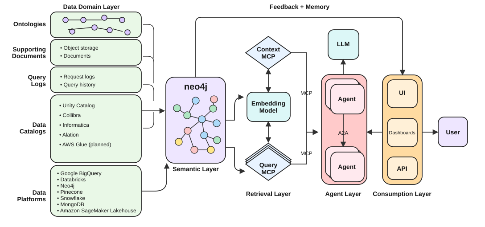

<style>
section {
  --marp-auto-scaling-code: false;
  color: #0f172a;
  font-size: 26px;
  padding: 48px 64px;
}

h1 {
  color: #0f172a;
  font-size: 52px;
}

h2 {
  color: #0f172a;
  font-size: 37px;
  margin-bottom: 18px;
}

h3 {
  color: #0f766e;
  font-size: 26px;
}

table {
  font-size: 21px;
  width: 100%;
}

th {
  background: #e2e8f0;
}

td, th {
  padding: 9px 13px;
}

code {
  font-size: 21px;
}

small {
  color: #64748b;
  font-size: 13px;
}

section.lead {
  background: linear-gradient(135deg, #f8fafc 0%, #ecfeff 100%);
}

section.lead h1 {
  font-size: 58px;
  max-width: 1050px;
}

section.lead h2 {
  color: #0f766e;
  font-size: 29px;
  font-weight: 500;
  max-width: 980px;
}

.promise {
  color: #475569;
  font-size: 21px;
  margin-top: 72px;
}

.callout {
  background: #ecfeff;
  border-left: 6px solid #14b8a6;
  margin-top: 18px;
  padding: 12px 18px;
}

.status-now {
  color: #047857;
  font-weight: 700;
}

.status-preview {
  color: #a16207;
  font-weight: 700;
}

.status-roadmap {
  color: #7c3aed;
  font-weight: 700;
}

.cols {
  display: grid;
  gap: 30px;
  grid-template-columns: 1fr 1fr;
}

.center {
  text-align: center;
}

.tight li {
  margin: 6px 0;
}

li {
  opacity: 1 !important;
  visibility: visible !important;
}

section.section {
  background: linear-gradient(135deg, #0f172a 0%, #134e4a 100%);
}

section.section h1 {
  color: #f8fafc;
  font-size: 44px;
  max-width: 980px;
}

section.section h2 {
  color: #5eead4;
  font-size: 25px;
  font-weight: 500;
  max-width: 940px;
}

.timing {
  color: #94a3b8;
  font-size: 20px;
  margin-top: 56px;
}
</style>

<!-- _class: lead -->

# Neocarta: A Semantic Map for Enterprise Data

## Build the map in Neo4j, serve it to agents over MCP, keep the data where it lives

<div class="promise">An overview, a comparison with Rosetta SDL, and a deep dive into the mechanisms</div>

<!--
Neocarta is an experimental Neo4j Labs Python library. It builds a
semantic layer in Neo4j from your data sources and serves it to agents
through an MCP server.

Two things to set up front. First, only metadata crosses into Neo4j.
Source data stays in its platform. Second, Neocarta does not run your
queries. It gives an agent the context to write one, and a separate
database tool executes it. That boundary is the whole design, and it
comes back in the Rosetta SDL comparison.

Deck structure: eleven core slides, then five optional modules, then a
close. If we are short on time I drop modules from the back.
-->

---

## Agents See Fragments, Not a Data Landscape

- **Distributed metadata:** schemas, glossaries, metrics, query history
- **Technical names:** `cust_ord_amt` is not "revenue"
- **Missing relationships:** no joins, no lineage, no location
- **Large prompts:** every schema, every prompt, low relevance

<div class="callout"><strong>The gap:</strong> Schema access tells an agent what columns exist. It does not tell the agent what they mean or how they connect.</div>

<!--
Give an agent raw schema access and it still cannot answer a business
question reliably.

The metadata it needs is split across systems. The names in the database
do not match the language in the question. Foreign keys, lineage, and
source location are missing, so the agent guesses at joins. And the usual
workaround, dumping every schema into the prompt, costs money and buries
the relevant tables in noise.

This is a retrieval problem, not a context-window problem.
-->

---

## Neocarta Ships as Three Surfaces

| Surface | Install | What it does |
| --- | --- | --- |
| **Python library** | `pip install neocarta` | Connector classes that extract, transform, and load metadata |
| **CLI** | `neocarta[cli]` | One command per source and action, plus every retrieval tool mirrored for the shell |
| **MCP server** | `neocarta[mcp]` | Serves the graph to agents over stdio |

<div class="callout"><strong>Division of labor:</strong> The library and CLI build the map. The MCP server serves it. Your agent's own query tool executes against the source.</div>

<small>Neocarta is a Neo4j Labs project supported by the Neo4j field team. It is not a Neo4j product. Apache 2.0, Python 3.10 or higher.</small>

<!--
Three surfaces, one graph model underneath.

The library is where the connectors live. You write a few lines of Python
to point a connector at BigQuery, Snowflake, Databricks, whatever, and it
loads the metadata into Neo4j.

The CLI does the same ingestion without writing Python. It also mirrors
every MCP retrieval tool as a shell command, which matters for debugging
and for agents that do not speak MCP.

The MCP server is the runtime surface. Your agent connects to it and gets
retrieval tools over the graph.

Note what is not on this list: a query executor. That is deliberate.
-->

---

## The Semantic Layer Sits Between Sources and Agents



<!--
This is the shape of the thing, and I want to let it sit for a moment
before I put words on it.

Data sources on the left. Ontologies, documents, query logs, data
catalogs, and the lakes, databases, and warehouses themselves.

They feed a semantic layer in Neo4j, in the middle. That is the map.

The retrieval layer exposes it as two kinds of MCP service. Context MCP
answers "what data matters and what does it mean." Query MCP is the path
to the data itself.

Then the agent layer, the consumption layer, and the user.

And the arc across the top: feedback and memory returning to the semantic
layer, so what an investigation learns is not thrown away.

Two things to notice. Neocarta builds and serves the middle box. And the
source systems on the left are never copied, they are only described.
-->

---

## How a Business Term Resolves to a Real Column

```text
"largest orders"
     |
     v
(BusinessTerm) -> (Column) -> (Table) -> (Schema) -> (Database)
                      |
                      +-[:REFERENCES]-> (Column)   the join
```

- **Built from:** The connectors load catalog metadata, glossary terms, semantic models, and query history into one graph.
- **What the agent gets back:** The traversal returns the exact column, its table and platform, sample values, and the foreign keys needed to join.
- **Why a graph:** Every step is a stored relationship, so the agent can show which glossary entry led it to that column.

<div class="callout"><strong>Candidates versus a query plan:</strong> Embedding search ranks table names and hands back a confidence number. The traversal hands back the column, the join, and the reason it was chosen.</div>

<!--
One traversal is the reading of that picture.

Somebody says "largest orders." That phrase is a business term. The term
is tagged to a column. The column belongs to a table, the table sits in a
schema, the schema lives in a database. And the column carries a
REFERENCES edge to the column it joins against.

So the traversal does not just narrow the search. It ends with everything
needed to write the query: the exact column, the platform it lives on,
what the values look like, and the join key.

Two things are worth pulling out of that.

First, every step is a stored relationship. Somebody's glossary said this
term maps to this column, and the connector recorded it. The agent is
reading facts, not inferring them, and it can show you the path it took.

Second, compare that to embedding your table descriptions and returning
the top five by cosine similarity. You get candidates and a confidence
number. That is not enough to write SQL. It does not give you the column,
it does not give you the join, and it cannot tell you that two catalogs
use the same term for different things.

Candidates versus a query plan. That is the whole argument for a graph
rather than a vector index.

ARTWORK NOTE: replace the previous slide's diagram with the three-state
graph model SVG when built, and highlight this path on it.
-->

---

## A Grounded Text-to-Query Flow: Who Does What

```text
"Which customers placed the largest orders last quarter?"
      v
[agent]       calls one Neocarta retrieval tool
      v
[Neocarta]    returns orders and customers, with columns, types,
              sample values, and orders.customer_id -> customers.id
      v
[agent LLM]   writes the SQL, using that reference as the JOIN
      v
[query tool]  runs the SQL against BigQuery
      v
[agent]       answers, citing the tables and the query it ran
```

<div class="callout"><strong>Where the join comes from:</strong> <code>REFERENCES</code> is already in the graph, so the foreign key arrives in the first retrieval result. Neocarta supplies the schema and never writes or runs SQL.</div>

<!--
One request, end to end, and the point of this slide is who is doing each
step. Neocarta appears exactly once.

The agent makes one retrieval call with the question. Neocarta answers
with the orders and customers tables: their columns, types, sample values,
and the foreign key between them.

That foreign key is worth stopping on, because people assume it is a
second call. It is not. REFERENCES is already a relationship in the graph,
loaded by the connector when it read the source catalog. So the join
arrives in the same result as the schema, and the agent never has to
infer it or ask again.

Then Neocarta is done. The agent's own LLM writes the SQL. Neocarta does
not generate SQL, and it does not have an opinion about the SQL. It
supplied real column names and a real join key, which is what keeps the
generated query grounded.

A separate tool executes it. In the runnable example in the repo that is
a BigQuery query tool, driven by LangGraph.

The answer comes back citing the tables and the query, so it is traceable.

That division is the whole architecture: Neocarta describes, the LLM
composes, a governed tool executes.
-->

---

## Extending Neocarta to AWS

| Step | Planned expansion |
| --- | --- |
| **Connect** | Add a Glue Data Catalog connector using Neocarta's existing connector contract |
| **Normalize** | Map AWS databases, tables, columns, and catalog metadata into the shared Neo4j model |
| **Enrich** | Link AWS assets to business terms, known join paths, and usage evidence |
| **Serve** | Expose AWS metadata through the same CLI and MCP retrieval tools used across platforms |
| **Validate** | Prove semantic discovery through governed Athena queries over S3 Tables |

<div class="callout"><strong>Same pattern, new source:</strong> Read S3 Tables metadata through the Glue federated catalog; keep S3 Tables authoritative and Athena as the query engine. <span class="status-roadmap">Planned:</span> Glue Data Catalog connector.</div>

<!--
The AWS expansion starts with a Glue Data Catalog connector. That
closes the current gap in Neocarta's AWS source coverage without creating
a separate AWS-specific graph model.

The connector will extract Glue metadata and normalize it into Neocarta's
shared Database, Schema, Table, and Column model. It can then enrich those
AWS assets with business terms, known joins, and usage evidence.

Once the metadata is in the shared model, the CLI, MCP tools, glossary
bridge, and retrieval strategies already used for other platforms can
serve it to agents.

The boundary stays explicit: Glue exposes the federated catalog, Athena
executes the query, S3 Tables remains authoritative for its tables, and
Neocarta adds the semantic context and cross-source relationships.
-->

<!-- AWS sources: https://docs.aws.amazon.com/glue/latest/dg/enable-s3-tables-catalog-integration.html and https://docs.aws.amazon.com/athena/latest/ug/gdc-register-s3-table-bucket-cat.html -->

---

<!-- _class: section -->

# Neocarta and Rosetta SDL

## Where they align, where they differ, and when each fits

<!--
The AWS target and Glue roadmap establish Neocarta's direction. Rosetta
SDL is the useful comparison because it implements a deeper AWS-specific
application around the same semantic-map idea.

There is another Neo4j-based project solving this problem, and it is
worth knowing about: Rosetta SDL. It is an AWS reference application that
maps business language onto Glue and Athena metadata in Neo4j and serves
it to agents. Same core idea, built from the other end.

Neocarta is a cross-platform library and context service. Rosetta SDL is
a complete AWS reference application. They share a semantic-map
foundation, then differ in platform scope, execution, and deployment.

Three slides: the shared foundation, the primary responsibility
boundary, then the remaining implementation differences.
-->

---

## What Neocarta and Rosetta SDL Share

**Rosetta SDL** is an AWS reference application. It maps business language onto Glue and Athena metadata in Neo4j, then serves it to agents over MCP.

| Shared functionality | How |
| --- | --- |
| **Semantic map in Neo4j** | Technical metadata linked to business meaning |
| **Catalog discovery** | Search and browse tables, columns, joins, metrics |
| **MCP server** | Retrieval tools for AI agents |
| **Hybrid search** | Graph traversal, full-text, and embeddings together |
| **Data stays put** | Only metadata enters the graph |

<!--
Building the semantic map is not a side capability in either project. It
is the core feature of both, which is why the comparison is worth making
at all.

Five pieces of shared functionality.

Both build a semantic map in Neo4j that links technical metadata to
business meaning. Both let you search and browse the catalog: tables,
columns, joins, metrics. Both expose retrieval tools to agents over MCP.
Both combine graph traversal with full-text and embedding search rather
than picking one. And both leave the source data alone, so only metadata
crosses into the graph.

Neocarta ships all five today. The core model carries REFERENCES for
joins, the Dataplex connector brings BusinessTerm and TAGGED_WITH, the
query log connector brings Query with USES_TABLE and USES_COLUMN, and the
MCP server serves business-term-bridged hybrid search.

The differences are real and they are on the next slide. They are
differences of scope, not of what the two projects set out to do.
-->

---

## Where Their Scope and Responsibilities Differ

| | Rosetta SDL | Neocarta |
| --- | --- | --- |
| **Product shape** | Complete application: API, admin UI, deployment | Library, CLI, graph model, MCP server |
| **Platform scope** | AWS: AWS Glue, Amazon Athena, S3 Vectors, Amazon Bedrock | Eleven connectors across clouds and open formats |
| **Query execution** | Plans, validates, and runs Athena queries | Supplies context, relies on a separate tool |
| **Safety controls** | sqlglot SQL firewall, fail-closed | Not the execution firewall |

<div class="callout"><strong>Choose on scope, not features:</strong> One AWS data lake with an admin experience points to Rosetta SDL. Metadata from several platforms behind your own agent points to Neocarta.</div>

<!--
These four dimensions usually decide the fit. The next slide covers the
remaining implementation differences.

Product shape. Rosetta SDL is something you deploy: FastAPI service,
React admin interface, Cognito auth, CDK stack. Neocarta is something you
import.

Platform scope. Rosetta SDL goes deep on AWS. Neocarta goes wide across
BigQuery, Dataplex, Snowflake, Databricks, Unity Catalog, JDBC, CSV, query
logs, and OSI.

Query execution. Rosetta SDL can take a question all the way to results in
Athena. Neocarta stops at context.

Safety. Rosetta SDL parses every query with sqlglot before execution and
fails closed on a parse error. Neocarta parses SQL during query log
ingestion, but it is not in the execution path, so it cannot be your
firewall.

That last row is not a hidden product weakness. It is the consequence of
Neocarta stopping at context while a separately governed tool owns
execution.
-->

---

## Other Differences

| | Rosetta SDL | Neocarta |
| --- | --- | --- |
| **Metric safety** | Compiles approved metrics to SQL with no LLM, so SQL is reproducible | Stores and retrieves metric definitions for the agent to use |
| **SQL controls** | sqlglot AST firewall, fails closed, limits allowed tables | Parses SQL at ingestion, not in the execution path |
| **Documents** | Document metadata and chunk search in S3 Vectors | Structured metadata, glossary, semantic models, query history |
| **Interfaces** | FastAPI service, React admin UI, Cognito auth, CDK stack | Python package, CLI, MCP server |

<!--
These differences matter when the first four dimensions do not settle
the choice.

Metric safety is the strongest thing Rosetta SDL has. A governed metric
compiles to SQL deterministically, with no LLM in the path, so the same
question produces the same SQL every time. Neocarta stores metric
definitions, including OSI metrics with dialect-specific expressions, but
generation is the agent's job. If reproducible numbers for approved
business measures are your requirement, that is a real difference.

SQL controls follow from execution. Rosetta SDL is in the execution path
so it can be a firewall. Neocarta is not, so it cannot.

Rosetta SDL indexes document chunks in S3 Vectors and can route an
unstructured question there. Neocarta is structured metadata only.

Rosetta SDL also provides an application UI and deployment stack, while
Neocarta provides a package, CLI, and MCP server.
-->

---

<!-- MODULE:B1 graph-model ~5min -->
<!-- _class: section -->

# Module B1: The Graph Model

## Core model, glossary extension, query logs and semantic models

<div class="timing">Three slides, about five minutes</div>

<!--
MODULE B1. Three slides, about five minutes. Drop this if under 30 minutes.

This module opens the hood on the graph. If the audience is going to build
a connector or write Cypher against the map, they need this. If they are
evaluating fit, they do not.
-->

---

## The Core Metadata Model

```text
(Database) -[:HAS_SCHEMA]-> (Schema) -[:HAS_TABLE]-> (Table)
                                                        |
                                              [:HAS_COLUMN]
                                                        v
                          (Value) <-[:HAS_VALUE]- (Column)
                                                        |
                                              [:REFERENCES]
                                                        v
                                                   (Column)
```

- **Every connector converts to this shape.** That is the contract
- **`REFERENCES`** carries the foreign key, so joins are traversable
- **`Value`** holds example values, which ground SQL generation

<!--
Five node labels, five relationship types. That is the whole core model.

Database, Schema, Table, Column, and Value, with a hierarchy running down
through them.

Two relationships do the real work. REFERENCES connects a foreign key
column to the column it points at, which is how an agent discovers a join
without guessing. And HAS_VALUE holds sample values, which is how the
agent knows that a status column contains 'cancelled' rather than 'CANCEL'.

The important property of this model is that it is shared. Every connector,
BigQuery or Snowflake or CSV, has to produce this shape. That is why one
MCP server works against all of them.

Database, Schema, Table, and Column all carry an optional embedding
property for vector search.
-->

---

## The Glossary Extension Bridges Business Language

```text
(Glossary) -[:HAS_CATEGORY]-> (Category) -[:HAS_BUSINESS_TERM]-> (BusinessTerm)
                                                                       ^
                                                            [:TAGGED_WITH]
                                                                       |
                                                          (Table) and (Column)
```

- **`BusinessTerm`** merges on name, so catalog and OSI sources collide cleanly
- **`TAGGED_WITH`** is the bridge from vocabulary to physical asset
- **Business-term hybrid search** traverses this edge, not just the index

<!--
This is where the business language lives.

The Dataplex connector brings glossaries, categories, and business terms
out of the catalog and links them to tables and columns with TAGGED_WITH.

One detail worth knowing: BusinessTerm nodes merge on name. So a term that
arrives from the Dataplex glossary and the same term arriving as a synonym
from an OSI semantic model land on the same node. Sources reinforce each
other instead of duplicating.

And this is what the business-term retrieval tools use. When the full-text
branch of a hybrid search is bridged through BusinessTerm, a question
phrased in business language reaches the physical column even when the
column name shares no words with the question. That is the case a plain
vector index over column names handles badly.
-->

---

## Query Logs and Semantic Models Extend the Same Model

<div class="cols">
<div>

**Usage knowledge**

```text
(Query) -[:USES_TABLE]->  (Table)
(Query) -[:USES_COLUMN]-> (Column)
(CTE)
```

Real queries, real joins, real access paths.

</div>
<div>

**Governed semantics**

```text
(OsiSemanticModel)
   -> (OsiTable) -> (OsiColumn)
   -> (Metric) -> (Expression)
   -> (Join)
   -> (OsiAiContext)
```

Open Semantic Interchange, bidirectional.

</div>
</div>

<div class="callout"><strong>OSI is the only bidirectional connector:</strong> It ingests a YAML spec and exports a semantic model subgraph back to spec-compliant YAML.</div>

<!--
Two extensions on the same core.

On the left, usage. The query log connectors parse SQL and record which
tables and columns each query touched, including through CTEs. That gives
you the access paths people actually use, which is a much better discovery
signal than the schema alone.

On the right, governed semantics through Open Semantic Interchange. OSI is
a YAML interchange format for semantic models. The connector brings in
datasets, fields, metrics with dialect-specific expressions, joins with
ordered column lists for composite keys, and AI context.

OSI is the only connector that goes both ways. You can ingest a spec, and
you can export a semantic model subgraph back out as compliant YAML with
column ordering preserved. So Neo4j can be the editing surface for a
semantic model that other tools consume.
-->

---
<!-- /MODULE:B1 -->

<!-- MODULE:B2 connectors ~5min -->
<!-- _class: section -->

# Module B2: Connectors and the Contract

## How metadata enters the graph, and how to add a platform

<div class="timing">Three slides, about five minutes</div>

<!--
MODULE B2. Three slides, about five minutes.

Keep this if the audience might write a connector or has a platform that
is not on the list. Drop it for an evaluation audience.
-->

---

## Every Connector Decomposes the Same Way

```text
Source          Extractor      Transformer         Loader        Neo4j
system    -->   read raw  -->  validate with  -->  write    -->  graph
metadata        metadata       Pydantic            indexed
                                                   nodes
```

- **Extractors:** connect to the source and read its metadata
- **Transformers:** validate and convert to the shared model
- **Loaders:** write indexed nodes and relationships
- **Connectors:** orchestrate the three as one class

<div class="callout"><strong>Optional accelerator:</strong> <code>neocarta[performance]</code> swaps in neo4j-rust-ext for 60 to 90 percent faster bulk loads. Requires Python 3.11 or higher.</div>

<!--
Four components, one pattern, repeated for every source.

The extractor talks to the source. For BigQuery that means reading
INFORMATION_SCHEMA tables. For Dataplex it means the catalog API.

The transformer validates with Pydantic and converts to the shared graph
model. This is where the contract is enforced.

The loader writes indexed nodes and relationships.

And the connector class wraps all three, so from the outside you construct
one object and call ingest.

If you are loading a large schema, the performance extra is worth it. It
replaces the pure-Python serialization layer in the Neo4j driver with a
compiled Rust extension.
-->

---

## Eleven Connectors Today

| Source | Connectors |
| --- | --- |
| **Google Cloud** | BigQuery schema, BigQuery logs, Dataplex schema, Dataplex glossary |
| **Other platforms** | Snowflake, Databricks, Unity Catalog, JDBC |
| **Files and formats** | CSV, query logs, OSI semantic models |
| **Enrichment** | Embeddings via LiteLLM or the OpenAI SDK |

<div class="callout"><strong>Before you present this:</strong> Snowflake, Databricks, Unity Catalog, and JDBC packages exist in the tree but are not documented at the depth of the others. Confirm maturity before naming all eleven to a customer.</div>

<!--
The inventory as it stands.

Google Cloud is the deepest. BigQuery has separate schema and logs
connectors, and Dataplex has separate schema and glossary connectors.

Snowflake, Databricks, Unity Catalog, and JDBC broaden the reach. JDBC in
particular means anything with a JDBC driver is reachable without a
bespoke connector.

CSV matters more than it looks. It is how you load curated metadata from a
system with no API, which covers a lot of real enterprise glossaries.

Embeddings are an enrichment step rather than a source. Run it after
ingestion to turn on vector and hybrid search. Dimension is auto-detected
from the model.

Honesty note for whoever presents this: check the state of the four in the
middle row before claiming them. They are in the codebase. They are not
documented like the others.
-->

---

## The Connector Contract

```bash
# List connectors and their detected kind
make connectors-list

# Scaffold a new source connector plus a conformance test
make connector-new NAME=glue

# Verify a connector against the contract
make connector-verify NAME=glue
```

- **New platforms contribute metadata** without changing agent behavior
- **Conformance test** ships with the scaffold, not after the fact
- **Static checks plus pytest** enforce the shared model

<!--
This is the part that makes the connector list a starting point rather
than a ceiling.

There is a scaffold command. It generates a connector package with the
extractor, transformer, and loader stubs, and a conformance test.

Then there is a verify command that runs static checks plus the
conformance pytest against the contract.

Why this matters for the audience: if your platform is not on the list,
the cost of adding it is a connector, not a fork. And because the contract
enforces the shared graph model, a new connector inherits every existing
retrieval tool. The MCP server does not know or care where the metadata
came from.

That is the argument for the shared model paying for itself.
-->

---
<!-- /MODULE:B2 -->

<!-- MODULE:B3 retrieval ~5min -->
<!-- _class: section -->

# Module B3: Retrieval in Depth

## Five ways to find a table, and how the server adapts

<div class="timing">Three slides, about five minutes</div>

<!--
MODULE B3. Three slides, about five minutes.

This is the highest-value module for an agent-building audience, because
retrieval quality is what decides whether the map is useful. Keep it
whenever you have more than 15 minutes.
-->

---

## Five Ways to Find a Table

| Method | When it wins |
| --- | --- |
| **Catalog browsing** | The agent needs orientation, not search |
| **Full-text** | Exact names and description terms, no embeddings required |
| **Vector** | Business phrasing that shares no words with the schema |
| **Hybrid** | Both signals, which is the usual production answer |
| **Glossary bridge** | Governed vocabulary reaches the asset that implements it |

<div class="callout"><strong>Table level and column level:</strong> Each search method runs against table embeddings and descriptions, or column ones. A question about "amount" is a column-level question.</div>

<!--
Five retrieval strategies, and they are not interchangeable.

Catalog browsing is list_schemas and list_tables_by_schema. No search, no
indexes, no embedding key. When an agent needs to know what exists, this
is cheaper and more reliable than search.

Full-text matches names and descriptions. It needs no embeddings, so it
works on a graph you just loaded.

Vector search matches meaning. This handles the case where the question
says revenue and the column says total_amount.

Hybrid combines both, and it is what you want in production.

The glossary bridge is the one that is hard to replicate elsewhere. The
full-text branch runs through BusinessTerm nodes, so governed vocabulary
routes to the physical asset.

And each of these exists at table level and column level, because
sometimes the question is about a table and sometimes it is about a field.
-->

---

## The MCP Server Adapts to the Graph It Finds

```text
Server startup
      |
      v
Probe database for indexes
      |
      v
Register highest-priority tool per label:

  business-term hybrid  >  hybrid  >  vector or full-text alone
      |
      v
Agent sees only tools the graph can actually serve
```

<div class="callout"><strong>Why this matters:</strong> An agent cannot call a vector search tool against a graph with no vector index. The server removes the failure mode instead of documenting it.</div>

<!--
This is a small design decision with a large effect on agent reliability.

At startup the MCP server probes the target database to see which indexes
exist. Then, per label, Table and Column, it registers the single
highest-priority retrieval tool the graph can support.

Priority order: business-term-bridged hybrid, then plain hybrid, then
vector or full-text on their own.

Schema-level vector retrieval and the catalog tools register independently.

The effect is that the tool list an agent sees is always a list of tools
that work. If you loaded a schema without embeddings, the agent gets
full-text and catalog tools, and it never tries a vector search that
would fail.

The same tools are reachable from the CLI as `neocarta tool <name>`, which
is how you debug retrieval without an agent in the loop. A search command
run against a graph missing its index exits with code 3.
-->

---

## What a Retrieval Result Contains

```text
Table: ecommerce.orders
  Columns:
    order_id       INT64    PK    examples: 1001, 1002
    customer_id    INT64    FK -> customers.id
    total_amount   NUMERIC        examples: 49.99, 128.50
    status         STRING         examples: shipped, cancelled
```

- **Types** let the agent cast and compare correctly
- **Example values** stop the agent guessing at enum spellings
- **Foreign keys** are the difference between a list and a query plan

<!--
This is what comes back, and every part of it earns its place.

The table and its columns, obviously. Types, so the agent writes valid
comparisons instead of casting a string to a date and hoping.

Example values. This is underrated. An agent writing a filter on status
needs to know the value is 'cancelled', lowercase, not 'CANCELLED' or
'Cancelled'. Sample values turn a guess into a fact.

And the foreign key reference. This is the one that changes the outcome.
Without it the agent has two tables and no idea how they relate, so it
either guesses a join key or asks the user. With it, the join is
determined.

Compare this to what a vector search over table descriptions returns: a
ranked list of table names. That is a starting point. This is a query plan.
-->

---
<!-- /MODULE:B3 -->

<!-- MODULE:B4 process-knowledge ~4min -->
<!-- _class: section -->

# Module B4: Reusable Query and Process Knowledge

## From query logs to paths an agent can start from

<div class="timing">Two slides, about four minutes</div>

<!--
MODULE B4. Two slides, about four minutes. This is direction, not shipped
behavior. Be clear about that when you present it.
-->

---

## From Query Logs to Process Paths

<div class="cols">
<div>

**Ships today**

```text
(Query) -[:USES_TABLE]->  (Table)
(Query) -[:USES_COLUMN]-> (Column)
```

Which assets a query touched.

</div>
<div>

**The next step**

```text
(Question)
  -> selected concepts
  -> source choice
  -> generated query
  -> evidence
  -> result
```

The whole path, connected.

</div>
</div>

<div class="callout"><strong>The shift:</strong> Query logs record what happened. A process path records why, so a later agent can reuse the reasoning rather than rediscover it.</div>

<!--
Query log ingestion already gives you the foundation on the left. Parse
the SQL, record the tables and columns it used.

The direction on the right is to store the whole path. Not just the SQL
that ran, but the question that prompted it, the concepts the agent
selected, why it chose that source, the evidence it retrieved, and the
result.

The difference is reusability. A query log tells a later agent that
somebody once joined orders to customers. A process path tells it that
this specific question was answered by these concepts, this source, and
this query, and that the answer was accepted.

To be clear about status: the left side ships. The right side is direction.
-->

---

## Reuse and Its Boundary

- **Find similar requests** and start from a path that worked
- **Attach signals:** quality, latency, cost, and user feedback
- **Preserve rejected paths** with the reason they were rejected
- **The boundary:** a reused path is a starting point, not an answer

<div class="callout"><strong>Why keep failures:</strong> A path that was rejected for a stated reason stops the next agent repeating the mistake. Deleting it guarantees the mistake recurs.</div>

<!--
Three things make a stored path useful and one keeps it honest.

Similarity search over stored questions lets a later agent find a
comparable request and start from a path that already worked.

Signals let you rank. A path that was fast, cheap, and accepted beats one
that was slow and corrected.

Keeping rejected paths is the part people skip. If an agent tried a join
that produced a wrong answer and you delete that record, the next agent
tries the same join. Keep it with the reason.

And the boundary. A reused path is a hypothesis. The data may have moved,
the schema may have changed, the question may differ in a way that matters.
The agent still has to check its work. Reuse cuts the search space. It
does not remove the need to be right.
-->

---
<!-- /MODULE:B4 -->

<!-- MODULE:B5 governance ~4min -->
<!-- _class: section -->

# Module B5: Governance

## How trusted context stays trustworthy

<div class="timing">One slide, about two minutes</div>

<!--
MODULE B5. One slide, about two minutes. Keep this when the audience needs
the operating model behind trusted retrieval.
-->

---

## Governance Turns Retrieval Into Trusted Context

- **Automated evaluation:** retrieval quality, query validity, performance
- **User feedback:** approval, correction, task outcome
- **Expert review:** stewards validate mappings, metrics, and query paths
- **Traceability:** context, tool calls, queries, and evidence retained
- **Authority:** expert-approved definitions for high-risk decisions

<div class="callout"><strong>The point:</strong> A semantic map is only as trustworthy as the process that maintains it. Mappings decay when nobody owns them.</div>

<!--
A map that nobody maintains stops being true, and an agent grounded in a
stale map is worse than one that admits it does not know.

Automated evaluation is the first line. Does retrieval return the right
assets, does generated SQL parse and run, how fast, how expensive.

User feedback is the second. Approvals, corrections, and whether the task
actually completed.

Expert review is the third and it is the one that needs a named owner.
Data stewards validate that a business term maps to the right column and
that a metric definition is current.

Traceability makes all of that reviewable after the fact.

And authority. For a high-risk decision you want an expert-approved
definition, not whatever the embedding search ranked first.
-->

---
<!-- /MODULE:B5 -->

## Start With One Governed Question

1. **Choose** one business question that spans several related tables
2. **Connect** source schema, glossary terms, and representative query history
3. **Map** the highest-value links between business terms and physical assets
4. **Serve** focused context through the Neocarta MCP server
5. **Execute** through one governed query tool with real access controls
6. **Measure** retrieval relevance, SQL correctness, answer quality, cost
7. **Expand** once the first workflow has proven itself

<div class="callout"><strong>Why one question:</strong> A whole-catalog ingest produces a large graph and no evidence. One question end to end produces a working path and a number you can defend.</div>

<!--
The first motion, and the reason it is one question rather than one catalog.

The temptation with a metadata graph is to load everything. That gets you a
large graph, a slide with an impressive node count, and no evidence that
any of it helps an agent.

Instead: pick one question that genuinely needs discovery across several
tables. Load the schema for those tables, the glossary terms that describe
them, and enough query history to show real access paths.

Validate the mappings by hand. There will not be many, and getting them
right is what makes retrieval work.

Serve it over MCP, wire up one query tool with actual access controls, and
measure. Retrieval relevance, whether the SQL is correct, whether the
answer is right, what it cost.

Then expand. Every source and mapping you add after that is justified by a
workflow that already works, which is a much easier conversation than
asking for budget to build a catalog.
-->
