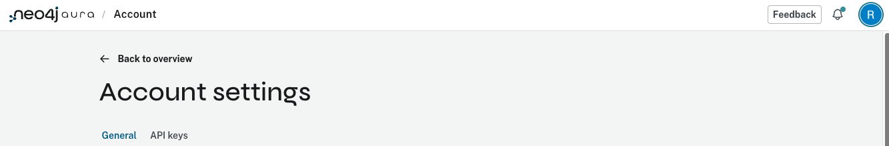

# Neo4j Aura Agents Python Client

This Python client calls an external Neo4j Aura Agent through its REST API.

## Overview

- **Aura Agents:** [Neo4j Aura Agents](https://neo4j.com/developer/genai-ecosystem/aura-agent/) lets you build, test, and deploy AI agents that answer from your AuraDB data. An agent marked "External" gets a REST endpoint.
- **Authentication:** The client gets an OAuth2 token, caches it, and refreshes it before it expires.
- **Invocation:** The client can call the agent synchronously or asynchronously.
- **Typed responses:** Pydantic models hold the response text, reasoning, tool uses, and token usage.
- **CLI:** `cli.py` sends one question to the agent from the command line.
- **Interactive chat:** `examples/interactive_chat.py` runs a question and answer session.

## Quick start

Run these commands from the repo root:

```bash
cd integrations/neo4j-aura-agents
uv sync
cp .env.sample .env        # add NEO4J_CLIENT_ID, NEO4J_CLIENT_SECRET, NEO4J_AGENT_ENDPOINT

uv run python cli.py "What's in the graph?"
uv run python cli.py --tools
uv run python examples/interactive_chat.py
```

## Prerequisites

- **Neo4j Aura account:** You need an Aura account with an AuraDB instance.
- **Aura Agent:** You need an agent with its external endpoint turned on.
- **API credentials:** You need a client ID and secret from your Neo4j profile.
- **Python and uv:** You need Python 3.13 or later and the `uv` package manager.

## Set up your Aura Agent

### Step 1: Create the agent

Follow the [Neo4j Aura Agents Lab](https://github.com/neo4j-partners/hands-on-lab-neo4j-and-azure/tree/main/Lab_2_Aura_Agents)
to create an agent.

**Important:** Select **"External endpoint"** when you create the agent. This
turns on REST API access.

### Step 2: Get the agent endpoint URL

1. Click your agent in the Aura console.
2. Copy the endpoint URL. It looks like `https://api.neo4j.io/v2beta1/projects/.../agents/.../invoke`.

### Step 3: Get your API credentials

1. Click your **profile icon** in the top right corner.
2. Go to **Settings**.
3. Select the **API keys** tab.
4. Create a new API key. Aura shows you the client ID and client secret.



## Test with the Jupyter notebook

1. Open [aura_agent_demo.ipynb](aura_agent_demo.ipynb).
2. Set these values in the notebook:
   - **`CLIENT_ID`:** This is your API key client ID.
   - **`CLIENT_SECRET`:** This is your API key client secret.
   - **`AGENT_ENDPOINT`:** This is your agent's endpoint URL.
3. Run the notebook cells to test your agent.

## Installation

Run this from the repo root:

```bash
cd integrations/neo4j-aura-agents
uv sync
```

## Configuration

Copy the sample environment file:

```bash
cp .env.sample .env
```

Then set these values in `.env`:

- **`NEO4J_CLIENT_ID`:** This is the client ID from your Aura API key. It is required.
- **`NEO4J_CLIENT_SECRET`:** This is the client secret from your Aura API key. It is required.
- **`NEO4J_AGENT_ENDPOINT`:** This is the invoke URL from the Aura Agent console. It is required.
- **`NEO4J_TOKEN_URL`:** This sets a custom OAuth2 token URL. It is optional. The default is `https://api.neo4j.io/oauth/token`.
- **`NEO4J_TIMEOUT`:** This sets the request timeout in seconds. It is optional. The default is 60.

```bash
# From your Neo4j Aura user profile (API Keys)
NEO4J_CLIENT_ID=your-client-id
NEO4J_CLIENT_SECRET=your-client-secret

# From the Aura Agent console (Copy endpoint button)
NEO4J_AGENT_ENDPOINT=https://api.neo4j.io/v2beta1/projects/.../agents/.../invoke
```

## Usage

### Python API

```python
from src import AuraAgentClient

# Create a client from environment variables
client = AuraAgentClient.from_env()

# Or create a client with explicit credentials
client = AuraAgentClient(
    client_id="your-client-id",
    client_secret="your-client-secret",
    endpoint_url="https://api.neo4j.io/v2beta1/projects/.../agents/.../invoke"
)

# Call the agent (sync)
response = client.invoke("What contracts mention Motorola?")
print(response.text)

# Call the agent (async)
import asyncio
response = asyncio.run(client.invoke_async("What's in the graph?"))
print(response.text)
```

### CLI

Run these from `integrations/neo4j-aura-agents/`:

```bash
# No arguments: ask the default question about the graph
uv run python cli.py

# Ask which tools the agent has
uv run python cli.py --tools

# Ask about a specific company
uv run python cli.py "Tell me about NVIDIA CORPORATION"

# JSON output for scripts
uv run python cli.py --json "Give me a summary" | jq .text

# Raw API response for debugging
uv run python cli.py --raw "What tools do you have?"

# Debug logging
uv run python cli.py -v "Explain the schema"

# Read the question from stdin
echo "What's in the graph?" | uv run python cli.py -
```

#### CLI options

| Option | Description |
|--------|-------------|
| `(no args)` | Ask the default question about the data in the graph |
| `-` | Read the question from stdin |
| `--tools` | Ask the agent to list its tools |
| `--json`, `-j` | Print the response as formatted JSON |
| `--raw`, `-r` | Print the raw API response |
| `--verbose`, `-v` | Turn on debug logging |
| `--timeout`, `-t` | Accepted, but the CLI does not pass it to the client yet. Set `NEO4J_TIMEOUT` in `.env` instead. |

### Interactive chat

```bash
uv run python examples/interactive_chat.py
```

## Examples

| Example | Description |
|---------|-------------|
| `examples/basic_usage.py` | Simple synchronous call |
| `examples/async_usage.py` | Concurrent async queries |
| `examples/interactive_chat.py` | Interactive question and answer session |

Run an example:

```bash
uv run python examples/basic_usage.py
```

## Discover agent tools

Ask the agent which tools it has:

```bash
$ uv run python cli.py --tools

I have one tool available:

*   **`get_company_overview(company_name: str)`**: This tool provides a
    comprehensive overview of a company. It can retrieve information such
    as SEC filings, identified risk factors, and major institutional owners.
```

The tools depend on how you configured the agent in the Aura console. The
agent from the lab has this tool:

| Tool | Parameters | Description |
|------|------------|-------------|
| `get_company_overview` | `company_name: str` | Returns SEC filings, risk factors, and institutional owners |

## API reference

### AuraAgentClient

```python
class AuraAgentClient:
    def __init__(
        self,
        client_id: str,
        client_secret: str,
        endpoint_url: str,
        token_url: str | None = None,  # Default: https://api.neo4j.io/oauth/token
        timeout: int | None = None,     # Default: 60 seconds
    ): ...

    def invoke(self, question: str) -> AgentResponse: ...
    async def invoke_async(self, question: str) -> AgentResponse: ...
    def clear_token_cache(self) -> None: ...

    @classmethod
    def from_env(cls) -> "AuraAgentClient": ...
```

### AgentResponse

```python
class AgentResponse:
    text: str | None           # Formatted response text
    thinking: str | None       # Agent reasoning steps
    tool_uses: list[ToolUse]   # Tools used during the call
    status: str | None         # Request status (SUCCESS)
    usage: AgentUsage | None   # Token usage
    raw_response: dict | None  # Full JSON for debugging
```

### AgentUsage

```python
class AgentUsage:
    request_tokens: int | None   # Tokens in the request
    response_tokens: int | None  # Tokens in the response
    total_tokens: int | None     # Total tokens used
```

## Example output

### Text response

```bash
$ uv run python cli.py "Tell me about Apple Inc"

Apple Inc. (ticker: AAPL) has several SEC filings...

Some of their top risk factors include:
*   Geography
*   Aggressive price competition
*   Frequent introduction of new products
...

Major asset managers holding Apple Inc. include:
*   BlackRock Inc.
*   Berkshire Hathaway Inc
*   Vanguard Group Inc
...
```

### JSON response

```bash
$ uv run python cli.py --json "What tools do you have?" | jq .
```

```json
{
  "text": "I have one tool available: `get_company_overview`...",
  "status": "SUCCESS",
  "thinking": "The user wants to know my capabilities...",
  "tool_uses": null,
  "usage": {
    "request_tokens": 122,
    "response_tokens": 100,
    "total_tokens": 222
  }
}
```

### Raw API response

```bash
$ uv run python cli.py --raw "Hello" | jq .
```

```json
{
  "content": [
    { "type": "thinking", "thinking": "..." },
    { "type": "text", "text": "..." }
  ],
  "end_reason": "FINAL_ANSWER_PROVIDED",
  "role": "assistant",
  "status": "SUCCESS",
  "type": "message",
  "usage": {
    "request_tokens": 128,
    "response_tokens": 163,
    "total_tokens": 291
  }
}
```

## How Aura Agents work

1. **Create an agent:** You create the agent in the Neo4j Aura console.
   - Set your AuraDB instance as the data source.
   - Define what the agent does and how it behaves.
   - Test it in the built-in chat.
2. **Make it external:** You set the agent's visibility to "External".
   - Copy the endpoint URL.
3. **Get API credentials:** You create an API key in your Neo4j user profile.
   - Go to your profile, then **API Keys**.
   - Create a new key and secret.
4. **Call the REST API:** Your code gets a token and posts the question.
   - Get a bearer token through OAuth2.
   - POST `{"input": "your question"}` to the agent endpoint.

## Authentication flow

The client handles OAuth2 for you:

```
1. POST https://api.neo4j.io/oauth/token
   - Basic Auth: client_id:client_secret
   - Body: grant_type=client_credentials
   - Response: { access_token, expires_in: 3600, token_type: bearer }

2. POST {endpoint_url}
   - Authorization: Bearer {access_token}
   - Body: { input: "your question" }
   - Response: { text, thinking, status, usage, ... }
```

The client caches the token. It gets a new token 60 seconds before the old one
expires. It also gets a new token and retries once if the API returns 401.

## Resources

- [Aura Agent Documentation](https://neo4j.com/developer/genai-ecosystem/aura-agent/)
- [Build a GraphRAG Agent in Minutes](https://neo4j.com/blog/genai/build-context-aware-graphrag-agent/)
- [Aura API Authentication](https://neo4j.com/docs/aura/platform/api/authentication/)
- [GraphAcademy: Aura Agents](https://graphacademy.neo4j.com/courses/workshop-genai/3-agents/5-aura-agents/)
