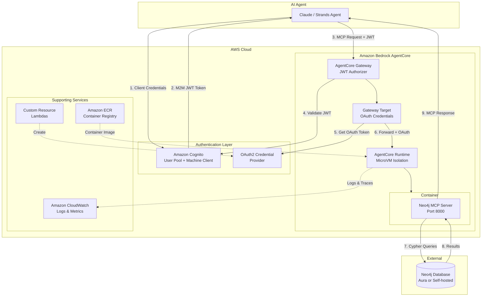
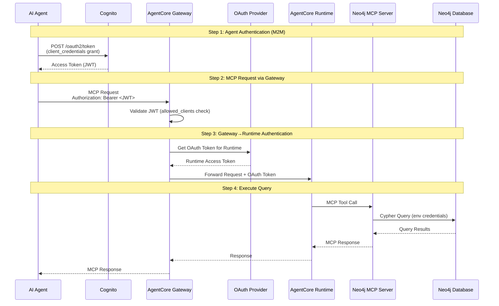
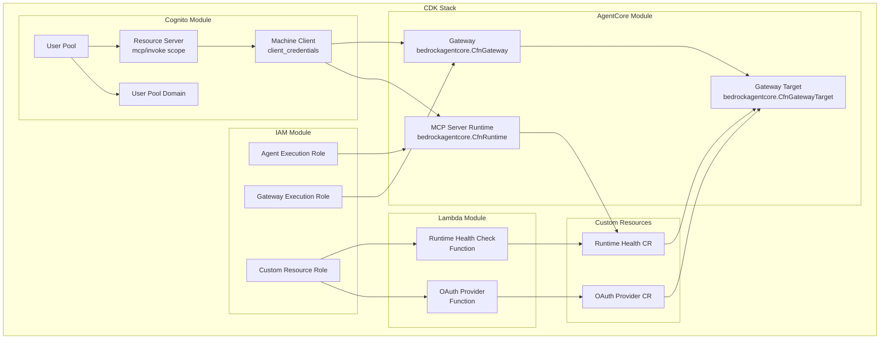

# Architecture

This document provides detailed architecture information for the Neo4j MCP Server deployment on Amazon Bedrock AgentCore.

## Overview

### High-Level Architecture



### Authentication Flow



## CDK Stack Structure

The CDK stack (`cdk/neo4j_mcp_stack.py`) creates all AWS resources:



### Cognito Module

- **User Pool** - Identity store (no users created, M2M only)
- **User Pool Domain** - Required for OAuth2 token endpoint
- **Resource Server** - Defines `mcp/invoke` scope for authorization
- **Machine Client** - OAuth2 client for `client_credentials` flow

### IAM Module

- **Agent Execution Role** - Role for AgentCore Runtime with ECR, CloudWatch, X-Ray permissions
- **Gateway Execution Role** - Role for Gateway with Runtime invocation and OAuth permissions
- **Custom Resource Role** - Role for Lambda functions managing OAuth provider

### Lambda Module

- **OAuth Provider Function** - Creates OAuth2 Credential Provider for Gateway→Runtime auth
- **Runtime Health Check Function** - Waits for Runtime to be ready before creating Gateway Target

### AgentCore Module

- **MCP Server Runtime** - The AgentCore Runtime running the Neo4j MCP container
- **Gateway** - Entry point for agents with JWT authorization
- **Gateway Target** - Connects Gateway to Runtime with OAuth2 credentials

### Stack Outputs

After deployment, the CDK stack exports:

| Output | Description |
|--------|-------------|
| **GatewayUrl** | Primary endpoint for MCP clients |
| **GatewayId** | Gateway identifier |
| **CognitoMachineClientId** | Client ID for M2M authentication |
| **CognitoTokenUrl** | OAuth2 token endpoint |
| **CognitoScope** | OAuth2 scope (e.g., `neo4j-agentcore-mcp-server-mcp/invoke`) |
| **MCPServerRuntimeArn** | ARN of the AgentCore Runtime |
| **CognitoUserPoolId** | User Pool ID (for retrieving client secret) |

## Why M2M-Only via Gateway?

This architecture is optimized for **agent access**:

1. **No User Management** - No passwords to rotate, no users to create/delete
2. **Simplified Auth** - Agents use client credentials, not interactive login
3. **Centralized Access** - Gateway provides a single entry point with audit logging
4. **Automatic Token Handling** - Gateway manages OAuth tokens with Runtime
5. **Tool Discovery** - Gateway enables semantic tool search across multiple MCP servers
6. **Security Isolation** - Runtime only accepts Gateway traffic, not direct access

## Why Deploy MCP Servers to AgentCore Instead of Fargate or Lambda?

When deciding where to run your MCP server, you have several options: Amazon Bedrock AgentCore Runtime, AWS Fargate, AWS Lambda, or even a plain EC2 instance. While all of these can technically host an MCP server, AgentCore Runtime offers significant advantages that become increasingly important as you move toward production.

### The Core Difference: Purpose-Built for AI Agents

AgentCore Runtime was designed from the ground up to run AI agents and their tools. Fargate and Lambda are general-purpose compute services that you must configure and manage yourself to work with AI workloads. This difference shows up in every aspect of the platform.

**Session Isolation with MicroVMs:** Each user session in AgentCore runs in its own dedicated microVM with completely isolated CPU, memory, and filesystem resources. When a session ends, the entire virtual machine is terminated and all memory is sanitized. This prevents one user's data from ever leaking to another user—something that has caused real security incidents when organizations built their own MCP hosting on shared infrastructure. With Fargate, you would need to architect this isolation yourself, which is complex and error-prone.

**Long-Running Sessions:** AgentCore supports sessions that can run for up to 8 hours. Lambda has a 15-minute maximum execution time, which is often too short for complex agent workflows that involve multiple tool calls, reasoning steps, and user interactions. Fargate can run longer, but you need to manage the session state and lifecycle yourself.

**Automatic Scaling:** AgentCore uses Fargate as its backend but manages all the scaling automatically. You do not need to configure auto-scaling groups, set up health checks, or worry about cold starts. The platform handles all of this, scaling your MCP server up when demand increases and down when it decreases.

### Built-In Observability and Tracing

One of the most significant advantages of AgentCore is its observability capabilities. When you deploy an MCP server to AgentCore, you automatically get:

**End-to-End Tracing:** AgentCore captures detailed traces of every agent interaction, including reasoning steps, tool invocations, and model calls. Each trace is broken into spans that show exactly what happened at each step, how long it took, and what the inputs and outputs were. This is invaluable for debugging why an agent made a particular decision or why a tool call failed.

**OpenTelemetry Integration:** All telemetry data is emitted in standard OpenTelemetry format, which means you can integrate it with your existing monitoring tools. You are not locked into a proprietary format.

**CloudWatch Dashboards:** AgentCore provides pre-built dashboards in Amazon CloudWatch that show agent performance metrics including token usage, latency, session duration, and error rates. You can see at a glance how your MCP server is performing and drill down into specific traces when something goes wrong.

### Unified Agent-to-Tool Integration with Gateway

When you deploy MCP servers to AgentCore, they can participate in the AgentCore Gateway ecosystem. Gateway is a fully managed service that provides a single endpoint where agents can discover and invoke tools from multiple sources.

**Tool Discovery:** As organizations scale, they may have dozens or hundreds of MCP servers providing different tools. Gateway provides a unified interface where agents can search for tools semantically. An agent can ask "what tools can help me send notifications?" and Gateway will return the relevant tools from across all your MCP servers, not just one.

**Unified Authentication:** Gateway handles authentication to all your backend tools through a single interface. Your agent authenticates once to Gateway, and Gateway handles the credential exchange with each individual MCP server. This is far simpler than having agents manage credentials for multiple services.

### When Fargate or Lambda Might Make Sense

AgentCore is not always the right choice. Consider alternatives when:

**You are building a proof of concept:** Lambda's pay-per-invocation model is very cost-effective for low-volume testing. You pay nothing when the function is not running.

**You need custom infrastructure:** If you have very specific networking, security, or compliance requirements that AgentCore does not support, Fargate gives you more control.

**Your tools are simple and stateless:** If your MCP server just wraps a simple API with no need for session state, memory, or complex tracing, Lambda can be a simpler and cheaper option.

### The Bottom Line

For production AI agent deployments, AgentCore provides capabilities that would take significant engineering effort to replicate on Fargate or Lambda:

- True session isolation with microVM security
- Built-in observability with zero configuration
- Agent-aware tracing that captures reasoning and tool calls
- Unified tool discovery through Gateway
- Enterprise identity integration
- Automatic scaling with no cold start concerns

## Challenges with AgentCore and Gateway

This section documents challenges encountered when working with AgentCore and Gateway, along with solutions and workarounds.

### Gateway Tool Name Mapping

When MCP tools are accessed through AgentCore Gateway, tool names are automatically prefixed with the Gateway target name. This is **intentional, documented AWS behavior**.

#### The Prefixing Pattern

| Original Tool | Gateway Tool |
|---------------|--------------|
| `get-schema` | `neo4j-mcp-server-target___get-schema` |
| `read-cypher` | `neo4j-mcp-server-target___read-cypher` |

> **Note:** Write tools are disabled (`NEO4J_READ_ONLY=true`).

The delimiter is triple underscore (`___`).

#### Why Prefixing Exists

1. **Multi-Target Disambiguation** - When Gateway aggregates multiple MCP servers, prefixes prevent tool name collisions
2. **Request Routing** - Gateway uses the prefix to determine which target should handle the call
3. **Cedar Policies** - The prefixed name is the action identifier in authorization policies

#### How We Handle It

Following AWS best practices (same pattern in all official [AgentCore samples](https://github.com/awslabs/amazon-bedrock-agentcore-samples)), we use dynamic tool discovery:

```python
# From client/mcp_operations.py
async def get_tool_map(session: ClientSession) -> dict[str, str]:
    """Build a map from base tool names to actual (possibly prefixed) names."""
    result = await session.list_tools()
    tool_map = {}
    for tool in result.tools:
        full_name = tool.name
        # Extract base name (after ___ prefix if present)
        if "___" in full_name:
            base_name = full_name.split("___", 1)[1]
        else:
            base_name = full_name
        tool_map[base_name] = full_name
    return tool_map
```

This pattern:
- Discovers actual tool names at runtime via `tools/list`
- Maps base names to their Gateway-prefixed versions
- Works with both Gateway (prefixed) and direct Runtime (unprefixed) access
- Follows MCP spec's exact-match requirement

#### AWS Sample References

The same pattern appears in official AWS samples:

| Sample | File | Location |
|--------|------|----------|
| foundation_samples/simple-oauth-gateway | `client/demo.py` | Lines 174-176 |
| shopping-concierge-agent | `gateway_client.py` | Line 142 |
| AWS-operations-agent | `mcp-tool-handler.py` | Lines 8-10 |

See also: [FIX.md](./FIX.md) for detailed documentation.

### Claude Sonnet for Hyphenated Tools

This project uses **Claude Sonnet** (via AWS Bedrock) rather than Nova because:

- **Claude accepts hyphenated tool names** like `get-schema`, `read-cypher`
- **Nova rejects hyphens** - Nova requires `[a-zA-Z][a-zA-Z0-9_]*`
- **MCP spec allows hyphens** - The official spec permits `[a-zA-Z0-9_.-]{1,128}`

Using Claude means we use the Neo4j MCP server's standard tool names without modification.

## Troubleshooting

**Deployment fails with "Parameters do not exist in template"**

This happens when updating a stack that had different parameters. Delete and redeploy:
```bash
./deploy.sh cleanup
./deploy.sh
```

**Deployment fails with ROLLBACK_COMPLETE**

The deploy script automatically handles this by deleting the failed stack and retrying. If it persists, check CloudWatch logs for the cause.

**Test fails with authentication error or expired token**

1. Regenerate credentials: `./deploy.sh credentials`
2. Check token status: `./cloud.sh token`
3. Verify the stack deployed successfully: `./deploy.sh status`

**Neo4j connection fails**

1. Verify NEO4J_URI is correct (should start with `neo4j+s://` for Aura)
2. Check NEO4J_USERNAME and NEO4J_PASSWORD in .env
3. Ensure the database is running and accessible
4. Check CloudWatch logs for the AgentCore Runtime

**Build fails on Apple Silicon**

Docker buildx should handle ARM64 builds natively. If issues occur:
```bash
docker buildx create --use
docker buildx inspect --bootstrap
```

**CDK Bootstrap required**

If you see "CDKToolkit stack not found", run:
```bash
cd cdk && cdk bootstrap
```

## Resources

- [Neo4j MCP Server](https://github.com/neo4j/mcp)
- [Amazon Bedrock AgentCore](https://docs.aws.amazon.com/bedrock-agentcore/)
- [Model Context Protocol](https://modelcontextprotocol.io/)
- [AWS CDK Python Reference](https://docs.aws.amazon.com/cdk/api/v2/python/)
- [AgentCore CDK Samples](https://github.com/awslabs/amazon-bedrock-agentcore-samples/tree/main/04-infrastructure-as-code/cdk)
- [AgentCore Gateway Documentation](https://docs.aws.amazon.com/bedrock-agentcore/latest/devguide/gateway.html)
