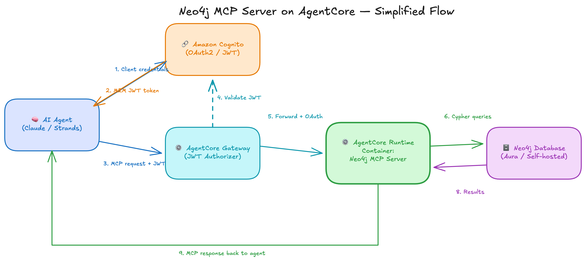

# Neo4j MCP Server on Amazon Bedrock AgentCore

Deploy the Neo4j MCP server to Amazon Bedrock AgentCore with Gateway access for AI agents.

> **Primary Goal:** This project is a **prototype for learning AWS AgentCore Gateway**. The Gateway is a critical component that provides unified authentication, centralized access control, multi-target aggregation, and audit logging. The Gateway architecture must not be removed or bypassed.

## Overview

This project deploys the [Neo4j MCP server](https://github.com/neo4j-partners/neo4j-mcp-canary) to AWS via AgentCore Gateway, enabling LLM agents to query Neo4j databases using the Model Context Protocol (MCP). Access is restricted to machine-to-machine (M2M) authentication only, designed specifically for agent access.

**Key Capabilities:**
- AgentCore Gateway configuration with OAuth2 authentication
- Gateway Target setup connecting Gateway to Runtime
- M2M (machine-to-machine) authentication via Cognito
- Gateway tool name prefixing and dynamic tool discovery
- Claude Sonnet integration via AWS Bedrock for MCP tool calling

## Architecture



An AI agent authenticates to Cognito (M2M OAuth2), sends MCP requests with a JWT to the AgentCore Gateway, which forwards them to the AgentCore Runtime hosting the Neo4j MCP server, which in turn queries the Neo4j database.

See [ARCHITECTURE.md](./ARCHITECTURE.md) for detailed diagrams, the authentication sequence, CDK stack breakdown, and design rationale.

**Key Features:**
- **Gateway-Only Access** - All requests go through AgentCore Gateway (no direct Runtime access)
- **M2M Authentication** - OAuth2 client credentials flow for agent access
- **No User Accounts** - No username/password management required
- **Automatic Token Exchange** - Gateway handles OAuth2 tokens with Runtime

**MCP Tools Available (Read-Only Mode):**
- `neo4j-mcp-server-target___get-schema` - Get the database schema
- `neo4j-mcp-server-target___read-cypher` - Execute read-only Cypher queries

> **Note:** Tool names are prefixed with the Gateway target name when accessed via Gateway. See [ARCHITECTURE.md](./ARCHITECTURE.md#gateway-tool-name-mapping) for details.

## Quick Start

### Prerequisites

- Docker with buildx support
- AWS CLI configured with appropriate credentials
- AWS CDK CLI (`npm install -g aws-cdk`)
- Python 3.10+
- Neo4j Aura database (or other Neo4j instance)

> **Important:** The Neo4j database must be running and accessible before deployment. The Neo4j MCP server verifies database connectivity on startup and exits immediately if it cannot connect. If using Neo4j Aura, ensure the database instance is resumed (not paused) before running `./deploy.py`.

### 1. Clone the Neo4j MCP Server

The ARM64 image is built from a local clone of the Neo4j MCP server source. Clone the [neo4j-mcp-canary](https://github.com/neo4j-partners/neo4j-mcp-canary) repository:

```bash
git clone https://github.com/neo4j-partners/neo4j-mcp-canary.git
```

You will point `NEO4J_MCP_REPO` in `.env` at this clone's path in the next step.

### 2. Configure Credentials

Create the `.env` file in this directory (`cp .env.sample .env`) and fill it in:

```bash
# Neo4j Database (passed to container at deploy time)
NEO4J_URI=neo4j+s://xxxxxxxx.databases.neo4j.io
NEO4J_DATABASE=neo4j
NEO4J_USERNAME=neo4j
NEO4J_PASSWORD=your-neo4j-password

# Build Configuration (path to the neo4j-mcp-canary clone from step 1)
NEO4J_MCP_REPO=/path/to/neo4j-mcp-canary

# Stack Configuration
AWS_REGION=us-east-1
```

> **Note:** No AGENT_USERNAME/AGENT_PASSWORD needed. The stack uses M2M OAuth2 with automatically generated client credentials.

### 3. Deploy

```bash
# If using a non-default AWS profile:
export AWS_PROFILE=my-profile

./deploy.py
```

This command:
1. Builds the ARM64 Docker image
2. Creates an ECR repository and pushes the image
3. Deploys the CDK stack with:
   - Cognito User Pool with OAuth2 Resource Server
   - Machine Client for M2M authentication
   - AgentCore Runtime with JWT authorizer
   - AgentCore Gateway with OAuth2 credential provider
   - Gateway Target connecting Gateway to Runtime
4. Creates custom resources for OAuth provider and runtime health check

Deployment takes approximately 5-10 minutes.

### 4. Generate Credentials

```bash
./deploy.py credentials
```

This generates `.mcp-credentials.json` with:
- Gateway URL
- OAuth2 client credentials (client_id, client_secret)
- Pre-fetched JWT token (valid for ~1 hour)

### 5. Test via Gateway (Recommended)

```bash
./cloud.sh
```

This tests the MCP server **via AgentCore Gateway** using the Python MCP client library. It reads credentials from `.mcp-credentials.json` and performs:

- **Token validation** - Checks if JWT token is still valid
- **MCP initialize** - Establishes MCP protocol session
- **tools/list** - Discovers available tools (with Gateway prefixes)
- **get-schema** - Retrieves Neo4j database schema
- **read-cypher** - Executes a test Cypher query

Available commands:
```bash
./cloud.sh          # Run full test suite
./cloud.sh token    # Check token status and expiry
./cloud.sh tools    # List available MCP tools
./cloud.sh schema   # Get database schema only
./cloud.sh query    # Run a test query
```

> **Note:** If the token expires, run `./deploy.py credentials` to refresh it.

### 6. Test Direct Runtime (Debugging)

```bash
./cloud-http.sh
```

This tests the MCP server **directly against AgentCore Runtime** (bypassing Gateway) using raw HTTP requests. Useful for debugging when Gateway tests fail, to isolate whether the issue is with Gateway or Runtime.

It performs:
1. **Retrieves client secret** from Cognito
2. **Gets M2M token** using client_credentials OAuth2 flow
3. **Sends raw JSON-RPC** initialize request to Runtime endpoint
4. **Sends tools/list** JSON-RPC request

This script shows the underlying protocol that the MCP client library abstracts away.

### 7. Deploy a Second Neo4j Instance (Optional)

Steps 2 through 6 deployed one instance from `.env`. To run a second one
alongside it, put its settings in a `.env.NAME` file and pass `--env NAME` to
every script. The suffix selects the config and its credentials together, so
the two can never be mixed up.

**Create the config.** Only the `NEO4J_*` values need to differ. The stack name
is derived from the suffix, and `NEO4J_MCP_REPO` and `ECR_REPO_NAME` can stay
the same when both deployments run the same MCP server image:

```bash
cp .env.sample .env.fleet
```

```bash
# .env.fleet
NEO4J_URI=neo4j+s://yyyyyyyy.databases.neo4j.io
NEO4J_DATABASE=neo4j
NEO4J_USERNAME=neo4j
NEO4J_PASSWORD=the-other-password

NEO4J_MCP_REPO=/path/to/neo4j-mcp-canary

AWS_REGION=us-east-1
```

No `STACK_NAME` line: `--env fleet` derives
`neo4j-agentcore-mcp-server-fleet` on its own.

**Deploy it, generate its credentials, and test it:**

```bash
./deploy.py --env fleet
./deploy.py --env fleet credentials   # writes .mcp-credentials.fleet.json
./cloud.sh --env fleet                # tests the fleet deployment
./cloud.sh                            # still tests the original .env deployment
```

Each deployment keeps its own stack, Gateway, Cognito pool, and credentials
file, so the two never interfere. `./deploy.py --env fleet cleanup` removes
only that one.

> **Note:** the derived stack name namespaces the Cognito domain, the IAM
> roles, the Gateway, and the Secrets Manager password path. Setting
> `STACK_NAME` explicitly overrides it, in which case the value has to be
> unique per deployment or the two collide.

See [Multiple Deployments](#multiple-deployments) for the full reference.

### 8. Run the LangGraph Agent

See [langgraph-mcp-agent/README.md](../neo4j-agentcore-agents/langgraph-mcp-agent/README.md) for instructions on running a LangGraph ReAct agent that connects to this MCP server.

### 9. Cleanup

```bash
./deploy.py cleanup
```

Removes all AWS resources. Add `--env NAME` to remove a specific deployment.

## Commands

### deploy.py

| Command | Description |
|---------|-------------|
| `./deploy.py` | Full deployment (build, push, stack) |
| `./deploy.py --skip-build` | Push existing image and deploy stack (skip Docker build) |
| `./deploy.py redeploy` | Fast redeploy (build, push, update runtime) |
| `./deploy.py stack` | Deploy CDK stack only |
| `./deploy.py synth` | Synthesize and preview the generated template |
| `./deploy.py status` | Show stack status and outputs |
| `./deploy.py credentials` | Generate `.mcp-credentials.json` with Gateway URL and JWT token |
| `./deploy.py stack-name` | Print the resolved stack name (used by the shell scripts) |
| `./deploy.py cleanup` | Delete stack, ECR repository, and password secret |
| `./deploy.py --env NAME ...` | Act on the `.env.NAME` deployment instead (see [Multiple Deployments](#multiple-deployments)) |

### cloud.sh (Gateway Testing)

Uses `.mcp-credentials.json` generated by `./deploy.py credentials`.

| Command | Description |
|---------|-------------|
| `./cloud.sh` | Run full test suite via Gateway |
| `./cloud.sh token` | Show current token and expiry status |
| `./cloud.sh tools` | List available MCP tools |
| `./cloud.sh schema` | Get database schema |
| `./cloud.sh query` | Run a test query |
| `./cloud.sh --env NAME <command>` | Run any of the above against the `.env.NAME` deployment |

### local.sh (Local Testing)

| Command | Description |
|---------|-------------|
| `./local.sh start` | Start local Docker server (no auth) |
| `./local.sh stop` | Stop local server |
| `./local.sh test` | Test local server |
| `./local.sh tools` | List tools on local server |
| `./local.sh --env NAME <command>` | Run any of the above using `.env.NAME` credentials |

### cloud-http.sh (Direct Runtime Debugging)

Tests Runtime directly with raw HTTP, bypassing Gateway. Useful for debugging.

| Command | Description |
|---------|-------------|
| `./cloud-http.sh` | Run JSON-RPC tests against Runtime endpoint |
| `./cloud-http.sh --env NAME` | Same, against the `.env.NAME` deployment |

### langgraph-mcp-agent/ (LangGraph Agent)

A standalone ReAct agent demonstrating full end-to-end MCP integration. See [langgraph-mcp-agent/README.md](../neo4j-agentcore-agents/langgraph-mcp-agent/README.md).

## Configuration

`./deploy.py`, `./cloud.sh`, and `./cloud-http.sh` read `.env` in this
directory, or `.env.NAME` when given `--env NAME`:

| Variable | Required | Description |
|----------|----------|-------------|
| `NEO4J_URI` | Yes | Neo4j connection string |
| `NEO4J_DATABASE` | Yes | Database name |
| `NEO4J_USERNAME` | Yes | Neo4j username (passed to container) |
| `NEO4J_PASSWORD` | Yes | Neo4j password (passed to container) |
| `NEO4J_MCP_REPO` | Yes | Path to local [neo4j-mcp-canary](https://github.com/neo4j-partners/neo4j-mcp-canary) clone (ARM64 image is built from here) |
| `AWS_REGION` | No | AWS region (default: us-east-1) |
| `STACK_NAME` | No | CDK stack name. Defaults to `neo4j-agentcore-mcp-server`, with `-NAME` appended under `--env NAME`. Max 41 characters, letters and digits joined by single hyphens, starting with a letter, and free of `aws`/`amazon`/`cognito`. The cap is IAM's 64-character role name limit less the 23 characters of `-gateway-execution-role` |

> **Note:** `./local.sh` is the exception. Without `--env` it reads `../.env`
> from the repository root, not the `.env` here. With `--env NAME` it reads
> `.env.NAME` from this directory like the other scripts.

## Multiple Deployments

Reference for the `--env NAME` selector. For a walkthrough, see
[step 7 of the Quick Start](#7-deploy-a-second-neo4j-instance-optional).

Each deployment is one `.env.NAME` file. The suffix names the config and its
generated credentials together, so a deployment can never be driven with
another one's credentials:

| Selector | Config file | Credentials file | Stack name |
|----------|-------------|------------------|------------|
| (none) | `.env` | `.mcp-credentials.json` | `neo4j-agentcore-mcp-server` |
| `--env fleet` | `.env.fleet` | `.mcp-credentials.fleet.json` | `neo4j-agentcore-mcp-server-fleet` |
| `--env finance` | `.env.finance` | `.mcp-credentials.finance.json` | `neo4j-agentcore-mcp-server-finance` |

`--env` works on `./deploy.py`, `./cloud.sh`, `./cloud-http.sh`, and
`./local.sh`, and must come before the command. The shell scripts export
`MCP_ENV`, which the Python clients read.

**The stack name comes from the suffix, so deployments cannot collide by
accident.** It namespaces the Cognito domain prefix, the IAM roles, the
Gateway, and the Secrets Manager password path. `./deploy.py [--env NAME]
stack-name` prints the resolved value, which is how the shell scripts learn it
rather than each keeping its own copy of the rule. Deployments that share one
MCP server image can keep the same `ECR_REPO_NAME` and `NEO4J_MCP_REPO`; only
the `NEO4J_*` values need to differ.

Both `.env.*` and `.mcp-credentials.*.json` are gitignored.

## Authentication

This deployment uses **M2M-only OAuth2 authentication** - there are no user accounts:

| Layer | Purpose | How It Works |
|-------|---------|--------------|
| Cognito OAuth2 | M2M Token | Client credentials flow with machine client |
| Gateway JWT | Gateway Access | Bearer token validates against Cognito |
| OAuth2 Provider | Gateway→Runtime | Gateway exchanges credentials for Runtime access |
| Neo4j (Env) | Database Access | Credentials configured at container startup |

**Authentication Flow:**

```
Agent → Cognito (client_credentials) → JWT Token
Agent → Gateway + JWT → Gateway validates token
Gateway → OAuth Provider → Gets Runtime token
Gateway → Runtime + OAuth Token → MCP Request
Runtime → Neo4j (env credentials) → Query
```

**Key Simplification:** Agents only need the Cognito client ID and secret (retrieved automatically from AWS). No username/password management required.

## Project Structure

```
neo4j-agentcore-mcp-server/
├── cdk/                              # AWS CDK Python application
│   ├── app.py                        # CDK app entry point
│   ├── neo4j_mcp_stack.py            # Stack definition (all resources)
│   ├── resources/
│   │   ├── oauth_provider/           # Lambda for OAuth2 credential provider
│   │   └── runtime_health_check/     # Lambda for runtime health check
│   ├── cdk.json                      # CDK configuration
│   └── pyproject.toml                # Python dependencies (uv)
├── client/
│   ├── gateway_client.py             # Gateway client (uses .mcp-credentials.json)
│   └── mcp_operations.py             # MCP operation helpers
├── deploy.py                         # Deployment script
├── cloud.sh                          # Gateway testing (MCP client)
├── cloud-http.sh                     # Direct Runtime testing (raw HTTP)
├── local.sh                          # Local Docker testing
├── .mcp-credentials.json             # Generated credentials (gitignored)
└── README.md                         # This file
```

### Credentials File

The `.mcp-credentials.json` file (generated by `./deploy.py credentials`) contains:

```json
{
  "gateway_url": "https://..../mcp",
  "token_url": "https://....amazoncognito.com/oauth2/token",
  "client_id": "...",
  "client_secret": "...",
  "scope": "neo4j-agentcore-mcp-server-mcp/invoke",
  "access_token": "eyJ...",
  "token_expires_at": "2024-01-15T12:00:00+00:00",
  "region": "us-east-1",
  "stack_name": "neo4j-agentcore-mcp-server"
}
```

This file is gitignored and contains secrets. Other MCP clients can use it to connect to the Gateway.

## Local Development

Test the MCP server locally before deploying:

```bash
# Start local server (no auth needed)
./local.sh start

# Test locally
./local.sh test

# Stop when done
./local.sh stop
```

## Further Reading

See [ARCHITECTURE.md](./ARCHITECTURE.md) for:
- Detailed architecture diagrams (Mermaid)
- CDK stack structure and module breakdown
- Authentication flow sequence diagrams
- Why M2M-only via Gateway
- Why AgentCore vs Fargate/Lambda
- Gateway tool name mapping challenges
- Troubleshooting guide

## Resources

- [Neo4j MCP Server (neo4j-mcp-canary)](https://github.com/neo4j-partners/neo4j-mcp-canary)
- [Amazon Bedrock AgentCore](https://docs.aws.amazon.com/bedrock-agentcore/)
- [Model Context Protocol](https://modelcontextprotocol.io/)
