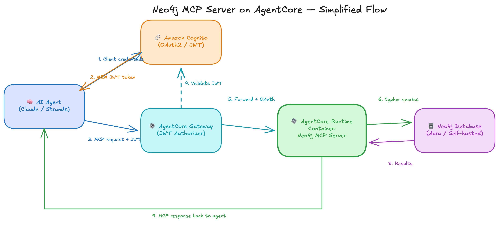

# Neo4j MCP Server on Amazon Bedrock AgentCore

This project deploys the Neo4j MCP server to Amazon Bedrock AgentCore. AI
agents reach it through an AgentCore Gateway and use its tools to query Neo4j.

This project is a prototype for learning AgentCore Gateway. Keep the Gateway
in the design. All agent traffic must go through it.

## Overview

- **MCP server:** The [Neo4j MCP server](https://github.com/neo4j-partners/neo4j-mcp-canary) runs on AgentCore Runtime. It gives agents read-only tools for a Neo4j database.
- **Gateway:** The AgentCore Gateway is the only way in. It checks each request's token and forwards the request to the Runtime.
- **Machine login:** Agents log in with a Cognito client ID and secret. There are no user accounts or passwords to manage.
- **Token exchange:** The Gateway gets its own token to call the Runtime. Agents do not handle that step.
- **Tools:** The Gateway exposes two read-only tools, `neo4j-mcp-server-target___get-schema` and `neo4j-mcp-server-target___read-cypher`.
- **Tool prefix:** The Gateway adds the target name to each tool name. [ARCHITECTURE.md](./ARCHITECTURE.md#gateway-tool-name-mapping) explains the prefix.
- **Named deployments:** You can run several deployments side by side. Each one uses its own `.env.NAME` file.

## Quick start

Run these commands from `neo4j-mcp-server/`:

```bash
git clone https://github.com/neo4j-partners/neo4j-mcp-canary.git /path/to/neo4j-mcp-canary
cp .env.sample .env         # add NEO4J_* values and NEO4J_MCP_REPO
./deploy.py                 # build, push, and deploy the stack (5 to 10 minutes)
./deploy.py credentials     # write .mcp-credentials.json
./cloud.sh                  # test the server through the Gateway
./deploy.py cleanup         # delete all AWS resources when done
```

## Architecture



A request moves through these steps:

1. The agent gets a token from Cognito.
2. The agent sends an MCP request with that token to the Gateway.
3. The Gateway checks the token and forwards the request to the Runtime.
4. The Neo4j MCP server on the Runtime queries Neo4j.

[ARCHITECTURE.md](./ARCHITECTURE.md) has detailed diagrams, the login
sequence, the CDK stack layout, and the design reasons.

## Prerequisites

- **Docker:** Docker must have buildx support. The deploy builds an ARM64 image.
- **AWS CLI:** The AWS CLI must have working credentials.
- **AWS CDK CLI:** Install it with `npm install -g aws-cdk`.
- **Python:** Python 3.10 or later is required.
- **Neo4j:** You need a Neo4j Aura database or another Neo4j instance.

Start the database before you deploy. The MCP server checks the database
connection at startup and exits if it cannot connect. If you use Neo4j Aura,
resume a paused instance before you run `./deploy.py`.

## Step 1: Clone the MCP server source

The deploy builds the ARM64 image from a local copy of the
[neo4j-mcp-canary](https://github.com/neo4j-partners/neo4j-mcp-canary)
repository. Clone it anywhere:

```bash
git clone https://github.com/neo4j-partners/neo4j-mcp-canary.git
```

You set `NEO4J_MCP_REPO` to this path in the next step.

## Step 2: Configure the deployment

Run this from `neo4j-mcp-server/`:

```bash
cp .env.sample .env
```

Fill in `.env`:

```bash
# Neo4j database
NEO4J_URI=neo4j+s://xxxxxxxx.databases.neo4j.io
NEO4J_DATABASE=neo4j
NEO4J_USERNAME=neo4j
NEO4J_PASSWORD=your-neo4j-password

# Path to the neo4j-mcp-canary clone from step 1
NEO4J_MCP_REPO=/path/to/neo4j-mcp-canary

# AWS region
AWS_REGION=us-east-1
```

You do not need an agent username or password. The stack creates the client
ID and secret for you.

## Step 3: Deploy

Run this from `neo4j-mcp-server/`:

```bash
export AWS_PROFILE=my-profile   # only if you use a non-default AWS profile
./deploy.py
```

The deploy takes about 5 to 10 minutes. It does these steps:

1. It checks that it can connect to Neo4j.
2. It builds the ARM64 Docker image.
3. It creates an ECR repository and pushes the image.
4. It stores the Neo4j password in Secrets Manager.
5. It bootstraps CDK in the region if that has not been done yet.
6. It deploys the CDK stack.

The CDK stack creates these resources:

- **Cognito user pool:** The pool has an OAuth2 resource server and a machine client for agent login.
- **AgentCore Runtime:** The Runtime runs the MCP server and checks tokens with a JWT authorizer.
- **AgentCore Gateway:** The Gateway has an OAuth2 credential provider for calling the Runtime.
- **Gateway target:** The target connects the Gateway to the Runtime.
- **Custom resources:** Lambda functions set up the OAuth provider and check that the Runtime is healthy.

## Step 4: Generate credentials

Run this from `neo4j-mcp-server/`:

```bash
./deploy.py credentials
```

This command writes `.mcp-credentials.json`. The file holds the Gateway URL,
the client ID and secret, and a JWT token. The token lasts about 1 hour. Run
the command again to get a new one.

## Step 5: Test through the Gateway

Run this from `neo4j-mcp-server/`:

```bash
./cloud.sh
```

This script tests the server through the Gateway with the Python MCP client.
It reads `.mcp-credentials.json` and runs these checks:

- **Token check:** The script checks that the JWT token has not expired.
- **MCP initialize:** The script opens an MCP session.
- **`tools/list`:** The script lists the tools, with their Gateway prefixes.
- **`get-schema`:** The script reads the Neo4j schema.
- **`read-cypher`:** The script runs a test Cypher query.

## Step 6: Test the Runtime directly

Run this from `neo4j-mcp-server/`:

```bash
./cloud-http.sh
```

This script skips the Gateway and sends raw HTTP requests to the Runtime. Use
it when the Gateway test fails. It shows whether the problem is in the Gateway
or the Runtime. It runs these steps:

1. It gets the client secret from Cognito.
2. It gets a machine token with the client credentials flow.
3. It sends a raw JSON-RPC `initialize` request to the Runtime.
4. It sends a raw JSON-RPC `tools/list` request.

## Step 7: Deploy a second Neo4j instance (optional)

Steps 2 through 6 deploy one instance from `.env`. To run a second instance,
put its settings in `.env.NAME` and pass `--env NAME` to every script. The
name picks both the config file and its credentials file, so the two always
match.

Run these commands from `neo4j-mcp-server/`:

```bash
cp .env.sample .env.fleet
```

Only the `NEO4J_*` values need to change. Both deployments can use the same
`NEO4J_MCP_REPO` and `ECR_REPO_NAME` when they run the same image:

```bash
# .env.fleet
NEO4J_URI=neo4j+s://yyyyyyyy.databases.neo4j.io
NEO4J_DATABASE=neo4j
NEO4J_USERNAME=neo4j
NEO4J_PASSWORD=the-other-password

NEO4J_MCP_REPO=/path/to/neo4j-mcp-canary

AWS_REGION=us-east-1
```

Leave out `STACK_NAME`. The `--env fleet` flag sets the stack name to
`neo4j-mcp-server-fleet`.

Deploy, generate credentials, and test:

```bash
./deploy.py --env fleet
./deploy.py --env fleet credentials   # writes .mcp-credentials.fleet.json
./cloud.sh --env fleet                # tests the fleet deployment
./cloud.sh                            # still tests the .env deployment
```

Each deployment has its own stack, Gateway, Cognito pool, and credentials
file. `./deploy.py --env fleet cleanup` removes only the fleet deployment.

If you set `STACK_NAME` yourself, it replaces the derived name. It must then
be unique for each deployment. Two deployments with the same stack name
collide.

[Multiple deployments](#multiple-deployments) has the full reference.

## Step 8: Run the LangGraph agent

[`quickstart/`](../quickstart/README.md) shows how to run a LangGraph ReAct
agent against this server.

## Step 9: Clean up

Run this from `neo4j-mcp-server/`:

```bash
./deploy.py cleanup
```

This command deletes the stack, the Secrets Manager password, and the ECR
repository. It asks you to confirm first. It asks again before it deletes the
ECR repository. Add `--env NAME` to remove one named deployment.

## Commands

All commands run from `neo4j-mcp-server/`.

### deploy.py

| Command | Description |
|---------|-------------|
| `./deploy.py` | Build the image, push it, and deploy the stack |
| `./deploy.py --skip-build` | Push the existing image and deploy the stack |
| `./deploy.py redeploy` | Build, push, and update the Runtime only |
| `./deploy.py stack` | Deploy the CDK stack only |
| `./deploy.py synth` | Generate and preview the CloudFormation template |
| `./deploy.py status` | Show the stack status and outputs |
| `./deploy.py credentials` | Write `.mcp-credentials.json` with the Gateway URL and a JWT token |
| `./deploy.py stack-name` | Print the resolved stack name. The shell scripts use this. |
| `./deploy.py cleanup` | Delete the stack, the ECR repository, and the password secret |
| `./deploy.py help` | Show the full help text |
| `./deploy.py --env NAME ...` | Run any command against the `.env.NAME` deployment |

### cloud.sh (Gateway tests)

`cloud.sh` reads `.mcp-credentials.json` from `./deploy.py credentials`.

| Command | Description |
|---------|-------------|
| `./cloud.sh` | Run the full test suite through the Gateway |
| `./cloud.sh token` | Show the current token and when it expires |
| `./cloud.sh tools` | List the MCP tools |
| `./cloud.sh schema` | Get the database schema |
| `./cloud.sh query` | Run a test query that counts nodes by label |
| `./cloud.sh --env NAME <command>` | Run any command against the `.env.NAME` deployment |

If the token expires, run `./deploy.py credentials` again.

### local.sh (local tests)

| Command | Description |
|---------|-------------|
| `./local.sh start` | Start the server in local Docker with no login |
| `./local.sh stop` | Stop the local server |
| `./local.sh test` | Test the local server |
| `./local.sh tools` | List the tools on the local server |
| `./local.sh call <tool> '<json>'` | Call one tool with JSON arguments |
| `./local.sh --env NAME <command>` | Run any command with the `.env.NAME` Neo4j values |
| `MCP_LOCAL_PORT=18000 ./local.sh start` | Start the local server on port 18000 |

### cloud-http.sh (direct Runtime tests)

| Command | Description |
|---------|-------------|
| `./cloud-http.sh` | Send JSON-RPC tests straight to the Runtime |
| `./cloud-http.sh --env NAME` | Run the same tests against the `.env.NAME` deployment |

## Configuration

`./deploy.py`, `./cloud.sh`, and `./cloud-http.sh` read `.env` in
`neo4j-mcp-server/`. With `--env NAME`, they read `.env.NAME` instead.

| Variable | Required | Description |
|----------|----------|-------------|
| `NEO4J_URI` | Yes | Neo4j connection string |
| `NEO4J_DATABASE` | Yes | Database name |
| `NEO4J_USERNAME` | Yes | Neo4j username. The deploy passes it to the container. |
| `NEO4J_PASSWORD` | Yes | Neo4j password. The deploy stores it in Secrets Manager as `<stack-name>/neo4j-password`. |
| `NEO4J_MCP_REPO` | Yes | Path to your local [neo4j-mcp-canary](https://github.com/neo4j-partners/neo4j-mcp-canary) clone. The deploy builds the ARM64 image from it. |
| `AWS_REGION` | No | AWS region. The default is `us-east-1`. |
| `STACK_NAME` | No | CDK stack name. See the rules below. |
| `ECR_REPO_NAME` | No | ECR repository name. The default is `neo4j-mcp-server`. |
| `IMAGE_TAG` | No | Docker image tag. The default is the short git SHA of `NEO4J_MCP_REPO`, or `latest` if that folder is not a git repo. |
| `CDK_BOOTSTRAP_EXECUTION_POLICIES` | No | Comma-separated policy ARNs for the CDK bootstrap role. The default is `PowerUserAccess` plus `IAMFullAccess`. This avoids `AdministratorAccess`, which org SCPs often block. |

`STACK_NAME` rules:

- **Default:** The stack name is `neo4j-mcp-server`. With `--env NAME`, it becomes `neo4j-mcp-server-NAME`.
- **Characters:** The name uses letters and digits joined by single hyphens. It must start with a letter.
- **Blocked words:** The name must not contain `aws`, `amazon`, or `cognito`. Cognito rejects those words in the domain prefix.
- **Length:** Every resource name comes from the stack name, so the stack name has a length limit. [`neo4j-mcp-server/cdk/naming.py`](./cdk/naming.py) computes it. The limit is 41 characters today.
- **Check:** `./deploy.py` checks the name before it builds anything. It names the resource that is too long.

`./local.sh` reads a different file. Without `--env`, it reads `.env` at the
repo root, not `neo4j-mcp-server/.env`. With `--env NAME`, it reads
`neo4j-mcp-server/.env.NAME` like the other scripts.

## Multiple deployments

This section is the reference for `--env NAME`. [Step 7](#step-7-deploy-a-second-neo4j-instance-optional)
walks through an example.

Each deployment is one `.env.NAME` file. The name picks the config file and
its credentials file together. This stops you from using one deployment's
credentials with another.

| Selector | Config file | Credentials file | Stack name |
|----------|-------------|------------------|------------|
| (none) | `.env` | `.mcp-credentials.json` | `neo4j-mcp-server` |
| `--env fleet` | `.env.fleet` | `.mcp-credentials.fleet.json` | `neo4j-mcp-server-fleet` |
| `--env finance` | `.env.finance` | `.mcp-credentials.finance.json` | `neo4j-mcp-server-finance` |

- **Scripts:** `--env` works with `./deploy.py`, `./cloud.sh`, `./cloud-http.sh`, and `./local.sh`.
- **Position:** Put `--env` before the command.
- **Python clients:** The shell scripts export `MCP_ENV`. The Python clients read it.
- **Stack name:** The stack name comes from the name you pass. It sets the Cognito domain prefix, the IAM roles, the Gateway, and the Secrets Manager password path. Two named deployments cannot collide by accident.
- **Name lookup:** `./deploy.py [--env NAME] stack-name` prints the stack name. The shell scripts call it, so every script uses the same rule.
- **Shared image:** Deployments that run the same image can share `ECR_REPO_NAME` and `NEO4J_MCP_REPO`. Only the `NEO4J_*` values need to differ.
- **Git:** Git ignores `.env.*` and `.mcp-credentials.*.json`.

## Authentication

This deployment uses machine login only. It has no user accounts.

| Layer | Purpose | How it works |
|-------|---------|--------------|
| Cognito OAuth2 | Machine token | The agent uses the client credentials flow with the machine client. |
| Gateway JWT | Gateway access | The Gateway checks the bearer token against Cognito. |
| OAuth2 provider | Gateway to Runtime | The Gateway trades its credentials for a Runtime token. |
| Neo4j (env) | Database access | The container reads the database login at startup. |

Login flow:

```
Agent → Cognito (client_credentials) → JWT Token
Agent → Gateway + JWT → Gateway validates token
Gateway → OAuth Provider → Gets Runtime token
Gateway → Runtime + OAuth Token → MCP Request
Runtime → Neo4j (env credentials) → Query
```

Agents need only the Cognito client ID and secret. `./deploy.py credentials`
gets both from AWS for you.

## Project structure

```
neo4j-mcp-server/
├── cdk/                              # AWS CDK Python app
│   ├── app.py                        # CDK app entry point
│   ├── neo4j_mcp_stack.py            # Stack definition with all resources
│   ├── naming.py                     # Stack and resource name rules
│   ├── resources/
│   │   ├── oauth_provider/           # Lambda for the OAuth2 credential provider
│   │   └── runtime_health_check/     # Lambda for the Runtime health check
│   ├── cdk.json                      # CDK config
│   └── pyproject.toml                # Python dependencies (uv)
├── client/
│   ├── gateway_client.py             # Gateway client used by cloud.sh
│   ├── get_token.py                  # Cognito username and password token script
│   ├── mcp_local_client.py           # Local client used by local.sh
│   └── mcp_operations.py             # MCP operation helpers
├── docs/
│   └── CLAUDE_DESKTOP.md             # Claude Desktop setup
├── deploy.py                         # Deployment script
├── cloud.sh                          # Gateway tests (MCP client)
├── cloud-http.sh                     # Direct Runtime tests (raw HTTP)
├── local.sh                          # Local Docker tests
├── test-neo4j-connection.sh          # Neo4j connection check with cypher-shell
├── .env.sample                       # Config template
├── .mcp-credentials.json             # Generated credentials (gitignored)
├── ARCHITECTURE.md                   # Detailed architecture
└── README.md                         # This file
```

### Credentials file

`./deploy.py credentials` writes `.mcp-credentials.json`:

```json
{
  "gateway_url": "https://..../mcp",
  "token_url": "https://....amazoncognito.com/oauth2/token",
  "client_id": "...",
  "client_secret": "...",
  "scope": "neo4j-mcp-server-mcp/invoke",
  "access_token": "eyJ...",
  "token_expires_at": "2024-01-15T12:00:00+00:00",
  "region": "us-east-1",
  "stack_name": "neo4j-mcp-server"
}
```

The file holds secrets, so git ignores it. Any MCP client can use it to
connect to the Gateway. To copy each deployment's credentials to the samples
that use it, run [`scripts/sync-credentials.sh`](../scripts/sync-credentials.sh)
from the repo root.

## Local development

Test the server locally before you deploy. Run these commands from
`neo4j-mcp-server/`:

```bash
./local.sh start      # start the local server with no login
./local.sh test       # test it
./local.sh stop       # stop it

# Use another host port if 8000 is busy. Set it for every command.
MCP_LOCAL_PORT=18000 ./local.sh start
MCP_LOCAL_PORT=18000 ./local.sh test
```

Set `MCP_SERVER_URL` to point `test`, `tools`, and `call` at a different URL.

## Further reading

[ARCHITECTURE.md](./ARCHITECTURE.md) covers these topics:

- **Diagrams:** The file has detailed Mermaid architecture diagrams.
- **CDK stack:** The file breaks down the stack by module.
- **Login flow:** The file has sequence diagrams for authentication.
- **Gateway only:** The file explains why agents use machine login through the Gateway.
- **Hosting choice:** The file compares AgentCore with Fargate and Lambda.
- **Tool names:** The file explains the Gateway tool name prefix.
- **Troubleshooting:** The file has a troubleshooting guide.

[docs/CLAUDE_DESKTOP.md](./docs/CLAUDE_DESKTOP.md) shows how to connect
Claude Desktop.

## Resources

- [Neo4j MCP Server (neo4j-mcp-canary)](https://github.com/neo4j-partners/neo4j-mcp-canary)
- [Amazon Bedrock AgentCore](https://docs.aws.amazon.com/bedrock-agentcore/)
- [Model Context Protocol](https://modelcontextprotocol.io/)
