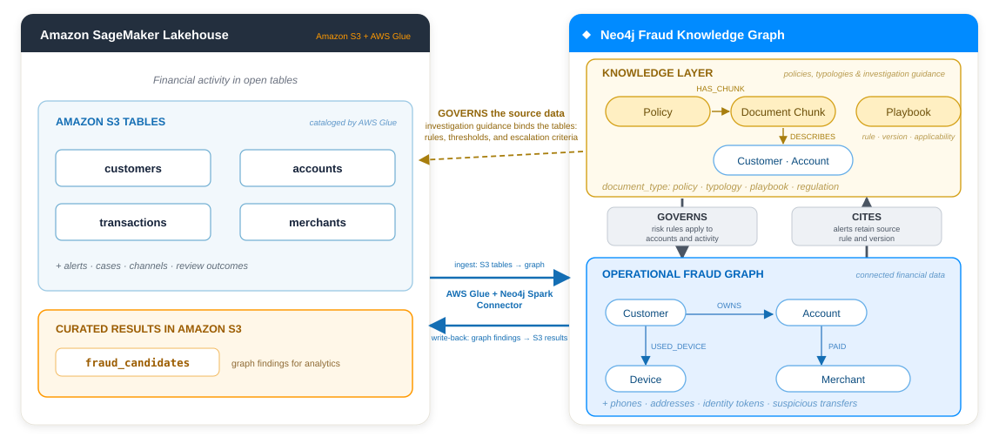
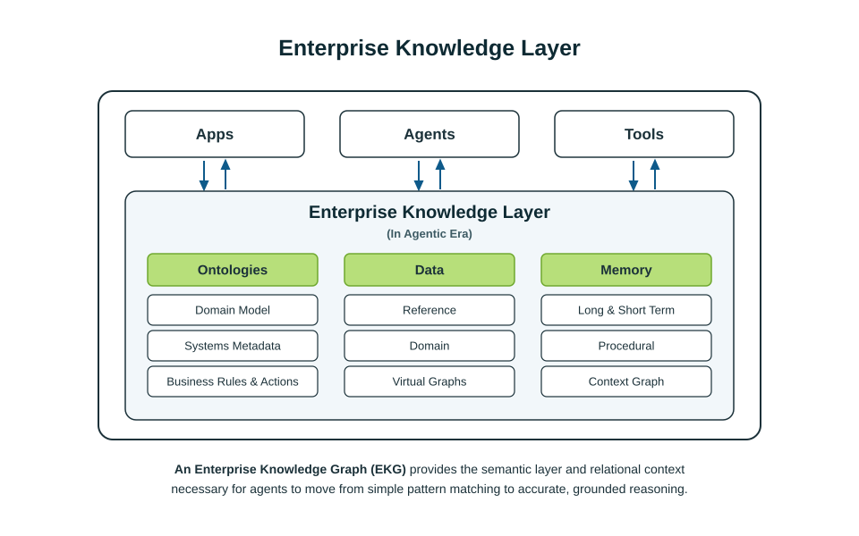
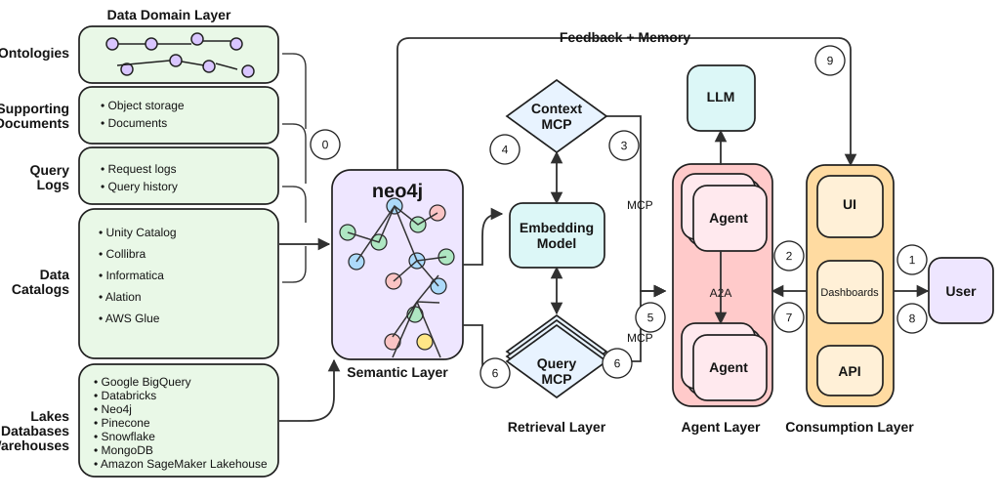

<style>
section {
  --marp-auto-scaling-code: false;
  color: #0f172a;
  font-size: 26px;
  padding: 48px 64px;
}

h1 {
  color: #0f172a;
  font-size: 52px;
}

h2 {
  color: #0f172a;
  font-size: 37px;
  margin-bottom: 18px;
}

h3 {
  color: #0f766e;
  font-size: 26px;
}

table {
  font-size: 21px;
  width: 100%;
}

th {
  background: #e2e8f0;
}

td, th {
  padding: 9px 13px;
}

code {
  font-size: 21px;
}

small {
  color: #64748b;
  font-size: 13px;
}

.lead {
  background: linear-gradient(135deg, #f8fafc 0%, #ecfeff 100%);
}

.lead h1 {
  font-size: 58px;
  max-width: 1050px;
}

.lead h2 {
  color: #0f766e;
  font-size: 29px;
  font-weight: 500;
  max-width: 980px;
}

.promise {
  color: #475569;
  font-size: 21px;
  margin-top: 72px;
}

.callout {
  background: #ecfeff;
  border-left: 6px solid #14b8a6;
  margin-top: 18px;
  padding: 12px 18px;
}

.status-now {
  color: #047857;
  font-weight: 700;
}

.status-preview {
  color: #a16207;
  font-weight: 700;
}

.status-roadmap {
  color: #7c3aed;
  font-weight: 700;
}

.cols {
  display: grid;
  gap: 30px;
  grid-template-columns: 1fr 1fr;
}

.center {
  text-align: center;
}

.tight li {
  margin: 6px 0;
}

li {
  opacity: 1 !important;
  visibility: visible !important;
}
</style>

<!-- _class: lead -->

# AWS + Neo4j: Connected Context for Grounded Enterprise AI

## Place Neo4j graph, knowledge, and memory beside AWS data and agent services

<div class="promise">A field guide for architecture conversations, connected investigations, and co-sell motions</div>

---

## AWS provides the foundation for governed enterprise AI


---

## Neo4j adds connected context across the AWS platform


---

## AWS and Neo4j have a clear division of labor

| AWS | Neo4j |
| --- | --- |
| **Store:** Keep authoritative records, documents, tables, and operational history. | **Connect:** Represent important entities, relationships, and investigation context. |
| **Govern:** Control access through catalogs, policies, identities, and platform services. | **Explain:** Link data to business terms, policies, typologies, and prior decisions. |
| **Analyze:** Use SQL, Spark, streaming, and ML for activity at scale. | **Traverse:** Find paths, communities, shared identifiers, and network patterns. |
| **Run AI:** Supply models, agent runtimes, gateways, and application infrastructure. | **Ground AI:** Give agents connected facts, semantic routing, tools, and memory. |

<div class="callout"><strong>AWS adjacency:</strong> Neo4j complements Athena and Redshift for connected analysis. AWS remains the system of record.</div>

---

## Neo4j connects through AWS services customers already use

| Integration path | AWS home | What it enables |
| --- | --- | --- |
| **Neo4j Spark Connector** | Amazon EMR | Read graph data into Spark and write Spark DataFrames to Neo4j. |
| **Neo4j Connector for AWS Glue** | AWS Glue | Build managed ETL jobs from AWS data sources to Neo4j. |
| **Neo4j Connector for Kafka** | Amazon MSK | Stream events into Neo4j and publish graph changes. |
| **Neo4j drivers** | Lambda, ECS, EKS, EC2 | Run Cypher from existing application services. |
| **Neo4j MCP tools** | AgentCore and Strands | Let AWS-hosted agents call graph retrieval tools. |

<div class="callout"><strong>Field message:</strong> Extend the architecture through AWS services already present in the customer environment.</div>

<small>Sources: [Neo4j Spark Connector](https://neo4j.com/docs/spark/current/), [Kafka Connector](https://neo4j.com/docs/kafka/current/), [connectors and drivers](https://neo4j.com/docs/connectors/), and [Neo4j MCP](https://neo4j.com/developer/genai-ecosystem/model-context-protocol-mcp/)</small>

---

## Virtual Graph will extend Cypher to governed AWS tables in place

```text
Cypher question
      ↓
Virtual graph model
      ↓ translates traversal into SQL
      ↓
S3 Tables with Apache Iceberg + AWS Glue Data Catalog
      ↓
Connected result without a full data copy
```

- **Athena and Redshift Spectrum:** Use SQL to query data in external sources.
- **Virtual Graph:** Presents a graph model, accepts Cypher, and translates the traversal into SQL against the source tables.
- **Governance:** Keeps AWS tables and catalog controls in the query path.

<div class="callout"><span class="status-preview">Available in public preview:</span> Snowflake, Databricks, and Google BigQuery. <span class="status-roadmap">In build for AWS:</span> S3 Tables and Glue Data Catalog support.</div>

<!-- Source: https://neo4j.com/blog/auradb/neo4j-virtual-graph-is-now-in-public-preview/ -->

---

## A fraud ring shows why an investigation needs both views

One transfer can look ordinary. Its connections can reveal coordinated activity.

```text
Customer A → Account A → Device X ← Account B ← Customer B

Account A → Account B → Account C → Account A
```

- **Shared identity signal:** Two customers use the same device.
- **Circular movement:** Funds return to the starting account.
- **Corroborating evidence:** Phone numbers, addresses, merchants, and timing strengthen or weaken the case.

<div class="callout"><strong>Investigation question:</strong> Which accounts form a circular payment chain, and what AWS activity makes that chain unusual?</div>

---

## Keep transaction evidence in AWS and connected context in Neo4j



<div class="callout"><strong>One question, two query paths:</strong> Athena retrieves transaction evidence from S3 tables. Cypher traverses entities, relationships, patterns, policies, and cases.</div>

---

## A shared knowledge layer makes connected context reusable



<div class="callout"><strong>Purpose:</strong> Connect business meaning, data assets, policies, provenance, and prior decisions in one governed graph.</div>

<!-- Source: https://neo4j.com/blog/agentic-ai/enterprise-knowledge-layer/ -->

---

## Policy and precedent make each graph finding explainable

```text
Alert
  → suspicious graph pattern
  → fraud typology
  → governing policy
  → prior investigation
  → evidence and outcome
```

- **Explain the finding:** Link the alert to the pattern and policy that make it significant.
- **Reuse prior work:** Find similar investigations, evidence, decisions, and outcomes.
- **Keep the path inspectable:** Let reviewers trace each answer back to governed sources.

| Adjacent AWS capability | What Neo4j adds |
| --- | --- |
| **Amazon Bedrock Knowledge Bases** retrieves relevant passages from documents. | **Enterprise Knowledge Layer** queries connected business concepts, relationships, provenance, and prior decisions. |

---

## NeoCarta builds a semantic map from metadata and usage



<div class="callout"><strong>Inputs:</strong> Catalog metadata, business glossary terms, and query-usage lineage. <strong>Output:</strong> An embedded Neo4j semantic graph exposed through MCP.</div>

<!-- Source: https://github.com/neo4j-labs/neocarta -->

---

## The semantic map improves discovery, routing, and SQL generation

```text
Business question
   → governed business term
   → approved table and columns
   → known join path
   → generated SQL
   → cited result
```

- **Data discovery:** Find physical assets from the language a customer uses.
- **Query routing:** Select the catalog, dataset, and query tool that fit the question.
- **Text-to-SQL:** Give the agent table meaning and known joins before query generation.

<div class="callout"><strong>AWS adjacency:</strong> Glue Data Catalog and SageMaker Catalog stay authoritative. <span class="status-roadmap">Planned NeoCarta metadata support</span> differs from the available AWS Glue ETL connector.</div>

<small>NeoCarta is a Neo4j Labs project supported by the Neo4j field team. It is not a Neo4j product.</small>

---

## Agent Memory preserves facts, context, and reasoning


<div class="callout"><strong>Long-term model:</strong> POLE+O represents Person, Object, Location, Event, and Organization. Temporal validity records when a fact was true.</div>

<!-- Source: https://github.com/neo4j-labs/agent-memory -->

---

## Graph memory makes each result inspectable and reusable

- **Short-term memory:** Keep the active conversation and investigation session.
- **Long-term memory:** Store entities, facts, relationships, and temporal context.
- **Reasoning memory:** Record tool calls, evidence, decision traces, and feedback.
- **Reusable outcomes:** Connect a confirmed result to the policies, patterns, and evidence that supported it.

| Adjacent AWS capability | What Neo4j adds |
| --- | --- |
| **AgentCore Memory** provides managed short-term and long-term memory for AWS agents. | **Neo4j Agent Memory** makes entities, relationships, temporal facts, and reasoning traces directly traversable. |

<div class="callout"><strong>Integration:</strong> Use the Strands Agents SDK integration to add graph-native memory to an AWS agent.</div>

---

## These capabilities meet inside an AWS-hosted agent workflow

```text
User question
     ↓
AgentCore Runtime + Strands agent
     ↓
Amazon Bedrock model
     ↓ selects a tool through AgentCore Gateway
     ├─ Neo4j MCP → Cypher over persisted graph
     ├─ SQL tool  → Athena over S3 tables
     ├─ Document retrieval
     └─ Enterprise API
     ↓
Answer with evidence and provenance
```

<div class="callout"><strong>Security boundary:</strong> AgentCore Gateway manages tool access and OAuth 2.0. Each source service enforces data access.</div>

---

## Virtual Graph fits inside a multi-tool knowledge layer

| Retrieval need | Route | Best fit |
| --- | --- | --- |
| **Fast connected context** | Cypher over the persisted Neo4j graph | Repeated traversal, graph patterns, and selected operational context |
| **AWS data in place**<br><span class="status-roadmap">Planned</span> | Cypher through Virtual Graph, translated to SQL | Connected questions over governed S3 Tables without a full copy |
| **Aggregate evidence** | SQL through Athena | Totals, trends, rankings, and time-window analysis |
| **Policy text** | Document retrieval | Passages from policies, playbooks, and regulatory guidance |
| **Operational action** | Enterprise API | Case updates, alerts, approvals, and workflow steps |

<div class="callout"><strong>Design rule:</strong> The knowledge layer selects the right path. Each source remains responsible for execution and access control.</div>

---

## Together, connected knowledge grounds the AWS agent stack


---

## Neo4j supports managed and self-managed AWS deployment

- **AuraDB on AWS:** Use Neo4j's managed graph database in an AWS region that fits the workload.
- **AWS Marketplace:** Purchase eligible Aura plans through AWS billing and marketplace terms.
- **Private connectivity:** Use AWS PrivateLink with supported Aura enterprise configurations.
- **Self-managed:** Deploy Neo4j on Amazon EKS or Amazon EC2 when the customer manages the runtime.
- **AgentCore regions:** AgentCore is generally available in nine AWS Regions, including `us-east-1` and `us-west-2`. Confirm feature-level availability for the target region.

<div class="callout"><strong>Field choice:</strong> Start with the customer's operating model, procurement path, networking controls, and region requirements.</div>

<small>Sources: [Aura through cloud marketplaces](https://neo4j.com/docs/aura/cloud-providers/), [Aura secure connections](https://neo4j.com/docs/aura/security/secure-connections/), and [AgentCore supported regions](https://docs.aws.amazon.com/bedrock-agentcore/latest/devguide/agentcore-regions.html)</small>

---

## Position current capabilities separately from preview and roadmap

| Status | Capabilities |
| --- | --- |
| <span class="status-now">Available now</span> | AuraDB on AWS; Cypher and Graph Data Science; Spark, Glue, Kafka, driver, and MCP integration paths; the Enterprise Knowledge Layer pattern; NeoCarta Labs; Neo4j Agent Memory Labs |
| <span class="status-preview">Public preview</span> | Neo4j Virtual Graph for Snowflake, Databricks, and Google BigQuery |
| <span class="status-roadmap">In build or planned</span> | Virtual Graph support for AWS S3 Tables and Glue Data Catalog; NeoCarta support for Glue Data Catalog metadata |

<div class="callout"><strong>Position clearly:</strong> Match the customer proposal to the status shown here. Validate preview and roadmap details before making commitments.</div>

<!-- Sources: https://neo4j.com/blog/auradb/neo4j-virtual-graph-is-now-in-public-preview/ and https://github.com/neo4j-labs/neocarta -->

---

## Start with one governed question that needs both views

1. **Find the question:** Choose one investigation that needs AWS transaction evidence and connected Neo4j context.
2. **Map the sources:** Identify the S3 tables, catalogs, graph entities, policies, and systems involved.
3. **Prove both paths:** Use Athena for activity and Cypher for connections in one evidence-backed answer.
4. **Review the result:** Add automated checks, investigator feedback, and policy review.
5. **Expand with evidence:** Reuse the proven pattern for the next valuable question.

<div class="callout"><strong>First customer motion:</strong> Ask, “Which governed investigation is slow today because transaction evidence and connected context live in separate places?”</div>
