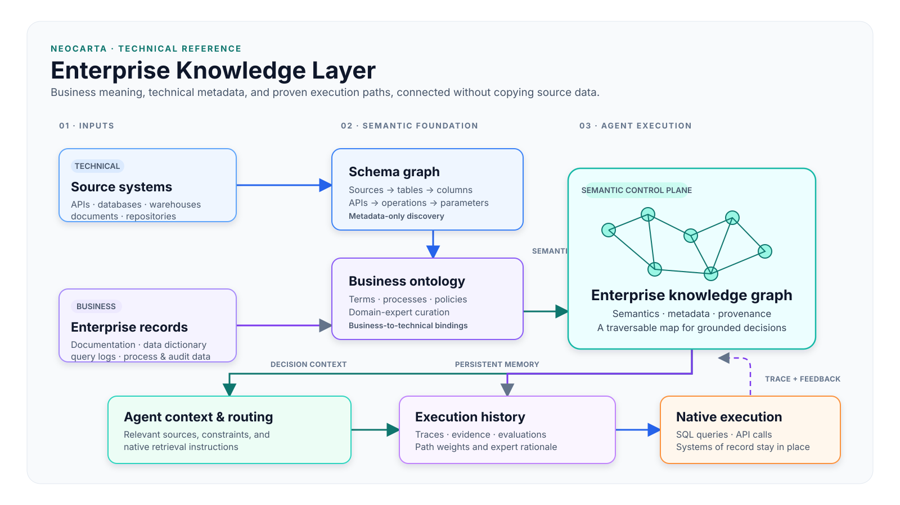

<style>
section {
  --marp-auto-scaling-code: false;
}

li {
  opacity: 1 !important;
  animation: none !important;
  visibility: visible !important;
}

/* Disable all fragment animations */
.marp-fragment {
  opacity: 1 !important;
  visibility: visible !important;
}

ul > li,
ol > li {
  opacity: 1 !important;
}
</style>

# Enterprise Knowledge Layer

## Semantic grounding, agent routing, and reusable process memory

---

## Five Ways AWS Connects to Neo4j

Choose the connection that fits the data flow and the workload.

- **Spark Connector on Amazon EMR:** moves large Spark DataFrames into Neo4j and reads graph data back into Spark.
- **AWS Glue Connector:** builds managed ETL jobs from S3, RDS, Redshift, DynamoDB, and other Glue sources.
- **Kafka Connector on Amazon MSK:** streams events into Neo4j and publishes graph changes to Kafka topics.
- **Neo4j drivers in AWS applications:** let Lambda, ECS, EKS, and EC2 services run Cypher queries.
- **MCP for AWS agents:** lets Bedrock and AgentCore agents call graph tools through a standard interface.

<small>Sources: [Neo4j data connectors](https://neo4j.com/docs/connectors/), [Spark Connector](https://neo4j.com/docs/spark/current/), [Kafka Connector](https://neo4j.com/docs/kafka/current/), and [Neo4j MCP](https://neo4j.com/developer/genai-ecosystem/model-context-protocol-mcp/)</small>

---

## Neo4j and AWS: What Each Platform Brings to Generative AI

| Platform | Role for generative AI |
| --- | --- |
| **Neo4j** | Provides connected facts, semantic relationships, graph retrieval, provenance, business rules, and durable memory. |
| **Amazon Bedrock** | Provides models for extraction, embeddings, reasoning, and response generation. |
| **Strands Agents** | Runs the agent loop and connects models to graph and AWS tools. |
| **Amazon Bedrock AgentCore** | Publishes governed tools through Gateway and runs deployed agents through Runtime. |

**Together:** Neo4j gives the model grounded context. AWS provides the model and agent services that use it.

---

## AWS and Neo4j: Different Data, Different Query Patterns

- **AWS SQL:** answers questions about measurements over time.
- **Neo4j Cypher:** answers questions about how plant assets and documents are connected.
- **Together:** use SQL results and graph paths when a question needs both measurements and topology.

---

## AWS SQL: The Plant's Numbers Over Time

- **Aggregation:** calculates average, minimum, maximum, and standard deviation for pressure, temperature, and flow tags.
- **Time-series trends:** creates hourly, daily, and monthly rollups for each tag.
- **Filtering and ranking:** finds readings above the 95th percentile and tags that create the most alarms.
- **Joins on keys:** connects readings to instruments and equipment one relationship at a time.
- **Dashboards and reporting:** shows uptime, throughput, and alarm counts.

**Amazon Athena:** runs standard SQL against data in Amazon S3. **Amazon Timestream:** stores and analyzes industrial telemetry with time-series SQL.

<small>Sources: [Amazon Athena](https://docs.aws.amazon.com/athena/) and [Amazon Timestream for LiveAnalytics](https://docs.aws.amazon.com/timestream/latest/developerguide/what-is-timestream.html)</small>

---

## Neo4j Cypher: How the Plant Is Connected

- **Multi-hop traversal:** follows a piping path across many lines and vessels.
- **Pattern search:** finds every pressure safety valve with no relief path to the flare header.
- **Path and reachability:** shows what is upstream of, or isolated by, a valve.
- **Variable depth:** follows an unknown number of connections without setting a fixed join count.
- **GraphRAG:** links P&ID drawings, standard operating procedures, and process hazard analysis documents to the equipment they describe.

**Together:** AWS holds the measurements. Neo4j explains the equipment, documents, and paths that give those measurements meaning.

---

## What the Knowledge Layer Stores

It is a graph of metadata and operational knowledge, not necessarily a copy of source data.

| Graph concern | Examples |
| --- | --- |
| **Technical metadata** | Sources, schemas, tables, columns, APIs, documents |
| **Business semantics** | Terms, definitions, processes, policies |
| **Retrieval knowledge** | Source instructions, query patterns, routing context |
| **Process memory** | Agent traces, evidence, evaluations, path weights |

The result connects business language to the technical mechanisms that can answer a question.

---

## Reference Architecture



<!--
The architecture diagram shows source schemas, business ontology, and enterprise
documentation feeding a schema graph and semantic links. The enterprise knowledge
graph then provides context and routing alongside execution history and weights.
It guides native queries and API calls; it does not replace systems of record.
-->

---

## 1. Discover Source Schemas

Use connectors, schema exports, or query-log analysis to construct a **metadata-only schema graph**.

```text
Database      -> Table      -> Column
Source system -> API        -> Operation -> Parameter
Repository    -> Collection -> Document
```

- Preserve the original system as the system of record
- Capture relationships and constraints from the source metadata
- Add agent-readable descriptions for technical names and abbreviations

---

## 2. Build the Business Ontology

The ontology represents business terms, their relationships, and the processes they participate in.

It can be assembled from:

- Existing ontologies and data dictionaries
- Process documentation, collaboration content, query logs, and audit records
- Domain-expert curation where associations are missing or ambiguous

Schema discovery and ontology development can progress independently.

---

## 3. Create Semantic Bindings

The critical integration step links a business concept to the technical paths that represent it.

```text
Business term -> Business process -> Source system -> Table / API / document
```

One concept can connect to multiple retrieval paths: a profile table, transaction history, a policy document, and the governing business process.

This makes the technical estate discoverable in business terms.

---

## 4. Supply Context at the Decision Point

For each new request, an agent can:

1. Identify the relevant business concepts
2. Traverse to related processes, sources, schema elements, documents, and known patterns
3. Retrieve only the context needed for the decision
4. Issue a native query or API call to the selected source
5. Construct a response from the returned evidence

This replaces all-schema, all-policy prompt stuffing with focused, task-specific context.

---

## 5. Persist the Execution Path

A novel request becomes a traversable process graph:

```text
Question
  -> selected business concepts
  -> source selection
  -> query or API invocation
  -> retrieved evidence
  -> response
  -> evaluation and performance metrics
```

Capture the decisions, actions, evidence, latency, resource use, feedback, and outcome at each step.

---

## Shared Memory Becomes Process Optimization

Later agents find semantically similar questions and inspect comparable paths.

- Reuse high-confidence retrieval and execution paths
- Skip proven steps and avoid previously unsuccessful routes
- Improve a path when quality or performance is insufficient
- Weight each graph relationship by observed quality and suitability

The graph becomes shared procedural memory: optimized business processes, not isolated chat histories.

---

## Evaluation and Governance Are Graph Inputs

| Feedback channel | What it contributes |
| --- | --- |
| **Agent evaluator** | Trace-level quality and performance assessment; adjusts path weights |
| **User feedback** | Explicit approvals or rejections and implicit response sentiment |
| **Expert review** | Authoritative validation, annotations, suppression, and policy direction |

Keep rejected paths with low weights and an explanation. They provide a record of what failed and why a preferred alternative is safer.

---

## Virtual Graph and Knowledge Layer

These are complementary graph patterns with different execution models.

| Virtual graph | NeoCarta knowledge layer |
| --- | --- |
| Maps schemas behind a unified graph query interface | Maps schemas, business semantics, retrieval instructions, and process knowledge |
| Translates a graph query into a native target query at runtime | Guides an agent to make native SQL, API, or source-specific calls |
| Supports federated retrieval | Supports grounding, routing, trace persistence, and path optimization |

A virtual graph can serve as a retrieval capability within the knowledge layer.

---

## Data Placement Is a Workload Decision

Start zero-copy: graph metadata, semantics, paths, and history while source data remains in its systems of record.

Selective graph materialization is justified when a workload needs:

- Repeated low-latency reads that federation cannot meet
- Multi-hop relationship analysis that is inefficient in a tabular source
- Native graph algorithms or graph-native traversal

Materialization is a targeted optimization discovered from observed traces, not a prerequisite for the semantic layer.

---

## Specialized Graph Analytics and Simulations

Keep operational simulation as a dedicated analytics workload.

```text
Persisted operational graph
           -> In-memory scenario projection
           -> Graph algorithms and impact analysis
           -> Ranked mitigation options and reasoning
```

The knowledge layer treats the simulation as a governed capability: agents discover it, invoke validated procedures, and reuse tested workflows.

---

## Implementation Sequence

1. Inventory sources, APIs, documentation, logs, and existing terminology
2. Create the metadata-only schema graph
3. Build the ontology and validate high-value business-to-technical links
4. Implement one narrow workflow with complete trace capture
5. Add automated evaluation, feedback capture, and expert review queues
6. Reuse, weight, annotate, and suppress paths based on outcomes
7. Materialize graph-native workloads only where measured gaps justify it

Start with a single governed workflow, then expand the graph and its reusable process memory.
